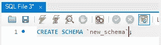

# 使用开源软件免费开始使用 SQL

> 原文：<https://towardsdatascience.com/how-to-master-sql-for-free-with-open-source-7eb03e1a0dd0?source=collection_archive---------53----------------------->

## 开源 MySQL 入门指南


在 [Unsplash](https://unsplash.com?utm_source=medium&utm_medium=referral) 上由 [SwapnIl Dwivedi](https://unsplash.com/@momentance?utm_source=medium&utm_medium=referral) 拍摄

或者任何与数据打交道的人(我最近听说是所有人)，SQL 是那些真正能移山倒海的技能之一。如果你的工作场所使用 SQL，学习它可以极大地改善你的职业生涯。

虽然它在任何地方都被使用，但是它也很贵。我工作过或合作过的许多公司都使用了以下方法之一:

*   微软的 SQL 服务器
*   Oracle 数据库管理系统
*   IBM DB2

这些都不是开源的，而且都有很高的价格。幸运的是，如果您想(或需要)学习 SQL 的详细内容，有大量免费的开源选项可供选择。

其中之一就是 MySQL。MySQL 是一个开源设置，反映了大多数公司正在使用的许多 SQL 产品。因此，无论你是计划和改变日常任务、团队，甚至是工作，MySQL 都是一个完美的起点。

在本文中，我们将介绍 MySQL 的基础知识。当我们从安装转移到数据库查询和数据转换时，我们不做任何假设并解释一切。简而言之，我们涵盖:

```
**> MySQL Installation
**  - Running the Server**> Getting Started**
  - MySQL Workbench
  - Schemas, Databases, and Tables
  - Uploading Data**> Querying Data**
  - SELECT * FROM ...
  - WHERE
  - ORDER and GROUP
```

# MySQL 安装

首先，我们需要安装 MySQL。Windows 和 Mac 的安装都可以在[这里](https://dev.mysql.com/downloads/installer/)找到。确保下载完整版，而不是网络版。


一旦安装程序开始，我们需要选择**开发者默认**并继续完成安装程序接下来的几个步骤。

安装完成后，还需要几个配置步骤。这些应该是直截了当的(如果不是，请在这里或在 [Twitter](https://twitter.com/jamescalam) 上给我自己留言)。此外，请确保设置 root 用户密码。

## 运行服务器

一旦安装完毕，MySQL 服务器应该建立在端口 3306 上。这应该会自动运行，但是如果不能，我们通过打开一个命令提示窗口(CMD，Bash 等)来实例化它。)并键入`mysqld`。

如果这个命令没有被识别，在运行`mysqld`之前导航到 MySQL 服务器`/bin`目录。在我的 Windows 计算机上，位于:

```
C:\Program Files\MySQL Server 8.0\bin
```

# 入门指南

## MySQL 工作台

一旦 MySQL 安装完毕，我们就可以打开 MySQL 工作台了


工作台是 MySQL 的瑞士军刀。它涵盖了所有内容，解释完整的包需要很长时间——所以为了精确起见，以及解释完整工作台所需的荒谬的经验水平——我们将坚持从基础开始。

我们可以点击正面屏幕上的本地实例 MySQL80 磁贴。这建立了到这个特定 MySQL 实例的连接，并打开了一个图形界面，允许我们探索这个实例。

在左边，我们将在我们的服务器实例上找到一个树状结构的数据库和表。

## 模式、数据库和表


SQL Server 的高级结构和层次结构

这种树状结构代表了 SQL 中对象的层次结构。

在这个层次结构的顶端是我们的服务器实例。在服务器内部是模式(与数据库同义，我们在这里将互换使用这两个术语)。模式内部是 SQL 表本身。

我们的数据存储在这些表中。因此，在 Workbench 中，我们可以继续创建我们的第一个模式和表。

## 创建模式

在左侧窗口的服务器层次结构中，您会注意到我们的服务器中已经有了几个模式。这些都是默认设置的——但通常情况下，我们需要自己创建。

为此，我们有两个选择。第一种是用**点击**:

**1。**点击顶部栏中的**创建模式**(数据库)图标


**2。**给新模式起一个好记的名字(至少比我的名字好)，然后点击 **Apply**


**3。**接下来，我们应用模式创建脚本(这里不需要更改默认设置)


**4。**我们有了新的模式！点击**完成**即可。我们现在将能够在我们的**输出**窗口中看到模式创建:


另一种选择是以编程方式创建我们的模式。也就是说，写一些 SQL 代码，而不是点击鼠标。我们可以通过以下方式做到这一点:

**1。**点击顶部工具栏的**创建新的 SQL 选项卡**，打开新的查询窗口


**2。**在新的查询窗口中输入`CREATE SCHEMA `<schema-name>`;`



**3。**点击闪电图标(执行全部/选定代码)


**4。我们又有了新的模式！我们可以再次在我们的**输出**窗口中看到模式创建:**


太好了，这是创建 MySQL 模式的两种方式！现在让我们转向桌子。

## 创建表格

SQL 中的表可能稍微复杂一些。而对于模式，我们只需指定模式名，其他的什么都不用做——表需要结构和数据类型。


本例中的虚拟数据。

在本例中，我们将使用所示的虚拟数据。我们有三列；身份证，姓名和年龄。

这些列中的每一列都需要分配一个数据类型。

*警告，这部分有点啰嗦——可以随意提前跳到* ***表创作*** *。*

**名称**

在 SQL 中，我们调用 text **VARCHAR** ，在定义 VARCHAR 数据类型时，我们还需要将条目的最大长度(以字符为单位)传递给这个字段。

如果我们想定义一个长度在 1 到 8000 个字符之间的文本，我们应该写 VARCHAR(1–8000)。我们只需输入 VARCHAR(MAX)就可以超过 8000。

然而，我们不应该在不需要的地方使用 VARCHAR(MAX)——仅仅是因为它可能会使那些阅读您代码的人感到困惑，并且它被认为是一种不好的做法。

相反，在我们的 name 列中，我们希望分配一个范围，我们确信没有名字会超出这个范围。在我们的例子中，VARCHAR(2-20)数据类型可能满足所有可能的名称。

**年龄**

SQL 提供了许多不同的数字数据类型——数值型、浮点型、货币型、小数型等等。其中一种数据类型是 **INT** ，我们将在这里使用它。

INT 是 integer 的缩写，指的是一个整数(1、2 和 3，而不是 3.142、1.5 或任何其他非整数)。INT 涵盖了从-2.1B 到 2.1B 左右的任何整数[1]。


整数类型、它们的范围以及以字节为单位的大小。改编自[1]。

对于更小或更大的值，我们可以使用从 **TINYINT** (适合年龄)到 **BIGINT** 的各种其他整数变量。

TINYINT 非常适合用作我们的**年龄**数据类型。我们不希望看到一个负的年龄，因此我们可以使用从 0 到 255 的任何整数值，这比我们希望任何客户达到的年龄都要大得多。

在定义 TINYINT 数据类型时，我们必须向它传递一个数字。这个数字是我们可以显示的最大数字/字符数。因此，如果我们想显示 0-255，我们的最大位数是三(255)。

或者，如果我们想显示-128 —我们的最大位数是四位(-128)。对于**年龄**，我们只需要三位数，给我们`TINYINT(3)`。

**id**

最后，我们来到我们的 ID 栏。我们用它来为我们的每个记录提供一个唯一的标识符。


这里我们使用左表的 **customer_id** 来连接使用右表的主键( **id** )的记录。

通常，这将用于匹配不同表中的相应记录。例如，我们可能有一个销售表，其中包含所有销售的列表。这可能包含一个 **customer_id** 列，它将客户表中的客户详细信息匹配到这个销售表中。

在我们的例子中，我们的 id 是数字，所以我们可以使用 SMALLINT、MEDIUMINT 或 INT。然而，值得注意的是，作为 ID 值，我们可以轻松地使用 VARCHAR——在许多情况下，这可能更合适。

所以我们可以使用 INT 或者 VARCHAR。在我们的例子中，我们希望自动分配 ID，每增加一条新记录就需要增加 1。我们可以使用`AUTO_INCREMENT`告诉 SQL，但是这要求我们使用 INT 数据类型。

总之，这将为我们提供类似于`SMALLINT(6)`的东西(如果我们不期望超过 999，999 条记录的话)。

**表格创建**

同样，创建我们的表有两种方法。点击，或以编程方式。**点击方式**是:

1.  在左侧栏中，展开新数据库，右键单击**表、**并选择**创建表**。


2.输入列名和数据类型。我们为 **id** 选择 PK、NN 和 AI 标志，因为它们分别表示 **P** rimary **K** ey、 **N** ot **N** ull 和**A**uto**I**N 增量。


3.在下一个屏幕上，我们将看到用于创建我们的表的 SQL 代码——我们可以继续并**应用**它。


我们完了。另一种方法是以编程方式对此进行编码。为此，我们打开一个查询窗口，输入上面第三步中的 SQL 代码，并执行它。

## 上传数据

我们创建了一个表，但是它没有数据！我们需要上传它，我们可以从各种来源上传。对于本例，我们将使用如下所示的 CSV:


**sample.csv，**其中包含我们的样本数据。

为了将数据上传到 SQL，我们回到 MySQL Workbench 并:

**1。**在**导航器**中右键点击**表格**，选择**表格数据导入向导**


**2。**浏览并选择要上传的文件，点击下一步


**3。**选择是创建新表还是将数据追加到现有表中。我们已经创建了表格，所以我们选择**使用现有表格**


**4。**然后我们点击下一步，直到导入过程结束。回到我们的查询窗口，我们可以输入`SELECT * FROM new_table`来确认上传成功:


最后，我们可以使用`INSERT INTO`命令添加更多数据:


注意，我们没有指定`id`值。这是因为我们已经将`id`设置为 auto-increment，这意味着 SQL 会自动为新行分配一个值，该值是前一行的+1。

# 查询数据

## 从…中选择*

最容易识别的 SQL 代码片段— `SELECT * FROM <table-name>`允许您显示表格中的所有列和行。

在 MySQL 中，一个额外的隐藏参数被添加到查询中。这是`LIMIT 1000`。LIMIT 允许我们返回给定数量的行。因此，尽管我们的表中有四条记录，键入`SELECT * FROM `new_table` LIMIT 2`将返回两条:


**SELECT * FROM** 查询，具有两行的**限制**。

*如果这不起作用，尝试首先在导航窗口中双击模式以选择它，然后再次执行。*

此外，我们可以通过单击上面屏幕截图右上角可见的下拉菜单(在查询窗口内)来更改默认限制值。

## 在哪里

如果我们想要查看满足给定条件(或一组条件)的数据，我们可以使用`WHERE`子句。

WHERE 添加在我们的`SELECT * FROM ...`之后，只允许我们显示给定条件为真的行。在较大的数据集上，我们可能希望搜索具有给定名称的所有客户:

```
SELECT * FROM new_table WHERE `name` = 'paul';
```

或者，我们可能希望筛选年龄超过 30 岁的客户:


**SELECT * FROM …** 带有一个 **WHERE** 子句，用于筛选 30 岁以上的客户。

## 订单和组

`ORDER BY`和`GROUP BY`是 SQL 查询的两个更基本的方法。首先，让我们在表中再添加几条记录。

```
name,age
Laura,27
Illaria,34
Luke,39
Tristan,39
Yess,27
```

*(将这些保存到一个 CSV 文件，并像我们之前做的那样导入——使用现有的表格)*

我们可以按给定的列进行**排序，比如**年龄**，像这样:**


这里，我们所有的值都按照年龄列以升序排列(从小到大)。升序`ASC`是默认的，但是我们可以通过在查询末尾添加`DESC`来切换到降序:


我们的另一个子句允许我们对给定的列进行分组。但是，在使用该选项时，我们将无法像以前一样选择*。原因是，如果我们按列分组，就没有逻辑方法来显示该分组中的其他列(如名称)。

因此，为了避免这种情况，我们可以对列应用可聚合操作(如 COUNT 或 SUM ),或者简单地排除它们:


我们可能还想在同一个查询中同时使用 **ORDER BY** 和**GROUP BY**——在这种情况下，我们总是将 **GROUP BY** 放在 **ORDER BY** 之前。

*在 GROUP BY 之前放置 ORDER BY 将产生语法错误。此外，这也不符合逻辑。如果我们先订购，我们一组合就失去了那个订单。*

这就是开始使用 SQL 和 MySQL Workbench 所需要知道的一切。我们涵盖了很多内容，包括:

*   安装和设置 MySQL
*   如何使用 MySQL Workbench
*   什么是模式/数据库和表，以及如何使用它们
*   VARCHAR 和 INT 数据类型
*   使用**表格数据导入向导**上传数据
*   **SELECT * FROM …**
*   使用**过滤数据，其中**
*   通过按**顺序、**按**分组、**计数**组织和转换我们的数据**

SQL 可能需要一些时间来适应，但幸运的是，它相当用户友好，并且与许多技术相比，不需要很长时间就能胜任。

易用性加上它在世界上几乎每一个行业和公司中的普及性，使它成为一个非常值得熟悉的工具。

我希望你喜欢这篇文章！如果你有任何问题，请通过 [Twitter](https://twitter.com/jamescalam) 告诉我，或者在下面的评论中告诉我。如果你想要更多这样的内容，我也会在 YouTube 上发布。

感谢阅读！

# 参考

[1] [整数类型](https://dev.mysql.com/doc/refman/8.0/en/integer-types.html)，MySQL 文档

[🤖《变形金刚》课程 NLP 的 70%折扣](https://bit.ly/nlp-transformers)

**所有图片均由作者提供，除非另有说明*