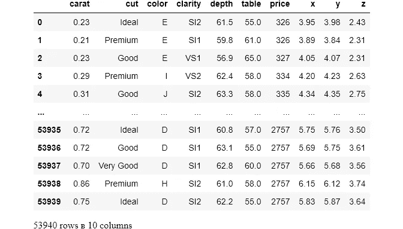
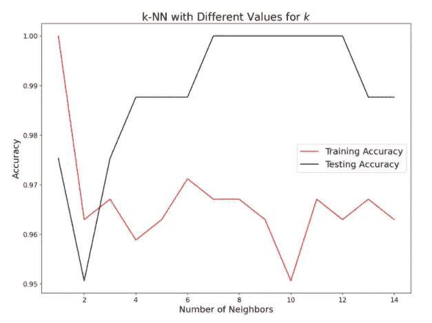
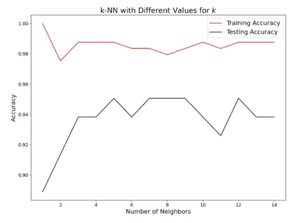
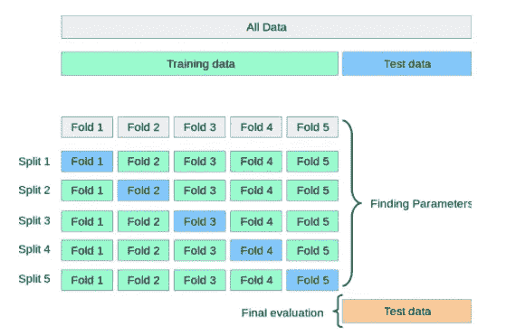
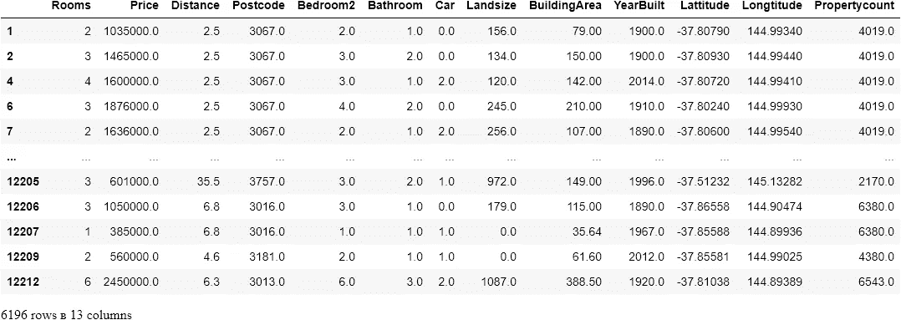

# 如何掌握训练和测试集生成的微妙艺术

> 原文：<https://towardsdatascience.com/how-to-master-the-subtle-art-of-train-test-set-generation-7a8408bcd578?source=collection_archive---------20----------------------->

## 它不仅仅是一个普通的功能


**照片由** [**玛丽泰勒**](https://www.pexels.com/@mary-taylor?utm_content=attributionCopyText&utm_medium=referral&utm_source=pexels) **上** [**像素**](https://www.pexels.com/photo/active-man-jumping-from-brick-wall-6009265/?utm_content=attributionCopyText&utm_medium=referral&utm_source=pexels)

## 介绍

可以说，你从 Scikit-learn 学到的第一个函数是`train_test_split`。它执行最基本也是最关键的任务:将数据分成训练集和测试集。将相关模型与训练集相匹配，并在测试集上测试其准确性。听起来很简单。但是让我告诉你，这并不简单。一点都不简单。

Scikit-learn 提供了大量的 [15 种不同的函数](https://scikit-learn.org/stable/modules/cross_validation.html#cross-validation)来根据不同的用例分割你的数据。有些你从未听说过，有些是日常使用的。但是不要担心，我们不会在这里一一介绍。相反，我们将只关注从初学者到围棋大师的科学家们最常用和最重要的方法。

具体来说，您将学习分类任务的`train_test_split`的最重要参数，换句话说，即分层以及如何使用`cross_validate`、`cross_val_score`和`StratifiedKFold`进行交叉验证。

> 这篇文章的所有代码示例都可以在 [this](https://www.kaggle.com/bextuychiev/master-the-subtle-art-of-train-test-set-generation) Kaggle 笔记本或者 [this](https://github.com/BexTuychiev/medium_stories/blob/master/2021/february/5_train_test_generation/train_test.ipynb) GitHub repo 上找到。

[](https://ibexorigin.medium.com/membership) [## 通过我的推荐链接加入 Medium-BEXGBoost

### 获得独家访问我的所有⚡premium⚡内容和所有媒体没有限制。支持我的工作，给我买一个…

ibexorigin.medium.com](https://ibexorigin.medium.com/membership) 

获得由强大的 AI-Alpha 信号选择和总结的最佳和最新的 ML 和 AI 论文:

[](https://alphasignal.ai/?referrer=Bex) [## 阿尔法信号|机器学习的极品。艾总结的。

### 留在循环中，不用花无数时间浏览下一个突破；我们的算法识别…

alphasignal.ai](https://alphasignal.ai/?referrer=Bex) 

## 还需要为`train_test_split`澄清？

首先，让我详细说明一下`train_test_split`。假设我们想使用钻石的属性(如克拉数和尺寸长度)来预测钻石的价格。作为样本数据，我们将从 Seaborn 加载`diamonds`数据集:

```
diamonds = sns.load_dataset('diamonds')
diamonds
```



数据集有几个数值特征和三个分类特征。因为我们想要预测连续的值，我们可以选择任何回归算法，比如任务的`RandomForestRegressor`。

对于所有的 ML 算法，都有一个单一的、明确定义的过程:将数据分为训练集和测试集，在训练集上拟合模型，在测试集上测试精度。模型不针对所有数据进行训练的原因是，我们最关心的是模型如何处理看不见的数据。而且几乎总是，你不会有足够的全新的，真实世界的数据来测试。所以，唯一的选择就是把一些可用的数据放在一边进行测试。点击阅读关于培训和测试流程[的更多信息。](/codeless-machine-learning-dictionary-for-dummies-fa912cc7bdfe)

使用 Scikit-learn 的`train_test_split`函数可以完成拆分任务。下面，我们选择用于预测钻石价格的变量作为特征( *X* 数组)，价格本身作为目标( *y* 数组):

功能是从`sklearn.model_selection`引进的。对于前两个参数，我们首先传递特性数组，然后传递目标数组。测试集的大小由`test_size`参数指定——这里我们留出 30%的数据用于测试。`random_state`是种子，所以我们每次使用相同的参数运行函数时都会得到一致的结果。

我们将输出分解成 4 个变量。我希望您注意输出的顺序，因为很容易混合它们。

接下来，我们将使用默认参数拟合一个`RandomForestRegressor`模型，并对其进行评分:

这就是`train_test_split`回归的基本用法。但是如果我们把范畴包括进来，事情会变得更有趣。

## 抽样偏误

在我解释如何将`train_test_split`用于分类特征之前，我必须简单提一下*采样偏差*。当选择的样本不能代表总体时，就会出现抽样偏倚。

例如，一家冰淇淋公司可能会打电话给 1000 个人，询问他们喜欢什么口味的冰淇淋。为了不造成抽样偏差，或者换句话说，为了选择一个有代表性的比例，调查者应该尊重特定地区或城市的男女比例。如果该地区有 54%的男性和 46%的女性，公司必须确保调查 540 名男性和 460 名女性以获得代表性样本。

当我们将数据分成训练集和测试集时，我们实际上是从总体中抽取样本。因此，每当涉及到分类变量时，我们应该以某种方式分割数据，以保持类别的基本比例相同或接近相同。

形式上，这种类型的抽样被称为*分层抽样*，每个独特的类别被称为*阶层*。接下来，我们将看到如何在代码中使用这个方法。

## 用`train_test_split`分层分割

分层采样在 Scikit-learn 中超级简单，只需在函数中添加`stratify=feature_name`参数即可。为了证明这一点，让我们用普通分割和分层来分割钻石数据集。

这一次，我们只使用分类变量。让我们看看`X`和`X_train`中的类别比例:

你可能会认为比例上的差异不是很大。但在预测时，即使是最微小的微小变化也会破坏模型。这里有一个明显的例子:



作者图片

上面是一个 kNN 分类器的模型复杂度曲线，它是在一个普通的 split 上训练和测试的。如你所见，几乎所有的测试分数都高于培训。以下是模型在分层拆分中重新训练后的结果:



作者图片

您可以看到分层是如何极大地改变模型的性能的。

> 一般来说，当你看到测试分数高于训练分数时，不要过于兴奋，因为你创造了一些特殊的东西。恰恰相反，在你犯错的过程中😁🤦‍♂️.

以下是如何通过对钻石切割进行分层来分割数据:

将`stratify`设置为一个分类特征(或目标，如果你正在进行分类，即`stratify=y`)可以确保完成分割以保持通过的列中类别的比例。如您所见，比例保留到小数点后第四位。

## 与`cross_val_score`交叉验证

不管你如何调整`train_test_split`来得到一个完美的分割，都有可能结果是有偏差的。例如，在无限多的训练/测试集的变体中，您可能最终得到非常不平衡的廉价和昂贵的菱形特征集。这种情况很少见，但可能会导致一个完全无用的模型。对于较小的数据集，这种情况变得更加罕见。

处理这个问题的一种方法是使用一种叫做 k-fold 交叉验证的技术:



[**来自 Scikit-learn 文档**](https://scikit-learn.org/stable/modules/cross_validation.html#cross-validation)

想法是重复训练-测试-分割过程几次 *k* 并且每次使用不同的训练和测试集。例如，5 重交叉验证意味着将数据分成 5 个大小相等的块，称为*重*。然后，在折叠 2–5 上训练模型作为训练集，并在第一次迭代中测试折叠 1 上的性能。在下一个中，使用折叠 1、3、4、5 作为训练数据，使用折叠 2 作为测试集。在最后的第五次迭代之后，我们选择的模型将在所有数据上被独立地训练和测试。

通过这种方式，我们完全消除了由于随机机会而产生有偏样本的可能性。Scikit-learn 提供了`cross_val_score`和`cross_validate`函数作为整个过程的包装器。让我们从一个更简单的开始——`cross_val_score`:

我们将使用来自 Kaggle 的[墨尔本房产数据](https://www.kaggle.com/dansbecker/melbourne-housing-snapshot)通过 7 重交叉验证来预测房价。在每次迭代中，我们将拟合一个`RandomForestRegressor`模型并返回𝑅2，决定系数:



为了简单起见，我去掉了空值，只选择 4 个特性:

对于`cross_val_score`，我们传递初始化的模型、特征和目标数组，并用`cv`指定折叠的数量。输出包含每次迭代的分数:

如你所见，分数相差很大。你可以很容易地得到 R2 0.64 的分裂。有了分数列表，您可以对模型的性能更有信心:

默认情况下，`cross_val_score`使用被传递模型的`.score`方法所使用的评分方法。如你所见，回归变量的默认得分是决定系数。要传递一个定制的成本函数，比如平均绝对误差(MAE)，您必须将其名称作为字符串传递给`scoring`:

> 我知道这有点令人惊讶。Scikit-learn 的交叉验证函数期望效用函数(越大越好)而不是成本函数(越低越好)。所以，传递给`scoring`的函数与 MAE 相反(负的)。这就是为什么我用`-score`把它们转换成正值。要查看您可以传递给`scoring`的所有得分者的姓名，请运行`sklearn.metrics.SCORERS.keys()`。

## 与`cross_validate`交叉验证

`cross_val_score`的缺点是它的功能非常有限，也就是说，它只返回每次迭代的分数。一次只能使用一个计分器，所有训练好的模型在执行后都会丢失。如果您想要计算几个性能指标并选择最佳模型，该怎么办？这就是`cross_validate`的用武之地。

它是一个更加灵活的交叉验证包装器，允许在每次迭代中使用多个评分器，并能够返回训练好的模型:

在一个单独的列表中，定义您想要计算的所有性能指标，并将其传递给`scoring`。此外，将`return_estimators`设置为`True`，以便返回每个列车随机森林。现在，输出不是一个计分器列表:

它是一个字典，包含 fit time、score time、所有返回的估计值和所有以关键字`test_`为前缀的评分函数的键值对。每个键都是一个字符串，对应的值是每次拆分返回的值的列表。让我们看看决定系数:

看起来第四次分割的估计量表现最好，所以我们可以提取它:

对于`cross_validate`的其他功能，还有许多其他的小调整。一定要看看令人敬畏的[文档](https://scikit-learn.org/stable/modules/generated/sklearn.model_selection.cross_validate.html)。

尽管交叉验证很棒，但这是有代价的——折叠越多，执行时间越长。这就是为什么建议对小数据集(< ~50k)使用交叉验证。你会问，大规模数据集怎么样？嗯，随着数据的规模越来越大，获得非代表性样本的机会就越来越小。换句话说，交叉验证对于更大的量来说并不是真正必要的。

## 使用`StratifiedKFold`进行分层交叉验证

如果你决定使用分层拆分并同时进行交叉验证，你必须求助于另一个函数:`StratifiedKFold`。我们将返回钻石数据集，并使用`RandomForestClassifier`预测钻石的切工。我们先来看看`StratifiedKFold`是怎么用的:

不像`train_test_split`，我们先初始化它。我们设置我们想要的分割数量，并将`shuffle`设置为`True`，这将在进行分割之前打乱数据(在第一次分割之前只打乱一次)。洗牌通常是一个好主意，因为数据可能像时间序列数据一样预先排序。

接下来，我们使用类'`.split`'函数传递特性和目标数组:

结果是一个生成器对象，它包含每个分割的训练和测试索引。这意味着我们必须在每次迭代中循环并安装一个分类器:

请注意，我们不必在`StratifiedKFold`中指定要分层的特征。我们不需要这样做，因为这个类的构建是为了尽可能地保持每个特性的底层分布。

最后一件事，如果我们使用 Scikit-learn 中的任何分类算法，并将其传递给`cross_validate`或`cross_val_score`，这些类会自动使用`StratifiedKFold`来启用分层。因此，在这一点上，你可能会有点失望，我们不得不学习分层简历的`StratifiedKFold`，而`cross_validate`可以在我不提及的情况下完成这项工作。

当您想要在每个分割中执行自定义操作，而不是将自己局限于`cross_validate`参数所提供的内容时，`StratifiedKFold`非常有用。

## 不知道接下来要读什么？在这里，我为你挑选了一些东西:

[](/my-6-part-powerful-eda-template-that-speaks-of-ultimate-skill-6bdde3c91431) [## 我的 6 部分强大的 EDA 模板，讲终极技能

### EDA —做得对…

towardsdatascience.com](/my-6-part-powerful-eda-template-that-speaks-of-ultimate-skill-6bdde3c91431)