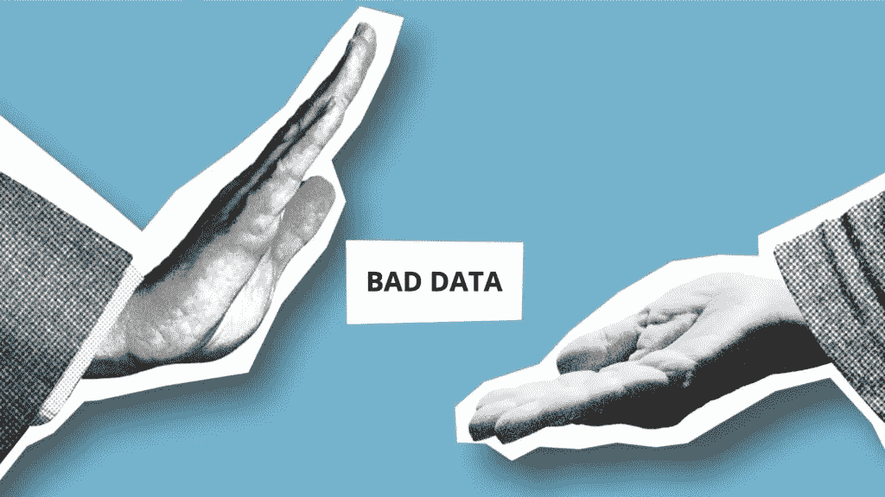
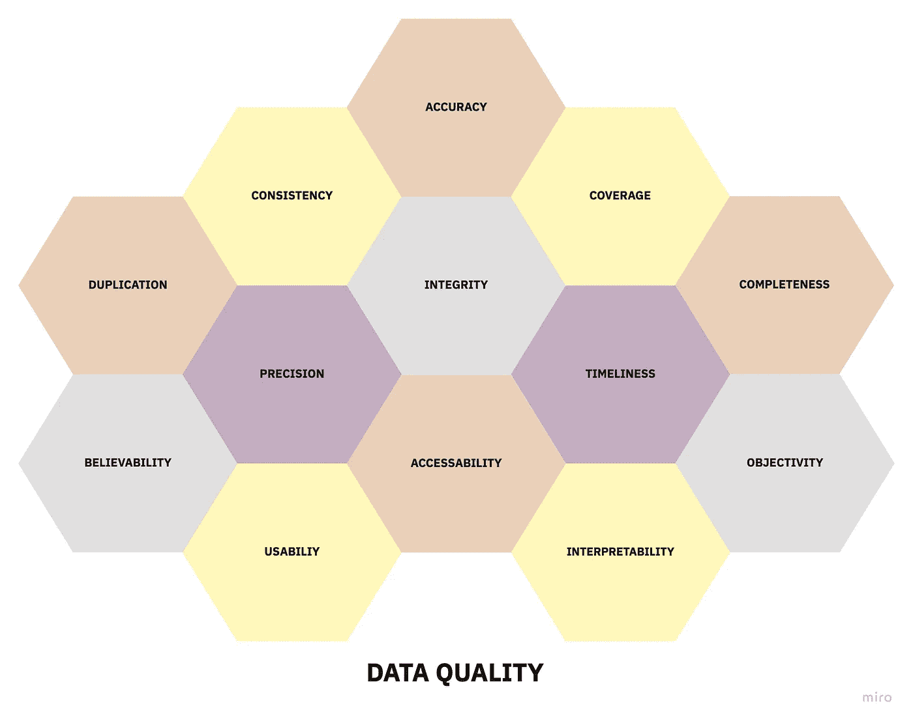

# 如何衡量数据质量

> 原文：<https://towardsdatascience.com/how-to-measure-data-quality-815076010b37?source=collection_archive---------21----------------------->

## 你应该跟踪的 13 个指标(但不要跟踪)



照片由 [Pexels](https://www.pexels.com/photo/entrepreneur-rejecting-offering-from-man-with-outstretched-hand-5849579/?utm_content=attributionCopyText&utm_medium=referral&utm_source=pexels) 的 Gabby K 拍摄——作者修改

您需要可靠的信息来对风险和业务成果做出决策。这些信息通常非常有价值，因此您可能会通过第三方数据提供商直接购买，以扩充您的内部数据。

然而，您多久考虑一次数据质量对您决策的影响？不良信息会对业务决策产生不利影响，进而影响您的业务绩效、创新和竞争力。事实上，根据 [Gartner](https://www.data.com/export/sites/data/common/assets/pdf/DS_Gartner.pdf) 的调查，由于数据质量差，40%的业务计划未能实现其目标收益。

将信息视为公司资产的组织应该像对待其传统资产一样进行相同的质量评估。这意味着持续监控和提高他们信息的质量和价值。

在这篇文章中，我们将探索一个评估和比较数据质量的实用框架。您可以将此应用于内部产生的数据，以及从第三方供应商购买的数据。

评估数据质量是衡量信息资产整体**价值**的一个小而重要的组成部分，我已经在后续文章中对[进行了描述。](https://showmethedata.blog/how-to-measure-the-value-of-data?utm_source=medium&utm_campaign=internal-reference&utm_content=data-quality)

# 客观数据质量指标

您可以将最常见的数据质量指标分为以下几类:

1.  **准确性** —每个可用数据字段代表现实的准确性如何？这也就是通常所说的数据的*有效性*。
2.  **覆盖率** —有记录的事件或感兴趣的对象的百分比是多少？例如，如果您只关心北美公司，那么北美公司在数据集中所占的百分比是多少？
3.  **完整性** —在所有提供的记录中，有多少百分比的可用字段有值？
4.  **完整性** —如果数据中存在关系，相关属性之间的期望值被违反的频率有多高？例如，公司筹集的资金总额应该始终等于该公司各个筹款事件的总和，或者外键应该始终指向已存在的记录(参照完整性)。
5.  **一致性** —数据集内和数据集之间的数据在格式和结构上有多一致？
6.  **重复** —所有记录中有百分之多少是重复的？
7.  **精度** —数据有多精确？文本或图像等非结构化数据的详细程度如何？所提供数据的交付频率是多少？
8.  **及时性** —在任何给定时间，数据代表真实值的概率是多少？请注意，我们对现实世界中发生的事件和数据集中出现的事件之间的时间差不感兴趣。实际上，这很难验证，企业通常更关心数据集是否与源同步，而不是时滞本身。
9.  **可访问性** —可以访问数据并从中受益的业务流程或人员的数量。

# 主观数据质量度量

并非数据质量的所有方面都可以孤立于它们与数据用户的关系来考虑。一些质量指标纯粹是主观的，但对数据资产的利用率有重大影响。这些指标通常通过用户调查来衡量。

1.  **可信度** —用户是否信任他们正在查看的数据，或者这些数据是否被规避或被类似信息的替代来源所替代？
2.  **可用性** —从数据中提取价值以执行某些业务功能的难易程度如何？
3.  **客观性** —用户眼中的数据来源有多公正？
4.  可解释性——数据的可理解性如何？是否有足够的文件支持原始数据？

请注意，人们可能会用“质量”这个词来表示数据的价值，但这是一个深入的话题，将在下一篇博文中单独讨论。

# 在实践中衡量数据质量

数据质量度量有多种用途。一个这样的用途是管理人员产生的信息的质量。

你可能会觉得有趣的是，通过影响人们管理和使用数据的方式的变化，测量本身就可以导致数据质量的提高。

您还可以使用这些实践来比较第三方数据提供商，他们都声称在所有竞争对手中拥有最佳的数据质量。

在实践中，通过将这种测量方法应用到数据流最多的地方，您可能会从中获得最大的提升。这往往是在软件系统和分析数据管道之间。

事实上，如果您已经很好地装备了您的业务，来自第三方数据提供商和业务流程的大部分数据应该流入数据存储，在那里您可以集中进行质量监控。

# 实施数据质量监控

虽然通过调查来衡量主观数据质量相对简单，但客观指标可能难以实现。

在 9 个客观数据质量度量中，我认为只有**完整性**、**完整性**、**精度**和**可访问性**度量有可能完全自动化。

您可以通过应用用 SQL、另一种编程语言或专用软件编写的数据测试来监控这些指标。

使用 SQL 监控数据质量的一种方法是构建 BI 仪表板来跟踪“数据质量视图”，它运行对坏数据的查询，返回任何与预期不符的行。

或者，这些数据测试可以作为您的转换管道的一部分或先决条件，在通用编排工作流中使用像[dbt-expectations](https://github.com/calogica/dbt-expectations)for[dbt](https://www.getdbt.com/)或 [great-expectations](https://docs.greatexpectations.io/en/latest/) 库这样的工具。

> ***自动化提示*** *对于自动化质量检查，您应该在移动和转换数据的每个数据处理节点之前和之后验证您的预期(成本允许)。*

对于其他指标，您可以从让一个人参与进来提供基本事实开始，并使用随机抽样从统计测试提供的效率中获益。在某些情况下，您不仅可以利用自动化来度量，还可以修复其中的一些数据问题。

下面，我分解了一些示例策略，您可以使用这些策略来逐个字段地评估*的数据质量指标。为了开发特定数据集的整体“健康得分”，如果需要，可以应用进一步的聚合。*

## 准确(性)

> 字段准确性= [#具有准确字段信息的记录] / [字段中有值的记录数]

为了获得每个领域的准确性，你需要一些你认为是基本事实的“黄金记录”。您可以通过手动注释一组实体或使用替代的*高度精确的*数据源作为代理来获得这个基本事实。

## 新闻报道

> 字段覆盖率= [#数据集中的真实世界实体] / [#真实世界实体]

如果您的实体的“宇宙”是预先定义的或者容易估计的，那么您可能能够获得一个自动化的覆盖率度量。

如果不是这样，您可以使用“错过”事件的数量作为覆盖范围的代理。当您意识到遗漏了一些实体时，您可以在您的业务流程中捕捉到这一点。

> 字段未命中率= [#未命中的真实世界实体触摸系统] / [#真实世界实体触摸系统]

## 复制

> 重复率= [#检测到的重复] / [#数据集中的记录总数]

这个看似简单的指标非常难以衡量，因为重复记录很难检测。

你可以使用人类注释器和聪明的采样策略([，我已经写了关于](https://showmethedata.blog/how-to-measure-what-you-cant-see))来近似你的数据集的整体重复率，但是这很难扩展。

鉴于你的最终目标是*消除*重复，你最好使用外部软件供应商。对于个人和公司实体来说，这主要是一个已解决的问题，通用的重复数据删除策略*可用于不太常见的重复数据删除问题*。

在极少数情况下，记录匹配供应商不能满足您的需求，您必须从头开始进行记录重复数据删除过程(如果您希望我在博客上讨论这个话题，请告诉我)。

你能做的最好的事情是进行适当的验证，从一开始就防止重复数据进入你的系统，因为*防止*数据输入问题要比修复它们容易得多。

> ***警告*** *请谨慎处理重复数据删除，因为有时重复记录实际上是重复事件或现实世界中的独立实体。理想情况下，重复数据消除不应是破坏性操作，并且应维护匹配和操作的审核日志。*

## 及时

> 及时性= [#数据集中准确表示当前真实值的记录] / [#记录总数]

正如我之前解释的那样，真实世界的事件与其在数据集中出现的时间之间的差异很难测量。此外，它没有观察数据时值同步的概率重要。

为了衡量及时性，您可以从“黄金记录”中抽取一个小样本，并计算匹配值与记录总数之间的比率。

## 易接近

可访问性度量是高度依赖于上下文的。您可能会发现测量一段时间内访问数据的用户数量就足够了。

或者，您可能对数据可用的系统数量感兴趣，并将其与数据相关或适用的系统数量进行比较。

在上面的指标中，建议我们引入“人在循环中”来提供目标值的可靠注释并不少见。要在实践中实现这一点，你可以使用低代码和无代码平台，如[重组](https://retool.com/)或[泡泡](https://bubble.io/)，在几个小时内完成一个注释过程。

从抽样过程中得出的指标只能给出可能产生该结果的**潜在**值分布的**平均值**。您可能对量化采样过程引入的不确定性感兴趣。

您可以通过参数化 Beta 分布来计算观测值的 90%置信区间，如下所示:

> 公制~ ***贝塔* (⍺ =** 分子+ 1 **，β** =分母—分子+ 1 **)**

考虑这个问题的一个简单方法是术语。“命中”和“未命中”

要使用 Excel 或 Google Sheets 获得指标的 90%置信区间界限，可以使用`BETA.INV(probability, ⍺, β)` 函数。

例如，如果您从 50 个的随机**样本中检测到 1 个重复的**样本，您将按如下方式计算边界:****

```
*Duplication Rate = [# duplicates detected] / [# total records in the dataset]***5% Lower Bound =>** BETA.INV(0.05, 1+1, 49+1) = 0.7%
**95% Upper Bound =>** BETA.INV(0.95, 1+1, 49+1) = 8.9%
```

这意味着我们有 90%的机会可以从 0.7%到 8.9%的总体重复率中获得我们所做的结果！

了解与您的指标相关的不确定性对于确定您的数据质量是否真的在变化，或者它是否只是与随机过程相关的波动的产物，肯定是有用的。

# 结论

我们探讨了数据质量的核心维度，以及如何衡量它们以减少由于不可靠的信息而导致的路径所产生的浪费。



13 个数据质量维度|作者图片

跟踪这些数据质量指标的目标不是得到一个完美的度量，而是确定我们是否在朝着正确的方向前进，最重要的是，**根据这些信息采取行动**来改进我们的流程。

在您尝试测量您企业中每个系统的数据质量之前，我想提醒您的是**并非所有数据都具有相同的价值**，测量也不是免费的。

您应该确定 20%的数据在您的决策和业务流程中驱动 80%的价值。然后，在更广泛地应用这些技术之前，您可以对高价值数据子集的数据质量度量和改进工作进行优先级排序。

但是，您如何准确地评估和测量数据的**价值，以及我们如何利用这些知识来制定我们的数据策略呢？**

## [接下来—如何衡量数据的价值](https://showmethedata.blog/how-to-measure-the-value-of-data?utm_source=medium&utm_campaign=internal-reference&utm_content=data-quality)

想进一步讨论这个吗？请在 Linkedin 上发表评论或[与我联系。](https://www.linkedin.com/in/balmasi/)

## 📕这篇文章最初发表在[向我展示数据](https://showmethedata.blog/?utm_source=medium&utm_campaign=post&utm_content=data-quality)的博客上，在那里我讨论了更多关于数据驱动业务的话题。