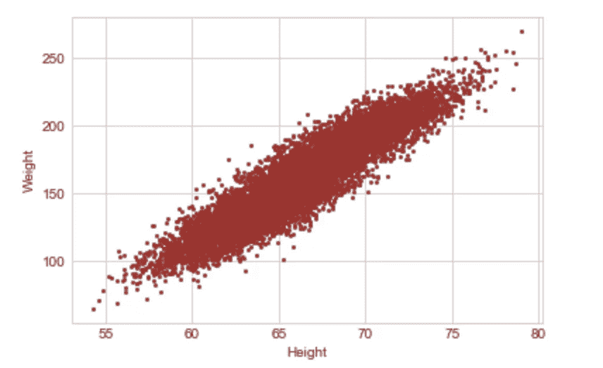
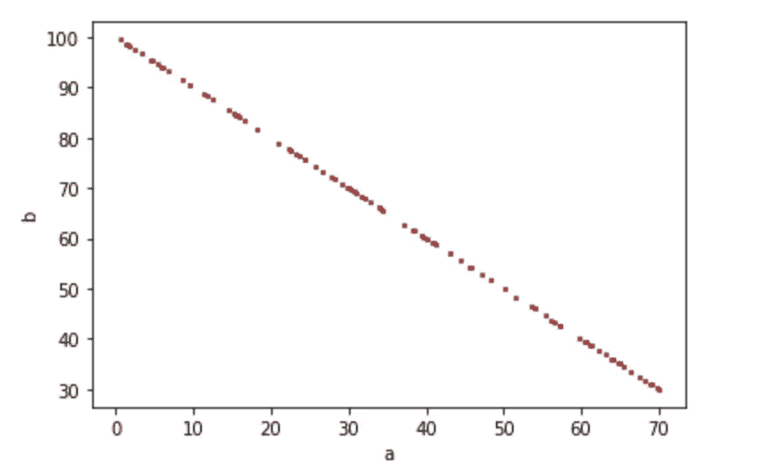
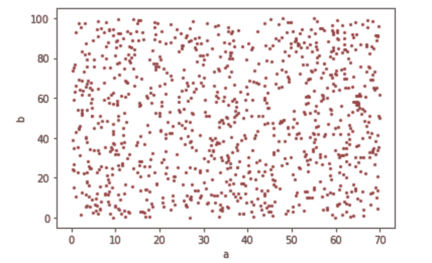
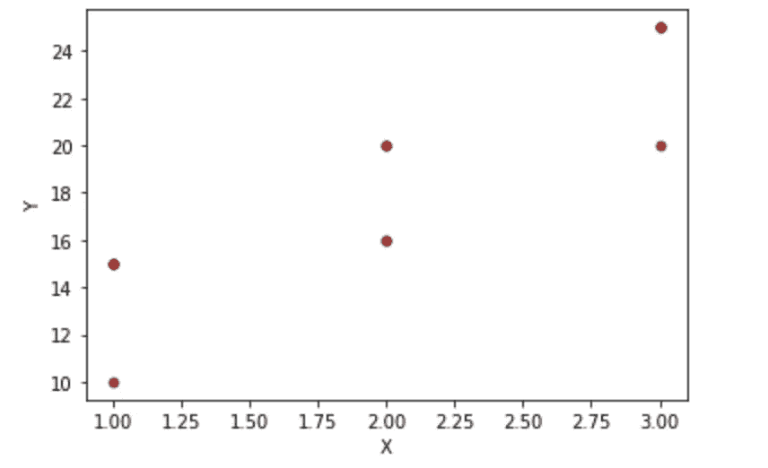
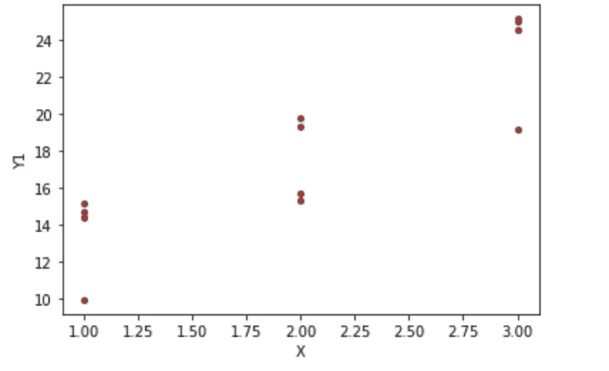
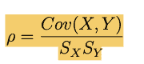

# 如何衡量变量之间的关系

> 原文：<https://towardsdatascience.com/how-to-measure-relationship-between-variables-d0606df27fd8?source=collection_archive---------3----------------------->

## 试图用最简单的形式解释协方差和相关性。


(图片由作者提供)

一次分析和可视化一个变量是不够的。为了在执行探索性数据分析时做出各种结论和分析，我们需要了解数据集中的变量是如何相互作用的。有许多方法可以直观地分析这种关系，最常用的方法之一是使用流行的散点图。但是散点图有一定的局限性，我们将在后面的章节中看到。从数量上来说，协方差和相关性用于定义变量之间的关系。

# 散点图

散点图是最常见的视觉形式之一，它可以让你一目了然地理解变量之间的关系。在最简单的形式中，这只不过是变量 A 对变量 B 的绘图:一个绘制在 x 轴上，另一个绘制在 y 轴上

```
%matplotlib inline
import matplotlib.pyplot as plt
plt.style.use('seaborn-whitegrid')
import numpy as npdf = pd.read_csv('weight-height.csv')
df.head()plt.plot(df.Height, df.Weight,'o',markersize=2, color='brown')
plt.xlabel('Height')
plt.ylabel('Weight')
```



图 1:散点图高度与重量:正相关

在上图中，很容易看出两个变量之间似乎存在正相关关系，即一个变量增加，另一个变量也增加。具有负相关关系的散点图，即随着一个变量增加，另一个变量减少，可以采用图 2 的形式。

```
#Just for demonstration purposes I have taken 'a' and 'b'
import numpy as np
import random
import matplotlib.pyplot as plt
a = np.random.rand(100)*70
b = 100-a
plt.plot(a, b,'o',markersize=2, color='brown')
plt.xlabel('a')
plt.ylabel('b')
```



图 2:散点图 a 与 b:负相关

两个变量之间没有明显关系的散点图将采用图 3 的形式:

```
import numpy as np
import random
import matplotlib.pyplot as plt
a = np.random.rand(1000)*70
b = np.random.rand(1000)*100
plt.plot(a, b,'o',markersize=2, color='brown')
plt.xlabel('a')
plt.ylabel('b')
```



图 3:散点图 a 和 b:没有明显的关系

一般来说，散点图最适合分析两个连续变量。使用散点图可视化两个离散变量可能会导致数据点重叠。让我们看看离散变量情况下的散点图。

```
x = [1,1,1,1,2,2,2,2,3,3,3,3]
y = [10,15,15,15,16,16,20,20,20,25,25,25]plt.plot(x,y,'o',markersize=5, color='brown')
plt.xlabel('X')
plt.ylabel('Y')
```



图 4:散点图 X 与 Y:离散变量

在上图中，并非所有的点都是可见的。为了克服这一点，我们将随机噪声添加到数据中，称为“抖动”。这个过程自然地被称为抖动，以允许那些重叠点的稍微清晰的可视化。

```
def Jitter(values, jitter):
    n = len(values)
    return np.random.uniform(-jitter, +jitter, n) + values
y1 = Jitter(y,0.9)
plt.plot(x,y1,'o',markersize=4, color='brown')
plt.xlabel('X')
plt.ylabel('Y1')
```



图 5:散点图 X 与 Y1:添加抖动

如图 5 所示，现在可以看到更多的数据点。但是，抖动应该仅用于可视化目的，并且应该避免用于分析目的。

在连续变量的情况下，也可能存在数据重叠，重叠点可能隐藏在数据的密集部分，异常值可能被给予不相称的强调，如图 1 所示。这叫做饱和。

散点图有其自身的缺点，因为它不提供关于关系的定量测量，而只是显示定量变化的表达。我们也不能用散点图来显示两个以上变量之间的关系。协方差和相关性解决了这两个问题。

# 协方差

协方差衡量变量如何一起变化。正协方差意味着变量沿同一方向一起变化，负协方差意味着它们沿相反方向变化，而 0 协方差意味着变量不一起变化或者它们彼此独立。换句话说，如果有两个变量 X & Y，正协方差意味着 X 值越大，Y 值越大，负协方差意味着 X 值越大，Y 值越小。

数学上，Cov(x，y)由下式给出，其中 dxi = xi-xmean，dyi = yi -ymean。请注意，以下是计算样本协方差时，用 1/(n-1)代替 1/n 的总体协方差公式。为什么会这样，超出了本文的范围。


```
Let’s understand this with an example: 
Consider, 
x = [34,56,78,23] 
y = [20,45,91,16] 
=> xmean = 47.75 
=> ymean = 43 
=> Sum of (dxi*dyi) = (34–47.75)*(20–43) + (56–47.75)*(45–43) + (78–47.75)*(91–43) + (23–47.75)*(16–43) = 2453\. 
=> Cov(x,y) = 2453/4 = 613.25
```

在上面的例子中，我们可以清楚地看到，随着 x 增加，y 也增加，因此我们得到一个正协方差。现在，让我们考虑 x 和 y 有单位。x 是以“厘米”为单位的身高，y 是以“磅”为单位的体重。协方差的单位是厘米-磅。不管那是什么意思！

协方差实际上可以取任何可以使用-1 到 1 范围内的相关性来克服的数。所以协方差并不能准确地告诉我们这种关系有多强，而仅仅是关系的方向。由于这些原因，解释协方差也很困难。为了克服这些缺点，我们使用相关性。

# 相互关系

相关性再次提供了关于变量之间关系的定量信息。如果变量具有不同的单位，或者变量的数据分布互不相同，那么测量相关性会很有挑战性。计算相关性的两种方法可以帮助解决这些问题:1)皮尔逊相关性 2)斯皮尔曼等级相关性。

这两种计算相关性的方法都涉及到将被比较变量中的数据转换成某种标准的可比格式。让我们看看这两种方法都做了哪些转换。

## 皮尔逊相关

皮尔逊相关包括将变量中的每个值转换为标准分数或 Z 分数，即从平均值中找出每个值的标准偏差数，并计算标准分数的相应乘积之和。

z 得分=(Xi-Xmean)/适马，其中 Sigma 表示标准差

```
Suppose we have 2 variables 'x' and 'y' 
Z score of x i.e. Zx = (x-xmu)/Sx 
Where xmu is the mean, Sx is standard deviation
Translating this info to our understanding of Pearson Correlation  (p):  
=> pi = Zxi*Zyi 
=> pi = ((xi-xmean)*(yi-ymean))/Sx*Sy 
=> p = mean of pi values 
=> p = (sum of all values of pi)/n
=> p = (summation (xi-xmean)*(yi-ymean))/Sx*Sy*n 
As seen above: (summation (xi-xmean)*(yi-ymean))/n is actually Cov(x,y). 
So we can rewrite Pearson correlation (p) as Cov(x,y)/Sx*Sy
NOTE: Here, pi is not the same as mathematical constant Pi (22/7)
```



皮尔逊相关系数“p”将始终在-1 到 1 的范围内。“p”的正值表示随着“x”增加，“y”也增加，负值表示随着“x”增加，“y”减少，0 表示“x”和“y”之间没有明显的线性关系。注意，零皮尔逊相关并不意味着“没有关系”，它只是意味着“x”和“y”之间没有线性关系。

皮尔逊相关“p”= 1 表示完全正相关，然而，0.5 或 0.4 的值意味着存在正相关，但这种关系可能不那么强。皮尔逊相关的大小或值决定了关系的强度。

但是，皮尔逊相关也有一定的缺点。如果数据中存在异常值，这种关联方法就不太适用，因为它会受到异常值的影响。如果变量 x 相对于变量 y 的变化是线性的，即当变化以恒定的速率发生时，当 x 和 y 都有点正态分布时，或者当数据在区间尺度上时，皮尔逊相关性工作良好。

皮尔逊相关的这些缺点可以用斯皮尔曼等级相关来克服。

## 斯皮尔曼等级相关

在 Spearman 方法中，我们将两个变量中的每个值转换为给定变量中的相应等级，然后计算等级的 Pearson 相关性。

```
Consider x = [23,98,56,1,0,56,1999,12], 
Corresponding Rankx = [4,7,5,2,1,6,8,3] 
Similarly, for y = [5,92,88,45,2,54,90,1], 
Corresponding Ranky = [3,8,6,4,2,5,7,1]
```

看看 Rankx 和 Ranky，这种方法的优势似乎很明显。Rankx 和 Ranky 都不包含任何离群值，即使实际数据有任何离群值，离群值也会被转换成一个秩，这个秩只不过是数据集中数字的相对正。因此，这种方法对异常值是稳健的。这种方法也解决了数据分布的问题。等级的数据分布将总是均匀的。然后，我们使用“皮尔逊相关性”部分中的公式计算 Rankx 和 Ranky 的皮尔逊相关性。

但是斯皮尔曼等级法效果很好:

1.  当 x 像 y 一样变化，但不一定以恒定的速率变化时，即当 x 和 y 之间存在非线性关系时
2.  当 x 和 y 具有不同的数据分布或非正态分布时
3.  如果您想避免离群值的影响
4.  当数据是有序尺度时

当等级重叠时，应该避免使用矛兵。

还有许多其他方法可以用来确定变量之间的关系。这篇文章只是让你开始这个话题的入门。

如果你喜欢在 Twitter 上极客化，并对收到可消化的 tweet 格式的文章感兴趣，别忘了在[https://twitter.com/TrishaChandra16](https://twitter.com/TrishaChandra16)关注我，看看下面的 tweet 主题:

## 参考

这个主题的编写受到了 Allen B. Downey 的《Thinkstats》一书以及大量令人惊叹的数据科学和统计学文章的极大影响。