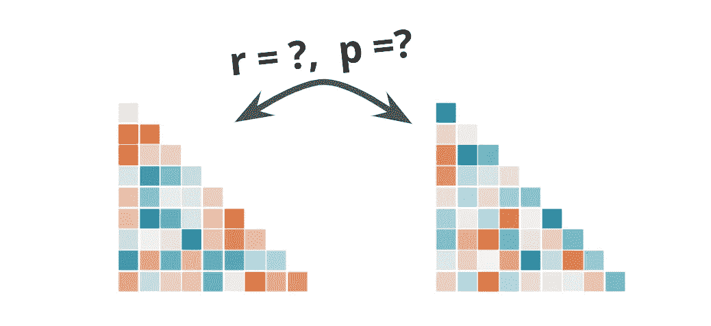
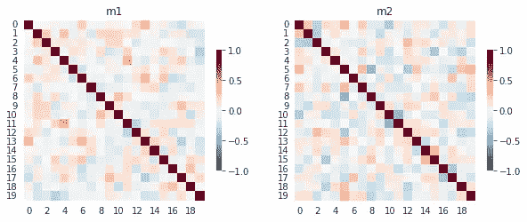
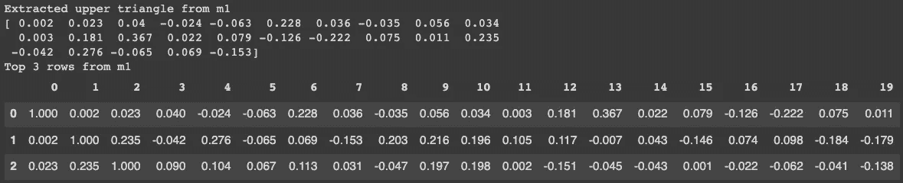
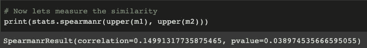
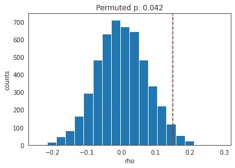

# 如何度量两个相关矩阵之间的相似性

> 原文：<https://towardsdatascience.com/how-to-measure-similarity-between-two-correlation-matrices-ce2ea13d8231?source=collection_archive---------11----------------------->

## 数据科学教程

## 关于度量矩阵间相似性时使用什么度量以及如何计算显著性的教程

相关矩阵。图由作者制作。

比较矩阵之间的相似性可以提供一种评估变量之间结构关系的方法，通常用于跨学科，如[神经科学](https://www.frontiersin.org/articles/10.3389/neuro.06.004.2008/full)、[流行病学](https://cancerres.aacrjournals.org/content/canres/27/2_Part_1/209.full.pdf)和[生态学](https://www.jstor.org/stable/2412528)。

让我们假设你有关于人们在观看一小段 Youtube 视频时的反应的数据。这可以通过面部表情、心率或呼吸来测量。这些数据的主题相似性矩阵将代表每个人的情绪与其他主题的相似程度。矩阵中的高相似性值意味着这些个体的反应比其他个体更相似。

您可以将此反应相似性矩阵与其他因素(如人口统计、兴趣和/或偏好)的相似性进行比较。这允许您直接测试一个领域中的相似性(例如情绪反应)是否可以用另一个领域中的相似性来解释(例如人口统计/偏好相似性)。

本教程介绍了可用于度量相似性矩阵之间的相似性的不同度量，以及如何计算这些值的显著性。

# 步骤 0:准备数据

我们来模拟一些数据进行分析。我们创建一个随机数据`m1_u`和`m2_u`，它们通过添加的噪声量`nr`相关联。接下来，我们使用默认的 pandas 关联函数为每个底层数据创建一个关联矩阵。让我们假设相关矩阵`m1`代表每个受试者的反应与每个其他受试者的反应有多相似，而`m2`代表每个受试者的偏好彼此有多相似。

我们可以用下面的代码来模拟和可视化这些矩阵。

相关矩阵 m1 和 m2。图由作者制作。

现在让我们看看如何测试这两个矩阵的相似性。

# 步骤 1:测量两个相关矩阵之间的相似性。

为了测量两个相关矩阵之间的相似性，首先需要提取顶部或底部的三角形。它们是对称的，但我建议提取上面的三角形，因为当把上面的三角形重铸回一个矩阵时，它提供了与其他矩阵函数更多的一致性。

提取上三角的方法很简单。您可以使用下面的函数`upper`，它利用了 numpy 功能`triu_indices`。从下图我们可以看到，提取的上三角与原矩阵相匹配。

该图比较了从上部矩阵提取的值和矩阵的实际顶部。图由作者制作。

现在您已经有了简单向量形式的矩阵，您可以使用您需要的度量来度量相似性。您使用的精确指标将取决于您正在处理的数据的属性，但建议使用等级相关性，如[斯皮尔曼的ρ](https://en.wikipedia.org/wiki/Spearman%27s_rank_correlation_coefficient) 或[肯德尔的τ](https://en.wikipedia.org/wiki/Kendall%27s_tau_rank_correlation_coefficient) 。好处是，您不需要假设相似性的增加是线性的，并且结果对于异常值也更加健壮。

在本例中，让我们使用 Spearman 相关性来衡量相似性。

这产生了斯皮尔曼ρ为 0.15 的以下结果。Spearman 函数也提供了 0.038 的 p 值，但是使用这个值是不准确的。我们的数据是非独立的，这意味着上层矩阵中的每个单元格的值都不能独立提取，否则会影响来自同一受试者的其他单元格([点击](https://www.ncbi.nlm.nih.gov/pmc/articles/PMC5114176/)了解更多信息)。或者，我们可以使用步骤 2 中概述的排列测试方法。

相关矩阵 m1 和 m2 之间的 Spearman 秩相关。图由作者制作。

# 步骤 2:用排列测试重要性。

我们的上矩阵中的每个单元格的值都不是相互独立的。独立是在主体的层次上，这将是我们要置换的。

在下面函数的 for 循环的每次迭代中，我们从一个相关矩阵`m1`中打乱行和列的顺序。我们重新计算两个矩阵之间的相似性，计算次数是我们想要置换的次数(例如 5000 次)。之后，我们可以看到有多少值高于我们的估计值，以获得 p 值。

排列结果。红色虚线表示真实 rho。图由作者制作。

如上图所示，我们的置换 p 在 p = .042 时比我们之前在 p = .038 时得到的更保守。

# 最后的想法

比较相似性矩阵可以帮助识别跨模态数据中的共享潜在结构。本教程提供了一个评估相似性和计算显著性的非参数排列测试的基本方法。

这种方法可以以多种方式扩展。一个扩展是比较两个相关矩阵之间的平均相似度。您可以使用相同的方法提取上面的三角形并置换数据，以获得差异的显著性。不过，需要补充的一点是，您可能希望使用 [Fisher 变换](https://en.wikipedia.org/wiki/Fisher_transformation)将皮尔逊 R 转换为 Z 分布，以使该分布接近正态分布。

另一个扩展是比较两个*距离*矩阵，例如地理距离、[欧几里德距离](https://en.wikipedia.org/wiki/Euclidean_distance)或[马氏距离](https://en.wikipedia.org/wiki/Mahalanobis_distance)。你所要做的就是创建一个距离矩阵而不是相关矩阵。以下链接中的完整 Colab 笔记本中包含了一个真实世界的例子，其中的数据比较了城市之间的距离与平均温差之间的关系。

感谢您的阅读。如果你喜欢这篇文章，请考虑[订阅](https://jinhyuncheong.medium.com/subscribe)并支持像我这样的作者，通过我的[推荐链接](https://jinhyuncheong.medium.com/membership)加入 Medium，通过它我可以免费获得一点佣金。这里还有一些你可能会喜欢的文章:

<https://medium.com/age-of-awareness/heres-what-you-should-do-when-you-can-t-decide-according-to-science-484026c1eeca>  </how-to-run-linear-mixed-effects-models-in-python-jupyter-notebooks-4f8079c4b589>  </four-ways-to-quantify-synchrony-between-time-series-data-b99136c4a9c9> 