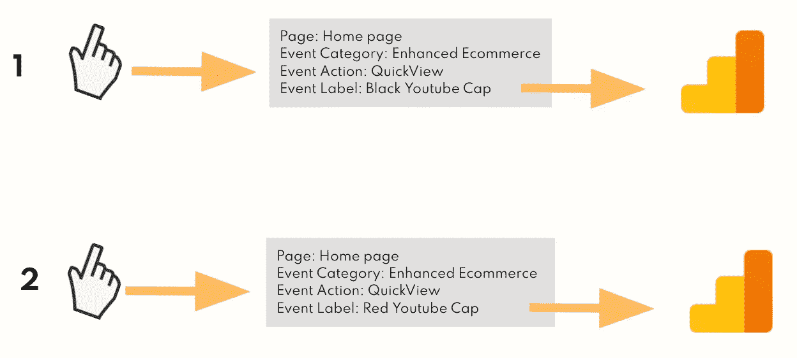

# 如何在谷歌分析中衡量用户互动

> 原文：<https://towardsdatascience.com/how-to-measure-user-interactions-in-google-analytics-cc5f5a32b02b?source=collection_archive---------7----------------------->

## [实践教程](https://towardsdatascience.com/tagged/hands-on-tutorials)

## 利用独特的维度组合进行报告，以推动产品增长。

T 他的文章将带你了解以下内容:

*   什么是互动？
*   GA 中的事件度量有什么区别？
*   什么时候应该使用唯一的维度组合？
*   如何计算互动率？

如何在 GA 中衡量用户互动以推动产品增长[克洛伊·摩根](https://medium.com/u/1e1a852762e2?source=post_page-----cc5f5a32b02b--------------------------------)

# 什么是互动？

交互是网站上与元素的任何接触点。这些是由分析师或谷歌分析用户定义的，可以是点击、悬停、滚动等。

> 交互率是与某个元素进行交互(点击、悬停、点击)的人的百分比。

在产品分析领域，互动率是一个非常有用的指标，可以帮助分析师找到网站或应用中客户可能遇到问题的地方。

假设一个软件工程师通知我们，网站上的一些添加到购物车按钮停止工作，我们需要知道通常使用这个元素的会话的百分比，以便开发团队能够理解修复这个按钮有多紧急。

该指标还可用于洞察用户可能转换或不转换的原因，并可用作目标和目的的关键绩效指标。

# 需要了解信息

Google Analytics(通用)中有 3 个主要指标:**总事件**、**唯一事件、**以及一个更复杂的指标**唯一维度组合。**

这些指标通常使用 3 个维度进行分析:**事件类别、事件操作**和**事件标签。**

如果你不熟悉谷歌分析(通用)，看看我的视频系列开始:

如何使用谷歌分析[克洛伊摩根](https://medium.com/u/1e1a852762e2?source=post_page-----cc5f5a32b02b--------------------------------)

# 事件指标之间有什么区别？

为了了解用户在网站和应用上做了什么，我们可以看看三个事件指标:**总事件**、**唯一事件、**和**唯一维度组合、**，但有什么区别呢？

我们来看一个例子，有一个袜子网站的数据。我们将着眼于与产品组件的交互。

如果用户点击添加到购物车按钮 4 次，事件将被发送或“触发”4 次到 Google Analytics，并且**总事件**指标将为 4。

互动&理解独特的维度组合[克洛伊·摩根](https://medium.com/u/1e1a852762e2?source=post_page-----cc5f5a32b02b--------------------------------)

如果另一个用户也点击了 4 次添加到购物车按钮，那么这个按钮的**总事件**将是 8。Google Analytics 根据追踪组合触发的次数增加总事件数。

> **跟踪组合:**
> 
> 事件类别:产品卡
> 
> 事件操作:单击
> 
> 事件标签:添加到购物车

克洛伊·摩根如何衡量互动

对于独特的交互，Google Analytics 在会话中使用这些维度值第一次触发事件时计数 1，并忽略任何具有相同值的其他事件。

因此，在我们的添加到购物车按钮的例子中，**唯一事件**将是 2，每个客户在一个会话中点击一次。每次发送值时，**总事件数**指标都会计数。

接下来我们有**独特的尺寸组合**。此指标计算报告中每个维度的唯一维度值组合的数量。在大多数情况下，该指标通常与**唯一事件**的值相近，但根据您使用的维度不同，可能会有所不同。

**独特的尺寸组合**允许您*组合*或*组尺寸* 而无需更新或添加额外的跟踪。

## 例子一

*这个例子包含来自谷歌分析演示帐户的数据，所以你可以跟着做。*

由 Chloe mor gan[解释事件指标](https://medium.com/u/1e1a852762e2?source=post_page-----cc5f5a32b02b--------------------------------)

这里我们有一些来自谷歌商品商店的互动事件。对于*黑色 Youtube Cap* 我们可以看到该产品已经被*快速浏览*共计 1045 次。

Chloe mor gan[解释事件指标](https://medium.com/u/1e1a852762e2?source=post_page-----cc5f5a32b02b--------------------------------)

但是其中只有 121 次是独特的。

克洛伊·摩根解释事件指标

这里我们可以看到**独特事件**，场次和**独特维度组合**是一样的。这是因为类别、操作和标签维度是同时发送到 Google Analytics 的。

克洛伊·摩根解释事件指标

假设您的利益相关者想要开展一项促销活动，并希望了解美国每台设备上有多少人与产品进行了互动。

如果您构建了一个包含国家/地区、设备并针对事件类别= *增强型电子商务*进行了过滤的报告，您会发现与以前不同的是，您拥有不同的唯一指标值。这是因为国家和设备事件在会话中发送到 Google Analytics 的时间不同于*增强型电子商务*事件发生的时间。

Chloe mor gan[解释事件指标](https://medium.com/u/1e1a852762e2?source=post_page-----cc5f5a32b02b--------------------------------)

在这种情况下，举办独特的活动会夸大利益相关者推广的受众规模。**唯一维度组合**查看在一个会话内触发这些事件的会话的唯一数量。这给了我们有这一组行动的总人数。

# 例子二

如果你在谷歌商品网站上点击主页上的一顶黑帽子，主页上的一顶红帽子，男士页面上的一顶黑帽子，女士页面上的一顶黄帽子，你在谷歌分析中的互动看起来就像下表。

对于您已经采取的 4 个唯一操作，唯一事件总数**将为 4，唯一维度组合**将为 4。****

克洛伊·摩根计算事件指标

如果您从报告中删除了事件标签，Google Analytics 现在会在主页上显示 2 个**唯一事件**和 1 个**唯一维度组合**，用于我们与快速查看元素的交互。

这是因为**独特事件**正在对我们在这一页上与黑色和红色帽子的两次互动的价值进行求和。

克洛伊·摩根计算事件指标

记得事件类别、动作和标签在**同一时间**向谷歌分析开火。在我们的快速查看交互的情况下，我们点击黑色的帽子，交互被发送到谷歌分析。然后，我们点击红色的帽子，互动被发送到谷歌分析在另一个事件。*(如下图)*

克洛伊·摩根组合事件指标

如果我们想从整体上理解快速查看元素的独特交互，我们需要**在一个独特的层次上组合或分组**这些动作类别的交互。

由 Chloe Morgan 组合事件指标

# 多用户示例

在我们有多个用户的情况下，**用户一**点击黑色帽子的快速视图，事件被发送到 google analytics。**用户一**然后快速看了一眼红色的帽子，这个互动在一个单独的事件中被发送到谷歌分析。

**用户二**走过来，快速看了一眼黑色、红色和黄色的帽子。这些事件将被单独发送到谷歌分析。

由 Chloe mor gan[和 Pexels](https://medium.com/u/1e1a852762e2?source=post_page-----cc5f5a32b02b--------------------------------)为多个用户解释事件指标

为了了解总体快速查看性能，我们需要在事件-操作级别组合或分组这些指标。

如果我们在一个表中查看这个，**独特事件**将显示 5。

*   2 用于用户一
*   3 用于用户二

解释事件指标，Chloe mor gan[的独特事件](https://medium.com/u/1e1a852762e2?source=post_page-----cc5f5a32b02b--------------------------------)，Pexels 的图片

这是因为**唯一事件**仍在查看图表开头的数据，并将**用户二的**事件计为 3 次唯一点击，将**用户一的**计为 2 次唯一点击。

**唯一维度组合**查看图表的组合级别，因此计数为 2。

Chloe Morgan 解释事件指标多用户、唯一维度组合

回到我们的利益相关者的问题——有多少人通过设备与产品进行交互，**独特的维度组合**会对点击多个产品的任何客户进行折扣，**会统计一次。**

由 [Chloe Morgan](https://medium.com/u/1e1a852762e2?source=post_page-----cc5f5a32b02b--------------------------------) 解释事件指标重点示例

# 什么时候应该使用唯一的维度组合？

了解事件如何在你的网站上引发将有助于你找出使用哪个指标。

Chloe mor gan[解释事件指标差异](https://medium.com/u/1e1a852762e2?source=post_page-----cc5f5a32b02b--------------------------------)

*   如果事件同时发送到 Google Analytics，唯一事件将与唯一维度组合指标相匹配。
*   如果事件在会话中的不同时间发送到 Google analytics，这些指标将会不匹配，并且唯一的事件将会被夸大。
*   如果有疑问，请始终使用唯一的尺寸组合，因为这在两种情况下都是正确的。

如有疑问，使用克洛伊·摩根[的独特维度组合](https://medium.com/u/1e1a852762e2?source=post_page-----cc5f5a32b02b--------------------------------)，故事集插图

# 计算交互率

如果我们想了解有多少人与“添加到购物车”按钮进行了交互，我们首先要查看所有看过该元素所在页面的会话。在 Google Analytics 中，您可以为发生交互的页面创建一个片段，以找到会话数。

接下来，我们将找出在 **Sock product 页面上为添加到购物车而触发的事件的事件类别、动作和标签有多少个**唯一维度组合**。**

> 使用页面、事件类别、事件操作、事件标签按唯一的维度组合创建自定义报告，以找到此编号。

在本例中，100 个会话看到了袜子产品页面，80 个**唯一维度组合**被发送到 GA，用于点击添加到购物车的交互。

克洛伊·摩根[解释互动率](https://medium.com/u/1e1a852762e2?source=post_page-----cc5f5a32b02b--------------------------------)

现在，我们可以用会话* 100 除唯一维度组合来计算交互率。我们示例的答案是 80%。

克洛伊·摩根计算互动率

另一个有用的度量是一个会话中一个元素被交互的平均次数。*(平均点击量)*这是用来了解痛点的。

如果一个只需要点击一次或两次的元素有很高的平均点击次数。点击这可能表明用户卡住了，或者是因为失望而点击。

由[克洛伊·摩根](https://medium.com/u/1e1a852762e2?source=post_page-----cc5f5a32b02b--------------------------------)计算平均点击数

# 让我们回顾一下

## **什么是交互？**

*   使用网站上的标签捕捉行为事件的分析。

## **我在哪里可以在谷歌分析中找到事件**

*   在自定义报告中或存储在界面中的 Behaviour > Events 下。

## **主要指标**

*   事件总数
*   独特事件
*   唯一维度组合

## **什么是唯一维度组合，何时应该使用？**

*   与事件组合交互的会话的唯一数量。
*   最佳实践—在衡量独特的互动时，始终使用。

# 快乐分析！

克洛伊👩🏽‍💻📈

推特:@the_numerist

Github: chloeanalyst