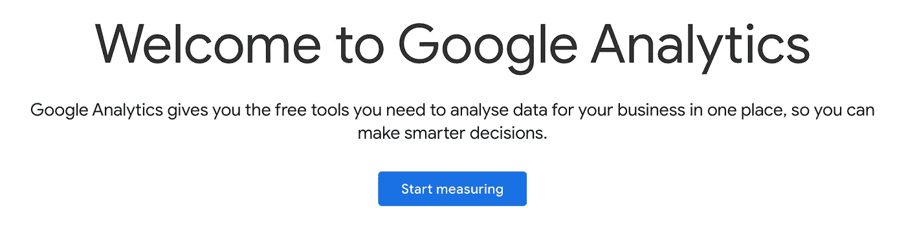
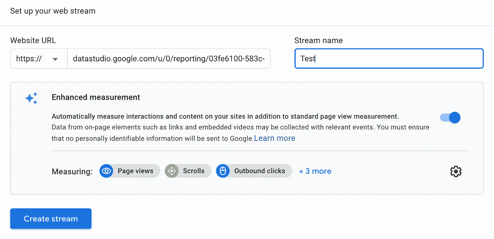
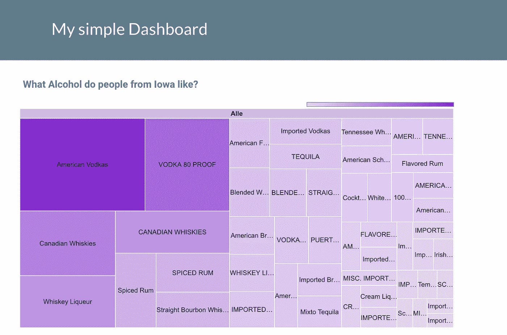
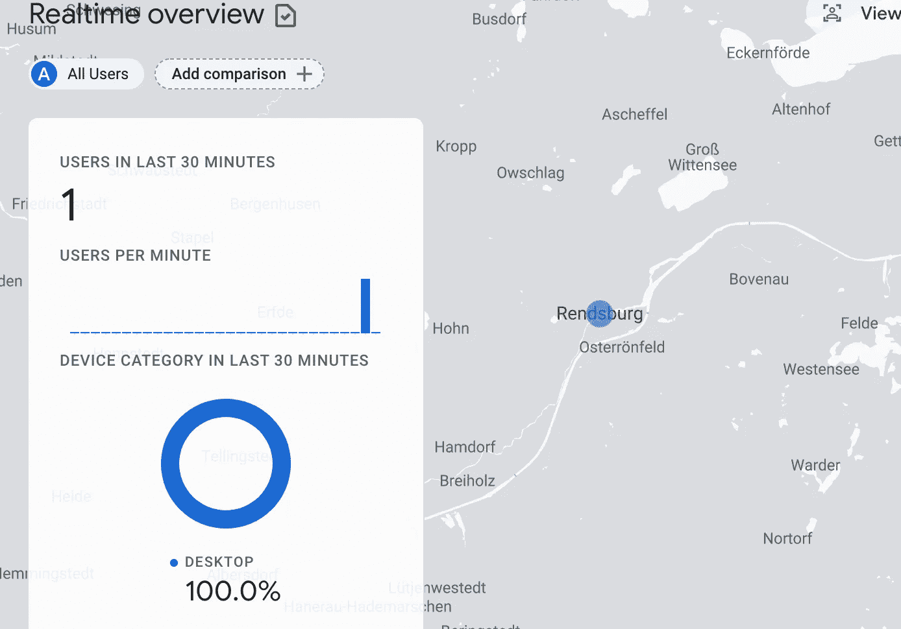

# 如何衡量您的数据工作室统计数据

> 原文：<https://towardsdatascience.com/how-to-measure-your-data-studio-statistics-2d8d2d9f5edb?source=collection_archive---------24----------------------->

## 使用 Google Analytics 监控重要的仪表板指标

丽芙·布鲁斯在 [Unsplash](https://unsplash.com/s/photos/cockpit?utm_source=unsplash&utm_medium=referral&utm_content=creditCopyText) 上的照片

你可能也有使用 BigQuery 的 Google Cloud 作为数据仓库和前端数据工作室吗？作为 BI 或 IT 部门，了解您的报告是否真的被用户使用会很有趣，对吗？截至数据下载时间，哪些报告特别受欢迎。有了谷歌分析，你可以做到这一点。

## 步骤 1:设置谷歌分析

第一步是设置谷歌分析，如果你还没有。这里很酷的一点是，你只需要一个免费的谷歌账户。之后，只需点击**开始测量**。

设置 Google Analytics 按作者分类的图片

谷歌分析检查，除其他外，访问者的来源，他们花在个人网页上的时间，以及搜索引擎的使用，从而更好地监控广告活动的成功。著名的 KPI 有[1]:

*   会话持续时间
*   跳出率(如果有人来到一个页面，没有互动就离开了)
*   命令
*   查看联系信息

还有很多。

## 步骤 2:建立数据流

下一步是创建数据流，并输入要监控的报告的 URL。

建立数据流-按作者分类的图像

我想测量的仪表板是一个简单的测试，我想分析爱荷华州人民的饮酒习惯。数据源是 BigQuery，这是一个公共数据源，Google 已经友好地向所有人开放。

我的简单仪表板—作者图片

## 步骤 3:在报告中存储测量 ID

下一步是将来自分析的度量 ID 添加到 Data Studio dashboard 的报告设置中[2]。在这里，您必须遵循下面提到的步骤:

> 文件→报告设置→粘贴测量 ID

## 第四步:我们来测试一下！

成功了！我看到了一个测试电话，甚至是用什么设备，还有这个人在哪里。

## 摘要

Google Data Studio 和 Analytics 之间的交互也是从 Data Studio 和 Analytics 的方向快速方便地集成。我发现这个特性非常有用，原因有几个。首先，作为提供报告的部门，知道谁以及有多少用户正在访问报告是非常有用的。通常，这些部门必须证明其存在的合理性。这将是一个生成数字和确定改进潜力的好工具。还可以从访问报告的位置和下载数据的时间进行进一步的分析。在这里，我看到了上面提到的所有安全监控方面。

## 资料来源和进一步阅读

[1]谷歌，[营销平台](https://marketingplatform.google.com/about/analytics/) (2021)

[2]谷歌数据工作室*的 Mylluks Kertzel，s . 307*–309(2018)