# 如何衡量您团队的 A/B 测试影响

> 原文：<https://towardsdatascience.com/how-to-measure-your-teams-a-b-testing-impact-f74c6f2b4660?source=collection_archive---------27----------------------->

## Air BnB 估算试验影响的方法

在评估已实现功能的影响时，我们通常使用 A/B 测试提升来评估该功能。然而,《赢家的诅咒》使得我们的治疗提升了，平均来说，夸大了一个特征的真实影响。

下面概述的调整允许我们考虑这种偏差，并对功能影响进行更可靠的估计。Air BnB 的例子见图 1。

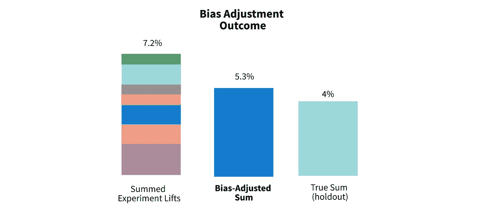

图 1:对 Air BnB 的偏置调整精度的测试，在 7 次实验中运行。注意这些数字改编自[论文](https://www.kdd.org/kdd2018/accepted-papers/view/winners-curse-bias-estimation-for-total-effects-of-features-in-online-contr)。

从实现的角度来看，偏差调整只是从特征的观察到的提升中减去一项。它的计算效率和实现简单。然而，开发鲁棒的精度测量需要一个保持组，这很难设计。

# 偏差调整技术 TLDR

**1)确定每个实验的启动标准。**启动标准( *b* )，即决定一项实验是否会投入生产的规则，是我们参考分布中表示统计显著性的临界点。对于α为 0.05 的 t 检验， *b* 为 1.96。

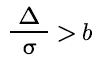

*图 2:δ*是实验升力，σ是标准偏差(或标准误差)，而 *b 是我们参考分布的截止值。*

**2)计算每个实验的偏差。**偏差被定义为由于我们的数据中的自然变化而观察到我们的实验寿命的“可能性”,取决于我们的选择标准。这种可能性由未标准化的 z 值表示。

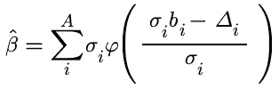

图 3: φ是[正态分布 pdf](https://en.wikipedia.org/wiki/Normal_distribution) ，A *是我们选择启动的一组实验。*

**3)从每个实验中减去偏差项，并对结果求和。**我们现在可以开发一个调整后的总实验升力估计值，该值考虑了赢家诅咒的偏差。

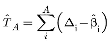

图 4:估计无偏升力。

很简单，对吧？

# 我想是的，但是偏差调整实际上是如何工作的呢？

## 胜利者的诅咒

好的，要理解调整在做什么，我们首先需要理解为什么需要调整。赢家的诅咒是一个借用自经济学的概念，认为拍卖的赢家总是出价过高。要理解这种现象，以及它与在线 A/B 测试的联系，我们来看一张图。

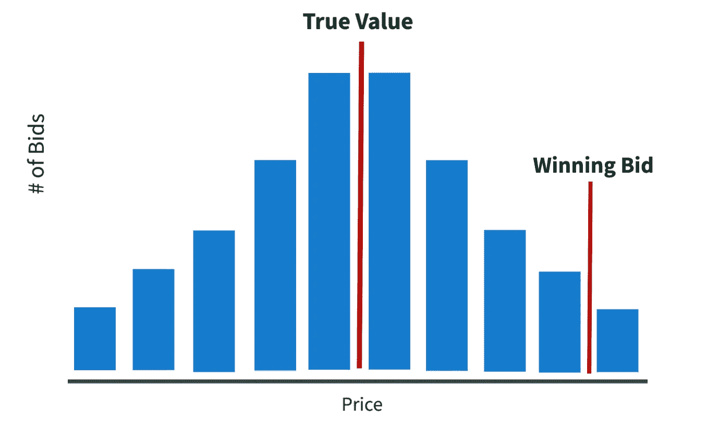

图 5:展示赢家诅咒的直方图。

这里我们看到一个代表拍卖中所有可能出价的钟形曲线。大多数人会出价接近物品的真实价值，即中间的红线。然而，有些人可能对这件物品不感兴趣，所以他们会支付不足，提前离开拍卖。其他人可能真的对这件物品感兴趣，所以他们会支付远远超过其真实价值的价格。最有积极偏见的人会出价最高，赢得拍卖。

在这种情况下，胜出的出价必须高于所有其他出价。让我们用一个条件来定义它，其中管道“|”的左边取决于右边的不等式。

```
Winning Bid := bid | bid > MAX(all other bids)
```

太好了。现在我们有了这个条件，让我们把它和在线实验联系起来。

与拍卖不同，当运行 A/B 测试时，我们不知道处理的**真实** **影响**。相反，通过一些统计意义来支持我们的结论，**我们使用获胜(观察到的)影响来估计真正的影响**。因此，当我们选择将治疗方法投入生产时，我们是在挑选最好的解决方案。

现在，如果我们选择非常积极和消极的影响，我们的选择平均来说是无偏的，但因为我们只选择积极影响高的治疗，我们更有可能选择高估。

请注意，全球抵制组织(即不具备上述任何特征的组织)可以轻松克服赢家的诅咒。从那里，我们可以进行 A/B 测试，其中处理是*所有功能都已实现*，控制是*所有功能都不是*。然而，全球抵制带来了几个问题，其中一些是…

1.  高工程升力，
2.  处于这种维持状态的用户看不到改进的功能，而且
3.  抵制不能被实施来隔离单个团队的影响。如果我们想分别比较产品和 ML 团队的实验影响，我们需要一个支持者。

## **赢家诅咒的数学**

事实证明，我们可以从数学上证明，对于我们投入生产的实验，我们的真实实验效果*平均*小于我们观察到的实验效果**。这句话的最后一部分是关键；如果我们没有选择要实施的实验，就不存在选择偏差，胜利者的诅咒也不适用。**

虽然数学对于实现来说不是必需的，但是它非常简单，所以我们将快速回顾一下。

我们希望证明我们观察到的提升的期望值(平均值)大于真实的、不可测量的提升。

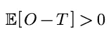

图 6:观察到的升力大于真实升力的情况。

这里， *O* 是观察到的实验升力之和， *T* 是我们假设的真实升力之和。注意第二个量是不可测量的。还要注意，这些金额受我们实施其治疗的标准的限制。我们将这个实现条件表示为 *A* 。

为了包括实施标准，我们将该等式转换为图 7 中的总和。

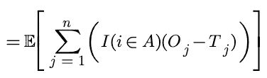

图 7:总的观察影响减去总的真实影响的期望值。

这里，

*   *j* 是我们的 *n* 总用户的迭代器，
*   *i* 是*中每一个实验的一个*，我们设定的实验要启动、
*   *Oⱼ* 是我们在 A/B 测试中观察到的效果，以及
*   Tⱼ是我们真实的(不可测量的)效果。

下一步相当疯狂。我们将参考分布的实验临界值定义为*δ/σ>b*，其中 b 是置信度为α的分布的临界值。在英语中，我们利用统计显著性标准，并将该标准代入等式。请注意， *b* 的典型值是 1.96，这是置信度为 0.05 时的 t 统计值(单侧)。

这种替换产生了下面的等式。请注意，我们也将期望值移到求和中。

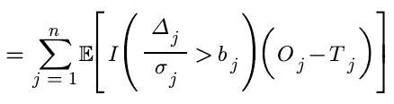

图 8:替换了 stat sig 标准的图 7。

从这里，我们可以从不等式的两边减去 Tⱼ，得到图 9。

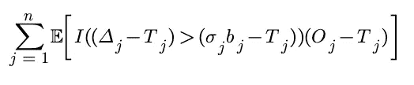

图 9:图 8 从不等式的两边减去了我们的 T_j。

最后，因为 *Oⱼ* 严格大于 *b*σ* (根据我们的实现标准)，我们可以保证 *E[O] > E[T]* 。算出每个例子都很冗长，但是如果你好奇，可以查看 3.2 部分的完整步骤。

我不确定你的看法，但我认为不等式替换是相当疯狂的。

## **偏置调整**

现在我们已经对我们的问题有了一些直觉，让我们来谈谈解决方案。

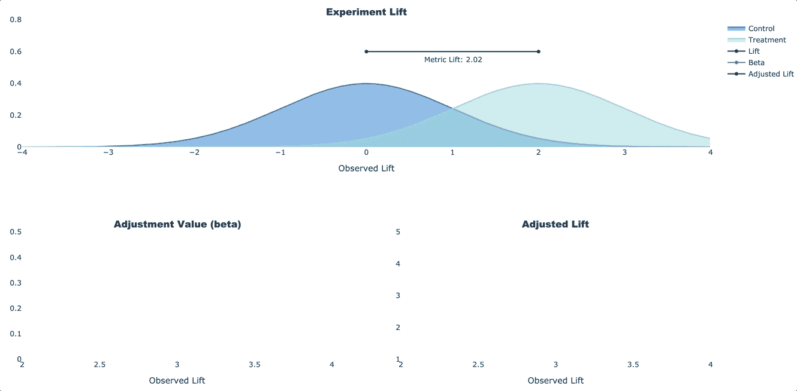

图 10:我们的调整组件的模拟。

我们的目标是考虑在选择要实施的实验时引入的偏差；因为我们只选择非常积极的治疗，我们更有可能选择高估。

为了调整我们的升力，我们减去这个观察值被高估的“可能性”。同样，这种可能性由 z 得分乘以我们的度量标准的标准差来表示，这将标准化单位转换为我们的度量单位。

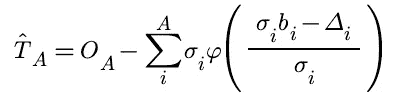

图 11:我们的真实总影响无偏估计的公式。

在图 11 中，我们看到了完整的调整公式。重点关注的区域是 *φ* 里面的分子，我们的正态概率分布函数(PDF)。我们可以看到，随着我们观察到的升力(*δ*)变大(由于正常 pdf 中的负号)，我们的调整项变小。**如果我们的 lift 比我们的实现标准( *b* ᵢ **σ* ᵢ)大得多，那就更值得信赖，更不容易出现偏差。**

而且，所有这些标准差(*)*)只是用来在标准化正态分布(*【N(0，1)】*)单位和我们的度量单位之间移动。从直觉的角度来看，它们并不重要；它们只是方便使用普通的 pdf， *φ* 。**

****置信区间****

**既然我们能够估计由于赢家诅咒而产生的偏差，我们可能想要计算我们在这个估计中的置信度。本文讨论了 3 种置信区间的计算:天真，自助和无偏自助。如果你想计算置信区间，只需参考论文或任何其他关于这些方法的讨论。**

**这就是你要的。实验影响的无偏测量。**

# **实施说明**

*   **对于这个公式，我们假设实验影响是相加的，即它们是按顺序测试的。如果不是这种情况，您将不得不调整数学来处理乘法影响。**
*   **如数学中所暗示的，我们还假设每个分级实验都有正的和统计上显著的升力，即升力大于 *b* 。如果不是这样，你必须做一些调整。如果您对调整有任何疑问，请随时联系我们。**
*   **实施时，重要的是要批判性地思考你的数字意味着什么。例如，确保实验处理中的目标用户能够代表你的用户群体。如果实验的目标是新用户，那么在全球范围内实施时，一定要根据新用户的数量而不是用户总数进行扩展。**
*   **如前所述，维持组是评估总体功能影响的最准确的方法。如果可能的话，在第一次实现时，对您的评估和坚持组一起运行 QA。**

**感谢你完成这篇文章！我将再写 49 篇文章，将“学术”研究引入 DS 行业。查看评论，了解有关调整实验影响的更多链接/想法。**