# 如何将您的数据从红移迁移到雪花

> 原文：<https://towardsdatascience.com/how-to-migrate-your-data-from-redshift-to-snowflake-81208ebb2686?source=collection_archive---------28----------------------->

## 借助开源数据集成，轻松将您的数据从 Redshift 中取出并放入雪花中

作者图片

几十年来，数据仓库解决方案一直是企业报告和商业智能的支柱。但是，近年来，像亚马逊红移和雪花这样的基于云的数据仓库变得非常流行。那么，为什么有人想要从一个基于云的数据仓库迁移到另一个呢？

**答案很简单:**更多*规模和灵活性*。借助雪花，用户可以通过自动添加节点，快速独立地横向扩展数据和计算资源。使用 VARIANT 数据类型，雪花还支持存储更丰富的数据，如对象、数组和 JSON 数据。正如红移用户所知，调试红移并不总是那么简单。有时，它超越了可能引发迁移欲望的特性差异。也许你的团队只是知道如何比红移更好地使用雪花，或者也许你的组织想要在一个特定的技术上标准化。

本食谱将解释使用 [**Airbyte**](https://airbyte.io/) 从红移迁移到雪花以最大化您的业务价值所需采取的步骤。‍

# 先决条件

**1。你需要 Airbyte 来移动你的数据。要部署 Airbyte，请遵循我们文档中的简单说明[这里](https://docs.airbyte.io/quickstart/deploy-airbyte)。**

**2。**红移和雪花都是 SaaS 的服务，你需要在这些平台上有一个账户才能开始。

**3。**当您使用 Redshift 创建数据仓库集群时，默认情况下，它会在其中添加样本数据。我们的数据存储在我们在*‘开发’*数据库中创建的“*红移-星团”*中。创建的集群可以在仪表板上的' *Amazon 红移>集群'*下看到。要创建一个新的集群，请单击下面突出显示的图标，然后继续操作。

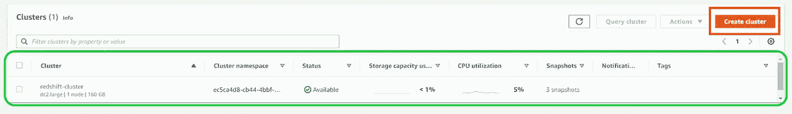

作者图片

**4a)** 对于目的地，您需要在 Snowflake 中创建一个空的数据库和仓库来托管您的数据。为此，单击导航栏中显示的数据库图标，点击*“创建…”。*

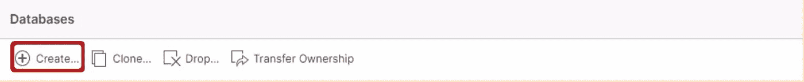

作者图片

*为您的数据库提供一个名称*。在下面的例子中，我们将数据库命名为“雪花 _ 目的地”。‍

**4b)** 建立数据库后，点击仓库图标*‘创建’*一个名为*‘计算 _ WH’的仓库。在我们的例子中，我们使用了一个 X-Small 计算实例。但是，您可以使用更大的实例类型或添加更多实例来扩展计算实例。这可以通过几次简单的点击来实现，并将在后面的部分中演示，以说明迁移的商业价值。现在，您已经具备了开始迁移的所有先决条件。*

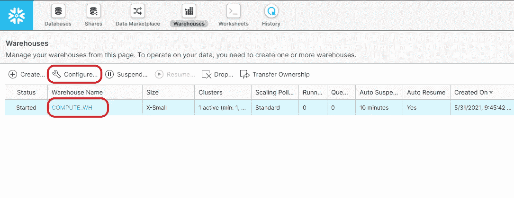

作者图片

# 步骤 1:在 Airbyte 中设置红移源

在网络浏览器中导航到 [http://localhost:8000](http://localhost:8000/) ，打开 Airbyte。 **1b)** 填写以下详细信息，继续设置信号源-

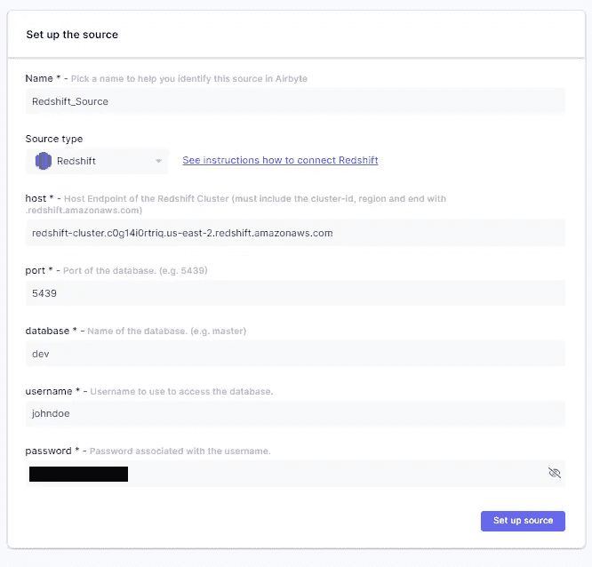

作者图片

在*‘设置源’‘*airbyte 屏幕中，我们在本例中将源命名为*‘红移 _ 源’*，但是如果您愿意，您可以将其更改为其他名称。我们选择的源类型为'*红移'*。其余的信息可以从红移星团仪表盘中获得，如下图突出显示的部分所示。

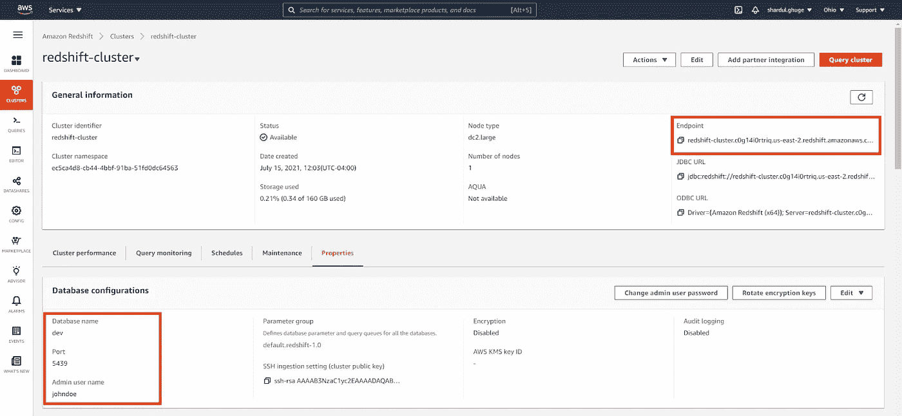

作者图片

除此之外，还有一些设置需要在你的红移控制台中进行调整。例如，假设您在本地机器上运行 Airbyte 并连接到 Redshift。在这种情况下，您需要使您的集群能够通过互联网公开访问，以便 Airbyte 可以连接到它。您可以通过导航到红移控制台上的*“操作”*下拉菜单，单击*“修改公共可访问设置”*并将其更改为“启用”(如果尚未启用)。

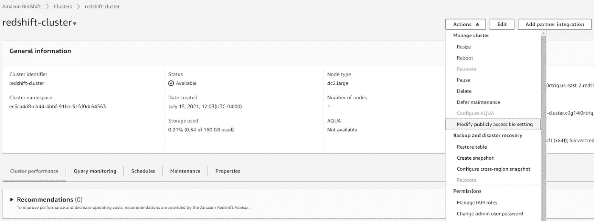

作者图片

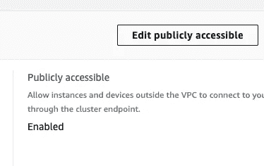

作者图片

接下来，转到 AWS 提供的 VPC 服务。您可以在搜索栏中搜索它，如下所示。

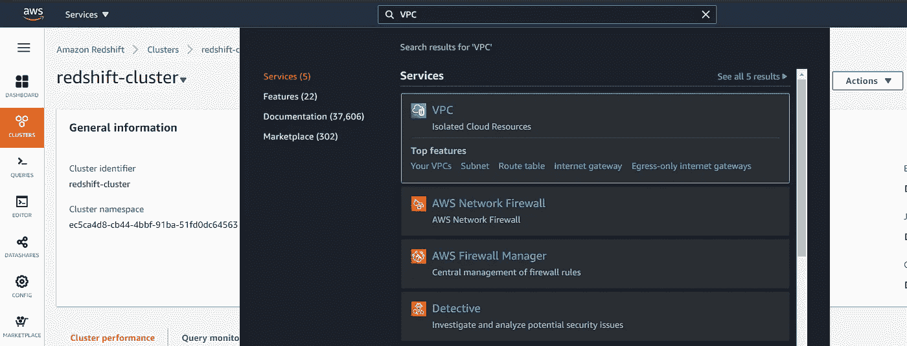

作者图片

然后导航到左侧的*“安全组”*选项卡，进入如下所示的页面，创建一个自定义的入站和出站规则。例如，您需要在端口 5439 上创建一个自定义 TCP 规则，允许来自本地 IP 地址的传入连接。保存规则后，它将在控制面板上以蓝色突出显示。

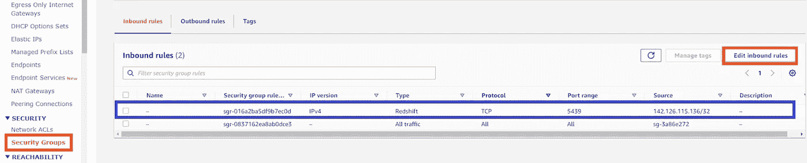

作者图片

自定义入站规则需要具有如下图所示的规范。 ***注意，出站规则也需要做同样的步骤，然后您的红移源将准备好与 Airbyte 连接。***

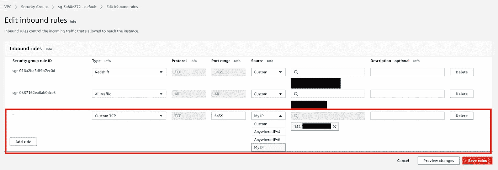

作者图片

# 步骤 2:在 Airbyte 中设置雪花的目的地

配置源之后，进入 Airbyte 中的“设置目标”页面来配置目标。

与上一步类似，目的地名称是可定制的。在本例中，我们使用了“*雪花 _ 目的地*”。然后，我们选择目的地类型为雪花。有关其他必填字段的详细信息，请参考下图。

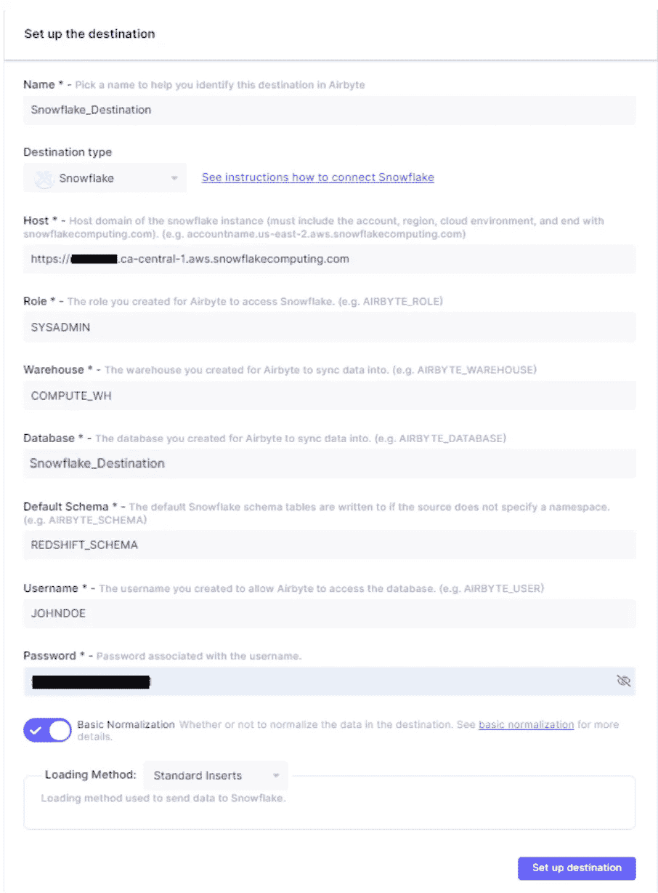

作者图片

可以从雪花仪表板中检索主机值。

注意:在这个例子中，我们在雪花中使用 SYSADMIN 角色，但是强烈建议在雪花中创建一个定制角色[，并减少使用 Airbyte 的权限。默认情况下，Airbyte 使用 Snowflake 的默认模式来写数据，但是如果您愿意，可以将数据放在另一个模式中(就像我们的例子中的 REDSHIFT_SCHEMA)。当您希望将正在迁移的数据与现有数据分开时，拥有单独的模式会很有帮助。最后，用户名和密码应该与创建雪花帐户时设置的凭证一致。](https://docs.snowflake.com/en/user-guide/security-access-control-considerations.html)

点击“Setup the destination”按钮，如果一切顺利，您应该会看到一条消息，告诉您所有的连接测试都已通过。

# 步骤 3:建立连接

一旦设置了目的地，您将被引导至 Airbyte 中的*“设置连接”*屏幕。在这一步中，您会注意到 Airbyte 已经检测到了要迁移的表和模式。默认情况下，选择所有表进行迁移。但是，如果您只想迁移数据的子集，可以取消选择要跳过的表。在此步骤中，您还可以指定详细信息，例如源和目标之间的同步频率。如图所示，有几个时间间隔选项，从 5 分钟到每小时。同步操作的粒度也可以通过为您的使用案例选择正确的同步模式来设置。阅读 Airbyte 文档中的[同步模式了解更多详情。](https://docs.airbyte.io/understanding-airbyte/connections)

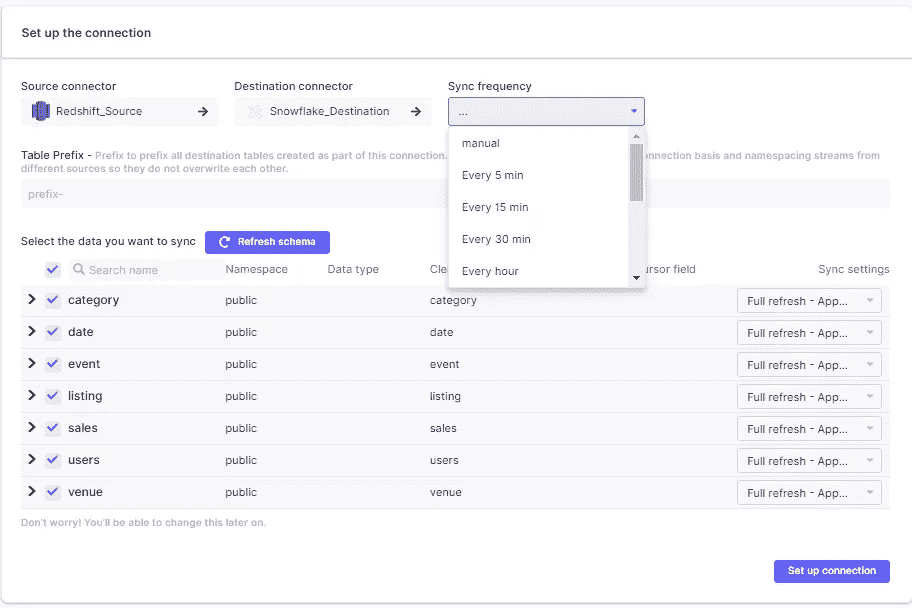

作者图片

指定所有定制后，我们可以单击'*设置连接'*,开始从红移到雪花的数据迁移。一目了然，您将能够看到连接的上次同步状态以及上次同步发生的时间。

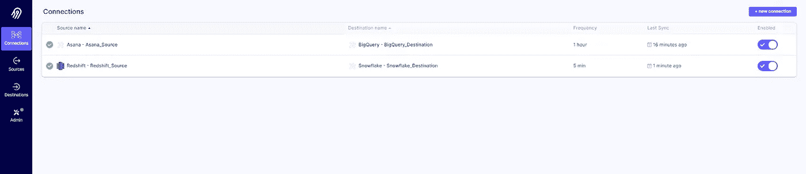

作者图片

这就是使用 Airbyte 将您的数据从红移移动到雪花有多容易。但是，如果您想验证迁移是否已经发生，请查看雪花中的目标数据库，您会注意到还存在额外的数据表。

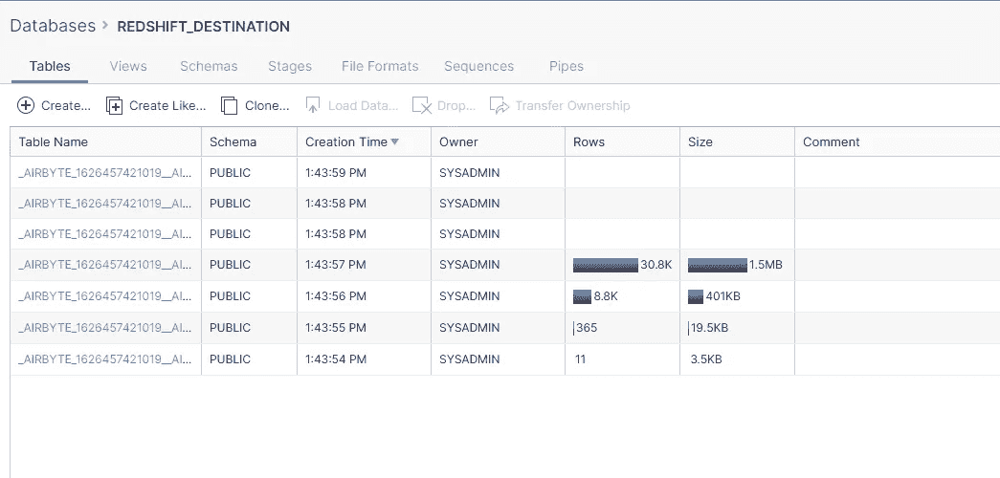

作者图片

# 步骤 4:评估结果

成功迁移数据后，让我们来评估激发迁移的雪花的关键特性。在雪花中，计算能力和存储是解耦的，使得雪花的存储容量不依赖于集群大小。此外，与 Redshift 繁琐的过程相比，Snowflake 只需简单的三次点击就能扩展数据。‍

作者图片

如下图所示，Airbyte 使用 VARIANT 数据类型将 JSON 数据加载到雪花表中。使用 Snowflake 强大的 JSON 查询工具，您可以处理存储在表中的 JSON 数据和非 JSON 数据。另一方面，Redshift 对半结构化数据类型的支持有限，需要多个复杂的子表连接来生成报告视图。

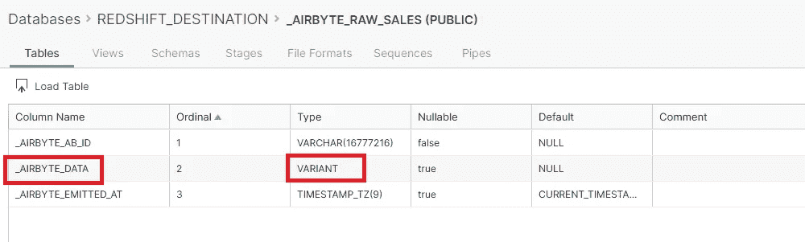

作者图片

# 结束了。

总结一下，我们在这个食谱中做了以下工作:

1.配置了一个红移气源

2.配置了一个雪花 Airbyte 目的地

3.创建了一个 Airbyte 连接，可自动将数据从红移迁移到雪花

4.使用 VARIANT 数据类型探索了易于使用的伸缩特性和对雪花中 JSON 数据的支持

我们知道，在时间紧迫的快速发展项目中工作的开发和运营团队需要积极开发 Airbyte 的开发人员快速回答他们的问题。他们还希望与“亲身经历过”的有经验的社区成员分享他们的经验

[加入 Airbyte 社区 Slack 频道的对话](https://airbyte.io/community)，与 1000 多名数据工程师分享您的想法，帮助每个人的项目取得成功。

有了 Airbyte，集成的可能性是无限的，我们迫不及待地想看看你要构建什么！

*原载于* [*Airbyte*](https://airbyte.io/recipes/redshift-to-snowflake)