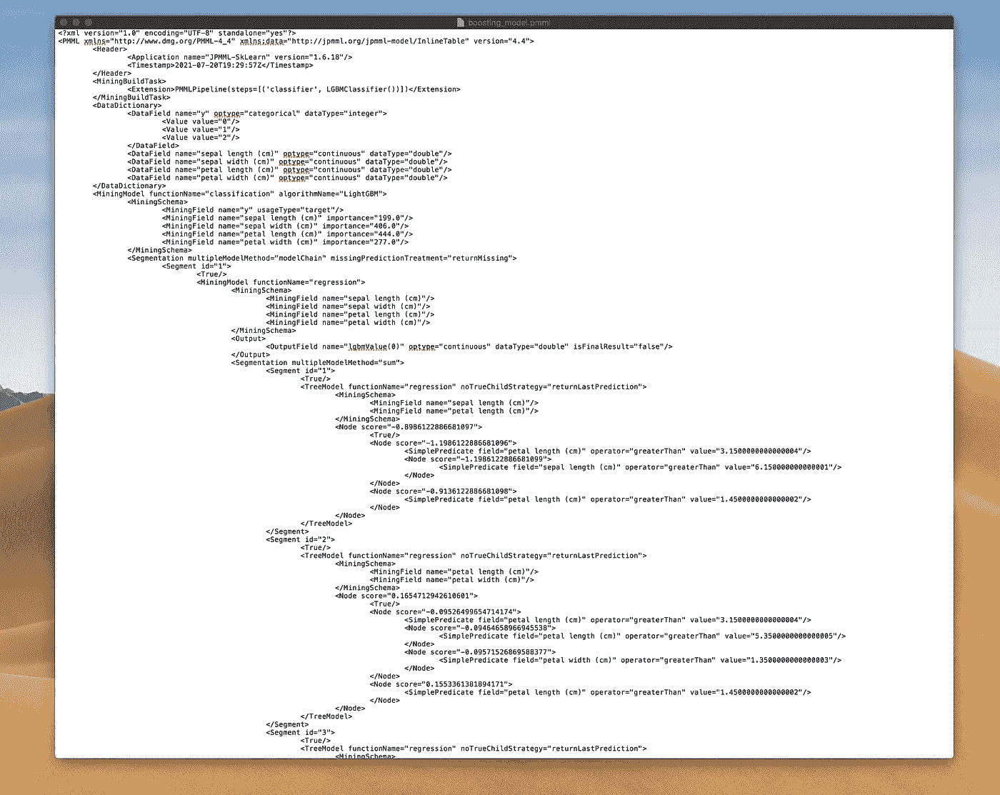
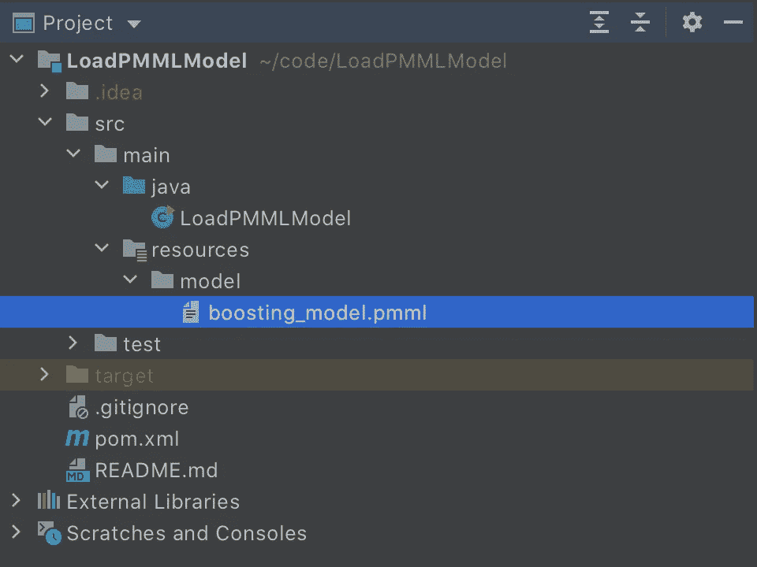
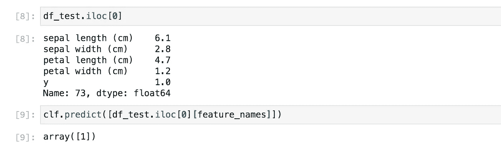
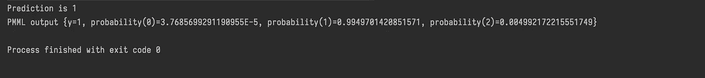

# 如何将您的 Python 机器学习模型迁移到其他语言

> 原文：<https://towardsdatascience.com/how-to-migrate-your-python-machine-learning-model-to-other-languages-6212c9bc61f9?source=collection_archive---------8----------------------->

## 关于如何将你的 ML 模型移植到 Java、Go、C++或任何其他语言的 3 步教程。这比你想象的要容易。


由 [Unsplash](https://unsplash.com?utm_source=medium&utm_medium=referral) 上的[位云](https://unsplash.com/@bitcloudphotography?utm_source=medium&utm_medium=referral)拍摄的照片

我最近在做一个项目，我需要训练一个在边缘运行的机器学习模型——这意味着，处理和预测发生在收集数据的设备上。

像往常一样，我用 Python 做了我的机器学习部分，我还没有想太多如何将我的 ML 内容移植到 edge 设备，这是用 Java 编写的。

当建模部分接近尾声时，我开始研究如何用 Java 加载 LightGBM 模型。在此之前，我和一个同事讨论过，他推荐我用 XGBoost 模型重新训练模型，这个模型可以用 [XGBoost4J](https://xgboost.readthedocs.io/en/latest/jvm/java_intro.html) 依赖关系在 Java 中加载。

LightGBM 和 XGBoost 都是梯度增强库，但有一些不同。如果我决定用 XGBoost 重新训练模型，我希望得到一个类似的模型，但是我不想重新运行所有的实验，因为必须有一个更好的方法。

幸运的是，我发现了一种简单的方法，可以将 Python 中的任何机器学习模型加载到任何其他语言中。

通过阅读这篇文章，你将学会:

*   什么是 PMML？
*   如何将 Python 模型保存为 PMML 格式？
*   如何用 Java 加载 PMML 模型？
*   如何在 Java 中使用 PMML 模型进行预测？

**这里有几个你可能感兴趣的链接:**

```
- [Complete your Python analyses 10x faster with Mito](https://trymito.io/) [Product]- [Free skill tests for Data Scientists & ML Engineers](https://aigents.co/skills) [Test]- [All New Self-Driving Car Engineer Nanodegree](https://imp.i115008.net/c/2402645/1116216/11298)[Course]
```

*你愿意多看一些这样的文章吗？如果是这样，你可以点击上面的任何链接来支持我。其中一些是附属链接，但你不需要购买任何东西。*

# 认识 PMML


[Dom Fou](https://unsplash.com/@domlafou?utm_source=medium&utm_medium=referral) 在 [Unsplash](https://unsplash.com?utm_source=medium&utm_medium=referral) 上拍摄的照片

> 来自[维基百科](https://en.wikipedia.org/wiki/Predictive_Model_Markup_Language):
> 
> **预测模型标记语言** ( **PMML** )是一种基于 XML 的预测模型交换格式，由时任伊利诺伊大学芝加哥分校国家数据挖掘中心主任的罗伯特·李·格罗斯曼博士构想。PMML 为分析应用程序提供了一种描述和交换由数据挖掘和机器学习算法产生的预测模型的方法。

**PMML 支持:**

*   神经网络
*   支持向量机
*   关联规则
*   朴素贝叶斯分类器
*   聚类模型
*   文本模型
*   决策树(随机森林)
*   梯度增强(LightGBM 和 XGBoost)
*   回归模型

PMML 使我们能够加载一个机器学习模型，这个模型是用 Python、 [Java、](https://github.com/jpmml/jpmml-evaluator)、 [Go lang、](https://github.com/asafschers/goscore) [C++](https://github.com/AmadeusITGroup/cPMML) 、 [Ruby](https://github.com/asafschers/scoruby) 和其他语言训练的。

# 1.使用 PMML


照片由[JESHOOTS.COM](https://unsplash.com/@jeshoots?utm_source=medium&utm_medium=referral)在 [Unsplash](https://unsplash.com?utm_source=medium&utm_medium=referral) 上拍摄

在了解了 PMML 之后，我的第一个想法是我需要从根本上重构代码，这将使得用 XGBoost 重新训练模型更加可行。

经过考虑，我决定给 PMML 一个尝试。它有一个维护良好的[库](https://github.com/jpmml/sklearn2pmml)和清晰的说明——这总是一个好迹象。

您可以简单地安装 PMML 软件包:

```
pip install sklearn2pmml
```

将 Python 机器学习模型导出为 pmml 格式需要 sklearn2pmml 包。使用它很简单，我们只需要用 PMMLPipeline 类包装分类器。

为了方便起见，我编写了一个简单的要点，在 Iris 数据集上训练 LightGBM 模型，并将模型导出为 PMML 格式:

1.  导入所需的 Python 包
2.  加载虹膜数据集
3.  将虹膜数据集分割为训练集和测试集
4.  使用 PMML 支持训练 LightGBM 模型——这是您的代码中唯一需要的更改。
5.  衡量模型的分类准确性。
6.  最后，将模型保存为 PMML 格式。

在 Iris 数据集上训练 LightGBM 模型，并将其导出为 PMML 格式。

## PMML 模型是什么样子的？

上面的代码创建了一个 PMML 文件，这是一个 XML 文件。XML 包含了所有的模型细节，如下图所示。



PMML 模型存储在一个 XML 文件中(图片由作者提供)。

# 2.如何用 Java 加载模型？


杰克·杨在 [Unsplash](https://unsplash.com?utm_source=medium&utm_medium=referral) 上的照片

我们用 Python 训练了模型，并将其导出为 PMML 格式，现在我们需要用 Java 加载它。

我在 Github 上创建了一个极简资源库 [LoadPMMLModel](https://github.com/romanorac/LoadPMMLModel) ，它展示了如何用 Java 加载 PMML 模型。

第一步是向 pom.xml 添加 PMML 依赖项(我使用的是 maven dependency manager):

```
<dependency>
	<groupId>org.jpmml</groupId>
	<artifactId>pmml-evaluator</artifactId>
	<version>1.5.15</version>
</dependency
```

我将 PMML 文件保存到项目的 resources 文件夹中，以便编译器可以打包它。



PMML 文件在资源文件夹中(图片由作者提供)

然后我们需要指定模型的路径:

```
String modelFolder = LoadPMMLModel.class.getClassLoader().getResource("model").getPath();String modelName = "boosting_model.pmml";Path modelPath = Paths.get(modelFolder, modelName);
```

用 PMML 模型加载模型很简单(Java 中模型的变量是 Evaluator 类型):

```
Evaluator evaluator = new LoadingModelEvaluatorBuilder()
                .load(modelPath.toFile())
                .build();
evaluator.verify();
```

# 3.如何用 Java 做预测？


塔德乌什·拉科塔在 [Unsplash](https://unsplash.com?utm_source=medium&utm_medium=referral) 上拍摄的照片

现在让我们用加载的模型做一些预测。

在 Python 中，测试集中第一个样本的预测值是 1。



python 中的首次预测(图片由作者提供)。

让我们用 Python 和上面一样的例子，但是用 Java:

```
Map<String, Double> features = new HashMap<>();
features.put("sepal length (cm)", 6.1);
features.put("sepal width (cm)", 2.8);
features.put("petal length (cm)", 4.7);
features.put("petal width (cm)", 1.2);Map<FieldName, FieldValue> arguments = new LinkedHashMap<>();
for (InputField inputField : inputFields) {
            FieldName inputName = inputField.getName();
            Double value = features.get(inputName.toString());
            FieldValue inputValue = inputField.prepare(value);
            arguments.put(inputName, inputValue);
}
```

并在 Java 中查询模型进行预测:

```
Map<FieldName, ?> results = evaluator.evaluate(arguments);// Extracting prediction
Map<String, ?> resultRecord = EvaluatorUtil.decodeAll(results);Integer yPred = (Integer) resultRecord.get(targetName.toString());
System.out.printf("Prediction is %d\n", yPred);
System.out.printf("PMML output %s\n", resultRecord);
```

使用上面的代码，我们得到以下输出:



Java 中模型的输出(图片由作者提供)

# 结论


Johannes Plenio 在 [Unsplash](https://unsplash.com?utm_source=medium&utm_medium=referral) 上拍摄的照片

在我的机器学习项目中，我使用了回归助推模型。令我惊讶的是，导出的 PMML 模型产生的结果与 Python 中的模型一样精确到小数点后第五位。

我对 PMML 没有什么不好的，因为它在生产中工作可靠。

请记住，您不需要复制粘贴本文中的代码，因为我在 Github 上创建了 [LoadPMMLModel](https://github.com/romanorac/LoadPMMLModel) 存储库。

请让我知道你对 PMML 的想法。

# 在你走之前

在 [Twitter](https://twitter.com/romanorac) 上关注我，我经常在那里发关于数据科学和机器学习的微博。


凯利·西克玛在 [Unsplash](https://unsplash.com?utm_source=medium&utm_medium=referral) 上的照片