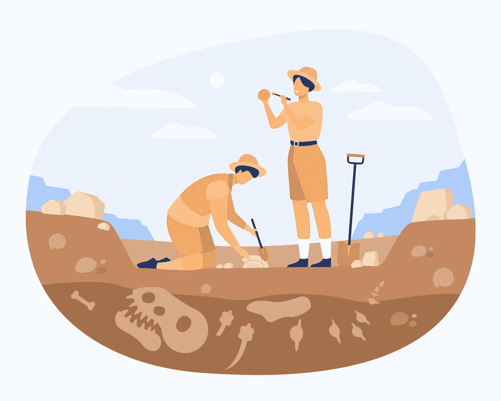
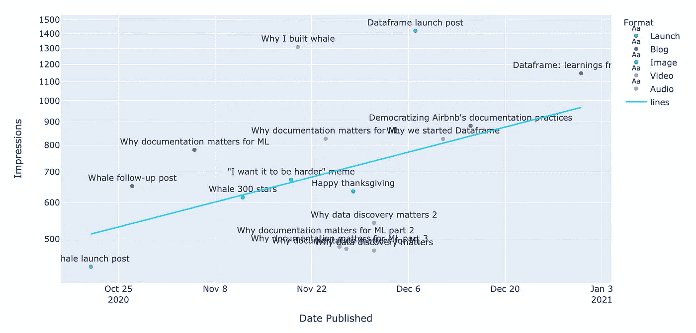

# 如何从小数据中获取洞察力

> 原文：<https://towardsdatascience.com/how-to-milk-small-data-for-insights-1ae9c7000f8e?source=collection_archive---------19----------------------->

## 用手做，不要过度

一些背景:我开了一家[公司](https://dataframe.ai/)。我们在 LinkedIn 上发布了 17 次，以测试社交媒体作为潜在客户生成渠道的能力。**我想知道:我们能从这 17 个职位的表现中学到什么？**

我心中的数据科学家自然会大声找借口。

> *这里没有* ***随机化*** *！这里有* ***每一种偏见*** *！我需要用一个* ***倾向模型*** *来权衡这个。但即使这样，我连* ***都没有重叠*** *！*

但作为 Dataframe 的产品负责人，我杀死了自己的这个内在版本，并提出了我认为合理的小数据分析方法。我将在这里分享我的过程和学习。

# ⚒第一课:不要用手提钻钻孔。

> ✏️不知道如何收集数据？手动操作。

好吧，这只是为了举例说明。不要把它写在纸上——至少把它放在电子表格里。

最困难的部分总是寻找、获取和清理你的数据。为了具有可重复性，这应该包括像 Segment、Fivetran、数据仓库和 Dataframe 这样的工具的组合来组织这一切。但是对于一次性的项目，一个全功能的、自我更新的管道通常是多余的。

我研究了第三方服务来为我从 LinkedIn 收集数据，但很快意识到只需要大约 15 分钟就可以手动收集我们从 LinkedIn 获得的所有数据**和我想要的精确维度。**

> 所以我就这么做了。我只是手动将我们所有的统计数据放入一个 csv 文件中。

这可能感觉有点显而易见，但是在 ETL 和数据管道的世界里，它不适合我。手动数据收集可能感觉过时，但它工作得很好。如果某件事要花你不到三十分钟的时间去做，那么做起来可能会更便宜。考虑机会成本)，而不是考虑并实现一个更具可扩展性的解决方案。

# ⭐️第二课:不要 p-hack。专注于你想回答的问题。

当你在做任何事情的时候，很容易进入兔子洞，但是当你在处理小数据的时候，这可能是特别危险的。您需要保持在 p-hacking 之上(测试太多的假设，并在此过程中发现假阳性)。一个奇妙的、节省时间的方法是只做你工作的 80/20。你在努力提高影响力，而不是证明你的工资是合理的。运用你最好的判断力，这应该足以让你朝着正确的方向前进。

## 📉随便编几个情节，继续前进。

这是我们为 LinkedIn 研究做的一个:

一段时间内不同帖子的 LinkedIn 印象图。图片作者。

是的，这是真实的数据，显示了一段时间内的印象。是的，它很丑(这是重点)。它只有几行代码，给了我们一些快速的洞察力:

*   随着时间的推移，我们的印象越来越深刻！
*   我们在页面上尝试了一系列纯音频的播客风格的帖子(线下的橙色块)。这些显然没有效果。
*   我们最有效的、超越曲线的帖子是我们的**发布帖和视频**。

这让我们确认了什么是有效的，什么是无效的。当然，这里的误差线可能很大，但这给了我们*一些*数据，虽然我们永远不会公布我们的发现，但有理由把这作为我们前进的零假设。

> 最有可能的情况总是你的数据反映了事实。📈

是的，是的，这是一个非常丰富的，容易被误解的声明。(不要杀我，统计学家。我是你们中的一员，我发誓！)不过一般都是真的。在没有更多数据的情况下，你的小数据结果可能是最接近事实的。

# 📜第三课:记录并分享你的学习成果。

小数据不适合机器学习模型。小数据不适合严格的实验。
小数据不适合稳健的效应大小估计。

> 🐭小数据对于**方向性**洞察很有用。

因此，与决策者分享你的成果更为重要。

在我们的例子中，作为 Dataframe 的首席数据官，我并不领导营销工作，而是我们的首席执行官约瑟夫·穆恩(Joseph Moon)领导。所以我对他放松了这一点，确保他读了它，然后在我们的会议上重复了一遍，这样他就能记住这一点。

# 简而言之，不要让缺乏数据阻止你寻找见解。🚀

只要你有一些数据，你就可以做一些事情。

由于来自数据量从来不是大问题的公司，我最初认为这种小数据工作是无用的(我认为这是大多数数据科学家和分析师的倾向)。但在一位数(甚至基点)涨幅的世界里生活了这么久之后，我忘记了一个重要的事实:

> 如果影响大小足够大，你不需要很多数据来找到站得住脚的见解。

当你刚刚创办一家公司时，每一个行动都有可能带来巨大的提升。当它发生时，确保你不会错过它。

*推文*[*@ imrobertyi*](https://twitter.com/imrobertyi)*/*[*@ data frame*](https://twitter.com/dataframeapp)*app 打招呼。👋**或者关注我们上*[*LinkedIn*](https://www.linkedin.com/company/dataframeai/)*。🙂* ***要了解更多我们在 Dataframe 所做的事情(并注册我们数据上下文平台的私有测试版)，请访问***[***data frame . ai***](http://dataframe.ai)***。***