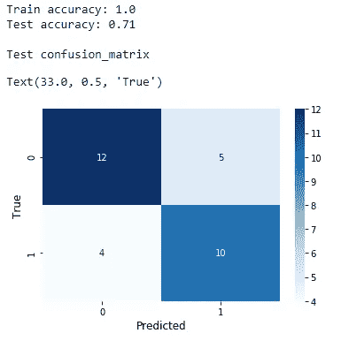
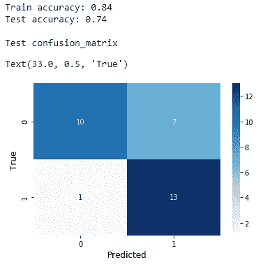
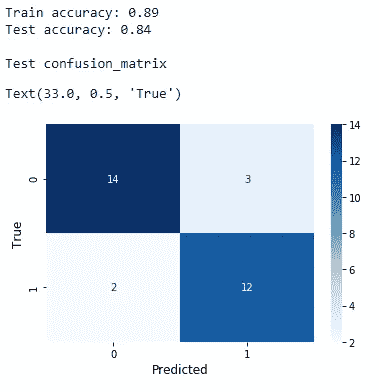

# 如何通过创建系综来减轻过度拟合

> 原文：<https://towardsdatascience.com/how-to-mitigate-overfitting-by-creating-ensembles-77e9299b9ad0?source=collection_archive---------24----------------------->

## 解决过度拟合问题

## 解决过度拟合问题—第 4 部分

[斯凯工作室](https://unsplash.com/@skyestudios?utm_source=unsplash&utm_medium=referral&utm_content=creditCopyText)在 [Unsplash](https://unsplash.com/?utm_source=unsplash&utm_medium=referral&utm_content=creditCopyText) 拍摄的照片

如果我们总结一下到目前为止在**“解决过度拟合问题”**系列文章中所做的工作，我们已经讨论了三种可以用来减轻过度拟合的不同技术。正如你已经知道的，**交叉验证**(在[第一部分](/how-to-mitigate-overfitting-with-k-fold-cross-validation-518947ed7428)中讨论过)、**正则化**(在[第二部分](/how-to-mitigate-overfitting-with-regularization-befcf4e41865)中讨论过)和**降维**(在[第三部分](/how-to-mitigate-overfitting-with-dimensionality-reduction-555b755b3d66)中讨论过)可以有效地减轻过拟合。在第 4 部分中，今天我们讨论另一个有用的技术，叫做**创建合集**。

然而，这种技术仅限于基于树的模型。有人可以尝试构建决策树模型(步骤 1)而不限制树的增长(不提前停止或不做任何超参数调整)。他将得到一个明显过度合身的模型。然后，他可以通过限制树的增长(通过提前停止或超参数调整)来构建相同的模型(步骤 2)。这一次，模型不会像前一次那样过度拟合数据。如果他想进一步减轻过拟合，他可以建立一个集成模型(步骤 3)，例如， ***随机森林*** 即不相关决策树的集合。这是我们讨论今天内容所遵循的顺序。

与单个决策树模型相比，如果我们通过限制每个单独决策树的增长来构建随机森林模型，则随机森林模型不太可能过度拟合数据。请记住，与其他模型相比，随机森林模型可能仍然过拟合。

与其他模型相比，随机森林不太可能过度拟合数据，这背后的直觉是:

> 随机森林是通过组合多个不相关的决策树构建的(因此得名，**森林**)。当创建随机森林时，在选择特征和训练实例时将应用额外的随机性(因此得名，**随机**)。由于这些原因，当创建随机森林时，数据和特征被很好地表示(混合)。森林中的每棵树都生成不相关的结果，然后对这些结果进行平均，得到最终结果，这个结果足够强大，可以产生比任何单个决策树更准确和稳定的结果(更少的过拟合)——作者

现在，我们将进入包含在 3 个步骤中的编码部分。

# (步骤 1):在不限制树增长的情况下构建决策树模型

为此，我们在“ [**心脏病**](https://drive.google.com/file/d/19s5qMRjssBoohFb2NY4FFYQ3YW2eCxP4/view?usp=sharing) ”数据集上创建决策树模型，而不限制树的增长(不提前停止或不进行任何超参数调整)。

创建决策树模型，而不限制树的增长

(图片由作者提供)

训练准确率 100%。测试精度远低于训练精度。因此，模型明显过拟合。这并不奇怪，因为我们没有限制树木的生长。

# (步骤 2):通过限制树的增长来构建相同的决策树模型

这里，我们将通过设置 **max_depth=3** 来限制树的深度。

通过限制树的增长来创建相同的决策树模型

(图片由作者提供)

这个型号比早期的稍好一些。让我们看看是否可以通过创建一个随机森林(系综)——多个不相关的决策树的搭配——来进一步减轻过度拟合。

# (步骤 3):构建随机森林

这里，我们将应用相同的限制标准， **max_depth=3** 来限制每棵树的深度，然后创建一个随机森林。

创建随机森林模型

(图片由作者提供)

这一次的模式比前两次好很多。它能够很好地概括新的看不见的数据。因此，我们能够通过创建决策树的集合来减轻过度拟合。

# 最后的想法

到目前为止，我们已经讨论了以下可用于减轻过度拟合的技术:

*   **交叉验证**
*   **正规化**
*   **降维**
*   **创建合奏**

要完成本系列文章，还有一项技术需要讨论。在应用任何技术之前，您应该首先意识到您的模型是过度拟合的。然后，根据您想要构建的数据和模型选择最佳技术。您可以尝试多种技术，看看模型的表现如何。在本系列的最后一部分(第 5 部分)，我将添加详细的指导原则，帮助您选择最佳技术。同时，你可以练习到目前为止你所学的方法。记住“你知道的不去实践”等于“你不知道”！

**更新(2021–10–05):**第 5 部分现已推出！
[ [如何通过特征选择减轻过度拟合](/how-to-mitigate-overfitting-with-feature-selection-164897c0c3db)

今天的帖子到此结束。我的读者可以通过下面的链接注册成为会员，以获得我写的每个故事的全部信息，我将收到你的一部分会员费。

**报名链接:**[https://rukshanpramoditha.medium.com/membership](https://rukshanpramoditha.medium.com/membership)

非常感谢你一直以来的支持！下一个故事再见。祝大家学习愉快！

特别感谢 Unsplash 上的 **Skye Studios** ，为我提供了一张不错的封面图片(我对图片做了一些修改:添加了一些文字并删除了一些部分)。

[鲁克山普拉莫迪塔](https://medium.com/u/f90a3bb1d400?source=post_page-----77e9299b9ad0--------------------------------)
**2021–09–30**