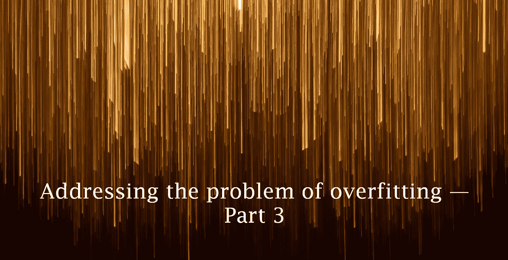
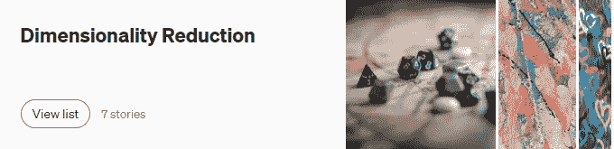
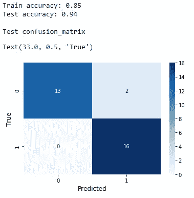
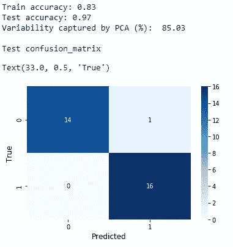

# 如何通过降维来减轻过度拟合

> 原文：<https://towardsdatascience.com/how-to-mitigate-overfitting-with-dimensionality-reduction-555b755b3d66?source=collection_archive---------22----------------------->

## 解决过度拟合问题

## 解决过度拟合问题—第 3 部分

Rene b hmer 在 [Unsplash](https://unsplash.com/?utm_source=unsplash&utm_medium=referral&utm_content=creditCopyText) 上拍摄的照片

到目前为止，我们已经完成了**文章系列的[第 1 部分](/how-to-mitigate-overfitting-with-k-fold-cross-validation-518947ed7428)和[第 2 部分](/how-to-mitigate-overfitting-with-regularization-befcf4e41865)。你已经知道有很多方法可以解决过度拟合的问题。**交叉验证**和**正则化**是我们已经讨论过的两种众所周知的技术。**降维****【DR】**是另一种可以用来减轻机器学习模型中过拟合的有用技术。请记住，除了减轻过度拟合，DR 还有许多其他用例。**

**当解决过度拟合时，DR 处理模型复杂性。当数据中有许多要素时，模型会变得更加复杂。复杂的模型往往会过度拟合数据。DR 通过减少数据中特征(维度)的数量来处理模型的复杂性。有两种方法可以减少数据的维数:**

*   **查找包含不同于原始数据集中的值的一组新要素。应用变换。这就是我们今天讨论的方法。**
*   **保留数据集中最重要的要素，移除冗余(不必要)的要素。数据集中的原始值保持不变，并且不应用任何变换。这种方法被称为**特征选择**，是一种 DR。这将在本系列的[第 5 部分](/how-to-mitigate-overfitting-with-feature-selection-164897c0c3db)中讨论。**

**降维的技术非常多。在这里，我们使用**主成分分析(PCA)** 来寻找一组包含不同值的新特征，同时尽可能多地保留原始数据集中的变化。**

****注:**如果你想详细研究各种 DR 方法(尤其是 PCA)及其对 Python 的诅咒，点击下图可以看到我之前的内容列表:**

**

(作者截图)** 

# **不应用主成分分析建立模型**

**首先，我们在“ [**心脏病**](https://drive.google.com/file/d/19s5qMRjssBoohFb2NY4FFYQ3YW2eCxP4/view?usp=sharing) ”数据集上建立逻辑回归模型，并查看输出。**

**不应用主成分分析的逻辑回归模型**

****

**(图片由作者提供)**

**让我们看看我们可以做些什么来进一步提高模型的性能。**

# **应用主成分分析后建立模型**

**现在，我们在相同的数据集上构建相同的模型，但是在应用 PCA 之后。原始数据集中有 13 个特征(用 **X** 表示)。PCA 将它们转换成一组新的 9 个变量。所有这些捕获了数据中总可变性的 85.03%。**

**应用主成分分析后的逻辑回归模型**

****

**(图片由作者提供)**

**模型的精度提高了 3%。因此，我们通过应用主成分分析进一步改进了模型。**

# **见解和结论**

**当我们应用 PCA 时，我们丢失了原始数据中的一些可变性。这取决于我们在 **n_components** 中指定的特性数量。在我们的例子中，我们丢失了原始数据中大约 15%的可变性。我们损失的可变性越低，结果就越好。然而，主成分分析仍然能够提高模型的性能。这是因为 PCA 去除了数据中的噪声，只保留了数据集中最重要的特征。这将减轻数据的过度拟合，并提高模型的性能。我们得到一个简单而精确的模型。**

****更新(2021–10–01):**第 4 部分现已推出！
[ [如何通过创建集合来减轻过度拟合](https://rukshanpramoditha.medium.com/how-to-mitigate-overfitting-by-creating-ensembles-77e9299b9ad0)**

**今天的帖子到此结束。我的读者可以通过下面的链接注册成为会员，以获得我写的每个故事的全部信息，我将收到你的一部分会员费。**

****报名链接:**[https://rukshanpramoditha.medium.com/membership](https://rukshanpramoditha.medium.com/membership)**

**非常感谢你一直以来的支持！下一个故事再见。祝大家学习愉快！**

**特别要感谢 Unsplash 上的**Rene b hmer**，他为我提供了这篇文章的漂亮封面图片(我对图片做了一些修改:在上面添加了一些文字并删除了一些部分)。**

**[鲁克山普拉莫迪塔](https://medium.com/u/f90a3bb1d400?source=post_page-----555b755b3d66--------------------------------)
**2021–09–27****