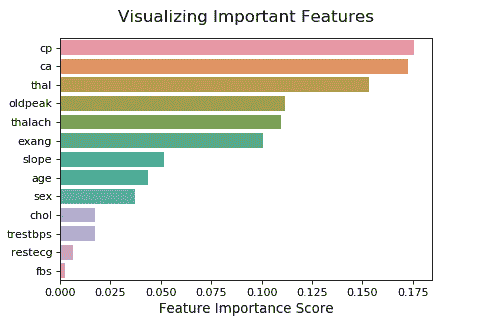
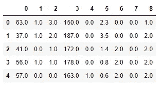
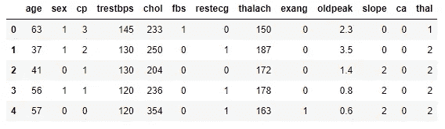

# 如何通过特征选择减轻过度拟合

> 原文：<https://towardsdatascience.com/how-to-mitigate-overfitting-with-feature-selection-164897c0c3db?source=collection_archive---------34----------------------->

## 解决过度拟合问题

## 解决过度拟合问题—第 5 部分


照片由[在](https://unsplash.com/@mockup_photos?utm_source=unsplash&utm_medium=referral&utm_content=creditCopyText) [Unsplash](https://unsplash.com/?utm_source=unsplash&utm_medium=referral&utm_content=creditCopyText) 上的实体照片拍摄

这是**【解决过度拟合问题】**系列文章的最后一部分。今天，我们从第四部分继续。上次，在第 4 部分的第 3 步中，我们在" [**心脏病**](https://drive.google.com/file/d/19s5qMRjssBoohFb2NY4FFYQ3YW2eCxP4/view?usp=sharing) "数据集上构建了一个随机森林模型。在那里，我们使用了数据集的所有 13 个特征。今天，我们将通过仅考虑最重要的特性来修改该模型。

首先，我们通过使用 **feature_importances_** 属性来可视化随机森林模型的特征重要性。

随机森林模型特征重要性的可视化



(图片由作者提供)

很明显，并不是所有的特征都对模型有贡献。有些特征对模型不重要，我们可以删除它们。

> 当我们从模型中移除最不重要的特征时，我们降低了模型的复杂性和数据中的一些噪声。这样做将有助于进一步减轻过度拟合——按作者

上图的 **x** 轴包含每个特性的特性重要性分数。我们可以为重要性分数指定一个阈值(这里，我们选择 **0.025** )，这样分数低于该阈值的所有特征都将被消除。为此，我们可以使用 Scikit-learn**select from model**类。

```
from sklearn.feature_selection import SelectFromModelselector = SelectFromModel(rfclf, threshold=0.025)
features_important = selector.fit_transform(X, y)
```

这将返回一个 2D-Numpy 数组，其中仅包含由阈值决定的重要特性的值。通过将其转换成熊猫数据帧，

```
pd.DataFrame(features_important).head()
```

我们可以获得下表:



数据帧 1(图片由作者提供)

如果我们也得到原始数据帧，

```
X.head()
```



数据帧 2(图片由作者提供)

我们已经移除了 4 个特征: **fbs** 、 **restecg** 、 **trestbps** 和 **chol** 。这些特征对模型没有足够的贡献。将它们保留在模型中会增加模型的复杂性，并导致模型过度拟合数据。

移除特征的重要性分数的顺序是:

```
**fbs < restecg < trestbps < chol**
```

如果考虑特征**【性】**，其重要性值是**【CHOL】**的两倍以上。如果我们还删除了特征**【性别】**，模型将丢失一些重要数据。这将导致模型拟合不足。这就是为什么我们选择了 **0.025** 作为阈值来选择我们想要保留在模型中的特征。通过查看特征重要性图，可以很容易地确定阈值的值。

最后，我们可以使用移除了特征的修改后的数据帧(数据帧 1)来再次构建随机森林模型。这一次，我们只使用了 9 个特性。换句话说，我们可以说我们降低了数据的维度。但是，请记住，数据集中的原始值保持不变。您可以将其与本系列的第 3 部分[进行比较，在第 3 部分](/how-to-mitigate-overfitting-with-dimensionality-reduction-555b755b3d66)中，我们讨论了一种降维方法，该方法可以找到一组新的要素，这些要素包含与原始数据集中不同的值。

我们今天讨论的特征选择方法可以应用于基于树的模型，如决策树、随机森林等。对于线性回归和逻辑回归模型，向后消除和向前选择是首选。如果你想详细了解它们，可以阅读我写的这篇文章。

今天的部分到此结束，也是**“解决过度拟合问题”**系列文章。我们在 5 篇文章中讨论了 5 种不同的技术来解决过度拟合的问题。作为附加内容，我将添加一些选择最佳技术的指南。

# 选择最佳技术的一些准则

到目前为止，我们已经讨论了以下可用于减轻过度拟合的技术:

*   **交叉验证**
*   **正规化**
*   **降维**
*   **创作合奏**
*   **功能选择**

您不需要应用所有这些技术来减轻过度拟合。这里有一些指导方针可以帮助你选择最好的技术。

*   首先，在应用任何技术之前，您需要意识到您的模型是过度拟合的。如果你得到一个较高的训练分数和相对较低的测试分数，你的模型会过度拟合数据。
*   使用[交叉验证](/k-fold-cross-validation-explained-in-plain-english-659e33c0bc0)来评估模型总是更好，交叉验证有助于您发现大量选项来减轻过度拟合。
*   最好将交叉验证与超参数调整技术结合起来，如[网格搜索或随机搜索](/python-implementation-of-grid-search-and-random-search-for-hyperparameter-optimization-2d6a82ebf75c)，为定义的超参数找到一组最佳值。这将有助于你减轻过度拟合。任何型号都可以进行超参数调整。例如，我们可以用它来限制决策树的增长。这个过程是在[第二部分](/how-to-mitigate-overfitting-with-regularization-befcf4e41865)中讨论的一种正规化。
*   另一种类型的正则化是将正则化项添加到损失函数中。这适用于逻辑回归、线性回归等线性模型，也适用于 XGBoost 等基于树的模型。对于逻辑回归，在 Scikit-learn 中默认应用正则化的 L2 变量。L1 变种也可用。对于线性回归，没有在模型本身中指定正则化的选项。然而，Scikit-learn 为此提供了 3 个不同的选项。当我们将 L1 正则化应用于线性回归时，它被称为**套索**回归。当我们将 L2 正则化应用于线性回归时，它被称为**岭**回归。当我们同时将 L1 和 L2 变量应用于线性回归时，它被称为 **ElasticNet** 回归。
*   降维技术可以应用于几乎任何数据集。最流行的 DR 技术是主成分分析(PCA)。除了解决过拟合问题之外，它还有许多优点。
*   如果您想在数据中找到非线性模式，您可以使用集成技术，如随机森林和 XGBoost 模型，而不是使用单个决策树。
*   您也可以将两种技术结合起来，以获得更好的效果。例如，您可以创建集合模型，同时应用正则化来限制单个树的增长。您可以在选择数据集中最重要的要素时创建集合模型。
*   创建模型后，您可以识别最重要的要素并从数据集中移除不必要的要素，然后仅使用最重要的要素来重新构建模型。对于像随机森林 XGBoost 这样的集合模型，使用 **feature_importances_** 属性可以很容易地做到这一点。对于线性回归和逻辑回归模型，可以使用单独的类进行向后消除和向前选择。

# 结论

现在，你将拥有应用 5 种不同技术解决过度拟合问题的实践经验。我建议您将它们应用于不同的数据集。您可以对数据集应用多种技术并查看输出，然后通过查看输出来选择最佳技术。

为了方便起见，我决定列出这个系列文章的所有部分和另一个有用的帖子。现在，您可以通过单击下图在一个位置访问所有这些内容。

[](https://rukshanpramoditha.medium.com/list/addressing-overfitting-868959382d1d)

本系列所有帖子列表(作者截图)

今天的帖子到此结束。我的读者可以通过下面的链接注册成为会员，以获得我写的每个故事的全部信息，我将收到你的一部分会员费。

**报名链接:**【https://rukshanpramoditha.medium.com/membership 

非常感谢你一直以来的支持！下一个故事再见。祝大家学习愉快！

特别感谢 Unsplash 上的**实体照片**，为我提供了这篇文章的封面图片(我对图片做了一些修改:添加了一些文字并删除了一些部分)。

[鲁克山普拉莫迪塔](https://medium.com/u/f90a3bb1d400?source=post_page-----164897c0c3db--------------------------------)
**2021–10–04**