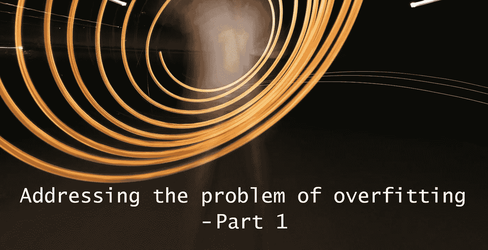
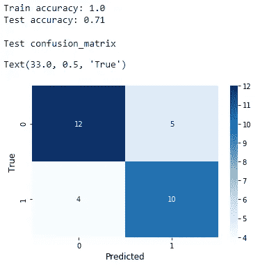
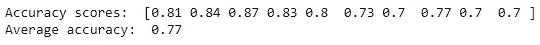

# 如何用 K-Fold 交叉验证减轻过度拟合

> 原文：<https://towardsdatascience.com/how-to-mitigate-overfitting-with-k-fold-cross-validation-518947ed7428?source=collection_archive---------12----------------------->

## 解决过度拟合问题

## 解决过度拟合问题—第 1 部分

约书亚·苏考夫在 [Unsplash](https://unsplash.com/?utm_source=unsplash&utm_medium=referral&utm_content=creditCopyText) 上的照片

**过度拟合**几乎每次在我们构建机器学习模型时都会发生，尤其是基于树的模型，比如决策树。 ***完全避免*** 过拟合的问题是不可能的。然而，我们可以尝试一些标准技术来 ***减轻*** 过度拟合。有几个这样的技术要讨论。它们不可能在一个岗位上完成。所以，我决定一个一个讨论。这是第 1 部分，我们在其中讨论如何用 ***k 倍交叉验证*** 来减轻过拟合。这一部分也是讨论其他技术的基础。

我们的最终目标应该是建立一个对看不见的数据(测试数据)和训练数据都表现良好的模型。这种模式再好不过了。另一方面，当您的模型过度拟合数据时，它会在训练数据上给出高得多的性能分数(例如 100%的准确性)，而在看不见的数据(测试数据)上给出较低的性能分数。在这种情况下， ***无法针对新的未见过的数据(测试数据)推广*** 。当这种情况发生时，模型试图记住训练数据中的噪声，而不是试图学习数据中的重要模式。这相当于现实生活中的情况，即学生试图通过记住模拟考试的答案来面对期末考试，而不是应用从模拟考试中获得的知识。这个学生将无法在期末考试中取得好成绩！

# 无 k 倍交叉验证的训练

我们将在一个名为**[**heart _ disease . CSV**](https://drive.google.com/file/d/19s5qMRjssBoohFb2NY4FFYQ3YW2eCxP4/view?usp=sharing)***的数据集上建立一个决策树分类模型，而不需要*做 k 重交叉验证。然后，我们用混淆矩阵得到训练和测试的准确度分数。通过查看这些输出，我们可以确定模型是否过度拟合。****

****无 k 重交叉验证的决策树分类模型****

********

****(图片由作者提供)****

****这一次，我们的模型明显过度拟合。我们如何决定？该模型在训练集上表现得非常好(100%的训练准确率！)并且在测试数据上表现不佳(只有 71%的准确率)。****

# ****k 倍交叉验证训练****

****现在，我们将训练相同的决策树模型，但是这一次，*使用* k 倍交叉验证。****

****同一个 k 重交叉验证的决策树模型****

********

****(图片由作者提供)****

****这一次，我们的模型可能仍然是过度拟合。但是，精度(实际上是测试精度)提高了 6%。****

# ****洞察力****

> ****实际上，k 重交叉验证本身并不能减轻过度拟合*。然而，它有助于我们检测大量选项(我们有增加模型准确性的空间)来减轻过度拟合。当将 k-fold 交叉验证与网格搜索等超参数调整技术相结合时，我们肯定可以减轻过度拟合。对于像决策树这样的基于树的模型，有一些特殊的技术可以减轻过度拟合。几种这样的技术是:预修剪、后修剪和创建集合。如果你想详细了解它们，请阅读我的文章:*****

***** [## 4 种可以减轻决策树过度拟合的有用技术

towardsdatascience.com](/4-useful-techniques-that-can-mitigate-overfitting-in-decision-trees-87380098bd3c) 

在应用 k 倍交叉验证后，准确度分数增加了 6%的原因是，交叉验证过程通过将数据集分成 10 个不同的折叠(指定为 **cv=10** )平均出了 10 组准确度分数。这样，模型在每个训练阶段看到不同类型的实例(数据点)。因此，该模型有许多不同的数据来学习新的模式。因此，它将很好地推广新的看不见的数据(测试数据)。这就是为什么我们看到了准确性得分的增加。

在第一种情况下，我们构建了我们的模型*而没有*进行 k 重交叉验证，该模型只看到一重随机数据，指定为 **random_state=0** 。

如果你不明白最后几段，不要担心！你可以阅读下面这篇文章，在这篇文章中，我解释了几乎所有与 k-fold 交叉验证相关的内容:

[用简单的英语解释 k 倍交叉验证](/k-fold-cross-validation-explained-in-plain-english-659e33c0bc0)

**更新(2021–09–24):**第 2 部分现已推出！
[ [如何通过正则化减轻过拟合](https://rukshanpramoditha.medium.com/how-to-mitigate-overfitting-with-regularization-befcf4e41865)***** 

*****今天的帖子到此结束。我的读者可以通过下面的链接注册成为会员，以获得我写的每个故事的全部信息，我将收到你的一部分会员费。*****

*******报名链接:**【https://rukshanpramoditha.medium.com/membership *****

*****非常感谢你一直以来的支持！下一个故事再见。祝大家学习愉快！*****

*****特别要感谢 Unsplash 网站上的**约书亚·苏考夫**，为我提供了这篇文章的封面图片(我对图片做了一些修改:添加了一些文字，删除了一些部分)。*****

*****[鲁克山普拉莫迪塔](https://medium.com/u/f90a3bb1d400?source=post_page-----518947ed7428--------------------------------)
**2021–09–21*******