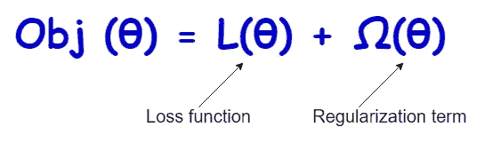

# 如何通过正则化减轻过度拟合

> 原文：<https://towardsdatascience.com/how-to-mitigate-overfitting-with-regularization-befcf4e41865?source=collection_archive---------26----------------------->

## 解决过度拟合问题

## 解决过度拟合问题—第 2 部分

在 [Unsplash](https://unsplash.com/?utm_source=unsplash&utm_medium=referral&utm_content=creditCopyText) 上由[kayan uda chia](https://unsplash.com/@kayaan?utm_source=unsplash&utm_medium=referral&utm_content=creditCopyText)拍摄的照片

今天，我们继续**“解决过度合身问题”**系列文章的[第 1 部分](/how-to-mitigate-overfitting-with-k-fold-cross-validation-518947ed7428)。**正则化**是另一种有用的技术，可用于减轻机器学习模型中的过拟合。今天将更着重讨论正则化背后的*直觉*而不是讨论它的数学公式。通过这种方式，你可以清楚地了解将正则化应用于机器学习模型的效果。

一般来说，**【规则化】**的意思是**限制** / **控制**。在机器学习的背景下，正则化处理模型的复杂性。它限制了模型的复杂性或者限制了模型在训练阶段的学习过程。一般来说，我们更喜欢简单而准确的模型，因为复杂的模型更容易过度拟合。通过限制模型的复杂性，过度拟合试图使模型尽可能简单，同时这些模型仍能做出准确的预测。

有两种方法可以将正则化应用于机器学习模型:

*   **通过在损失函数**中增加另一项，我们试图使其最小化。现在，目标函数由两部分组成:**损失函数**和**正则项**:

(图片由作者提供)

*   **通过在培训阶段提前停止学习过程**。这种方法的完美例子是在早期阶段停止决策树的生长。

我们将通过编写 Python 代码用例子来讨论每种方法。最后，您将获得将正则化应用于这里讨论的模型的实践经验。

# 方法 1:向损失函数添加一个**正则化**项

这里，我们将在名为**[**heart _ disease . CSV**](https://drive.google.com/file/d/19s5qMRjssBoohFb2NY4FFYQ3YW2eCxP4/view?usp=sharing)**的数据集上建立一个逻辑回归模型。首先，我们在不添加正则项( **penalty=none** )的情况下构建模型，并查看输出。****

****无任何正则化的逻辑回归模型****

********

****(图片由作者提供)****

****模型已经很好了。让我们看看是否可以通过增加一个正则项来进一步提高测试精度。这里，我们将 L2 正则化(**罚=l2** )添加到模型中。****

****L2 正则化的 Logistic 回归模型****

********

****(图片由作者提供)****

****加入正则项后，测试精度提高了 3%。假阳性的数量也减少了。因此，该模型能够对新的未知数据(测试数据集)进行归纳。****

# ****方法 2:尽早停止学习过程****

****这里，我们将在同一个数据集上构建一个决策树分类模型。首先，我们将构建完整的决策树，而不限制树的增长(即，不应用正则化/不提前停止学习过程),并查看输出。****

****没有任何正则化(没有提前停止)的决策树模型****

********

****(图片由作者提供)****

****我们得到了非常高的训练精度和低的测试精度。因此，模型明显过拟合。这是正常的，因为我们允许树完全成长。现在，我们正试图限制这棵树的生长。这是通过设置**最大 _ 深度**、**最小 _ 样本 _ 叶**和**最小 _ 样本 _ 分割**超参数的最佳值来实现的(在上述模型中，这些值已被设置为默认值)。在机器学习中，限制树的生长在技术上叫做 ***修剪*** 。****

****带有正则化的决策树模型(带有提前停止/修剪)****

********

****(图片由作者提供)****

****模型得到了显著改进(测试准确率提高了 16%！).****

******注:**寻找一组超参数的最佳值在技术上称为**超参数调整**或**超参数优化**。如果你不知道这个程序，你可以通过阅读我写的下面两个帖子来了解:****

****</k-fold-cross-validation-explained-in-plain-english-659e33c0bc0>  </4-useful-techniques-that-can-mitigate-overfitting-in-decision-trees-87380098bd3c> [## 4 种可以减轻决策树过度拟合的有用技术

towardsdatascience.com](/4-useful-techniques-that-can-mitigate-overfitting-in-decision-trees-87380098bd3c) 

# 结论

过拟合经常发生在建模中。正则化是减轻过度拟合的另一种有用的技术。今天，我们通过例子讨论了两种正则化方法。请注意，通过为最大迭代次数指定较低的值，早期停止方法可以应用于逻辑回归、线性回归等算法。

不得混淆术语**【正规化】**和**【普遍化】**。应用正则化来实现一般化。正则化模型将很好地概括看不见的数据。它 ***学习数据中的*** 重要模式，对看不见的数据做出准确预测，而不是 ***记忆*** 数据集中的噪音。

**更新(2021–09–27):**第 3 部分现已推出！
[ [如何通过降维来减轻过拟合](/how-to-mitigate-overfitting-with-dimensionality-reduction-555b755b3d66)

今天的帖子到此结束。我的读者可以通过下面的链接注册成为会员，以获得我写的每个故事的全部信息，我将收到你的一部分会员费。

**报名链接:**https://rukshanpramoditha.medium.com/membership

非常感谢你一直以来的支持！下一个故事再见。祝大家学习愉快！

特别感谢 Unsplash 网站上的 **Kayaan Udachia** ，为我提供了这篇文章的封面图片(我对图片做了一些修改:添加了一些文字并删除了一些部分)。

[鲁克山普拉莫迪塔](https://medium.com/u/f90a3bb1d400?source=post_page-----befcf4e41865--------------------------------)
**2021–09–24******