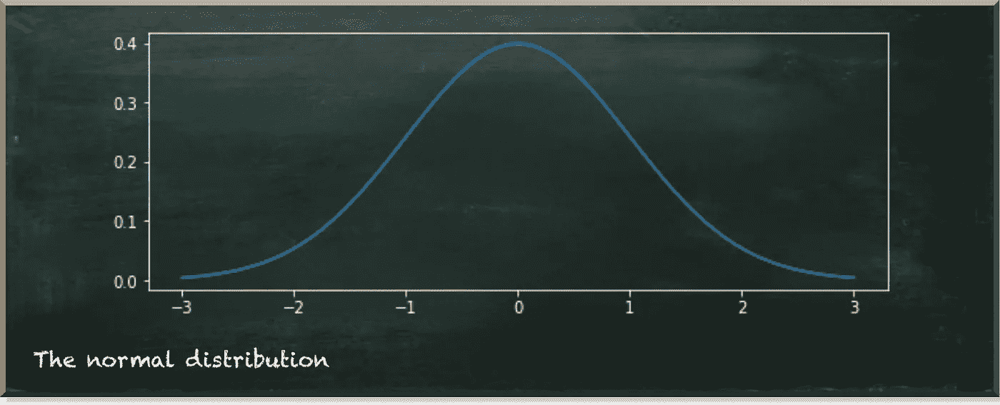
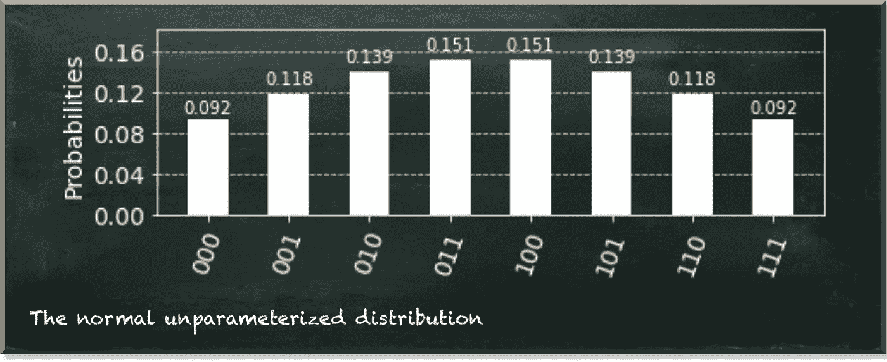
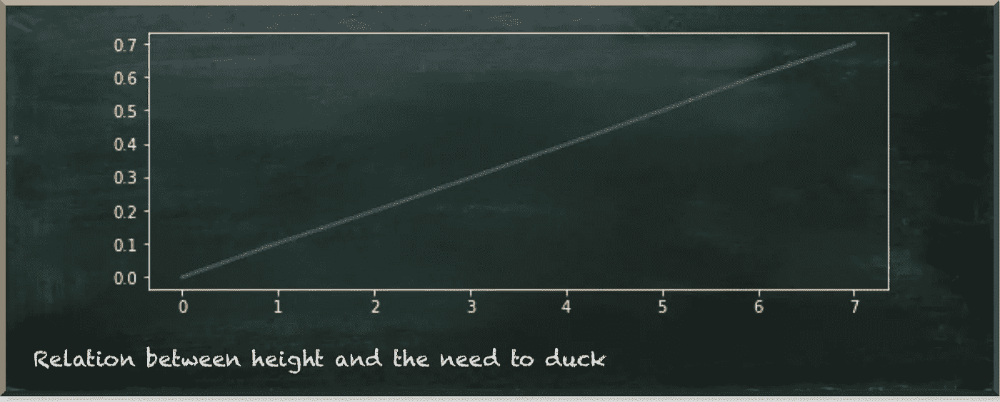
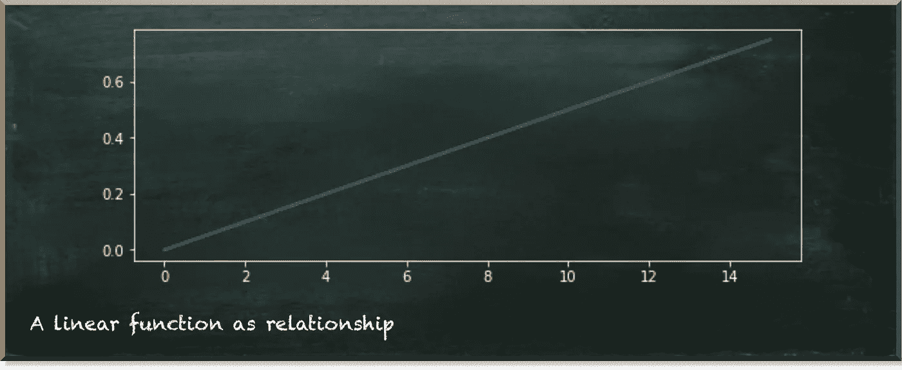
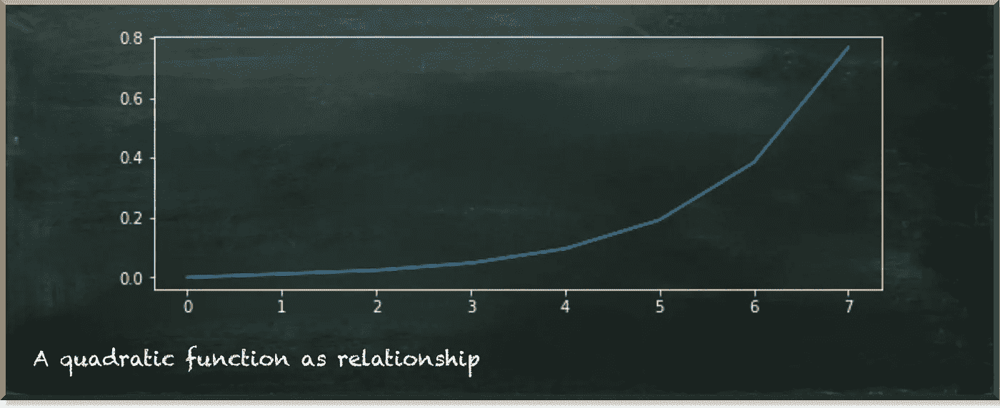

# 如何模拟量子变量之间的任意关系

> 原文：<https://towardsdatascience.com/how-to-model-arbitrary-relations-between-quantum-variables-d3b3ebc29e8c?source=collection_archive---------25----------------------->

## 实用量子数据科学

量子机器学习要不要入门？看看 [**动手量子机器学习用 Python**](https://www.pyqml.com/page?ref=medium_arbitrary&dest=/) **。**

上周，[我报道了](/beyond-linear-quantum-relations-e8f64bf5ab07)我在伯努利变量上努力模拟正态分布变量的关系。

尽管我在创建允许我对线性关系建模的函数时，目标是灵活性，但我惊讶地发现这个函数实际上是如此灵活。例如，我们可以使用这个函数来模拟一个正态分布对一个伯努利变量的任意依赖性，只需稍加调整。

今天，我们深入研究这个函数，并进一步了解它是如何工作的。但是，让我们先回顾一下目前为止我们所学的内容。

在数据科学中，我们使用概率分布来描述人口的特征，例如人的身高。这些特征中有许多可以用正态分布来描述，如下图所示。

作者图片

正态分布符合许多自然现象，因为它在均值处达到峰值，而在端点处变平。换句话说，更有可能看到接近平均值的值，而不是捕捉异常值。

当使用量子算法来解决数据科学或机器学习任务时，我们必须知道如何在量子电路中处理这样的分布。

IBM 的 quantum development SDK Qiskit 提供了一个创建正态分布的函数。这是`NormalDistribution`。

作者图片

虽然 Qiskit 让我们可以快速创建一个正态分布，但它仍然需要对它的值做一些有意义的事情。例如，我们可以对正态分布的值(在上图中，值的范围从 000=0 到 111=7)和伯努利分布之间的关系进行建模。

我们用一个例子来说明一个人的身高对她必须闪开的概率的影响。

作者图片

首先，我们创建了一个线性关系的实例[。接下来，](/how-to-work-with-a-quantum-normal-distribution-170ccc4e2da2)[我们创建了一个广义的](/linearly-dependent-quantum-variables-30c5d8d006c0) `linear_dependency`函数，它可以处理任意数量的量子位和任意斜率。最后，[我们看了如何在正态分布和从属伯努利分布的值之间建立二次和 sigmoid 关系](/beyond-linear-quantum-relations-e8f64bf5ab07)。

作者图片

虽然我们展示了我们需要改变功能的哪一部分，但我们并没有深入解释。所以。让我们补上这个。

我们将我们的方法分为三个部分。

1.  助手功能
2.  可定制的功能—核心
3.  主电路

像往常一样，我们从导入和助手函数开始。如果你读了我的一些帖子，你已经熟悉了`prob_to_angle`函数。测量量子位作为一个`1`需要一个概率，并返回相应的角度𝜃.详见[本帖](https://betterprogramming.pub/if-you-want-to-gamble-with-quantum-computing-e327c11f97e5)。

此外，让我们创建`plot_relation`函数来绘制正态分布和相关伯努利变量之间的关系。通常，当我们绘制量子电路的结果时，我们会得到所有状态及其测量概率的概述。但是现在，我们不关心各个州。我们关心正态分布的值对因变量的影响。换句话说，给定正态分布的一个特定值，因变量为真或为假的比率是多少。

对于 sigmoid 依赖关系，输出是一个线形图，如上图所示。对于线性相关性，我们会有这样的预期:

作者图片

那么，`plot_relation`功能是如何工作的呢？

它使用三个参数:`nd_qubits`、`dependency`和`get_key`。

*   `nd_qubits`表示我们想要用于正态分布的量子比特数。
*   `dependency`这一定是一个函数，我们稍后会详细讨论它。
*   `get_key`是另一个创建密钥的函数，我们可以用它来识别我们想要比较的状态。我们在选择子功能中使用它。例如，假设我们在正态分布中使用三个量子位。那么，我们需要比较的两个状态是 0111 和 1111。或者 0000 和 1000。或者 0101 和 1101。对于较低的三个量子位(从右边看)，状态对共享相同的值，代表正态分布。然而，它们在因变量的值上有所不同(左边的上部量子位)。

我们之所以需要在`plot_relation`函数之外创建密钥，是因为这取决于我们使用的量子位的数量，我们也将它作为参数(`nd_qubits`)。

`get_key`的实现是

*   `"{:d}{:01b}".format(a,b))`对于由单个量子位组成的正态分布。
*   `"{:d}{:02b}".format(a,b))`对于由两个量子位组成的正态分布。
*   `"{:d}{:03b}".format(a,b))`对于由三个量子位组成的正态分布。
*   `"{:d}{:04b}".format(a,b))`对于由四个量子位组成的正态分布。
*   …等等。

接下来的故事很快就讲完了。首先，我们用比正态分布多一个量子位的量子电路。其次，我们创建并添加正态分布。目前，我们用固定的参数来做这件事。我们只关心正态分布的值和因变量之间的关系。我们不关心任何值的概率。事实上，我们甚至不在乎正态分布是正态分布。我们唯一关心的是对因变量的影响稳步增加。它只是意味着较高的正态分布值对因变量有较高(或相等)的影响。例如，高个子必须更频繁地低头。第三，我们使用`custom_dependency`函数创建并添加正态分布和因变量之间的关系。

最后，我们运行电路，并将结果关联起来绘制图表。

所以，现在让我们看看这篇文章的核心——`custom_dependency`功能。

功能比较短。但是从嵌套循环中可以看出，这并不容易理解。所以我在这篇文章的[中提供了一些循环技术上的例子。](/linearly-dependent-quantum-variables-30c5d8d006c0)

所以，现在让我们转而关注后果。

最重要的一点是，正态分布的值是有序的。上面我已经解释过了，但是我想在这里再强调一次。**数值越高，对因变量的影响越显著。**

这一点非常重要，因为我们将正态分布的值视为一个位串。位串只不过是数字——二进制数。所以我们可以把它们转换成十进制数值。我们可以把十进制数值转换成二进制数。

在我们都习惯使用的十进制格式中，我们有十个不同的数字。它们的范围从 0 到 9。当我们超过 9 时，我们返回到 0，但是我们将 1 向左移动—例如，09+01=10。

在二进制格式中，我们做同样的事情。唯一不同的是，我们只有两个数字，只有 0 和 1。所以，当我们超过 1 时，我们从 0 开始，将 1 向左移动。比如:01+01=10。

数字(无论哪种格式)的一个很好的特征是高位等于它们相对于基数的位置(从零开始计数)。所以，十进制的 10=10，100=10，1000=10，以此类推。而二进制 10=2，100=2，1000=2，以此类推。

因此，我们可以将任何数字重写为它们位置的和。例如，二进制 1101=2 +2 +2⁰.

我们可以看到，基础总是相同的。现在是两点。当我们想知道数字的总值时，我们只需要知道位置。对于给定的例子，我们只需要知道列表`[0, 2, 3]`。这些是为 1 的位的位置。

当我们将列表中的每个数字的值 2 相加时，我们得到相应的十进制数作为结果。

当你查看源代码时，我们使用参数函数`dependency`一次。我们用参数`parts`调用它，并将其结果传递给`prob_to_angle`函数。

你猜怎么着！`parts`是职位列表，比如`[0, 2, 3]`。它表示我们需要结果值的位置。给定正态分布有这个位置，得到的值就是我们要给因变量的概率。因此，我们只需将零件列表转换为线性关系的小数位置，然后乘以任意斜率。斜率越高，数值增加越快。

作者图片

所有的嵌套循环都准备了量子门，因此我们唯一需要做的就是提供一个函数来计算正态分布的每个可能值。

因此，如果我们想要创建二次依赖，我们需要做的就是改变提供的`dependency`函数。

作者图片

最后，我们还可以使用一个逻辑函数来生成一个 s 形。这是一条 S 形曲线，等式为

在哪里

*   x 是我们计算的值，
*   x_0 是图的中点(这里是我们的平均值)，
*   k 是曲线的逻辑增长率或陡度，
*   L 是函数的最大值。

作者图片

# 结论

在这篇文章中，我们一步一步地剖析了我们在上一篇文章中开发的算法。此外，我们重构了代码以获取`custom_dependency`函数。这允许我们对多量子位变量(如正态分布)和从属伯努利变量之间的任何关系进行建模。你只需要实现相应的功能。

量子机器学习要不要入门？看看 [**动手用 Python**](https://www.pyqml.com/page?ref=medium_arbitrary&dest=/) **学习量子机器。**

在这里免费获得前三章。