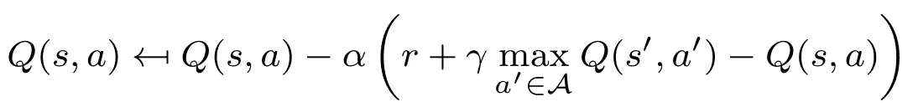
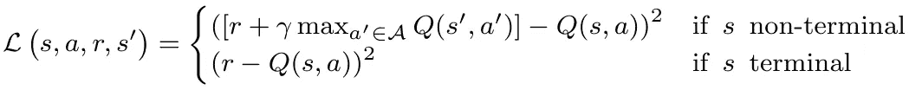
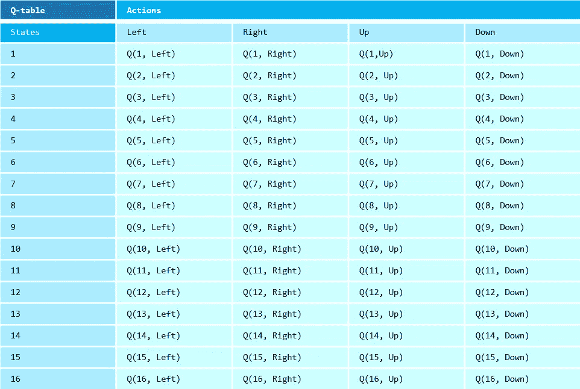
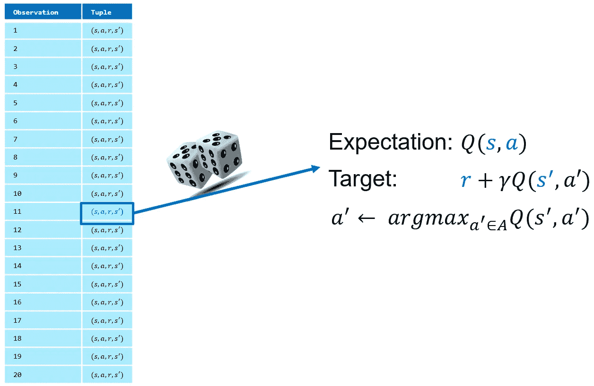
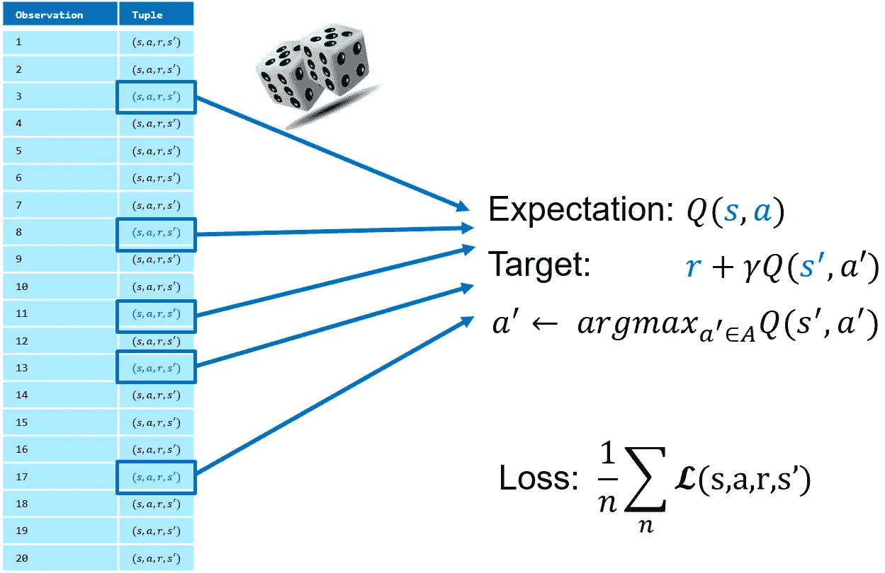
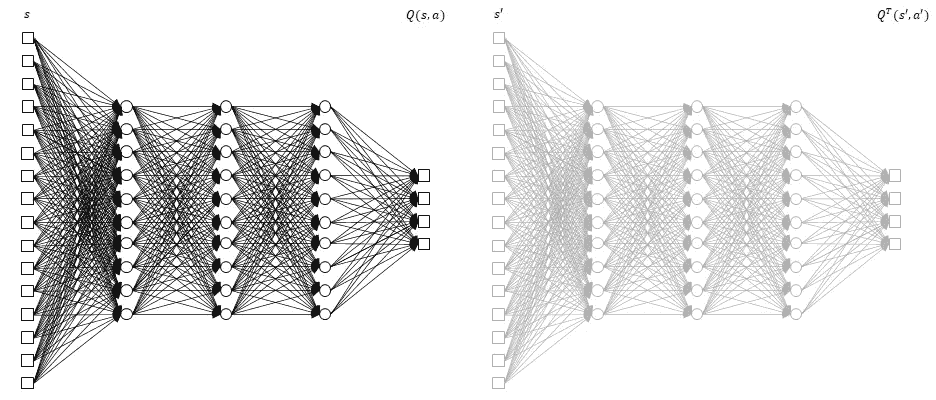

# 如何对经验重放、批量学习和目标网络进行建模

> 原文：<https://towardsdatascience.com/how-to-model-experience-replay-batch-learning-and-target-networks-c1350db93172?source=collection_archive---------23----------------------->

## 使用 TensorFlow 2.0，快速学习稳定和成功的深度 Q 学习的三个基本技巧


照片由[查德·沃顿](https://unsplash.com/@chadwiq?utm_source=medium&utm_medium=referral)在 [Unsplash](https://unsplash.com?utm_source=medium&utm_medium=referral)

如果你认为深度 Q 学习只是用一个神经网络代替一个查找表，你可能会有一个粗略的觉醒。虽然深度 Q 学习允许处理非常大的状态空间和复杂的非线性环境，但这些好处是以巨大的成本为代价的。

对于这篇文章，我假设你已经对 [Q-learning](/walking-off-the-cliff-with-off-policy-reinforcement-learning-7fdbcdfe31ff) 和[深度 Q-learning 有所了解。](/a-minimal-working-example-for-deep-q-learning-in-tensorflow-2-0-e0ca8a944d5e)下面的更新函数和损失函数将足以设置场景。在余下的部分，我将具体放大稳定性问题和三种常用技术来缓解这些问题:**经验重放**、**批量学习**和**目标网络**。



(普通)Q-learning 的口语更新功能。



深度 Q 学习的均方误差损失函数。

# (深度)Q 学习的稳定性

在某种程度上，稳定性是每个学习任务中的一个问题。然而，普通 Q-learning 相当稳定。当观察到对应于某个状态-动作对`(s,a)`、*的奖励时，只有*对应的 Q 值`Q(s,a)`被更新。查找表中的所有其他 Q 值保持不变。



Q 表示例。对属于各个状态-动作对的 Q 值进行更新，从而得到稳定的表示。[图片由作者提供]

相比之下，Q 网络可以被视为一个参数化的函数`f_θ:s →[Q(s,a)]_a∈A`，将一个状态映射到一个 Q 值向量。这里的关键区别在于，对于每个状态-动作对，单次更新会改变所有 Q 值。这种影响是相当深远的，在某种程度上由于神经网络的非线性表示(对异常值的敏感性等)而加剧。)即使对于看似简单的问题，深度 Q 学习也经常受到稳定性问题的困扰。


Q 网络的例子。单次更新影响所有状态-动作对的 Q 值，因为所有输入使用相同的网络。[图片由作者提供]

# 体验回放



体验重放从重放缓冲区随机抽取一个观察值(一个 s，a，r，s '元组)。期望和目标是通过将 s 和 s’插入 Q 网络来确定的。[图片由作者提供]

强化学习需要做出连续的决策。这通常意味着后续状态密切相关(例如，迷宫中的一步，股票价格的一天更新)，因此非常相似。因此，顺序观察往往高度相关，这可能导致网络过度拟合(例如，在迷宫的次优区域中)。

然而，即使*经验*是顺序获得的，也没有理由*学习*应该遵循相同的顺序。经验重放通过用过去的观察创建一个**重放缓冲器**来分离两个过程。具体来说，重放缓冲区存储我们遇到的每个`s,a,r,s’`元组。注意，相应的 Q 值是*而不是*存储的；我们在为更新目的对观察值进行采样时确定它们。具体来说，学习过程如下:

*   从重放缓冲区中随机抽取`s,a,r,s’`元组。
*   使用存储的动作`a`，将`s`输入 Q 网络以获得`Q_t(s,a)`。
*   将`s’`输入 Q 网络以获得`Q_t+1(s’,a*)`，其中`a*∈A`是状态`s’`中的最优动作(根据主要的 Q 值)。回想一下 Q 学习是不符合策略的，所以我们不使用实际轨迹。
*   使用`Q_t(s,a)`和`r_t+Q_t+1(s’,a*)`之间的差值计算更新网络所需的损耗。

除了打破相关性和克服过度拟合之外，理论上的好处是数据现在更接近 i.i.d .数据，这通常是在监督学习收敛证明中假设的。

Python 实现如下所示。请注意，我们所做的只是在**经验收集阶段**将`s,a,r,s’`存储在缓冲器中，并在**学习阶段**对它们进行随机采样。对于后者，我们使用方便的`random.choices`功能。

```
**"""Experience replay implementation"""****# Initialize replay buffer**
replay_buffer = []...**# Experience collection phase**# Set state
state = next_state# Determine action (epsilon_greedy)
if epsilon<= 0.05:
    # Select random action
    action = np.random.choice(action_dim)
else:
    # Select action with highest q-value
    action = np.argmax(q_values[0])# Compute and store reward
reward = get_reward(state, action)# Determine next state
next_state = get_state(state, action)

# Store observation in replay buffer
observation = (state, action, reward, next_state)

replay_buffer.append(observation)...**# Learning phase**# Select random sample from replay buffer
if len(replay_buffer) >= min_buffer_size:
    observations = random.choices(replay_buffer, k=1)
```

存储所有过去的观察数据并完全随机取样可能并不理想。事实上，这一程序可以改进。有了*优先重播*，我们更经常地尝试我们期望从中学习更多的经验。另一种常见的技术是更新重放缓冲区，删除旧的观察结果。毕竟，你不希望停留在过去的观察上，这些观察来自于状态空间中我们从一开始就不应该访问的区域。自然，像这样的改进引入了额外的建模挑战。

# 批量学习



批量学习对单个网络更新的多个观察值进行采样，导致更具代表性的损失和更稳定的更新[图片由作者提供]

一次更新一个观测值的 Q 网络可能不是一个好的解决方案。在许多情况下，这样的观察可能不包含太多有用的信息——想想迷宫中的一步。更糟糕的是，观察结果可能是异常值，不能代表整个问题，然而更新可能会对未来的决策产生灾难性的影响。理想情况下，我们希望每次更新都能代表整个问题。

另一方面，我们可能会执行所有的训练迭代，并使用完整的一批观察值来拟合带有单个更新的 Q 网络。虽然这样的一批确实具有代表性，但是所有的观察都是在我们最初的(可能非常差的)策略下进行的，因此我们永远也不会知道与一个*好的*策略相对应的 Q 值。

因此，大批量也不是很有用。我们希望将观察和更新结合起来，逐步改进我们的政策。这并不意味着我们必须更新每一次观察的*。显而易见的妥协是**小批量**，这意味着我们频繁地用相对较少的观测值更新我们的网络。与经验重放相结合，这是一种强大的技术，可以基于大量以前的观察获得稳定的更新。*

作为基本经验回放的延伸，我们可能仍然很难获得有代表性的样本。主要的实施问题是*更新频率*(更新自然比单次观测花费更长时间)和小批量的*大小*。

```
**"""Batch learning implementation"""**no_observations = 100
mini_batch_size = 10
loss_value = 0if len(replay_buffer) >= no_observations and 
   i % update_frequency == 0:
    **# Randomly sample k observations from buffer**
    observations = random.choices(replay_buffer, k=mini_batch_size) **# Loop over sampled observations**
    for observation in observations:
       # Determine Q-value at time t
       q_values = q_network(state)
       expected_value = q_values[0, action] # Determine Q-value at time t+1
       next_q_values = tf.stop_gradient(q_network(next_state))
       next_action = np.argmax(next_q_values[0])
       next_q_value = next_q_values[0, next_action] # Add direct reward to obtain target value
       target_value = reward + (gamma * next_q_value)

       # Compute loss value
       loss_value += mse_loss(expected_value, target_value)

**# Compute mean loss value**
loss_value /= batch_size
```

# 目标网络



目标网络(右)是原始 Q 网络(左)的周期性副本。目标网络用于确定 Q_t+1，降低期望与目标的相关性。[图片由作者提供]

通过从过去的观察中随机取样(经验回放)，我们试图打破观察之间的相关性。然而，注意，观察元组包含两个密切相关的状态——`s`和`s’` ——它们被馈送到相同的 Q 网络以获得 Q 值。换句话说，期望和目标也是相互关联的。每次网络更新也会修改目标，即我们正在追逐一个移动的目标。

为了降低期望`Q(s,a)`和目标`r+Q(s’,a’)`之间的相关性，我们可以使用不同的网络来确定`Q(s’,a’)`。我们称之为**目标网络**——我们的目标基于`Q^T(s’,a’)`而不是`Q(s’,a’)`。我们可以用 TensorFlow 的`clone_model`命令复制原 Q 网的网络架构。请注意，该克隆程序不会*而不是*复制权重，为此我们使用了`set_weights`命令。使用`get_weights`，我们定期从 Q-网络获得最新的权重。

```
**"""Target network implementation"""****# Copy network architecture**
target_network = tf.keras.models.clone_model(q_network) **# Copy network weights**
target_network.set_weights(q_network.get_weights()) ...**# Periodically update target network**
if episode % update_frequency_target_network == 0:
    target_network.set_weights(q_network.get_weights())
```

关键的挑战是找到正确的更新频率。如果更新间隔很久，目标可能对应于过去表现不佳的政策。过于频繁，目标和期望之间的相关性仍然很高。与其他两种技术一样，该解决方案解决了一个问题，但也引入了额外的复杂性。

# 外卖食品

*   **经验重放**将所有观察值— `s,a,r,s’`元组存储在一个缓冲区中，可以从中选择随机样本。这打破了连续观测中经常存在的相关性。
*   **批量学习**基于多次观察执行网络更新。这种方法往往比单一观测产生更稳定的更新，因为损失更好地代表了整体问题。
*   **目标网络**降低期望`Q(s,a)`和目标`r+Q^T(s’,a’)`之间的相关性。目标网络只不过是 Q 网络的周期性副本。
*   每种技术都引入了新的建模挑战和要调整的参数。在某种程度上，这就是深度学习如此困难的原因；每个解决方案都会产生新的障碍，增加模型的复杂性。

*对深度 Q-learning 感兴趣？你可能也会对下面的文章感兴趣:*

[](/a-minimal-working-example-for-deep-q-learning-in-tensorflow-2-0-e0ca8a944d5e) [## TensorFlow 2.0 中深度 Q 学习的最小工作示例

### 一个多臂土匪的例子来训练一个 Q 网络。使用 TensorFlow，更新过程只需要几行代码

towardsdatascience.com](/a-minimal-working-example-for-deep-q-learning-in-tensorflow-2-0-e0ca8a944d5e) 

想知道更多关于 Q-learning(和 SARSA)的基础知识吗？看看下面这篇文章:

[](/walking-off-the-cliff-with-off-policy-reinforcement-learning-7fdbcdfe31ff) [## 用非策略强化学习走下悬崖

### 政策外强化学习和政策内强化学习的深入比较

towardsdatascience.com](/walking-off-the-cliff-with-off-policy-reinforcement-learning-7fdbcdfe31ff) 

# 参考

坦贝特·马蒂森(2015 年)。揭秘深度强化学习。*计算神经科学实验室。*从 neuro.cs.ut.ee/demystifying-deep-reinforcement-learning/取回

Mnih，v .，Kavukcuoglu，k .，Silver，d .，鲁苏，A. A .，Veness，j .，Bellemare，M. G .，… & Hassabis，D. (2015)。通过深度强化学习实现人类水平的控制。*自然，518(7540)，529–533。*