# 如何监控数据质量——详细指南

> 原文：<https://towardsdatascience.com/how-to-monitor-data-quality-a-detailed-guide-2e28b7d21f3?source=collection_archive---------38----------------------->

来源:[沉积照片](https://ru.depositphotos.com/184070438/stock-photo-the-worker-bites-a-gold.html)

## 防止数据收集中的错误比处理其后果更容易。你的商业决策是否明智取决于你的数据质量。在本文中，我们将告诉您如何在收集的所有阶段检查数据质量，从工作陈述到完成的报告。

# 测试在网络分析中的重要性

不幸的是，许多花费大量资源存储和处理数据的公司仍然根据直觉和他们自己的期望而不是数据来做出重要决策。

为什么会这样？当数据提供的答案与决策者的期望不一致时，对数据的不信任就会加剧。此外，如果有人过去在数据或报告中遇到过错误，他们倾向于支持直觉。这是可以理解的，因为根据不正确的数据做出的决定可能会让你倒退，而不是让你前进。

假设您有一个多币种项目。您的分析师以一种货币设置了 Google Analytics，而负责上下文广告的营销人员以另一种货币设置了成本导入 Google Analytics。因此，在你的广告活动报告中，你有一个不切实际的广告支出回报(ROAS)。如果你没有及时注意到这个错误，你可能会禁用盈利活动或增加亏损活动的预算。

此外，开发人员通常非常忙，实现 web 分析对他们来说是次要任务。在实现新功能时——例如，一个带有附件的单元的新设计——开发人员可能会忘记检查数据是否在 Google Analytics 中收集。结果，到了评估新设计有效性的时候，发现数据收集在两周前就被破坏了。惊喜吧。

## 纠正错误的成本

假设您在规范阶段犯了一个错误。如果你发现它并立即纠正它，修复会相对便宜。如果在实现之后，在构建报告时，甚至在做决策时发现了错误，那么修复它的成本将会非常高。

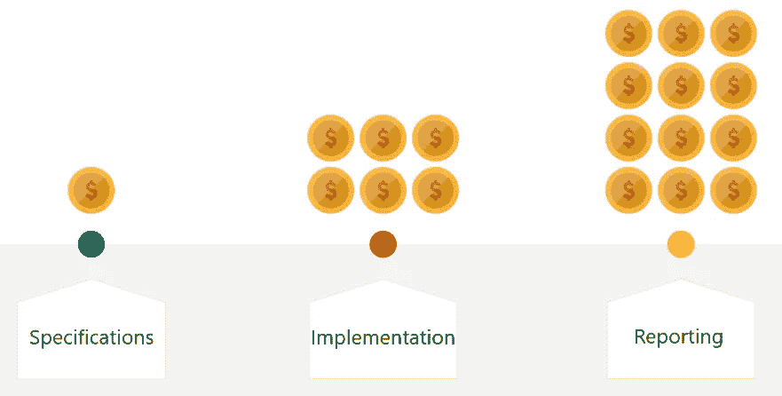

图片由作者提供

## 如何实现数据收集

数据收集通常由五个关键步骤组成:

*   制定业务挑战。比方说，你需要评估一个算法的效率，以便在推荐模块中选择商品。
*   负责数据收集的分析师或人员设计了一个要在现场跟踪的指标系统。
*   此人设置谷歌分析和谷歌标签管理器。
*   一种是发送开发人员执行的参考条款。
*   在开发人员实现了度量标准并设置了数据收集之后，分析人员就可以使用报告了。

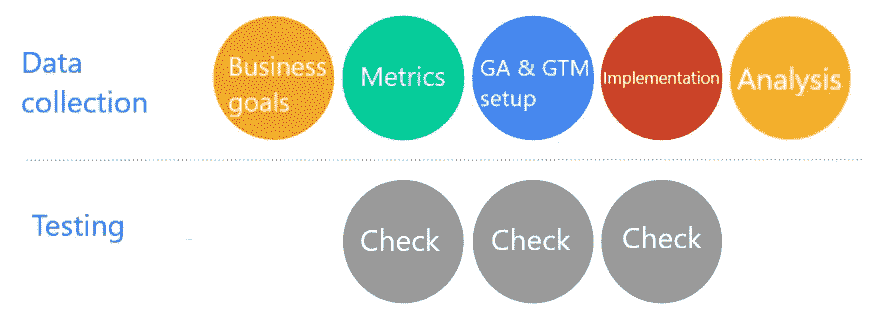

图片由作者提供

在几乎所有这些阶段，检查你的数据是非常重要的。有必要测试技术文档、谷歌分析和谷歌标签管理器设置，当然，还有在你的网站或手机应用上收集的数据的质量。

## 数据收集测试的特征

在进入每个步骤之前，让我们先来看看数据测试的一些要求:

*   没有工具就无法测试。至少，您必须在浏览器中使用开发人员控制台。
*   没有抽象的预期结果。你需要知道你最终会得到什么。我们总是有一组需要收集的参数，用于用户与网站的任何交互。我们知道这些参数应该取什么值。
*   专业知识是必要的。至少，你需要熟悉你所使用的网络分析工具的文档，实践，以及市场参与者的经验。

# 网站数据收集的测试文档

正如我们已经提到的，如果您在规范中发现一个错误，那么更正它就容易得多。因此，检查文档早在收集数据之前就开始了。让我们弄清楚为什么我们需要检查您的文档。

**测试文件的目的:**

*   不费吹灰之力修正错误。文档中的错误只是书面文本中的错误，因此您所要做的只是快速编辑。
*   防止将来可能影响站点/应用程序架构的变更需求。
*   保护分析师的声誉。一份在发展过程中有错误的文书可能会使起草人的能力受到质疑。

**规格中最常见的错误:**

*   错别字。开发人员可以复制参数的名称，而无需读取它们。这与语法或拼写错误无关，而是与参数名或参数值不正确有关。
*   跟踪事件时忽略字段。例如，如果表单没有成功提交，错误消息可能会被忽略。
*   无效的域名和不匹配的增强型电子商务方案。[用**数据层**变量实现增强的电子商务](https://www.owox.com/blog/articles/ecommerce-google-analytics/)需要清晰的文档。因此，在起草您的规范时，最好将所有字段检查两遍。
*   您没有多货币网站的货币支持。这个问题与所有收入相关的报告都有关系。
*   不考虑命中极限。例如，假设一个目录页面上可以有多达 30 种不同的产品。如果我们同时转移所有产品的视图信息，很可能 Google Analytics 中的点击不会被转移。

# 测试 Google Analytics 和 Google Tag Manager 设置

检查完技术文档后，下一步是检查您的 Google Analytics 和 Google Tag Manager 设置。

**为什么要测试 Google Analytics 和 Google Tag Manager 设置？**

*   确保数据收集系统正确处理参数。Google Analytics 和 Google Tag Manager 可以与您网站上的指标实现并行配置。在分析师完成之前，这些数据不会出现在谷歌分析中。
*   让测试嵌入网站的指标变得更加容易。你只需要专注于开发人员的部分工作。在 X 的最后阶段，你需要直接在网站上寻找错误的原因，而不是在平台设置中。
*   维修成本低，因为不需要开发人员参与。

**谷歌分析中最常见的错误:**

*   未创建自定义变量。这尤其与 Google Analytics 360 帐户相关，它可以有多达 200 个指标和 200 个参数。那样的话，很容易漏掉一个。
*   指定的访问范围无效。在数据层检查阶段或通过检查您发送的 hit，您将无法捕捉到此错误，但是当您创建报告时，您会发现数据看起来并不像预期的那样。
*   您将获得一个现有参数的副本。此错误不影响正在发送的数据，但在检查和构建报告时可能会导致问题。

**谷歌标签管理器最常见的错误:**

*   没有添加任何参数，如通用分析标签或谷歌分析设置变量。
*   标签中的索引与 Google Analytics 中的参数不匹配，这就产生了将值传递给错误参数的风险。例如，假设您为项目评级参数指定了 GTM 中用户数量参数的索引。在构建报告时，可能会立即发现这个错误，但是您将不再能够影响收集的数据。
*   数据层中指定的变量名无效。创建数据层时，请确保指定变量在数据层数组中的名称。如果您键入或写入另一个值，此变量将永远不会从数据层中读取。
*   增强型电子商务跟踪未启用。
*   启动触发器配置不正确。例如，触发 X 的正则表达式写得不正确，或者事件名中有错误。

# 测试谷歌分析的实施

测试的最后阶段是直接在现场测试。这个阶段需要更多的技术知识，因为您需要观察代码，检查容器是如何安装的，并阅读日志。所以你需要精明，使用正确的工具。

**为什么要测试嵌入式指标？**

*   检查实现的内容是否符合规范，并记录任何错误。
*   检查要发送的值是否足够。验证参数正在传输要传输的值。例如，商品的类别不通过它的名称来代替。
*   向开发人员反馈实现的质量。基于这些反馈，开发人员可以对网站进行修改。

**最常见的错误:**

*   并没有涵盖所有场景。例如，假设一个商品可以添加到产品、目录、促销或主页上的购物车中，也就是说，可以添加到任何有该商品链接的地方。这么多切入点，可能会漏掉一些东西。
*   该任务并未在所有页面上实现。也就是说，对于某些页面或某些分区/目录，根本不收集数据，或者只收集部分数据。为了防止这种情况，我们可以起草一份清单。在某些情况下，我们可以对一个函数进行多达 100 次检查。
*   并非所有参数都已实现；也就是说，数据层只实现了一部分。
*   增强型电子商务的数据层方案被打破。对于向购物车中添加商品、在结账步骤之间移动以及点击商品等事件来说尤其如此。实现增强型电子商务最常见的错误之一是在**产品**数组上缺少方括号。
*   数据层使用空字符串而不是 null 或 undefined 将参数归零。在这种情况下，Google Analytics 报告包含空行。如果您使用 null 或 undefined，此选项甚至不会包含在您发送的 hit 中。

# 检查数据的工具

我们用来测试数据的工具:

*   [谷歌分析调试器](https://chrome.google.com/webstore/detail/google-analytics-debugger/jnkmfdileelhofjcijamephohjechhna?hl=en) Chrome 扩展
*   GTM 调试器，可以用来在 Google 标签管理器中启用预览模式
*   开发人员控制台中的**数据层**命令
*   开发人员控制台中的[网络](https://developers.google.com/web/tools/chrome-devtools/network/reference)选项卡
*   [谷歌标签助手](https://chrome.google.com/webstore/detail/tag-assistant-by-google/kejbdjndbnbjgmefkgdddjlbokphdefk) Chrome 扩展

让我们仔细看看这些工具。

## 谷歌分析调试器

若要开始，您需要在浏览器中安装并启用此扩展。然后打开页面 ID 并转到控制台选项卡。您看到的信息是由扩展提供的。

该屏幕显示与 hits 一起传输的参数以及为这些参数传输的值:

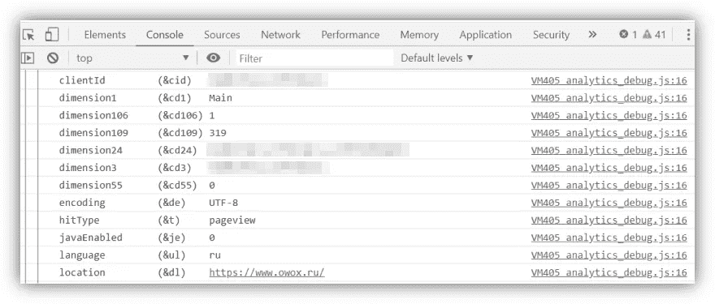

图片由作者提供

还有一个扩展的电子商务区块。您可以在控制台中找到它，名称为 **ec** :

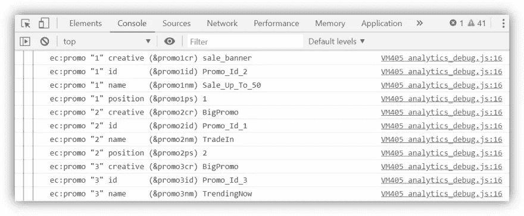

图片由作者提供

此外，此处还会显示错误消息，例如超出命中大小限制的消息。

如果需要检查数据层的组成，最简单的方法是在控制台中键入 **dataLayer** 命令:

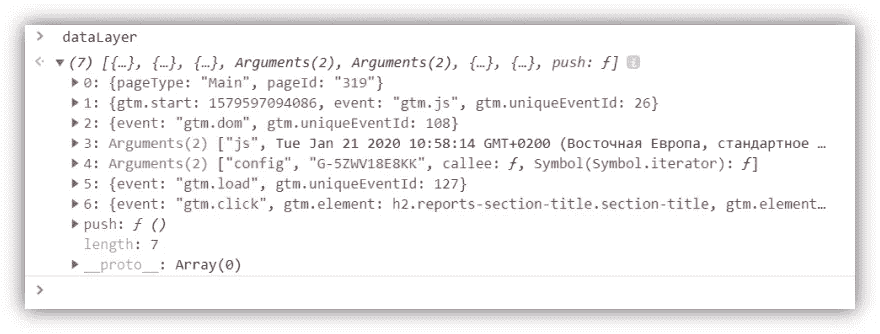

图片由作者提供

这是所有传输的参数。可以详细研究一下，验证一下。站点上的每个动作都反映在数据层中。假设你有七个对象。如果你点击一个空字段并再次调用**数据层**命令，第八个对象应该出现在控制台中。

## 谷歌标签管理器调试器

要访问 Google Tag Manager 调试器，请打开您的 Google Tag Manager 帐户并点击**预览**按钮:

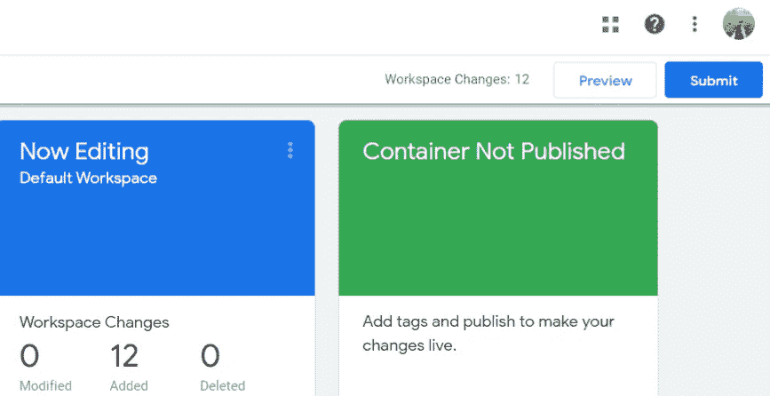

图片由作者提供

然后打开您的站点并刷新页面。在下面的窗格中，应该会出现一个面板，显示该页面上运行的所有标签。

图片由作者提供

添加到数据层的事件显示在左侧。通过点击它们，您可以检查数据层的实时组成。

# 测试移动浏览器和移动应用程序

**手机浏览器测试特点:**

*   在智能手机和平板电脑上，网站可以在自适应模式下启动，也可以有单独的移动版本。如果你在桌面上运行一个网站的移动版本，它将与你手机上的相同版本不同。
*   一般来说，扩展不能安装在移动浏览器中。
*   为了弥补这一点，您必须在网站的通用分析标签或谷歌分析跟踪代码中启用调试模式。

**移动应用测试的特点:**

*   使用应用程序代码需要更多的技术知识。
*   你需要一个本地代理服务器来拦截点击。为了跟踪设备发送的请求数量，您可以按应用程序的名称或请求发送到的主机来过滤请求。
*   所有命中都以测量协议格式收集，并需要额外的处理。一旦收集并过滤了命中结果，就必须将它们复制并解析成参数。你可以使用任何方便的工具来做到这一点: [Hit Builder](https://ga-dev-tools.appspot.com/hit-builder/) ，Google Sheets 中的公式，或者 JavaScript 或 Python 应用程序。这完全取决于什么对你更方便。此外，您还需要了解测量协议参数，以识别发送的点击中的错误。

## 如何使用您的手机浏览器

*   通过 USB 将移动设备连接到笔记本电脑。
*   在你的设备上打开谷歌浏览器。
*   在 Chrome 开发人员控制台中，打开远程设备报告:

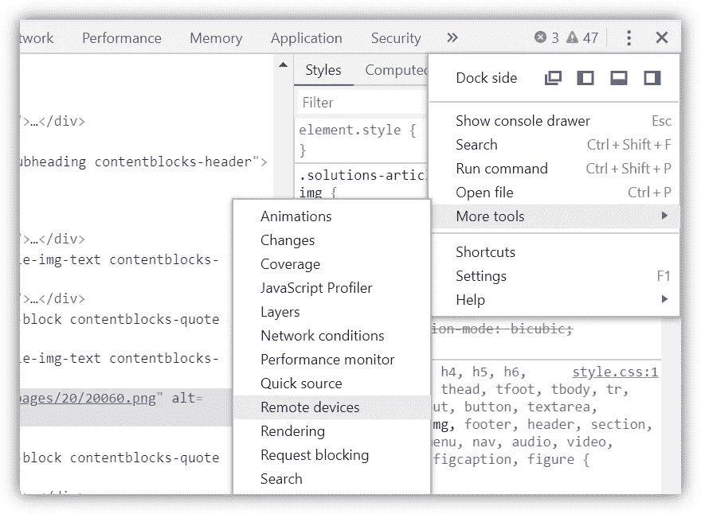

图片由作者提供

1.  点击对话框中的 **Ok** 确认与设备的连接。然后选择想要检查的标签，点击**检查**。
2.  现在，您可以在标准模式下使用开发人员控制台，就像在浏览器中一样。您将拥有所有熟悉的选项卡:控制台、网络和其他。

## 如何使用移动应用程序

1.  要使用移动应用程序，您必须安装并运行代理服务器。我们推荐查尔斯。

2.安装代理服务器后，检查应用程序连接到哪个 IP 地址:

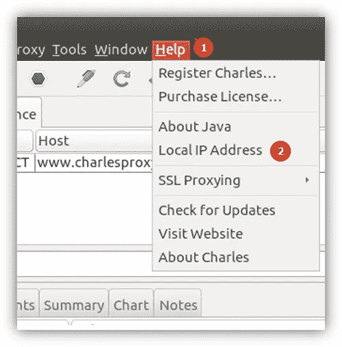

图片由作者提供

3.然后拿起您的设备，使用端口 8888 通过代理服务器配置 Wi-Fi 连接。这是 Charles 默认使用的端口。

4.之后，就是收集点击量的时候了。请注意，在应用程序中，命中不是发送到收集，而是发送到批处理。批处理是一个打包的请求，可以帮助您发送多个请求。首先，它节省了应用程序资源。第二，如果有网络问题，请求将存储在应用程序中，一旦网络连接重新建立，就会发送一个公共池。

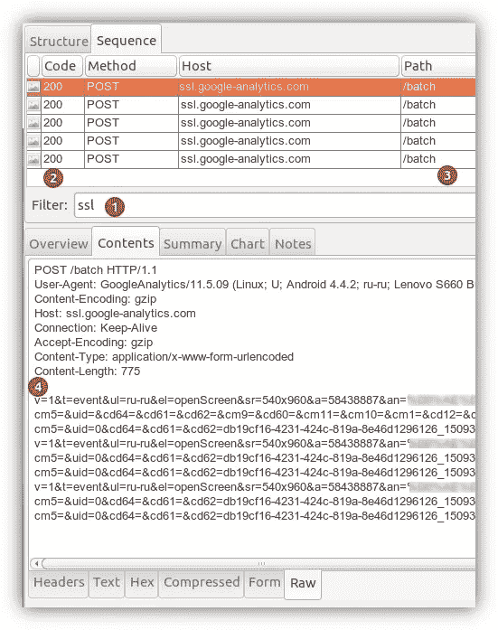

图片由作者提供

5.最后，必须将收集的数据解析(分解)成参数，按顺序检查，并对照规范进行检查。

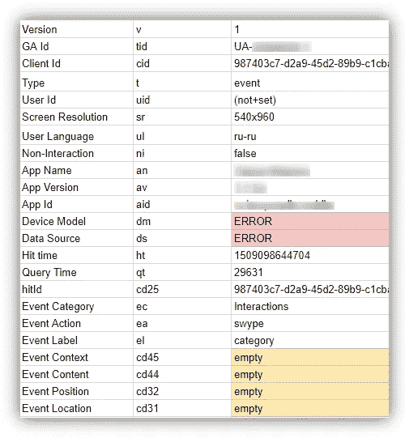

图片由作者提供

# 检查谷歌分析报告中的数据

这一步是最快最容易的。同时，它确保谷歌分析收集的数据是有意义的。在您的报告中，您可以检查数百个不同的场景，并根据设备、浏览器等查看指标。如果您发现数据中有任何异常，您可以在特定的设备上和特定的浏览器中播放该脚本。

您还可以使用 Google Analytics 报告来检查传输到数据层的数据的完整性。也就是说，取决于每个场景，变量被填充，是否有所有的参数在其中，参数是否取正确的值，等等。

## 最有用的报告

我们希望分享最有用的报告(在我们看来)。您可以将它们用作数据收集清单:

*   电子商务报告:
*   [产品性能](https://analytics.google.com/analytics/web/?utm_source=demoaccount&utm_medium=demoaccount&utm_campaign=demoaccount#report/conversions-ecommerce-product-performance/a54516992w87479473p92320289/)
*   [产品列表性能](https://analytics.google.com/analytics/web/?utm_source=demoaccount&utm_medium=demoaccount&utm_campaign=demoaccount#report/conversions-ecommerce-product-list-performance/a54516992w87479473p92320289/%3Fexplorer-segmentExplorer.segmentId%3Danalytics.productListName%26explorer-table.plotKeys%3D%5B%5D/)
*   [内部晋升](https://analytics.google.com/analytics/web/?utm_source=demoaccount&utm_medium=demoaccount&utm_campaign=demoaccount#report/conversions-ecommerce-internal-promotion/a54516992w87479473p92320289/)
*   [行为—事件—顶级事件](https://analytics.google.com/analytics/web/?utm_source=demoaccount&utm_medium=demoaccount&utm_campaign=demoaccount#report/content-event-events/a54516992w87479473p92320289/%3Fexplorer-segmentExplorer.segmentId%3Danalytics.eventCategory%26explorer-table.plotKeys%3D%5B%5D/)
*   [收购—活动—成本分析](https://analytics.google.com/analytics/web/?utm_source=demoaccount&utm_medium=demoaccount&utm_campaign=demoaccount#report/trafficsources-clicks-cost/a54516992w87479473p92320289/%3Fexplorer-table.plotKeys%3D%5B%5D%26explorer-table.rowStart%3D0%26explorer-table.rowCount%3D100/)
*   自定义报告—例如，[显示重复订单](https://www.owox.com/blog/articles/duplicate-transactions-in-google-analytics/)

我们来看看这些报表在界面上是什么样子的，你需要先关注这些报表中的哪一个。

## 产品性能报告

这份报告中最有价值的标签是购物行为。它分析了增强型电子商务的每个阶段的数据收集的完整性。也就是说，我们可以看到 Google Analytics 是否转移了产品列表视图、点击、产品详细信息视图、向/从购物篮添加/删除产品以及购买本身。

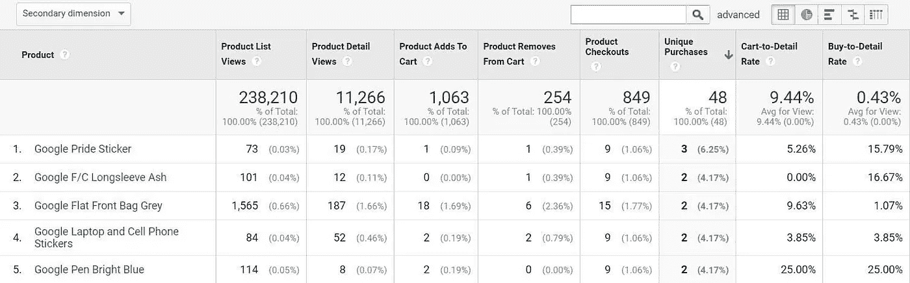

图片由作者提供

这里要注意什么？首先，如果任何一列中的值为零，那就非常奇怪了。第二，如果某个阶段的值比前一个阶段多，那么收集数据可能会有问题。例如，假设某项商品的唯一购买次数大于结账次数。这很奇怪，值得注意。

您还可以在该报告中的其他参数之间切换，该报告也应发送到增强型电子商务。例如，如果您选择项目类别作为主要选项，您可能会看到某些类别的项目有销售，但没有这些项目的视图，没有添加到购物车，等等。

## 顶级事件报告

首先，有必要遍历传输到 Google Analytics 的所有参数，看看每个参数取什么值。通常情况下，一切是否正常很快就会一目了然。可以在自定义报告中对每个事件进行更详细的分析。

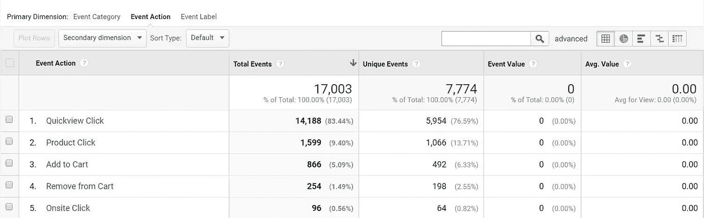

图片由作者提供

## 成本分析报告

另一个标准报告是成本分析，它对于检查将费用数据导入 Google Analytics 非常有用。

我们经常看到这样的报道，有一些资源或广告活动的费用，但没有会议。这可能是由 UTM 标签中的问题或错误引起的。或者，谷歌分析中的过滤器可能会排除来自特定来源的会话。这些报告需要不时检查。

## 自定义报告

我们想强调一下允许您跟踪重复交易的自定义报告。这很容易设置:参数必须是事务 ID，关键维度必须是事务。

请注意，当报告中有多个交易时，这意味着关于同一订单的信息被发送了多次。

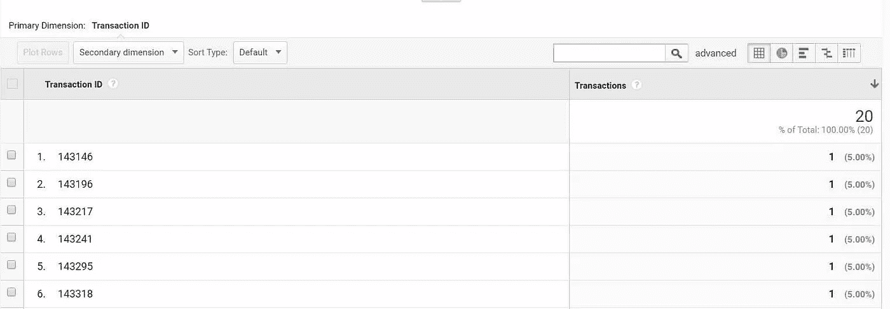

图片由作者提供

如果您发现类似的问题，[请阅读这些关于如何解决的详细说明](https://www.owox.com/blog/articles/duplicate-transactions-in-google-analytics/)。

在这篇关于[如何对网站分析进行审计](https://www.owox.com/blog/articles/web-analytics-audit/)的文章中，进一步了解配置 web analytics 时需要注意的事项以及使用哪些报告来验证数据质量。

## 自动电子邮件提醒

Google Analytics 有一个非常好的定制提醒工具，可以让你在不查看报告的情况下跟踪重要的变化。例如，如果您停止收集有关 Google Analytics 会话的信息，您会收到一封电子邮件通知。

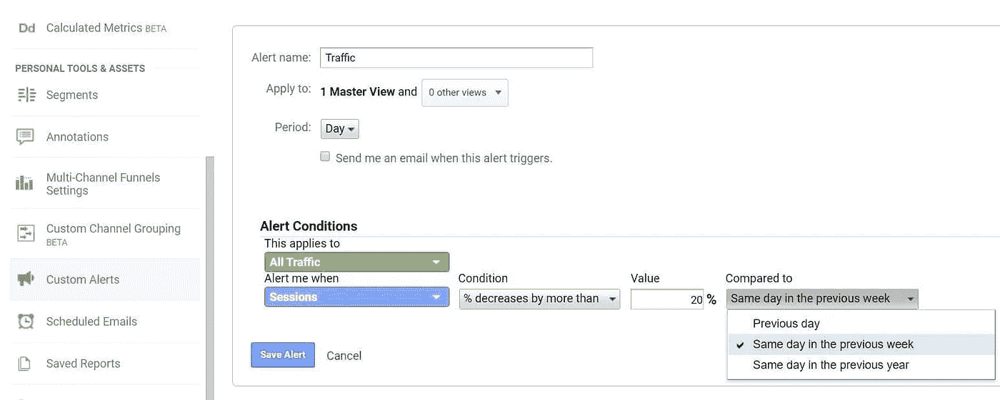

图片由作者提供

我们建议您至少为以下四个指标设置通知:

*   会话数量
*   跳出率
*   收入
*   交易数量

要设置通知，请看这篇关于在谷歌分析中[自动化报告的文章。](https://www.owox.com/blog/use-cases/google-analytics-report-automation/)

# 测试自动化

根据我们的经验，这是最困难和最耗时的任务——在这条狭窄的线上，错误是最常见的。

为了避免数据层实现出现问题，必须至少每周进行一次检查。一般来说，频率应该取决于您在站点上实现更改的频率。理想情况下，您需要在每次重大更改后测试数据层。手动完成这项工作非常耗时，因此我们决定自动化该过程。

## 为什么要自动化测试？

为了自动化测试，我们构建了一个基于云的解决方案，使我们能够:

*   检查站点上的数据层变量是否与参考值匹配
*   检查谷歌标签管理器代码的可用性和功能
*   检查数据是否被发送到 Google Analytics 和 OWOX BI
*   在 Google BigQuery 中收集错误报告

测试自动化的优势:

*   显著提高测试速度。根据我们的经验，您可以在几个小时内测试数千个页面。
*   获得更准确的结果，因为排除了人为因素。
*   降低测试成本，因为您需要更少的专家。
*   增加测试的频率，因为您可以在每次更改网站后运行测试。

我们使用的算法的简化方案:

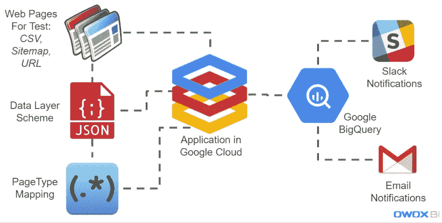

图片由作者提供

当您登录我们的应用程序时，您需要指定要验证的页面。你可以通过上传一个 CSV 文件，指定一个到站点地图的链接，或者简单地指定一个站点 URL，在这种情况下，应用程序会自己找到站点地图。

然后，为每个要测试的场景指定数据层方案是很重要的:页面、事件、脚本(一系列动作，比如结帐)。然后，您可以使用正则表达式来指定页面类型与 URL 匹配。

在收到所有这些信息后，我们的应用程序按照计划运行所有页面和事件，检查每个脚本，并将测试结果上传到 Google BigQuery。基于这些数据，我们设置了电子邮件和延期通知。