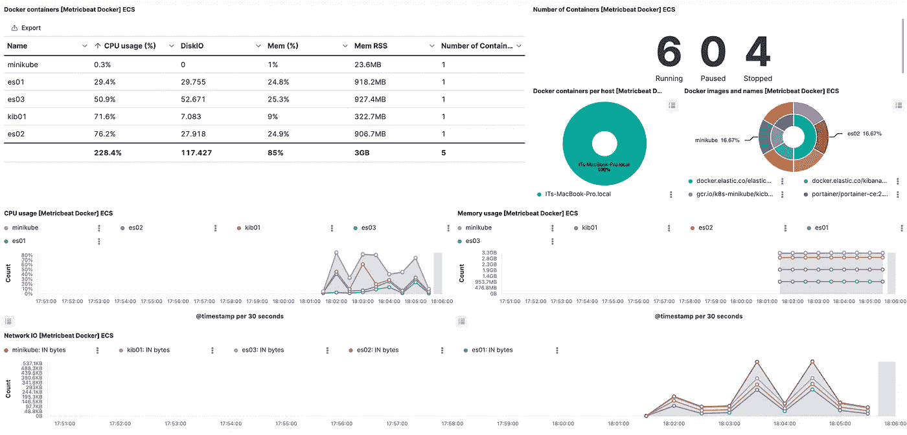
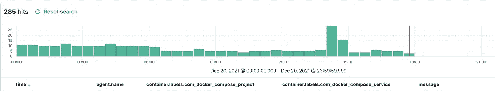

# 如何使用 Elasticsearch、Filebeat 和 Metricbeat 监控 Docker 容器

> 原文：<https://towardsdatascience.com/how-to-monitor-docker-containers-with-elasticsearch-filebeat-metricbeat-493b18681464?source=collection_archive---------11----------------------->


集装箱——摄影[乔纳斯·史密斯](https://unsplash.com/@jonassmith?utm_source=unsplash&utm_medium=referral&utm_content=creditCopyText)在 [Unsplash](https://unsplash.com/s/photos/container?utm_source=unsplash&utm_medium=referral&utm_content=creditCopyText)

## 使用弹性堆栈监控码头集装箱

H 避免多个容器分布在不同的节点上带来了跟踪容器健康状况、存储、CPU、内存利用率和网络负载的挑战。虽然您可以使用 Portainer 之类的工具来监控和跟踪您的 dockers，但是在生产环境中，Elastic stack 成为监控和维护这些工具的最佳工具(依我之见)。


Elastic 的趋势已经转向通过弹性代理进行集成，现在包括一个 Docker 集成，它可以从 Docker 容器中获取指标。它侧重于默认情况下启用的以下指标:

```
container
cpu
diskio
healthcheck
info
memory
network
```

弹性代理显然是集成到弹性堆栈的未来，是非常需要的无障碍配置，但在现实中，Metricbeat 和 Filebeats 仍然非常需要，因为它们提供了更多的灵活性。目前的情况是，即使服务器上安装了弹性代理，仍有一些用例没有集成到弹性代理中。

## 测试环境

*   Ubuntu 16.04 (Xenial Xerus) *(其中一些是使用 Macbook 上运行的 Docker 上的弹性堆栈在本地执行和测试的)*
*   Filebeat 7.16
*   Metricbeat 7.10

# 安装 Metricbeat

```
curl -L -O https://artifacts.elastic.co/downloads/beats/metricbeat/metricbeat-7.10.0-amd64.deb sudo dpkg -i metricbeat-7.10.0-amd64.deb
```

编辑配置:

```
output.elasticsearch:   
hosts: ["<es_url>"]   
username: "elastic"   
password: "<password>" 
setup.kibana:   
host: "<kibana_url>"
```

其中`<password>`是`elastic`用户的密码，`<es_url>`是 Elasticsearch 的网址，`<kibana_url>`是 Kibana 的网址。

```
sudo metricbeat modules enable docker sudo metricbeat setup //This will load all the dashboards in Kibanasudo service metricbeat start
```



斯蒂芬·查彭达玛截图

Metricbeat 提供的是 CPU 使用率、磁盘空间和性能相关的统计数据。但是，如果您想深入了解容器内部的情况，该怎么办呢？不幸的是，Metricbeat 不提供这种功能。因此，试图理解为什么在凌晨 2 点出现峰值意味着我们需要更深入，这就是 Filebeat 的用武之地。

## 关键资源

*   [Metricbeat 参考文件](https://www.elastic.co/guide/en/beats/metricbeat/current/index.html)

如何安装 metric beat-by Elastic

## 容器里有什么？

要查看由容器本身生成的日志，我们需要安装 Filebeat 来直接查看特定路径中的容器。不幸的是，Metricbeat 没有提供这种详细程度的信息。

```
curl -L -O https://artifacts.elastic.co/downloads/beats/filebeat/filebeat-7.10.0-amd64.deb sudo dpkg -i filebeat-7.10.0-amd64.deb
```

修改`/etc/filebeat/filebeat.yml`设置连接信息:

```
output.elasticsearch:   
hosts: ["<es_url>"]   
username: "elastic"   
password: "<password>" 
setup.kibana:   
host: "<kibana_url>"
```

其中`<password>`是`elastic`用户的密码，`<es_url>`是 Elasticsearch 的网址，`<kibana_url>`是 Kibana 的网址。在`/etc/filebeat/filebeat.yml`中，我们还需要添加以下内容:

```
- type: container# Change to true to enable this input configuration.
  enabled: true# Paths that should be crawled and fetched. Glob based paths.
  paths:
    - /var/lib/docker/containers/*/*-json.log 
```

默认情况下，所有 docker 容器的标准输出(stdout)都被写入 JSON 文件。这些日志文件存储在运行 docker 引擎的主机上，可以在下面的路径`/var/lib/docker/containers/{container-id}/{container-id}-json.log`下找到。

> 一个常见的错误是没有将类型指定为 container，因此要确保指定希望 filebeat 输出容器日志。

```
sudo filebeat setup sudo service filebeat start
```



斯蒂芬·查彭达玛截图

值得注意的是 docker 日志的位置。上面提到的是 Ubuntu 服务器上的 docker 日志，但这在 MacOS 上会有所不同，就像在 Windows 上一样，所以请记住这一点。对于 Mac，这可能很难确定，因为这取决于您运行的 macOS 版本。

## 关键资源

[Filebeat 文档](https://www.elastic.co/guide/en/beats/filebeat/current/index.html)

斯蒂芬·查彭达玛的帖子