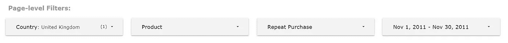
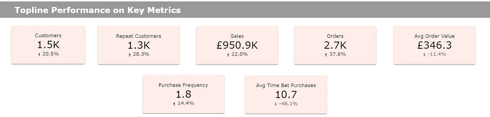
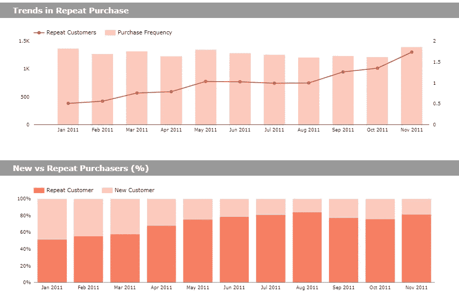
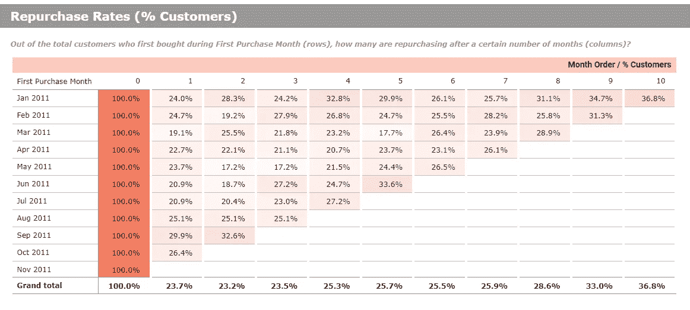
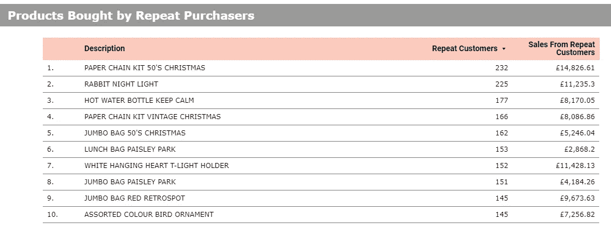

# 如何使用 Google Data Studio 和 BigQuery 监控重复购买行为

> 原文：<https://towardsdatascience.com/how-to-monitor-repeat-purchase-behavior-using-google-data-studio-and-bigquery-c2b5adbe8ebb?source=collection_archive---------9----------------------->

## 创建重复购买行为的自定义自动化可视化指南


在 [Unsplash](https://unsplash.com?utm_source=medium&utm_medium=referral) 上由 [Austin Distel](https://unsplash.com/@austindistel?utm_source=medium&utm_medium=referral) 拍摄的照片

监控重复购买行为对于确保零售或电子商务业务盈利至关重要。[回头客通常每次购物花费更多，更有可能向其他顾客推荐商店或产品，从而增加新顾客的获得和收入](https://blog.smile.io/repeat-customers-profitable/)。

自动化报告仪表板有助于企业所有者和分析师实时了解重复购买水平。在这篇文章中，我将演示如何使用 Google Data Studio 和 BigQuery 来实现这一点。

如果你从事电子商务，你可能已经有了一个谷歌分析账户，并且能够在那里查看留存率。构建该仪表板的优势在于，您可以根据自己的需求定制视图，并添加对您的业务有独特帮助的指标。除此之外，如果您能够从调查或社交媒体中获得数据，您可以轻松地将仪表板与其他数据源集成。所有的洞察力都集中在一个地方，因此可以更快地做出决策。

这是在 Google Data Studio 中完成的重复购买和保留仪表板示例:

这篇文章以 Google Data Studio 和 Big Query 为特色，但是我将更侧重于创建分析和度量标准，而不是讲授这些工具的基础知识。对于初学者，我会在文章末尾放一些资源供你参考。

# 数据集

本演示使用的数据是来自 UCI 机器学习库的[在线零售数据集。它是一个数据集，包含来自在线零售店的交易。您可以使用任何包含客户 id、订单 id、订单日期和销售额的事务数据来复制这个仪表板。](https://archive.ics.uci.edu/ml/datasets/Online+Retail#)

这些数据是从网站上下载的，然后手动上传到 Google BigQuery，这是一个可扩展的、具有成本效益的数据仓库。如果您的数据来自在线商店，可以设置集成，以便数据从商店流向第三方连接器，然后流向您的 BigQuery 仓库。如果您有这样的设置，数据将定期刷新，确保您获得关于您的业务的最新见解。

我不会详细介绍如何建立数据仓库，因为我打算更多地关注仪表板分析，但 BigQuery 有相当广泛的文档[在这里](https://cloud.google.com/bigquery/docs#training-and-tutorials)，以供参考。

# 将 Data Studio 连接到 BigQuery 数据集

建立数据仓库后，下一步是在 Google Data Studio 中创建数据源。以下是执行此操作的步骤:

1.  在 Data Studio 主页上，单击 Create。选择数据源。
2.  会出现各种各样的谷歌连接器。选择 BigQuery。
3.  为事务性数据选择 BigQuery 项目和数据集。
4.  单击连接。
5.  数据中的所有字段都将出现。检查数据格式是否正确，并在需要时添加自定义计算字段。对于这个仪表板，我添加了以下内容:

```
% Repeat Customers:
COUNT_DISTINCT(CASE WHEN RepeatPurchase = ‘Repeat Customer’ THEN CustomerID ELSE NULL END) / COUNT_DISTINCT(CustomerID)Average Order Value (AOV): SUM(Sales)/COUNT_DISTINCT(InvoiceNo)Purchase Frequency: COUNT_DISTINCT(InvoiceNo) / COUNT_DISTINCT(CustomerID)
```

6.单击创建报告。

现在，您将看到一个空白仪表板，您可以在其中放置所有需要的图表元素。

# 创建仪表板

让我们将仪表板组件分解为几个关键元素:

*   页面过滤器
*   关键指标的最高表现
*   重复购买的月度趋势
*   重复购买率(又名队列分析)
*   重复购买者购买的产品

## 页面过滤器



作者图片

页面级过滤器通常是您在仪表板上部看到的过滤器。它提供了交互功能，因为它使用户能够深入了解特定组的表现。在我们的控制面板中，我们可以选择关注哪个国家(我默认选择了英国)、产品类型、重复购买群体(首次购买者与重复购买者)以及交易日期。

## 关键指标的最高表现



作者图片

仪表板的第一个元素应该包含要查看的最重要的业务指标。我更喜欢用简单的记分卡——不要花哨的图表，直接列出你需要看到的关于企业健康状况的数字。我也更喜欢使用紧凑的格式——四舍五入到最多 1 位小数，并加上千位(K)或百万位(M)标记，而不是显示精确的值。这使得图表不那么杂乱，同时不会丢失太多所需的信息。

积极和消极的增长指标(绿色和红色)是一个伟大的事情。无需使用任何额外的图表，您就可以看到企业在特定指标上的表现是超过还是低于前期。

**代码:如何使用 BigQuery 创建回头客标志**

我们的记分卡中强调的一个关键指标是回头客(之前已经从商店购买过的顾客)。这个指标不能在 Data Studio 中计算，但可以在 BigQuery 中用下面的代码轻松完成:

```
SELECT *,
CASE WHEN customer_seq > 1 THEN 'Repeat Customer'
ELSE 'New Customer'
END AS RepeatPurchase
FROM (
    SELECT  *,
    RANK() OVER (PARTITION BY CustomerID ORDER BY date) AS customer_seq
    FROM online_retail
)
```

新字段 RepeatPurchase 是一个字符串字段，指示客户是“回头客”还是“新客户”。

## 重复购买的月度趋势



作者图片

不用说，有必要在每月视图上查看重要指标。通过这样做，人们能够检查趋势和季节模式，并据此采取行动。

在这个仪表板中，我首先显示了重复购买客户的原始数量以及购买频率。第二张图表显示了回头客与首次买家的比例。从原始计数和百分比两方面来看，随着时间的推移，商店似乎有了更多的回头客，这是一个好迹象。

## 重复购买率(又名队列分析)



作者图片

该分析通过关注客户“群体”显示了详细的回购率。在这种情况下，我们将群组定义为在特定月份第一次购买的**组客户。在示例中，第一个群组是 2011 年 1 月的群组。各栏代表参考月份，即 n 个月后，回购利率是多少？**

从该表中可以看出，2011 年 1 月首次购买者中，24%的人会在一个月后从商店回购，3 个月后的回购率为 24.2%，10 个月后的回购率为 36.8%。

“总计”行代表平均回购率，不管我们看的是哪一组。整体来看，该店 1 个月复购率 23.7%，3 个月复购率 23.5%，10 个月复购率 36.8%。

**代码:如何使用 BigQuery 执行群组分析**

以下代码片段显示了如何计算群组表中的回购率:

仪表板还包含销售百分比的群组分析—为了简洁起见，这里没有显示代码，因为它本质上与上面的相同(不是计算客户，而是计算销售总额)。

## 重复购买者购买的产品



作者图片

仪表板的最后一部分更侧重于细节，即哪些产品对重复购买客户和销售贡献最大？仅仅一张简单的桌子就足够了。虽然这里没有涉及，但确定有利可图的产品组合的分析，如市场购物篮分析，可以为您的企业提供营销和促销见解。

# 摘要

在本文中，我介绍了重复购买仪表板在监控零售店绩效方面的价值:

*   一眼看到背线表演
*   可视化重复购买的每月趋势
*   通过队列分析计算重复购买率

这个例子主要关注在线零售数据，但是也可以用于具有类似数据结构的其他销售数据源。任何包含客户 id、订单 id、订单日期和销售额的交易数据都可以用来复制这个仪表板。

我还强调了 Google Data Studio 生成这类报告的能力，以及 BigQuery 如何通过 SQL 语言增强它来进行更高级的分析。

本文中的所有代码都可以在我的 [GitHub](https://github.com/noemistatcat/Data_Viz_Portfolio) 上访问。快乐分析！

Google Data Studio 和 Big Query 的有用资源:

*   [分析学院对数据工作室的介绍](https://analytics.google.com/analytics/academy/course/10)
*   [营销分析师 big query](https://www.qwiklabs.com/quests/70)
*   [BigQuery 文档](https://cloud.google.com/bigquery/docs#training-and-tutorials)