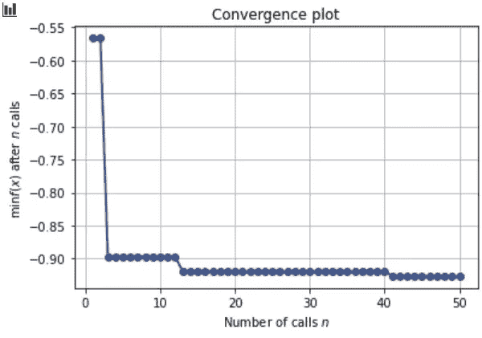
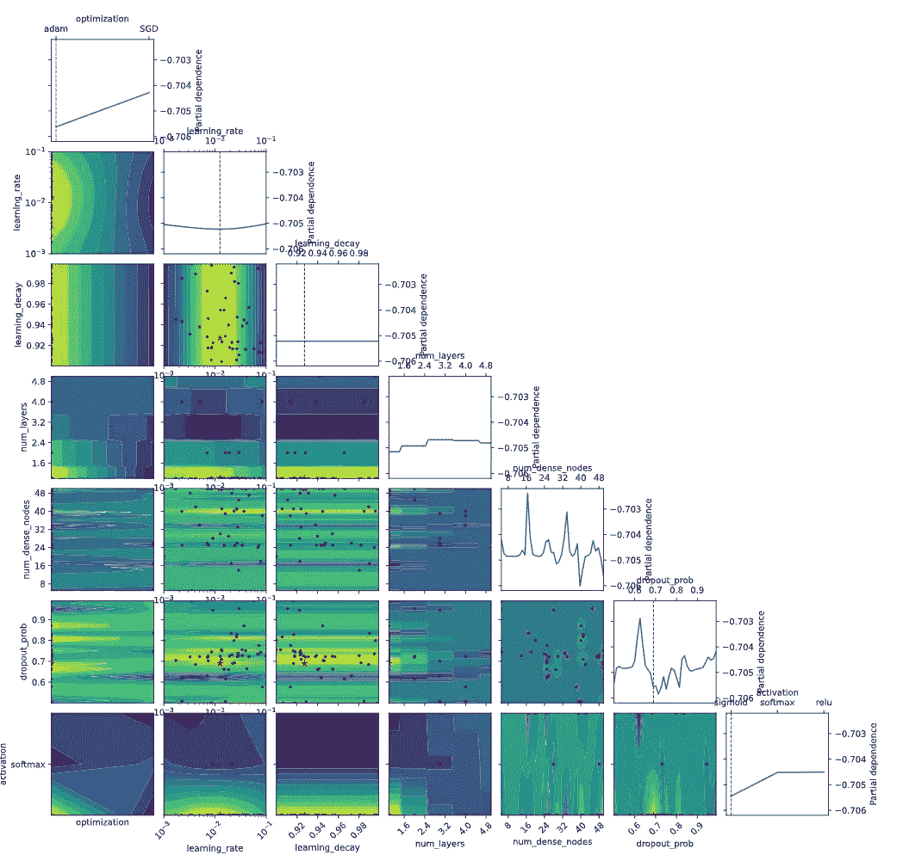

# 如何优化深度学习模型

> 原文：<https://towardsdatascience.com/how-to-optimize-a-deep-learning-model-2e9ff8a4c5de?source=collection_archive---------10----------------------->

## 通过有效的超参数优化，让您的模型更加出色


约翰·巴克利在 [Unsplash](https://unsplash.com?utm_source=medium&utm_medium=referral) 上拍摄的照片

超参数优化是任何机器学习管道的关键部分。仅仅选择一个型号不足以实现卓越的性能。您还需要调整您的模型，以便更好地解决问题。

这篇文章将讨论深度学习架构的超参数调整。有代码块来重新创建所示的示例。

> **欢迎将这篇文章加入书签，复制代码来快速优化你的深度学习模型。**

*如果您正在开发不同的深度学习模型，请用您的特定模型替换函数“create_model”中的代码，并更新每个函数的相关超参数。其余的优化代码是独立于模型的。*

使用 scikit-learn 开发模型时，超参数调整是一个相对简单的过程。随机搜索和网格搜索各有利弊。然而，被称为贝叶斯优化的第三种选择为超参数优化提供了一种实用、平衡的方法，可以产生更稳健的模型。

# **黑盒模型**

机器学习中的优化通常遵循相同的格式。首先，定义一个代表损失的函数。然后，通过最小化这种损失，该模型被迫产生日益改善的性能。
选择损失函数有两个主要原因。首先，它们很好地代表了问题。

标准损失函数的第二个方面是梯度被很好地定义。通过定义明确的梯度，许多不同的优化技术变得可用。最常见的是依赖于函数梯度的梯度下降法。

但是当函数没有梯度时会发生什么呢？当您有一个黑盒模型时，这种情况正是如此。


萨姆·穆卡达姆在 [Unsplash](https://unsplash.com?utm_source=medium&utm_medium=referral) 上拍摄的照片

黑盒模型有一个输入和一个输出。但是盒子里发生了什么是未知的。该属性使模型成为黑盒模型。

当模型是黑箱时，优化问题就更加困难。

不幸的是，在建立深度学习模型时，黑盒是标准的，因此标准的优化方法性能不佳。

简要考虑为什么梯度下降等优化方法无法优化超参数。如果你想优化一个超参数，你需要确定这个超参数的导数。例如，想象一下对随机森林的估计数进行求导。不可能的。

然而，黑盒优化并不关心确定函数的导数。相反，目标是基于来自超参数空间的多个样本来选择函数。那么一旦这个函数紧密表示超参数空间，你就可以优化这个函数了。这种优化的结果产生了最佳的超参数配置，其应该在原始黑盒函数上表现良好。

# **贝叶斯优化**

在上一篇文章中，我讨论了不同的超参数调优方法，并介绍了贝叶斯优化。有关其他可用调优方法的详细信息、它们的缺陷和优点，请参考我之前的帖子:

</hyperparameter-tuning-always-tune-your-models-7db7aeaf47e9>  

> 贝叶斯优化是从可能的超参数空间中采样，基于这些样本建模函数，然后优化该模型的过程

贝叶斯优化是从可能的超参数空间重复采样、基于这些样本建模函数、然后优化该模型的过程

与需要使用导数进行优化的梯度下降相反，贝叶斯优化创建了通过从超参数空间多次采样而生成的代表性函数。

这种多次采样和生成空间近似值的过程就是该方法是贝叶斯方法的原因。最后，使用来自重复采样的先验信息来调整代表性函数。

这个过程需要两件事，一个是从超参数空间采样的方法，另一个是优化产生的函数的方法。

从黑盒采样的方法需要对超参数空间进行采样，基于多个样本创建代表性函数，然后优化该函数。因此，输入成为超参数，输出是模型的性能。

利用来自超参数空间的足够数量的样本，生成该函数的良好近似。由此，该模型然后被优化用于超参数的最佳配置。

# **深度学习架构**

深度学习模型需要大量的调整。当你手动调整你的深度学习模型时，这是非常耗时的。

用于定义深度学习模型的超参数数量众多。

通过反复手动更改网络中的参数，您可以有效地执行实际的网格搜索。

您可以定义想要分析的每个超参数的分布，而不是手动检查不同的网络配置。然后有了很多样本，你就能找到一个更优的模型，你就能清楚地了解每个超参数对你的模型整体的影响。

这种架构调整方法至少需要两个函数。首先，评估函数并存储最佳结果和函数以基于一组超参数生成深度学习模型的过程。

# 优化深度学习模型

在这篇文章中，我将重点关注优化一个具有脱落层的神经网络的架构。我将在 TensorFlow 中使用 Keras，因为它可以直接快速地生成不同的模型。

> 这里稍作停顿，向 Keras 和 TensorFlow 的负责人说声谢谢。如果你曾经从零开始创建过神经网络、CNN 或 LSTM，你就会知道这是极其乏味和复杂的。因此，我非常感激这些图书馆的存在，并向公众开放。

使用从每个定义的分布中采样的超参数来生成模型。这些值控制层的数量、每个层上的节点数量、脱层概率、学习速率、优化器、优化方法的学习衰减以及激活函数。这个模型是为分类而建立的。

可以将这些函数应用于不同的网络，例如卷积神经网络。然而，由于卷积层的性质，每个后续层都依赖于前一层。这一方面增加了模型创建功能的复杂性。CNN 优化将可能是未来文章的重点。然而，CNN 的一个简单解决方法是固定层数并优化其余参数。

第一步是导入一些包并初始化一些参数。在这里，我还初始化了我要测试的不同超参数的分布。您会注意到，我没有将所有的超参数都设置为分布，所以我不会测试所有可能的组合。

## 导入和数据加载

```
import pandas as pd
import numpy as np
import matplotlib.pyplot as plt
from sklearn.datasets import load_breast_cancer
from sklearn.model_selection import train_test_split
import tensorflow as tf
from tensorflow.keras import backend as K
from tensorflow.keras.models import Sequential
from tensorflow.keras.layers import Dense, Dropout
from tensorflow.keras.callbacks import TensorBoard
from tensorflow.keras.optimizers import Adam, SGD
from tensorflow.keras.models import load_model
from tensorflow.keras.callbacks import EarlyStopping
from tensorflow.keras.optimizers.schedules import ExponentialDecay
import skopt
from skopt.space import Real, Categorical, Integer
from skopt import gp_minimize, forest_minimize
from skopt.plots import plot_convergence, plot_objective, plot_evaluations
from skopt.utils import use_named_args
print( "Tensorflow version: ", tf.__version__)data = load_breast_cancer()
y = data.target.astype(float)
X = data.data
X_train, X_test, y_train, y_test = train_test_split(X, y, test_size=0.4, random_state=2)
X_validation, X_test, y_validation, y_test = train_test_split(X_test, y_test, test_size=0.4, random_state=2)
```

接下来，定义超参数的分布。这些分布可以是实连续值、整数值或分类值。此外，还为连续分布添加了分布类型。

例如，当您要测试的大部分值都落在对数均匀分布的子集中时，对数均匀分布可能更适合学习率衰减。超参数也需要默认值。这些默认值用于优化过程中构建的第一个模型。

## 超参数初始化

```
dim_optimization = Categorical(categories=['adam', 'SGD'],
name='optimization')
dim_learning_rate = Real(low=1e-3, high=1e-1, prior='log-uniform',
name='learning_rate')
dim_learning_decay = Real(low=0.9, high=0.999, prior='uniform',
name='learning_decay')
dim_num_layers = Integer(low=1, high=5, name='num_layers')
dim_num_dense_nodes = Integer(low=5, high=50, name='num_dense_nodes')
dim_dropout_prob = Real(low=0.5, high=0.99, prior='uniform',
name='dropout_prob')
dim_activation = Categorical(categories=['sigmoid', 'softmax', 'relu'],name='activation')dimensions = [
    dim_optimization, dim_learning_rate, dim_learning_decay,
    dim_num_layers, dim_num_dense_nodes, dim_dropout_prob, dim_activation
]NUM_LAYERS = 1
BATCH_SIZE = 128
LEARNING_RATE = 0.001
DECAY_STEPS = 1000
DENSE_UNITS = 20
DROPOUT_PROB = 0.8
ACTIVATION_FUNC = 'relu'
LOSS_FUNC = 'binary_crossentropy'
METRIC = 'accuracy'
LEARNING_DECAY = 0.9
OTIMIZATION_FUNC = 'adam'
ACQ_FUNC = 'EI' # Expected Improvement
best_score = 0
EPOCHS = 50
BATCH_SIZE = 256
N_CALLS = 1000default_parameters = [OTIMIZATION_FUNC, LEARNING_RATE, LEARNING_DECAY, NUM_LAYERS, DENSE_UNITS, DROPOUT_PROB, ACTIVATION_FUNC]
```

如果你想改变底层模型，这个函数就需要改变。根据超参数输入，一些模型参数可能以其他参数为条件。例如，在 CNN 中，过滤器尺寸影响下一层的输出形状。目前 skopt 不支持条件特性。

对于这个例子，我控制了每个密集层中的单元数量，然后添加了一个下降层。这个结构是一个相当简单的网络，但是这个代码可以很容易地修改，以包含您选择的不同模型。

下一个代码块基于来自样本的超参数生成深度神经网络。

## 深度学习模型生成

```
def create_model(optimization, learning_rate, learning_decay, num_layers, num_dense_nodes, dropout_prob, activation):
    model = Sequential()
    name = 'layer_{0}_dense_units'.format(0)
    model.add( Dense( num_dense_nodes, input_dim=X_train.shape[1],
        activation=activation, name=name)) for i in range(num_layers-1):
        name = 'layer_{0}_dense_units'.format(i+1) 
        model.add( Dense( num_dense_nodes, activation=activation, name=name))
        model.add( Dropout(dropout_prob)) model.add( Dense(1, activation=activation))
    lr_schedule = ExponentialDecay( initial_learning_rate=learning_rate,
        decay_steps=DECAY_STEPS, decay_rate=learning_decay)

    if optimization == 'adam':
        optimizer = Adam(learning_rate=lr_schedule)
    if optimization == 'SGD':
        optimizer = SGD(learning_rate=lr_schedule)
    model.compile(
        optimizer=optimizer, loss=LOSS_FUNC, metrics=[METRIC])
    return model
```

适应度是 skopt 将使用‘gp _ minimize’进行优化的函数，它将生成的高斯过程最小化以对超参数空间进行建模。该函数通过构造最小化。因此，最大化的分数变成了负分数的最小化。

## 适合的功能

```
@use_named_args(dimensions=dimensions)
def fitness(optimization, learning_rate, learning_decay, num_layers, num_dense_nodes, dropout_prob, activation):
    # Create the neural network
    model = create_model( optimization=optimization,
        learning_rate=learning_rate, learning_decay=learning_decay,
        num_layers=num_layers, num_dense_nodes=num_dense_nodes,
        dropout_prob=dropout_prob, activation=activation)
    # Save log for tensorboard
    callback_log = TensorBoard(
        log_dir =
"./21_logs/opt_{0}_lr_{1:.0e}_lr_decay_{2:.0e}_layers_{3}_nodes_{4}_dropout_{5}_activation_{5}/".format(
        optimization, learning_rate, learning_decay, num_layers,         num_dense_nodes, dropout_prob, activation),
        histogram_freq=0, write_graph=True, write_grads=False, write_images=False) # Train the model.
    history = model.fit(
        x= X_train,y= y_train,
        epochs=EPOCHS,batch_size=BATCH_SIZE,
        validation_data=(X_validation, y_validation),
        callbacks=[callback_log],verbose=0)
    # Get the final model performance.
    col = [x for x in list(history.history.keys()) if 'val_'+METRIC in x]
    score = history.history[col[0]][-1]
    print("--> Validation {0}: {1:.2%}".format(METRIC, score))
    global best_score
    # Track scores and save best model
    if score > best_score:
        model.save('Optimal-NN')
    best_score = score
    # Clear model to save space
    del model
    K.clear_session()

    # Skopt minimizes black-box functions, return the negative
    return -score
```

skopt 函数‘gp _ minimize’对黑盒模型运行贝叶斯优化，以确定最佳超参数配置。用于优化高斯过程的“acq_func”是优化的几个选项之一。

## 高斯过程最小化

```
search_result = gp_minimize(func=fitness,
    dimensions=dimensions,
    acq_func=ACQ_FUNC,
    n_calls=N_CALLS,
    x0=default_parameters)
```

# 模型解释

搜索完成后，找到的最佳模型将保存在本地。可以从这一点加载和使用这个模型，如果需要，还可以进一步训练。

搜索结果包含每次评估的超参数以及每个测试模型的性能。

要查看搜索如何随着时间的推移提高模型性能，请运行以下代码块:

```
plot_convergence(search_result)
```



优化期间最佳模型性能的收敛(作者提供照片)

然而，仅仅看到不同测试模型的改进并不是贝叶斯优化的最大好处。独立分析每个超参数的行为，以及它们如何与其他超参数相互作用。

```
_ = plot_objective(result=search_result)
```



贝叶斯优化的部分相关性和参数交互(作者提供图片)

从上图中可以看出，一些参数仍然存在一些不确定性。改变密集节点数量的结果差异很大。然而，学习率似乎被有效地建模了。您可以看到优化选择了大约 10e-2 的学习速率。类似地，sigmoid 激活和 adam 优化在所有生成的模型中表现最佳。

# 结论

当试图微调和优化计算量大的模型时，贝叶斯优化非常有用。此外，贝叶斯优化需要很少的样本，并迅速接近更优化的超参数配置，因此它是深度学习模型的理想选择。

对于神经网络和网络变体等深度学习模型，微调架构至关重要。但是，不要浪费时间手动调优您的模型。相反，使用贝叶斯优化来确定每个超参数对模型的作用。

如果你有兴趣阅读关于新颖的数据科学工具和理解机器学习算法的文章，可以考虑在 Medium 上关注我。

*如果你对我的写作感兴趣，想直接支持我，请通过以下链接订阅。这个链接确保我会收到你的会员费的一部分。*

<https://zjwarnes.medium.com/membership> 