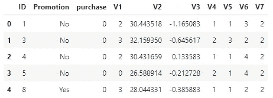
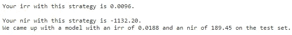
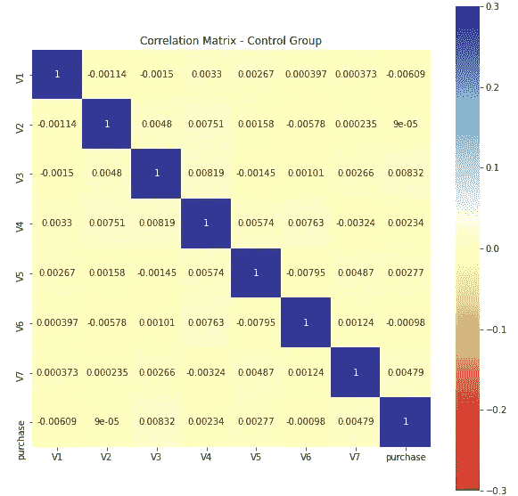
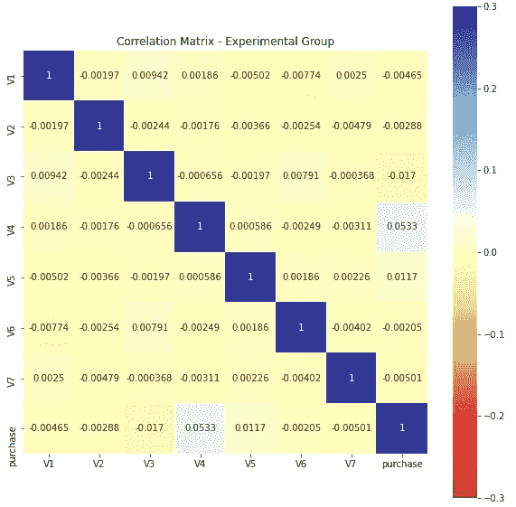
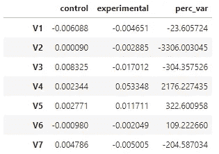
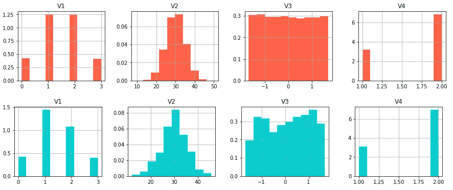
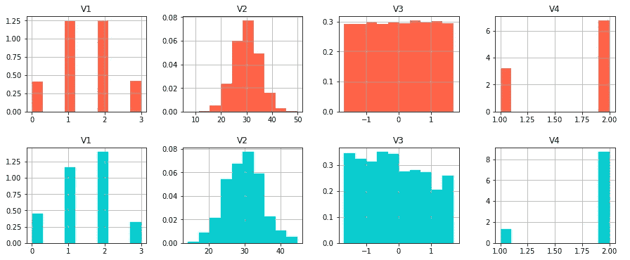
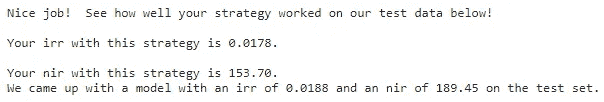
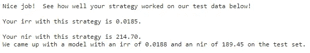

# 如何通过 A/B 测试优化促销回应

> 原文：<https://towardsdatascience.com/how-to-optimize-a-promotion-response-through-a-b-testing-a1ad1f8005a3?source=collection_archive---------22----------------------->

## A/B 测试已经达到必要的统计显著性，通过发送舞会门票来增加销售额。现在，通过瞄准正确的受众来优化它的潜力怎么样？

# 1.A/B 测试

你的一个朋友收到一张星巴克的促销券。你不知道。你会感到不安，尽管你本来就没打算用它。想知道发生了什么吗？

伊琳娜·巴比娜的照片

这很可能是该公司进行的**客户细分**的结果，目标是你的朋友是其中一员的一个特定群体，而你不是。 [A/B 测试](https://en.wikipedia.org/wiki/A/B_testing)也可以按照这个目的进行。

当试图在一个新网站、新功能、甚至新的广告活动实际发布给更大的受众之前衡量它们的影响时，A/B 测试是常见的。这样，就有可能避免把钱花在一些不会按预期执行的战略上，甚至更糟的是，会破坏公司的形象。

简而言之，这些测试被设计为在 2 个(或更多)组上执行。考虑 2 组情况(A 和 B)，一组称为**对照组**，另一组称为**实验组**。理想情况下，这两组之间唯一的区别是我们想要测试的**变化**。

在一个网站的例子中，我们可能想改变一个按钮的设计，看看它是否能增加销售额。**对照组**将被分配到**旧设计**，而**实验组**将被分配到**新设计**。

A/B 测试的另一个好处是收集数据，这些数据可以促进更好地理解与客户相关的具体**特征**，这些客户会对新事件做出更积极的反应。

当这个活动——送一张促销券——涉及的费用需要通过它的效果——增加销售额来弥补时，这一点尤其重要。在这种情况下，将促销券发送给正确的公众会使预期收益最优化，而将促销券发送给所有客户会导致金钱损失。

在这种情况下，A/B 测试可以回答促销活动是否会达到有效实施所需的 [**统计显著性**](https://en.wikipedia.org/wiki/Statistical_significance) 。一旦达到重要程度，就该针对目标受众进行优化了。

# 2.星巴克促销优化

尼尔斯·凯尔的照片

在本例中，我们使用的是星巴克的数据集，该数据集用于该公司求职者进行的技术测试。数据集已经分为训练集和测试集，它包含几个指示客户是被分配到控制组还是实验组、客户是否购买了商品的特征，以及代表客户特征的另外 7 个特征(V1 到 V7)。

训练集概览|作者图片

我们没有被告知这些特征实际上代表了什么，我们的工作是了解他们的行为，以有效地识别哪些客户更有可能对促销做出反应。

假设产品定价为 10 美元，并且公司发出每一次促销的成本为 0.15 美元，星巴克希望最佳策略能够最大化两个指标:**增量响应率** ( *IRR* )和**净增量收入** ( *NIR* )。

*IRR* 表示与未接受促销相比，通过促销购买产品的客户数量增加了多少。 *NRR* 代表发送促销信息会带来多少收益或损失。

为了更好地理解这一点的重要性，如果我们通过向所有客户端发送促销信息来对测试集运行一个测试函数，我们会得到以下结果:

测试结果-向所有客户端发送推广|作者图片

我们可以看到 0.0096 的 *IRR* 基本上是建议的 *IRR* 值的一半。更糟糕的是，我们会得到一个高负值的 *NIR* 指标，这意味着这个策略将代表**金钱损失**。*(可以通过这个* [*环节*](https://evertonbin.netlify.app/projects/starbucks-promotion_optimization) *按部就班的操作。)*

## 2.1 分析特征

测试了不同的策略，以实现与之前提出的指标值相似的指标值:0.0188 的 *IRR* 和 189.45 的 *NIR* 。除非我们不深入了解这些功能，否则我们会一直给星巴克造成金钱损失。

当我们比较这些特征在不同群体中的表现时，神奇的事情发生了。在分析了控制组和实验组的<https://en.wikipedia.org/wiki/Pearson_correlation_coefficient>**V1-V7 和*购买*特征之间的皮尔逊相关系数后，一些事情开始浮出水面。**

**重要的是要注意，计算分类数据之间的皮尔逊相关性是没有意义的，因为相关性代表“衡量”一个连续数值变量与另一个变量的行为相比是增加、减少还是保持不变。在这种情况下，一旦我们不知道这些变量意味着什么或代表什么，我们只是从不同的角度探索，看看我们是否可以获得一些见解。**

**例如，可以看出，在对照组(没有接受促销的那一组)中， *V3* 是与购买产品具有最高正相关性的特征，这意味着 *V3* 的较高值可能与**购买**产品、**的较高倾向相关，而与任何促销**无关。**

****

**相关矩阵-控制组|作者图片**

**当我们看这些相同的相关系数时，有趣的事情发生了，这次是在实验组。 *V3* 不仅作为最高相关值之一脱颖而出，而且这次是在**相反方向**上。它表明，促销活动一贯影响客户的行为时，观察这一具体特征。**

****

**相关矩阵-实验组|作者图片**

**在下一张图中，只选择了与控制组和实验组的*购买*特征相关的相关性，我们计算了它们从一组到另一组的**百分比变化:****

****

**相关系数的百分比变化|作者图片**

**为了更清楚，让我们观察一些特征的直方图，首先在对照组中，区分没有购买的人(红色的*)和购买的人(蓝色的*):****

******

***V1-V4 直方图-对照组(红色:未购买；蓝色:已购买)|作者图片***

***当查看蓝色的 *V3* 分布时，我们可以看到与 *V3* 的更高价值相关的**客户更有可能购买该产品，不管是否接受促销**。另一个有趣的结论是， *V2* 似乎呈正态分布，这意味着大多数客户都与均值附近的 *V2* 值相关。***

***让我们观察相同的直方图，这次是在实验组:***

******

***V1-V4 直方图-实验组(红色:没有购买；蓝色:已购买)|作者图片***

***当考虑到 *V3* 特性时，可以清楚地看到蓝色部分的情况是如何逆转的。它表明与 *V3* 的**较低值相关的客户因促销**而被鼓励购买该产品，而与 *V3* 的**较高值相关的客户因促销**而降低 **其自然** **购买率。*****

***如果我们想猜的话，我们可以说 *V3* 在某种程度上代表了参与者的收入。如果我们的猜测是正确的，我们可以说，高收入的客户倾向于定期购买产品。促销活动则相反:不仅他们可能不使用促销活动，而且他们中的一些人会停止购买该产品。***

***我们也可以说，由于促销，与低收入相关的客户有购买产品的动机，代表了实验组中购买者的最大比例。***

***根据特征分布，另一个可能的猜测是 *V2* 可以代表参与者的年龄。我们可以看到，一些年龄组对促销的反应更大。***

## ***2.2 建立战略***

***经过简短的分析和猜测，我们的策略是将这两个连续的数字变量( *V2* 和 *V3* )分成几个不同的类或组。***

****V3* 分 6 组:***

*   ****第 1 组*:低于-1.0 的值；***
*   ****第二组*:介于-1.0 和-0.5 之间的值；***
*   ****第三组*:介于-0.5 和 0.0 之间的值；***
*   ****第 4 组*:0.0 到 0.5 之间的值；***
*   ****第 5 组*:0.5 到 1.0 之间的值；***
*   ****第 6 组*:大于 1.0 的值。***

****V2* 也被分成不同的小组:***

*   ****第 1 组*:小于 15 或大于 45 的值；***
*   ****第二组*:15-25 或 35-45 之间的数值；***
*   ****第 3 组*:数值在 25 到 35 之间。***

***首先，我们为每一个类分配了序列号**。作为第二种方法，根据所做的分析，我们分配代表权重**的值**。例如，考虑到 *V3* 功能，组被分配到以下值:*****

*   ****第一组* : 5(方法 1) | 3(方法 2)；***
*   ****第二组* : 4(方法 1) | 2(方法 2)；***
*   ****第三组* : 3(方法 1) | 1(方法 2)；***
*   ****第 4 组* : 2(方法 1) | -1(方法 2)；***
*   ****第 5 组* : 1(方法 1) | -2(方法 2)；***
*   ****第六组* : 0(接近 1) | -3(接近 2)。***

***为 *V2* 功能设置了相同的逻辑，首先将序列号分配给不同的组，然后在第二种方法中加权值。***

***加权值是在考虑特征分布的情况下定义的，接近平均值的值会得到较高的“分数”(按比例更能反映促销)，而远离平均值的值会得到较低的“分数”。***

## ***2.3 训练 XGBClassifier***

***使用**序列号**方法，使用 *GridSearchCV* 进行参数调整，训练一个 *XGBClassifier* 模型。所有特征 *V1-V7* 被用作独立变量，变换被应用于 *V2* 和 *V3* 。***

***结果是一个非常接近建议的优化:***

******

***测试结果-序列号|作者图片***

***应用**加权序列号**方法，同时使用同一个 *XGBClassifier* 结合 *GridSearchCV* 算法，我们得到了更好的结果:***

******

***测试结果-加权序列号|作者图片***

***我们的 *IRR* 可以被认为等于提议的 IRR，而 *NIR* 指标增加了 10%以上。***

***在这两种情况下，模型仅使用**实验组**进行训练。在训练模型之前，我们使用了 *SMOTE* 技术来处理购买产品的群体和没有购买产品的群体之间的不平衡。***

# ***3.结论***

***A/B 测试可以定义一个新事件是否应该发布，数据分析可以增加它的好处。***

***对于任何数据科学家来说，分析数据都是不可或缺的工具。理解业务问题，分析特性的行为方式以及它们之间的关系是获得好结果的基础。***

***我们能够有效优化指标的唯一方法是通过**了解**特性的行为以及它们可能**代表什么**。***

***不仅如此，如果我们考虑到这个练习是星巴克在选择其团队未来成员时提出的，我们可以想象这些**分析技能**对一家公司是多么有价值。***

***在这个具体的例子中，我们能够:***

*   ***推断特征的含义；***
*   ***根据我们对功能的理解进行一些功能工程工作；***
*   ***针对正确的群体优化促销策略。***

***如果你到了这里，你就是赢家！感谢您加入我的分析之旅。***

***既然你可能会想到**数据分析**的重要性，那么刷新一些 [**统计概念**](/8-fundamental-statistical-concepts-for-data-science-9b4e8a0c6f1c) 会对你接下来的分析有所帮助呢？***

****笔记本呈现所有的分析和尝试可以在这里* *看到* [*。完整的项目，包括数据集，可以在我的*](https://evertonbin.netlify.app/projects/starbucks-promotion_optimization)[*Github*](https://github.com/evertonbin/starbucks-promotion-optimization)*中找到。****