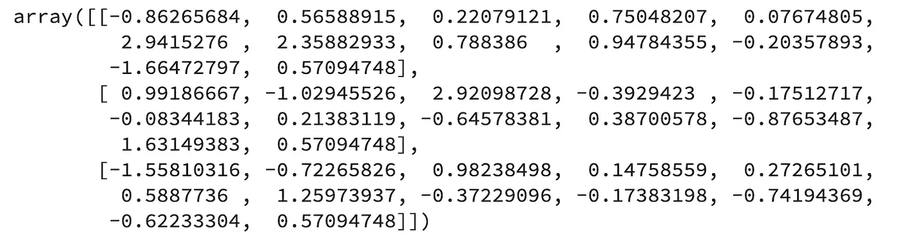
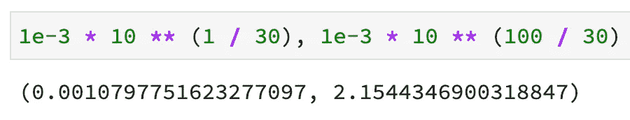
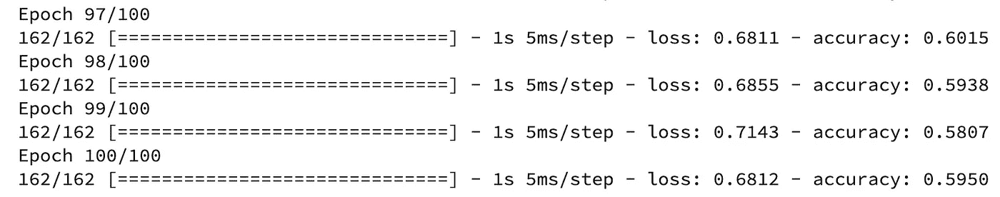
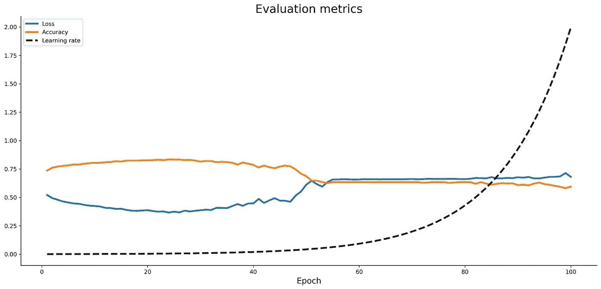
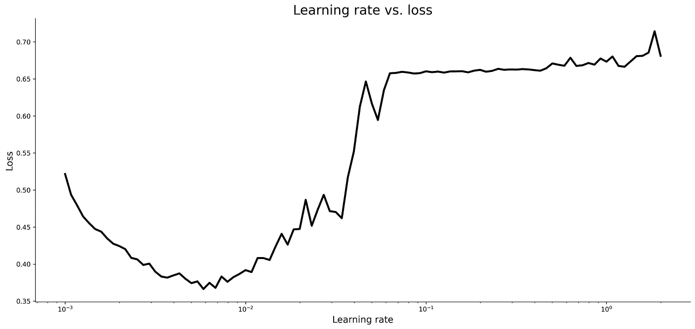
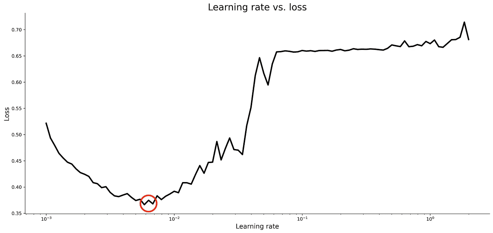
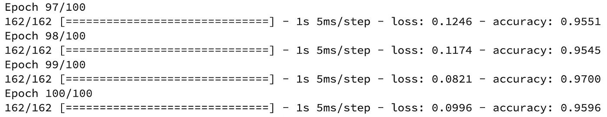
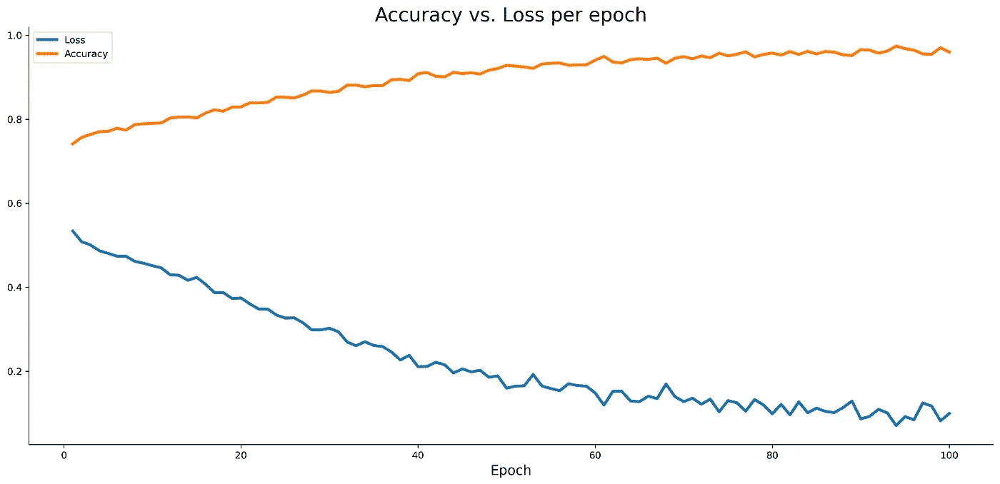
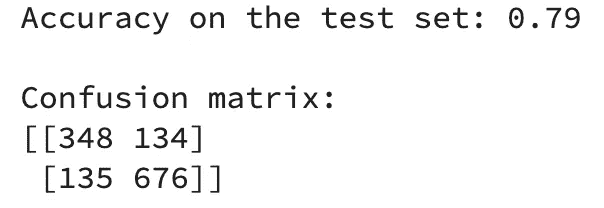

# 如何用 TensorFlow 优化学习速度——比你想象的要简单

> 原文：<https://towardsdatascience.com/how-to-optimize-learning-rate-with-tensorflow-its-easier-than-you-think-164f980a7c7b?source=collection_archive---------4----------------------->

## 显著改进您的模型并不需要太多时间——以下是开始的方法


由 [mahdis mousavi](https://unsplash.com/@dissii?utm_source=unsplash&utm_medium=referral&utm_content=creditCopyText) 在 [Unsplash](https://unsplash.com/s/photos/machine-learning?utm_source=unsplash&utm_medium=referral&utm_content=creditCopyText) 上拍摄的照片

调整神经网络模型不是闹着玩的。有如此多的超参数需要优化，使用网格搜索方法一次性优化所有这些参数可能需要几周甚至几个月的时间。*学习率*是一个超参数，只要你知道怎么做，你可以在几分钟内调整好。这篇文章将教你如何做。

学习率控制根据估计误差更新多少权重。选择太小的值，你的模型将永远训练，并可能卡住。选择过大的学习率，你的模型可能会在训练过程中跳过最优的一组权重。

您将需要安装 TensorFlow 2+、Numpy、Pandas、Matplotlib 和 Scikit-Learn 来跟进。

不想看书？请观看我的视频:

你可以在 [GitHub](https://github.com/better-data-science/TensorFlow) 上下载源代码。

# 使用的数据集和数据预处理

我不打算在这里花太多时间。我们将使用与[上一篇文章](/how-to-train-a-classification-model-with-tensorflow-in-10-minutes-fd2b7cfba86)相同的数据集——来自 Kaggle 的[葡萄酒质量数据集](https://www.kaggle.com/shelvigarg/wine-quality-dataset):


图片 1——来自 Kaggle 的葡萄酒质量数据集(图片由作者提供)

您可以使用以下代码将其导入 Python，并随机打印几行:

```
import os
import numpy as np
import pandas as pd
import warnings
os.environ['TF_CPP_MIN_LOG_LEVEL'] = '2' 
warnings.filterwarnings('ignore')

df = pd.read_csv('data/winequalityN.csv')
df.sample(5)
```

我们忽略警告并更改默认的 TensorFlow 日志级别，这样我们就不会被输出淹没。

以下是数据集的外观:


图 2——葡萄酒质量数据集的随机样本(图片由作者提供)

数据集基本上是干净的，但默认情况下不是为二元分类(好酒/劣酒)而设计的。取而代之的是，葡萄酒是按等级来评定的。我们现在将解决这个问题，还有其他一些问题:

*   **删除缺失值** —它们为数不多，所以我们不会在插补上浪费时间。
*   **处理分类特征**——唯一的一个是`type`，指示葡萄酒是白还是红。
*   **转换为二分分类任务**——我们将宣布任何等级为 6 及以上的葡萄酒为*好*，任何等级以下的为*差*。
*   **训练/测试分流**——经典的 80:20 分流。
*   **缩放数据** —预测值之间的比例差异很大，因此我们将使用`StandardScaler`来拉近数值。

下面是完整的数据预处理代码片段:

```
from sklearn.model_selection import train_test_split
from sklearn.preprocessing import StandardScaler

# Prepare the data
df = df.dropna()
df['is_white_wine'] = [
    1 if typ == 'white' else 0 for typ in df['type']
]
df['is_good_wine'] = [
    1 if quality >= 6 else 0 for quality in df['quality']
]
df.drop(['type', 'quality'], axis=1, inplace=True)

# Train/test split
X = df.drop('is_good_wine', axis=1)
y = df['is_good_wine']
X_train, X_test, y_train, y_test = train_test_split(
    X, y, 
    test_size=0.2, random_state=42
)

# Scaling
scaler = StandardScaler()
X_train_scaled = scaler.fit_transform(X_train)
X_test_scaled = scaler.transform(X_test)
```

下面是前几个缩放行的样子:



图 3 —缩放的训练集(图片由作者提供)

同样，如果你想更详细地了解数据预处理背后的逻辑，请参考[上一篇文章](/how-to-train-a-classification-model-with-tensorflow-in-10-minutes-fd2b7cfba86)。

说完这些，让我们看看如何优化学习率。

# 如何在 TensorFlow 中优化学习率

一旦你掌握了要点，优化学习速度就很容易了。我们的想法是从小处着手，比如说从 0.001 开始，然后在每个时期增加这个值。在训练模型时，你会得到可怕的准确性，但这是意料之中的。不要介意，因为我们只对当我们改变学习率时*损失*如何变化感兴趣。

让我们从导入 TensorFlow 并设置种子开始，这样您就可以重现结果:

```
import tensorflow as tf
tf.random.set_seed(42)
```

我们将训练 100 个时期的模型，以测试 100 种不同的损失/学习率组合。学习率值的范围如下:



图片 4-学习率值的范围(图片由作者提供)

比如说，0.001 的学习率是 Adam optimizer 的默认学习率，2.15 显然太大了。

接下来，让我们定义一个神经网络模型架构，编译该模型，并对其进行训练。这里唯一的新东西是`LearningRateScheduler`。它允许我们输入上面声明的方法来改变学习率作为一个 lambda 函数。

下面是完整的代码:

```
initial_model = tf.keras.Sequential([
    tf.keras.layers.Dense(128, activation='relu'),
    tf.keras.layers.Dense(256, activation='relu'),
    tf.keras.layers.Dense(256, activation='relu'),
    tf.keras.layers.Dense(1, activation='sigmoid')
])

initial_model.compile(
    loss=tf.keras.losses.binary_crossentropy,
    optimizer=tf.keras.optimizers.Adam(),
    metrics=[
        tf.keras.metrics.BinaryAccuracy(name='accuracy')
    ]
)

initial_history = initial_model.fit(
    X_train_scaled,
    y_train,
    epochs=100,
    **callbacks=[
        tf.keras.callbacks.LearningRateScheduler(
            lambda epoch: 1e-3 * 10 ** (epoch / 30)
        )
    ]**
)
```

训练将从现在开始，你会立即看到一个相当不错的准确率——大约 75%——但在 50 多岁之后，它会下降，因为学习率变得太大了。经过 100 个时代后，`initial_model`有了大约 60%的准确率:



图 5 —初始模型训练日志(图片由作者提供)

`initial_history`变量现在有关于损失、准确性和学习率的信息。让我们把它们都标出来:

```
import matplotlib.pyplot as plt
from matplotlib import rcParams
rcParams['figure.figsize'] = (18, 8)
rcParams['axes.spines.top'] = False
rcParams['axes.spines.right'] = False 

plt.plot(
    np.arange(1, 101), 
    initial_history.history['loss'], 
    label='Loss', lw=3
)
plt.plot(
    np.arange(1, 101), 
    initial_history.history['accuracy'], 
    label='Accuracy', lw=3
)
plt.plot(
    np.arange(1, 101), 
    initial_history.history['lr'], 
    label='Learning rate', color='#000', lw=3, linestyle='--'
)
plt.title('Evaluation metrics', size=20)
plt.xlabel('Epoch', size=14)
plt.legend();
```

这是图表:



图 6——损失与准确性和学习速度(图片由作者提供)

在开始进一步下降之前，精确度在时期 50 左右显著下降并平坦了一段时间。loss 发生了完全相反的情况，这是有道理的。

现在，您可以用对数标度绘制损失与学习率的关系图，显示损失最小的位置:

```
learning_rates = 1e-3 * (10 ** (np.arange(100) / 30))
plt.semilogx(
    learning_rates, 
    initial_history.history['loss'], 
    lw=3, color='#000'
)
plt.title('Learning rate vs. loss', size=20)
plt.xlabel('Learning rate', size=14)
plt.ylabel('Loss', size=14);
```

这是图表:



图 7——学习率与损失(作者图片)

一般来说，你会希望选择一个学习率来实现最低的损失，前提是它周围的值不会太不稳定。请记住，X 轴是对数刻度。最佳学习率在 0.007 左右:



图 8——最佳学习率(图片由作者提供)

因此，让我们用一个假定的最佳学习率来训练一个模型，看看我们是否能胜过默认的学习率。

# 以最佳学习速率训练模型

考虑到学习率为 0.007，我们再写一个神经网络模型。这次你不需要`LearningRateScheduler`:

```
model_optimized = tf.keras.Sequential([
    tf.keras.layers.Dense(128, activation='relu'),
    tf.keras.layers.Dense(256, activation='relu'),
    tf.keras.layers.Dense(256, activation='relu'),
    tf.keras.layers.Dense(1, activation='sigmoid')
])

model_optimized.compile(
    loss=tf.keras.losses.binary_crossentropy,
    optimizer=tf.keras.optimizers.Adam(learning_rate=0.007),
    metrics=[
        tf.keras.metrics.BinaryAccuracy(name='accuracy')
    ]
)

history_optimized = model_optimized.fit(
    X_train_scaled,
    y_train,
    epochs=100
)
```

在[上一篇文章](/how-to-train-a-classification-model-with-tensorflow-in-10-minutes-fd2b7cfba86)中，我们用默认的学习率得到了 76%的准确率，所以看看学习率优化是否能提高它会很有趣。训练集上报告的准确性看起来好得令人难以置信，因此我们的模型很可能过度拟合:



图 9-优化的模型训练日志(图片由作者提供)

如果我们成功地提高了测试集的性能，这不会有太大的影响，但是您可以通过为更少的时期训练模型来节省一些时间。

下面是优化模型的精度与损耗的关系:

```
plt.plot(
    np.arange(1, 101), 
    history_optimized.history['loss'], 
    label='Loss', lw=3
)
plt.plot(
    np.arange(1, 101), 
    history_optimized.history['accuracy'], 
    label='Accuracy', lw=3
)
plt.title('Accuracy vs. Loss per epoch', size=20)
plt.xlabel('Epoch', size=14)
plt.legend()
```



图 10 —训练集的准确度与损失(图片由作者提供)

让我们最后计算预测，并根据测试集对它们进行评估。代码如下:

```
from sklearn.metrics import confusion_matrix
from sklearn.metrics import accuracy_score

predictions = model_optimized.predict(X_test_scaled)
prediction_classes = [1 if prob > 0.5 else 0 for prob in np.ravel(predictions)]

print(f'Accuracy on the test set: 
    {accuracy_score(y_test, prediction_classes):.2f}')
print()
print('Confusion matrix:')
print(confusion_matrix(y_test, prediction_classes))
```

这是输出结果:



图 11 —测试集评估指标(作者图片)

总之，仅优化学习率就设法在测试集上将模型准确度提高了 3%。这听起来可能不大，但对于所花的时间来说，这是一个很好的权衡。此外，这只是你可以对神经网络模型进行的许多优化中的第一步，它是你需要担心的一个更少的超参数。

请继续关注学习如何优化神经网络架构——帖子将在几天后发布。感谢阅读！

*喜欢这篇文章吗？成为* [*中等会员*](https://medium.com/@radecicdario/membership) *继续无限制学习。如果你使用下面的链接，我会收到你的一部分会员费，不需要你额外付费。*

[](https://medium.com/@radecicdario/membership) [## 通过我的推荐链接加入 Medium-Dario rade ci

### 作为一个媒体会员，你的会员费的一部分会给你阅读的作家，你可以完全接触到每一个故事…

medium.com](https://medium.com/@radecicdario/membership) 

# 保持联系

*   注册我的[简讯](https://mailchi.mp/46a3d2989d9b/bdssubscribe)
*   在 YouTube[上订阅](https://www.youtube.com/c/BetterDataScience)
*   在 [LinkedIn](https://www.linkedin.com/in/darioradecic/) 上连接