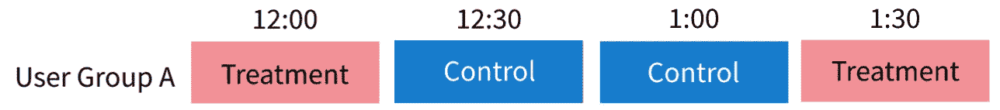
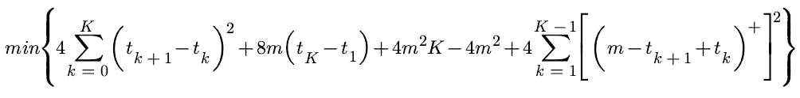
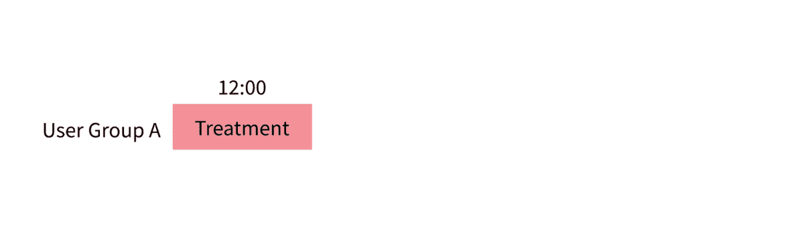
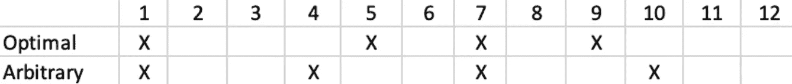
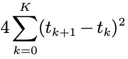
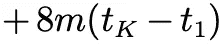
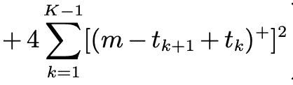

# 如何优化您的 Switchback A/B 测试配置

> 原文：<https://towardsdatascience.com/how-to-optimize-your-switchback-a-b-test-configuration-791a28bee678?source=collection_archive---------16----------------------->

## [思想和理论](https://towardsdatascience.com/tagged/thoughts-and-theory)

## 确定转回实验的最有效随机化点的算法。

2021 年 1 月，麻省理工学院和哈佛大学的研究人员开发了一篇[论文](https://arxiv.org/pdf/2009.00148.pdf)，概述了优化分析和设计转回实验的理论框架。转回实验，也称为时间分割实验，采用对照/处理的顺序重排来消除某些数据固有的偏差。这些方法在双边市场中很流行，如优步和 Lyft，因为它们允许用有限的资源(司机、乘客等)对数据进行稳健的实验。).

论文中概述的算法利用了我们关于遗留效应(补充有限资源所需的时间)的知识，以最小化我们实验的方差。虽然该方法确实需要求解算法，如 minimax，但优化是在实验运行之前完成的，因此计算开销很低。



图 1:具有 30 分钟时间分割的 switchback 测试框架——图片由作者提供。

下面是该方法的工作原理…

# **0。技术 TLDR**

**0.1 确定结转影响订单的持续时间。**遗留效应的顺序是在未来可以观察到治疗效果的时间段数。拼车市场的一个例子是司机可以再次乘车的时间间隔。

**0.2 编码使风险函数最小化。**下面我们有一个函数，当最小化时，它将为我们指定的残留效应顺序( *m* )和实验长度( *K* )提供最佳随机化点。



图 2:当最小化时，将产生具有最小方差的最佳随机化点的表达式— [源](https://arxiv.org/pdf/2009.00148.pdf)(等式 8)

**0.3 制定优化的控制/处理顺序。**使用求解器解决上述最小化问题。

**0.4 运行实验并分析。**在我们开发出最佳随机化配置并运行实验后，我们可以照常进行分析。唯一的区别是我们需要利用 bootstrap 风格的算法来确定我们的 p 值，这将在下面讨论。

# 1.但是，到底是怎么回事呢？

好了，让我们慢一点，为这个方法培养一些直觉。

## 1.1 我们何时使用转回实验？

当我们的用户群存在结构性偏差时，转回实验是最有用的。这些结构性偏见通常以共享有限资源或用户之间复杂交互的形式出现。

以数据科学家的自由职业网站为例。这是一个双边市场，意味着供求概念适用于自由职业者和雇主。如果我们运行一种治疗方法，帮助雇主找到具有机器学习(ML)技能的数据科学家，数据科学家的人才库将会枯竭，从而影响对照组中数据科学家的数量。我们还可以说，我们的兴趣指标是为 ML 工作(即转换)签署的合同数量。由于数据科学家的供应有限，我们的控制将会看到转化率的下降，这将高估我们的治疗效果。

> 如果处理影响了共享的资源池，控制组将受到影响，从而使我们的实验无效。

那么，我们怎么能相信治疗提升是我们 ML 功能成功的准确衡量标准呢？

## 1.2 转回实验的定义

转回实验(也称为*时间分割实验*)解决了这个问题。它们是 **A/B 测试框架，100%的流量在处理和控制之间交替。**



图 3:连续随机化期间的图解——作者提供的图片。

如图 3 所示，每 30 分钟我们随机抽取*用户组 A* 中的所有用户进行控制或治疗。这种方法可以应用于任何数量的处理实验。

现在，每个时间分割的持续时间是相当任意的，但是指导原则是持续时间应该足够短，以显示对我们数据的有效洞察，但不要短到计算成为问题。 [Doordash](https://medium.com/@DoorDash/switchback-tests-and-randomized-experimentation-under-network-effects-at-doordash-f1d938ab7c2a) 使用 30 分钟的窗口。

最后，为了测量我们的实验寿命，我们简单地取所有时间段的治疗寿命的平均值。请注意，更复杂的 lift 测量将用户在给定的时间戳视为随机化单元，但这超出了本文的范围。

## 1.3 更好的方法

虽然上面的简单转回实验框架有效，但它对可以持续很长时间的治疗效果不是很鲁棒，所以哈佛和麻省理工学院的研究人员开发了一种更好的方法。我们不是简单地在每个时间段进行随机化，而是利用关于遗留效应的知识来设计最佳配置。

首先，什么是结转效应？从我们上面的自由职业者的例子来看，当一个自由职业者被雇佣时，当他们完成项目时，他们会被从候选人名单中删除一段时间。候选人重新进入人才库所需的时间就是我们的**延续时间**。

通常结转持续时间被表示为它所覆盖的时间分割数的倍数；这个值称为我们的**结转效应顺序** ，用字母 *m* 表示。因此，对于 2 小时的结转持续时间，如果我们的时间间隔是 30 分钟，那么 *m = 4。*

第二，我们必须了解什么是好的/坏的配置。**主要目标是开发一个随机化框架，该框架创建适当数量的 *m+1* 序列，用于公正控制或公正处理**。从连续的一系列 *m* 处理中，我们可以观察到残留效应的混杂。相反，如果一行中有 *m+1* 个质控品，我们将“重置”我们的遗留物，并观察不受遗留物影响的处理。

我们的目标是在我们的用户群中交替我们的控制/治疗，以最小化我们的实验所产生的混淆。

酷毙了。准备好面对巨大的方程式了吗？


图 4:我们寻求最小化的表达式，以开发最佳随机化点。图 2 的副本— [来源](https://arxiv.org/pdf/2009.00148.pdf)(等式 8)

在图 4 中，

*   K 代表我们实验中的总时间周期数，
*   *t_k* 是第 *k* 个随机化指标，并且
*   *m* 是我们的结转效果订单。

这种最小化的输出将是随机化点的向量*T **(*T-star*)*。因此，例如，对于一个总时间分割为 *K=12* 且结转效应顺序为 *m=2* 的实验，我们会看到最优输出为 *T*={1，5，7，9}* 。这里，***表示我们在第 1、第 5、第 7 和第 9 时间间隔重组我们的对照组/治疗组。对于所有其他时间分割，我们不会重新调整我们的控制/治疗。*

*图 5 是一个表格，直观地表示了与任意设计相比的上述最佳设计。顶行是我们优化的框架，底行是任意的设计。最后，X 对应于一个随机点；如果有一个 X，我们就重新安排控制/治疗。*

**

*图 5:最佳配置(上排)和随机设计的折返(下排)的论文示例— [来源](https://arxiv.org/pdf/2009.00148.pdf)(表 1)*

*一个简单的技术提示——最小化是根据我们配置的风险函数改编的，并且对应于我们的升力的方差。我们越是最小化函数，我们观察到的方差就越低，我们对治疗效果的估计就变得越好。*

*论文中的数学非常酷，而且有据可查，所以如果你好奇，可以看看论文的第三部分。*

## *1.4 方法背后的直觉*

*现在我们已经了解了发生了什么，让我们来了解一下它为什么会起作用。对于这一部分，让我们在索引 *F={1，6，7，8，9}* 处尝试随机化点。 *t_n* 对应我们的 *F* 向量的第 *n* 个索引，所以比如 *t_0 = 1* 和 *t_4 = 9* 。*

**

*图 6:最小化表达式最左边的总和— [来源](https://arxiv.org/pdf/2009.00148.pdf)(等式 8)*

*从最左边的求和开始(图 6)，我们可以看到，随着顺序随机化指数之间的差异变大，该项也会变大。*

*为了充分披露，让我们快速算出一个例子。如果 *k = 0* ， *t_0 = 1* ， *t_(0+1) = 6* 。两者相差 5，比较大；我们被罚了 25 个单位。对所有指数求和，我们的惩罚项是 112。*

**

*图 7:最小化表达式的第二左求和— [来源](https://arxiv.org/pdf/2009.00148.pdf)(等式 8)*

*接下来，让我们处理第二项(图 7)。该表达式来自论文中的引理 2，其陈述了第一个和最后一个随机化点都应该跟随有 *m* 个非随机化时间分割。如果随机化来得太早或太晚，我们都会受到惩罚。*

*用我们的向量处理这个表达式，表达式的值是 128。目前为止我们看起来不太好。*

**

*图 8:最小化表达式最右边的总和— [源](https://arxiv.org/pdf/2009.00148.pdf)(等式 8)*

*忽略下面两项，它们是数学上的假象，没有什么可解释的价值，让我们把注意力集中在最右边的求和上(图 8)。这个术语代表连续随机化点之间的间隙；如果在重新洗牌之间有太多的时间，我们会被扣分。请注意,()⁺只是我们的数字和 0 的最大值，即 [max(x，0)](https://math.stackexchange.com/questions/1043399/what-does-it-mean-to-have-a-lone-plus-sign-in-the-exponent-superscript-modified) 。*

*这一项的值为 16，如果我们将所有的值相加，包括我们在上一段中忽略的值，我们得到 *112 + 128 + 192 - 16 + 16 = 432。**

*这就是我们的方法。很简单，对吧？*

*现在，我们所要做的就是使用一个解算器来找到使图 4 中的表达式最小化的随机化路径。*

# *2.推理*

*有了第 1 节中确定的优化配置，不幸的是，我们不能使用传统的方法来评估我们的治疗成功，因为我们在随机化中引入了结构偏倚。*

*有两种建议的方法用于从以这种方式构造的实验中得出推论。第一个提供了一个“精确”的估计，第二个提供了一个渐近上限。*

## *2.1 精确方法*

*确切的方法允许我们测试一个尖锐的零假设，即我们观察不到任何时间分割的影响。请参见下面的 pythonic 伪代码，了解这些步骤的概要…*

```
*sampled_lifts = []# 0\. Calcualte lift using the Horvitz-Thompson esimtator for our full data
total_lift = hv_estimator(observed_assignment_path, observed_ys)# 1\. Iterate through a large number of samples
for i in range(num_samples): # 2\. Sample a new assignment path (w) according to the assignment mechanism
  w = sampled_assigment_path(dist)

  # 3\. estimate our lift (lift) using the Horvitz-Thompson esimtator
  lift = hv_estimator(w, observed_vals)
  lifts.append(lift)# 4\. Calcualte p_value as the proprtion of samples that have higher lift than the total_lift
p_val = avg(abs(lifts) > abs(lift))# 5\. Examine values of interest
print(total_lift, p_val)*
```

*如果你不是伪代码的粉丝，英文版是我们从我们观察到的实验升力中反复取样，以获得其他理论升力的许多估计。请注意，这些样本必须遵循实验中使用的相同模式，即它们必须具有相同的随机化点。还要注意，理论升力是用霍洛维兹-汤普森估计量计算的，即每次升力的加权估计。*

*利用所有这些样本，我们观察它们比我们的真实生活更极端的时间比例。这个比例就是我们的 p 值。*

## *2.2 渐近法*

*第二种方法使用我们的 Horovitz-Thompson 方差来计算 t 统计量。不幸的是，方差计算和证明相当冗长，所以它们被省略了，但是请随意查看论文的第 4 部分以获得关于这两种方法的完整注释。*

*相反，我们将只关注性能。渐近估计比精确方法更保守，然而它们对大升力表现出相似的性能。你选择哪种方法将由你的需要决定。*

*现在你知道了。最佳切回实验的从头至尾框架。*

# *实施说明*

*   *如果您错误地指定了遗留效应的顺序 *m* ，统计推断仍然有效。*
*   *本文第 7.2 节概述了一种系统地确定 *m* 的方法。注意，这种方法需要实验数据。*
*   *当选择时间分割周期的长度时，长度小于 *m* 很重要，这样结转效应可以表示为几个时间分割的倍数。然而，过小的时间分割会毫无理由地增加计算量。一个经验法则是*(分裂数/ m) > 100* 并且偏于高估 *m.**
*   *虽然扩展到一个多种治疗的框架没有在这篇文章中讨论，但是相同的随机化点将适用于任何数量的治疗的实验。*

**感谢阅读！我将再写 48 篇文章，将“学术”研究引入 DS 行业。查看评论中关于优化转回实验的链接/想法。**