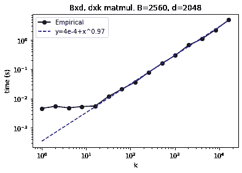
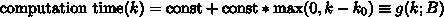
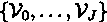
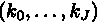
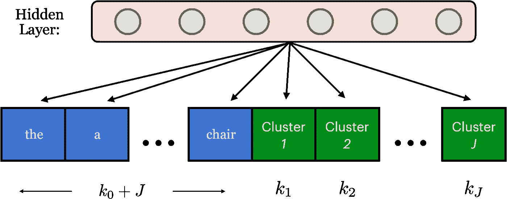
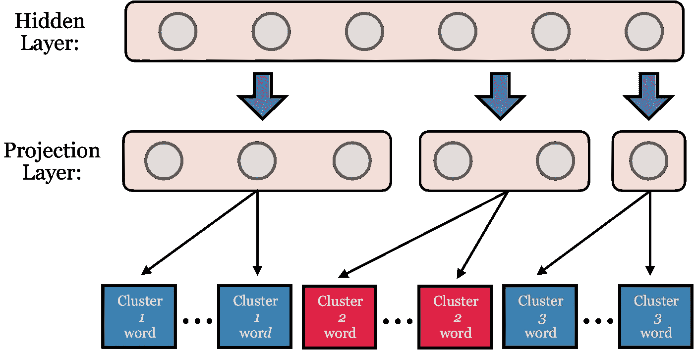
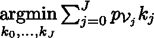
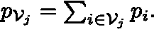

# 如何使用自适应 Softmax 层克服大词汇量瓶颈

> 原文：<https://towardsdatascience.com/how-to-overcome-the-large-vocabulary-bottleneck-using-an-adaptive-softmax-layer-e965a534493d?source=collection_archive---------21----------------------->

## [理解大数据](https://towardsdatascience.com/tagged/making-sense-of-big-data)

## 一个简单的 GPU 优化层替换如何提供 2-10 倍的加速，而性能几乎没有损失的详细指南

由 [Wolfgang Hasselmann](https://unsplash.com/@wolfgang_hasselmann?utm_source=medium&utm_medium=referral) 在 [Unsplash](https://unsplash.com?utm_source=medium&utm_medium=referral) 上拍摄的照片。像这只骆驼适应沙漠一样适应你的 softmax！

本文的目的是解释和提供自适应 softmax 的 TensorFlow 2.0+实现，如参考文献[1] ( [链接](http://proceedings.mlr.press/v70/grave17a/grave17a.pdf))所述:

只需将您的 softmax 切换到自适应 softmax，您就可以在训练和推理中轻松实现 2-10 倍的加速。在开始之前，这里是我们将要做的事情的概述:

1.  大词汇量=瓶颈。我们分析了在大型词汇表上使用常规 softmax 的相关问题。
2.  我们调查这个问题的其他解决方案，然后解释自适应 softmax 如何解决这些其他方法的缺点。
3.  我们深入研究实际的实现细节。
4.  我们以准备运行代码和实现建议结束。

对于 TensorFlow 2.0+中的实现，请在此和帖子底部查看以下链接[。](https://github.com/Jmkernes/PAR-Transformer-XL/blob/main/adaptive_softmax.py)

我们开始吧！

# **为什么大词汇量这么成问题？**

语言模型的最终输出层通常是全连接的密集层，将最终隐藏层与词汇表中每个单词的概率联系起来。这是一个*密集*层，所以很明显，它是*密集的，*意味着它有很多参数。具体来说，让最终隐藏层的形状为 *(B，d)* (认为 B 为批量，d 为尺寸)。对于词汇大小 *V* ，最终的密集层+softmax 将是形状 *(d，V)。*对于 100k 令牌和隐藏维度 2048 的词汇表来说，仅在最后一层就有*近十亿个参数*。因为矩阵乘法在最坏的情况下是 O(BdV) 这需要大量的计算时间。

存在许多解决这个问题的方案。对于一些任务，可以简单地修改损失函数，以避免需要每个单词的输出概率。分层 softmax [2，3]就是这样一种方法。不是单独预测每个词汇，而是预测树中的节点(通常是二进制的)。通过降低树来恢复单个单词的概率，这减少了从 *O(V) →O(ln V)* 的计算。然而，这些方案没有考虑到它们的层次划分的实际计算成本。

另一类解决方案涉及采样方法[4，5，6]。当我们执行交叉熵损失时，我们实际上只关心预测指数的概率。我们可以通过抓取预期单词的概率，然后将其与其他一堆随机选择的单词的概率进行比较，来估算损失(称为负采样)。这样，我们不需要执行完整的输出计算。然而，在推理时，我们仍然需要做一个完整的 softmax，这可能会很慢。

最后，还有自归一化解决方案，其目的是学习一个输出概率分布，即*被*归一化，从而避免计算所有输出概率然后归一化的需要。

# **介绍自适应 Softmax**

adaptive softmax 是一种基于类的分层 softmax，旨在满足和解决上述所有方法的局限性。它是围绕实际 GPU 的矩阵乘法计算时间构建的。

在一个 CPU 上，我们可以运行一个快速的计时实验来确认最终密集层的时间复杂度与词汇量 *V* 成正比。

来源:现作者。矩阵乘法线性缩放。

在 GPU 上，时间复杂度稍微复杂一点。

## **第一部分(时间复杂度):**

参考文献[1]的作者声称，运行矩阵乘法符合时间复杂度等式:

这是𝑔(𝑘函数的定义；𝐵).这里，当线性增加开始时，k0 是一些阈值参数(k0 大约是 50)，并且批量大小 *B* 被视为参数而不是变量。主要观点:时间增加在词汇量上还是线性的。

## **第二部分(实际方法):**

这是我们降低复杂性的方法。在开始之前，我们不仅要有语料库的词汇，还要有单字概率(我们有点不精确，但是这里假设单词和单字是同一个东西)。计算这些超出了本文的范围，但是，一个简单的解决方案是使用最大似然估计；统计每个单词的出现次数，并将其单字概率与频率相等。

这样一来，我们现在将词汇表分成 *J+1* 个簇

每个尺寸:

注意，这些簇的大小不同(即，不包含相同数量的单词)。我们现在执行以下操作:

1.  按照大小递增的顺序对集群进行排序(例如 20、40、80、160 等)。
2.  将整个词汇从最频繁到最不频繁排序(例如['the '，' of '，' a '，…，' platypus'])。
3.  将 *V* 拆分成大小为 *k_0，…，k_J* 的簇，规定为 *k_0+…+k_J* = *V* 。

预测步骤:这个想法是我们有一些目标数，比如说代表单词 w_m 的目标数。记住，我们是为了避免计算一个( *d* ， *V* )密集层的 softmax 惩罚。

我们试图预测的单词被称为标签。

因此，我们所做的是:如果标签在头簇 *V_0* 中，我们简单地使用密集层+softmax of size ( *d* ， *k_0+J* )直接计算它的概率，其中 *m* th 条目给出了我们的答案。由于最频繁出现的元素在第一个 bin 中，这在大多数情况下都会发生，我们已经将 softmax 输出大小从( *d* ， *V* )减少到( *d* ， *k_0+J* )！

隐藏→头部连接的图示如下:

来源:现作者。最终隐藏层到头部连接的图示。头集群字用蓝色表示，集群节点用绿色表示。有 k_0+J 个单词(蓝色方块)，和 J 个集群节点(绿色方块)。每个聚类节点表示隐藏层表示该聚类中的单词的概率(即，它是 k_i 个可能单词中的一个)。

好吧，如果标签不在头簇里呢？嗯，这就是为什么我们添加了 *J* 输出到头集群。这些代表了概率 *p(V_1| hidden)* ，…， *p(V_J | hidden)* 我们的隐藏状态代表一个单词在 *J* 其他聚类中的一个。

我们现在可以描述如何计算不在头簇中的标签的概率。首先，我们仍然需要计算头簇上的 softmax。由此，我们提取标签的聚类的概率。接下来，我们在标签的聚类上计算 softmax，以获得其在其聚类内的概率*。最后，总概率是乘积*p(w _ m | V _ j)p(V _ j | hidden)*我们的隐藏状态既属于正确的簇，又与那个簇中的正确单词相关联。*

> TLDR 计算单词在头簇中的概率，以及单词属于尾簇的概率。单词在尾部聚类中的概率是其仅在该聚类上的 softmax 乘以其开始时在该聚类中的概率(这从头部 softmax 中已知)。

我们仍然没有那么有效率。我们还能做一件事。这些额外的集群很少使用，我们不需要给它们很多参数(即大矩阵，即高容量)，因为我们不期望它们需要适合复杂的模式。例如，一个更常见的单词如单词“where”被大量使用，并且可以基于上下文具有许多语法意义，因此我们预计它比像“platypus”这样很少使用的单词需要更复杂的隐藏状态。因此，让我们通过如下的投影步骤来减小输入到生僻字中的隐藏层的大小(见下图):

来源:现作者。投影过程的一个示例，用于减少表示不常见标记的聚类的输入维数。

对于每一个 *J* 尾簇，不要喂它完整的 *d* 维隐藏状态。相反，应用投影矩阵 *P* 使得新的隐藏状态*h’= hP*具有降低的维度。这是通过应用密集层来实现的，缩减系数通常是~4 倍，即*dim h’*=*dim h/4。*

## **第三部分(超参数)**:

上述排序和聚类方法可以作为减少 GPU 计算时间的最佳解决方案。我们跳过细节，展示如何使用部分推导来修正超参数 *k_i* 。

首先，我们根据经验修正 *J* 。论文注意到在 2 和 5 之间使用 *J* 。

有了固定的 *J* ，我们就可以通过动态规划来确定最优的 *k_i* 。目标是最小化成本

受制于概率约束

这里， *p_{V_j}* 是第 *i* 个字的簇 *j* ， *p_i* 的概率(记住，是假设我们知道这个概率。见第二部分)，以及那个星团的大小。

## **第 IVa 部分(实施)**:

首先，我们讨论动态规划算法。我们希望找到一种最佳的方法来沿着一个长度为 *V* 的序列放置 *k* 个切割(单词按一元概率排序)。

*   将所有的 *p_i* 从最大到最小排序(应该已经是了)。
*   假设我们知道对由第一个 *i* 元素组成的数组进行 *J* 切割的最优成本和位置。将这些信息存储在字典 *d[J]_i* 中。现在，使用*cost =**d[J+1]_ I = d[J]_ I+cost _ { V-I }，搜索 cut *J+1* 的所有可能插入。*也就是说，成本是将所有 *J* 个切削放在 I 之前的成本加上在位置 *i.* 的第( *J+1)* 个切削*的成本之和*

该算法将在 *O(J*V )* 时间内运行，这很慢，但嘿，你只需要运行一次。

代码如下:

## **第 IVb 部分(张量流):**

该过程如下:

*   建立密集层来计算头簇单词概率加上尾簇节点概率。
*   对于这些尾部聚类中的每一个，为 1)低维投影和 2)聚类词概率定义密集层。
*   直接计算损失函数(这是一种加速，因为我们不需要计算所有的逻辑)。首先，计算头部集群*对数*概率(我们需要使用对数概率来保证数值的稳定性)，并保存一个“头部概率”数组，该数组表示输入位于头部集群中的概率，或者输入的尾部集群的概率。
*   对于每个尾簇，执行以下操作:
*   a)如果需要，用其尾部聚类概率替换“头部概率”数组中的输入。
*   b)计算尾部聚类概率(如果输入不属于所选的尾部聚类，则为零)。
*   最后，将尾簇概率加到头簇概率，以形成最终的输出分布。现在你可以像往常一样计算交叉熵损失了！

# **结论、提示和技巧:**

在本文中，我们引入了 adapative softmax 作为大词汇量瓶颈问题的解决方案。瓶颈是网络的最终密集层的结果，它通常将一个较小的隐藏维度层映射到一个更大的层，该隐藏维度层的数量级为 *O(10 )* ，其维度 *V* 由词汇大小给出，可以是 *V* ~ *O(10⁵).*最终的密集层既计算量大，又占用大量内存。

自适应 softmax 只是许多技术中的一种，这些技术旨在解决与通常的 softmax 相关联的计算和存储成本。与基于采样的方法、损失函数修改或自归一化层等现有技术相比，adaptive softmax 具有以下优势:

1.  它是常规 softmax 的即插即用替代品。人们可以简单地用自适应的来替换最终的 softmax。
2.  训练和推断之间没有矛盾。推理步骤的计算方式与训练步骤相同。
3.  它针对*计算*成本进行了优化，特别是在 GPU 方面。
4.  您可以调整参数以缩小正常的、未调整的 softmax，直到找到计算速度和模型精度的平衡。
5.  您可以轻松获得 2-10 倍的速度提升，几乎不需要修改，性能几乎不会下降。

调整自适应 softmax 也相对简单，因为您只需要担心调整两个参数。这些是:

1.  集群数量—2–5 之间的任何数量都足够了。超过这个数目就会导致收益递减。您应该根据您认为属于每个聚类的单词所需的准确度来选择数字。尾部较重的分布可能需要更多的聚类。
2.  投影尺寸——我们建议设置一个投影*因子*，而不是手动设置投影尺寸。每个新集群减少 4 是一个很好的缺省值。同样，根据您认为隐藏层需要多大来保存最终 softmax 所需的信息来选择这些尺寸。在一个 512 维的向量中，10 个类可以很容易地唯一编码，但是 10⁶类可能很困难。平衡在于决定你愿意容忍的罕见类的不准确性水平。

有关完整的实现，请参见以下内容:

 [## Jmkernes/PAR-Transformer-XL

### 一个实施注意当需要变压器:https://arxiv.org/pdf/2009.04534.pdf…

github.com](https://github.com/Jmkernes/PAR-Transformer-XL/blob/main/adaptive_softmax.py) 

谢谢，祝适应愉快！

*我们感谢 https://github.com/yangsaiyong/tf-adaptive-softmax-lstm-lm[的奇妙仓库给我们带来的灵感。](https://github.com/yangsaiyong/tf-adaptive-softmax-lstm-lm)

# 参考

[1] Joulin，Armand，et al .*GPU 的高效 softmax 近似。*机器学习国际会议。PMLR，2017。[http://proceedings.mlr.press/v70/grave17a/grave17a.pdf](http://proceedings.mlr.press/v70/grave17a/grave17a.pdf)

[2]莫兰、弗雷德里克、约舒阿·本吉奥。*分层概率神经网络语言模型。*ais stats。第五卷。2005.

[3] Goodman，Joshua T. *语言建模方面的一点进展*。计算机语音&语言，2001b。

[4]米科洛夫、托马斯、陈、凯、科拉多、格雷格和迪安、杰弗里。*向量空间中单词表示的有效估计*。arXiv 预印本 arXiv:1301.3781，2013。

[5]纪、、维什瓦纳坦、、萨迪什、纳达图尔、安德森、迈克尔 J 和杜贝、。Blackout: *加速词汇量非常大的递归神经网络语言模型。* arXiv 预印本 arXiv:1511.06909，2015

[6] Jozefowicz，Rafal，Vinyals，Oriol，Schuster，Mike，Shazeer，Noam，以及吴，永辉.*探索语言建模的极限。* arXiv 预印本 arXiv:1602.02410，2016

[7] Gutmann，Michael 和 Hyvarinen，Aapo。噪声对比估计:非规范化统计模型的一种新的估计原理。2010 年人工智能与统计国际会议。

[8] Mnih，Andriy 和 Teh，Yee Whye。*一种快速简单的神经概率语言模型训练算法。* arXiv 预印本 arXiv:1206.6426，2012 年。

[9] Vaswani，Ashish，赵，Yinggong，Fossum，Victoria，和 Chiang，David .*用大规模神经语言模型解码提高翻译。*EMNLP，2013 年。