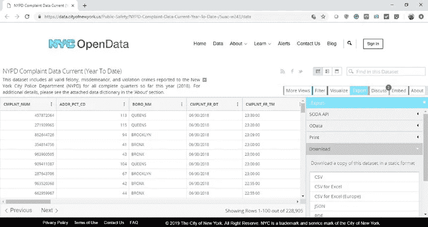
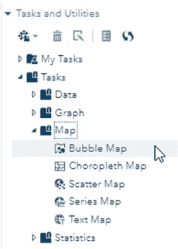
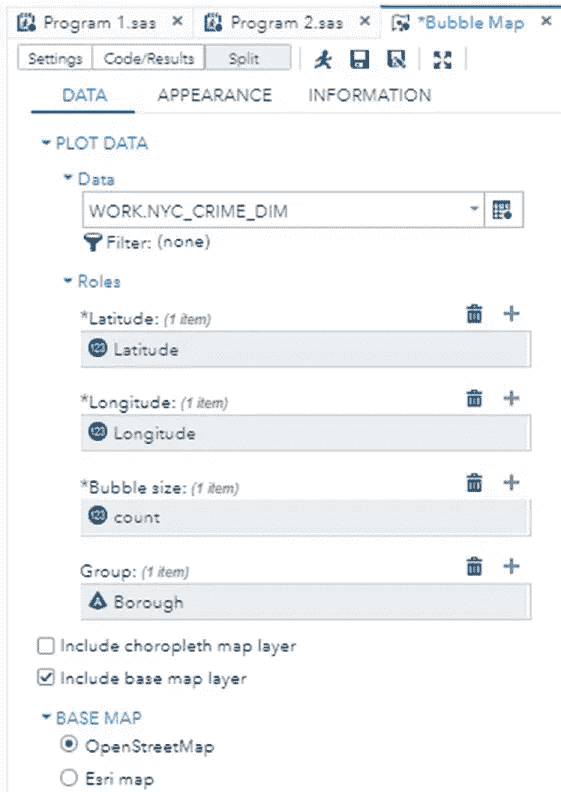
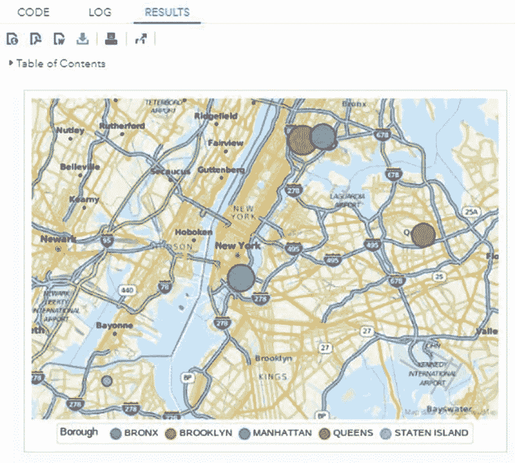
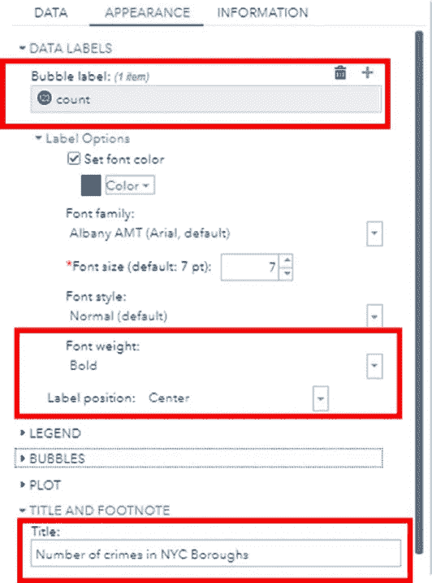
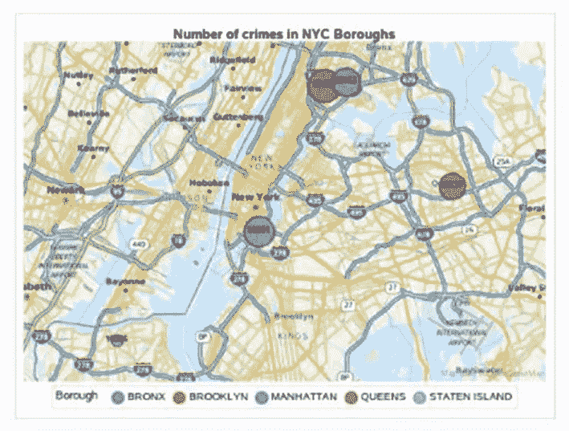
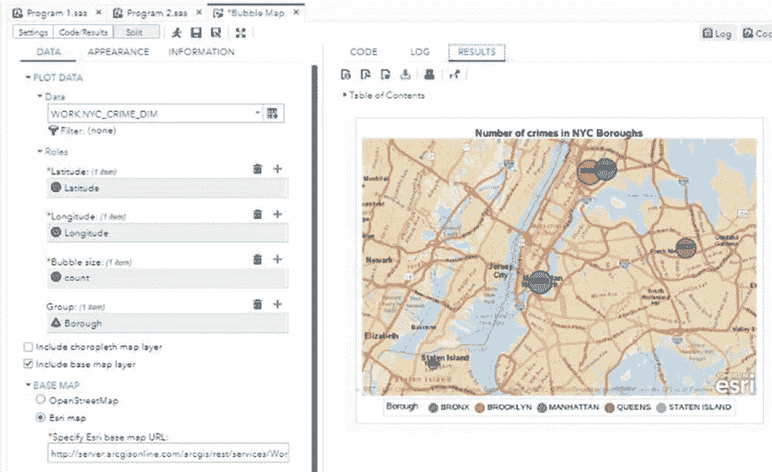

# 如何使用 SAS Studio 轻松地在地图上叠加数据

> 原文：<https://towardsdatascience.com/how-to-overlay-data-on-maps-easily-using-sas-studio-3b85de998e5e?source=collection_archive---------29----------------------->

## SAS Studio 中的地图非常简单

# 动机

每年，我的许多朋友都会问我最安全的纽约区，在那里他们可以为他们的孩子租一个地方。许多学生来纽约参加暑期培训或工作。我住在纽约，但不是纽约市。因此，我总是去寻找数据来回答这个问题，并在我的书《使用 SAS Studio[学习数据科学》中添加了这个过程，该书于 2020 年由 Apress 出版。](https://amzn.to/3lh00JU)

# **地图**

在地图上显示数据增加了新的视角。它可以自己讲述整个故事。SAS Studio 使在地图上显示数据变得容易。此外，使用颜色和气泡自定义地图会为您的数据添加新的维度。本节将使用现实生活中的数据引导您完成这一过程。它将逐步向您展示如何下载数据并准备在地图上显示。

# 气泡图

气泡图任务创建一个覆盖有气泡图的地图。对于这个例子，我们将使用纽约市的犯罪数据来创建一个气泡图，显示 2018 年纽约市不同行政区的犯罪率。这些数据可通过纽约市开放数据项目网站获得。

您将在“数据集”文件夹中找到该数据文件；文件命名为 NYPD _ 投诉 _ 数据 _ 当前 _ _ 年度 _ 截止日期. csv，或者，您可以从以下网址下载数据集:[https://Data . cityofnewyork . us/Public-Safety/NYPD-投诉-数据-当前年度至今-/5uac-w243/data](https://data.cityofnewyork.us/Public-Safety/NYPD-Complaint-Data-Current-Year-To-Date-/5uac-w243/data) [1]。

要从链接下载数据集，如图 1 所示，单击 Export，然后单击 CSV。



图 1:符合 NYPD 标准的数据——NYC open Data(图片由作者提供)

数据集包含大量信息。利用这些数据可以进行大量的调查和分析。例如，每个区最普遍的犯罪类型是什么？犯罪最有可能发生的时间是什么时候？大多数犯罪发生在一周的哪一天？

对于这个例子，我们只对回答哪个区的犯罪率最高和哪个区的犯罪率最低感兴趣。要回答这个问题，我们需要以下三列:行政区、经度和纬度。因此，我们删除了所有其他列。然后，我们计算每个区的犯罪数量，用地图上的气泡来表示。

在清理和准备数据之后，我们得到了下表所示的数据集。

## 表:每个区的犯罪数量

行政区|犯罪数量|纬度|经度

布朗克斯| 50153 | 40.82452 | -73.8978

布鲁克林| 67489 | 40.82166 | -73.9189

曼哈顿| 56691 | 40.71332 | -73.9829

皇后区| 44137 | 40.74701 | -73.7936

斯塔滕岛| 10285 | 40.63204 | -74.1222

为了加载数据，我们在 SAS Studio 中编写清单 1。

## 清单 1:为每个区的犯罪数量创建数据集

```
data NYC_crime;
input Borough $13.;
datalines;
BRONX
BROOKLYN
MANHATTAN
QUEENS
STATEN ISLAND
;
run;data NYC_crime_dim;
set nyc_crime;
input count Latitude Longitude;
datalines;
50153 40.82451851 -73.897849
67489 40.82166423 -73.91885603
56691 40.71332365 -73.98288902
44137 40.74701026 -73.79358825
10285 40.63203653 -74.1222402
;
run;
```

在这个程序中，我们没有导入原始数据文件。我们在数据步骤中使用 DATALINES 关键字将表的值插入到代码中。在清单 1 中，我们有两个数据步骤。第一个叫 NYC_crime。第二行使用 INPUT 语句指定列的名称和类型。在这个表中，我们只定义了一列作为区名，它的类型是 character，因为我们使用了$。最大字符数为 13。然后，我们使用 DATALINES 语句插入实际值，并以分号结束。

第二个数据步骤创建另一个名为 NYC_crime_dim 的表，在每个表中插入行政区的维度和犯罪数量。该表由前面的表 nyc_crime 使用 SET 语句初始化。同样，我们使用 INPUT 语句来指定我们应该向 borough 中再添加三列。我们添加计数、纬度和经度。记住在列名之间留一个空格，不要使用逗号。同样，使用数据行插入实际值，并以分号结束。

运行清单 1 后，将在工作库中创建两个名为 NYC_crime 和 NYC_crime_dim 的新表。要查看输出表，请单击库➤工作；在它下面，你会找到 NYC_crime 和 NYC_crime_dim。如果没有，请刷新您的库。

现在，点击任务和工具➤任务➤地图➤气泡图，如图 2 所示。



图 2:创建气泡图(图片由作者提供)

如图 2 所示，选择数据集工作。数据字段中的 NYC_CRIME_DIM。在角色中，选择纬度和经度。在气泡大小中，选择计数，即犯罪的数量。最后，在“组”中，选择“区”列。



图 3:每个区的犯罪数量(图片由作者提供)

对于基本地图，选择 OpenStreetMap。在本章的后面，我们将尝试 Esri maps 来查看输出中的差异。保留其余的默认值，然后单击 Run。将显示图 4 中的气泡图。



图 4:每个区的犯罪数量(图片由作者提供)

从泡沫大小可以清楚地看出，布鲁克林的犯罪率最高，而斯塔滕岛的犯罪率最低。SAS Studio 会自动调整气泡的位置、大小和颜色。此外，它还在地图底部添加了一个图例，用于表示行政区的颜色代码。

现在，让我们增强气泡图的外观。我们可以给带有犯罪数量的气泡添加一个标签，并给地图添加一个标题。如图 5 所示，在 Appearance 选项卡的 Data Labels 中，从 Bubble label 的数据集中选择 count 列。然后，在“标签选项”中，选择“粗体”作为“字体粗细”。在标签位置，选择“居中”。最后，在标题和脚注中，输入“纽约市行政区的犯罪数量”



图 5:增强外观(图片由作者提供)

单击运行以检查新的更改。输出如图 6 所示。



图 6:纽约市各区的犯罪数量(图片由作者提供)

清单 2 显示了 SAS Studio 通过用户界面从我们的选项中自动生成的代码。

## 清单 2:为每个区的犯罪数量创建数据集

```
ods graphics / reset width=6.4in height=4.8in;
proc sgmap plotdata=WORK.NYC_CRIME_DIM;
openstreetmap;
title ‘Number of crimes in NYC Boroughs’;
bubble x=Longitude y=Latitude size=count/ group=Borough datalabel=count
datalabelpos=center
datalabelattrs = (color=CX0f0e0e size=7pt weight=bold)
name=”bubblePlot”;
keylegend “bubblePlot” / title = ‘Borough’ ;
run;
ods graphics / reset;
title;
```

SAS Studio 功能强大，因为它提供了两种类型的底图:OpenStreetMap 和 Esri maps。现在，让我们尝试另一种底图类型。如图 3–48 所示，返回数据选项卡，选择 Esri maps，然后单击运行。输出图如图 7 所示。



图 7:使用 Esri maps 的地图(图片由作者提供)

SAS Studio 将为这个 Esri 地图选项生成清单 3 中的代码。

## 清单 3:使用 Esri Map 生成地图

```
ods graphics / reset width=6.4in height=4.8in;
proc sgmap plotdata=WORK.NYC_CRIME_DIM;
esrimap url= ‘http://server.arcgisonline.com/arcgis/rest/services/
World_Street_Map/MapServer’;
title ‘Number of crimes in NYC Boroughs’;
bubble x=Longitude y=Latitude size=count / group=Borough
datalabel=count datalabelpos=center
datalabelattrs=(color=CX0f0e0e size=7pt weight=bold)
name=”bubblePlot”;
keylegend “bubblePlot” / title =’Borough’;
run;
ods graphics / reset;
title;
```

# 结论

如您所见，通过输入 SAS studio clean 数据集，您可以在地图上叠加数据，而无需编写任何代码。事实上，SAS Studio 会生成代码供您编辑，这太棒了。如果你试图用其他编程语言来完成同样的任务，那将会令人望而生畏。我强烈推荐数据科学新手使用 SAS Studio。

# 参考

[1] NYPD 投诉数据当前，[https://Data . cityofnewyork . us/Public-Safety/NYPD-Complaint-Data-Current-Year-Date-/5uac-w243/Data](https://data.cityofnewyork.us/Public-Safety/NYPD-Complaint-Data-Current-Year-To-Date-/5uac-w243/data)，NYC 开放数据项目。(条款:【https://www1.nyc.gov/home/terms-of-use.page】T2)