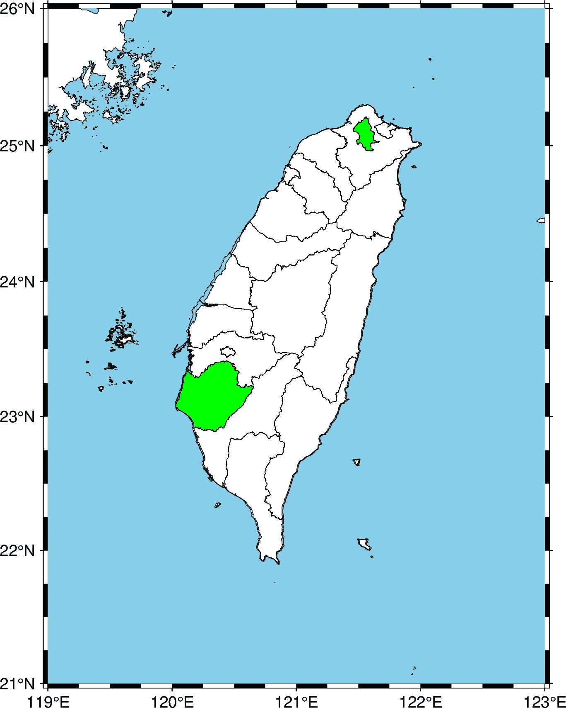
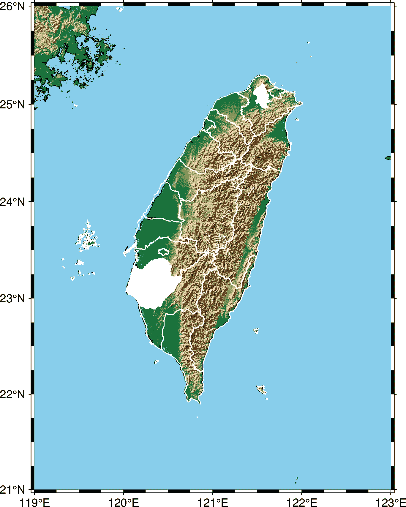

# 如何在高分辨率地图上叠加多边形形状

> 原文：<https://towardsdatascience.com/how-to-overlay-shapefile-data-on-pygmt-maps-3a2d84550780?source=collection_archive---------13----------------------->

## 我们将学习如何在 PyGMT 地图上使用 geopandas 绘制选定的 shapefile 数据。

Python 中的 PyGMT 库使绘制高分辨率地形图变得轻而易举。它带有海岸线、国界和地形数据。通常，我们需要使用可用的 shapefile (SHP)数据在地图上高亮显示任意选择的多边形形状或区域。

<https://www.earthinversion.com/utilities/pygmt-high-resolution-topographic-map-in-python/>  

安德鲁·斯图特斯曼在 [Unsplash](https://unsplash.com?utm_source=medium&utm_medium=referral) 上的照片

在本帖中，我们将看到如何使用 geopandas 库将 shapefile 数据叠加在 PyGMT 地图上。例如，在这里，我获得了。来自[data.gov.tw](https://data.gov.tw/dataset/7442)的 shp 格式，并叠加在台湾的高分辨率地图上。

# 导入库

我们将使用 geopandas 库来读取。shp 文件。

```
import pygmt
import os
import geopandas as gpd
```

# 县`shp`数据

我从各县下载了`shp`数据，并将其保存在`countiesData`的工作目录中。`countiesData`中有多个文件，但我们只需要`COUNTY_MOI_1090820.shp`文件。其他的都是相关的扩展文件。

我们选择了两个县在地图上突出显示——台北市和台南市。

```
countiesShp = os.path.join("countiesData","COUNTY_MOI_1090820.shp")gdf = gpd.read_file(countiesShp)all_data = []
all_data.append(gdf[gdf["COUNTYENG"]=="Taipei City"])
all_data.append(gdf[gdf["COUNTYENG"]=="Tainan City"])
```

# 使用 PyGMT 绘制底图

现在，我们可以使用 PyGMT 绘制简单的底图。使用 PyGMT 的好处是我们不需要单独的海岸线和地形数据，并且输出是高分辨率的。

```
region = [119, 123, 21, 26]fig = pygmt.Figure()
fig.basemap(region=region, projection="M4i", frame=True)fig.coast( 
    water='skyblue', 
    shorelines=True)
```

# 覆盖各县

现在，我们可以覆盖所选的县，用绿色填充它们，然后用背景色(白色)填充所有其他的县。

```
for data_shp in all_data:
    fig.plot(data=data_shp,color="green")
fig.plot(data=countiesShp)
```

# 以栅格和矢量格式保存地图

现在，我们可以保存地图的光栅和矢量格式供以后使用。

```
fig.savefig('map1.png')
fig.savefig('map1.pdf')
```



简单的台湾县地图(图片由作者提供)

# 地形图

我们可以使用地形背景，而不是使用简单的白色作为背景(顺便说一句，我觉得这看起来很不错):

```
import pygmt
import os
import geopandas as gpdcountiesShp = os.path.join("countiesData","COUNTY_MOI_1090820.shp")gdf = gpd.read_file(countiesShp)all_data = []
all_data.append(gdf[gdf["COUNTYENG"]=="Taipei City"])
all_data.append(gdf[gdf["COUNTYENG"]=="Tainan City"])region = [119, 123, 21, 26]fig = pygmt.Figure()
fig.basemap(region=region, projection="M4i", frame=True)
fig.grdimage("[@srtm_relief_03s](http://twitter.com/srtm_relief_03s)", shading=True, cmap='geo')fig.coast( 
    water='skyblue', 
    shorelines=True)for data_shp in all_data:
    fig.plot(data=data_shp,color="white", pen=["0.02c", 'white'])
fig.plot(data=countiesShp, pen=["0.02c", 'white'])fig.savefig('map1.png')
fig.savefig('map1.pdf')
```



台湾各县地形图(图片由作者提供)

# 结论

我们已经看到了如何轻松地将 shapefile 数据添加到 PyGMT 地图上。我们在台湾的底图上绘制了各县的数据。此外，我们创建了一个覆盖了 shapefile 数据的高分辨率地形图。

<https://www.earthinversion.com/utilities/how-to-overlay-shapefiles-on-pygmt-maps/>  

*原载于 2021 年 7 月 17 日*[*【https://www.earthinversion.com】*](https://www.earthinversion.com/utilities/how-to-overlay-shapefiles-on-pygmt-maps/)*。*