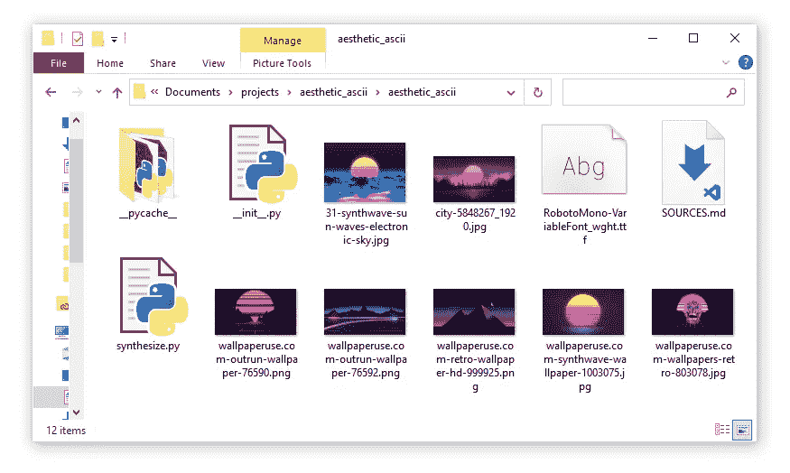
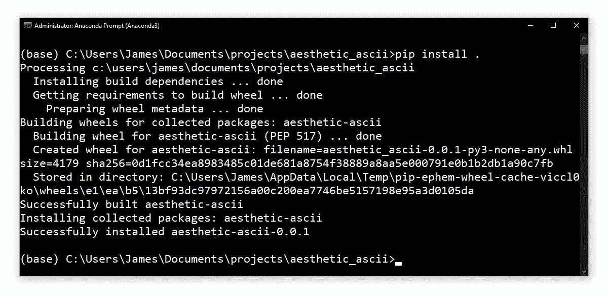
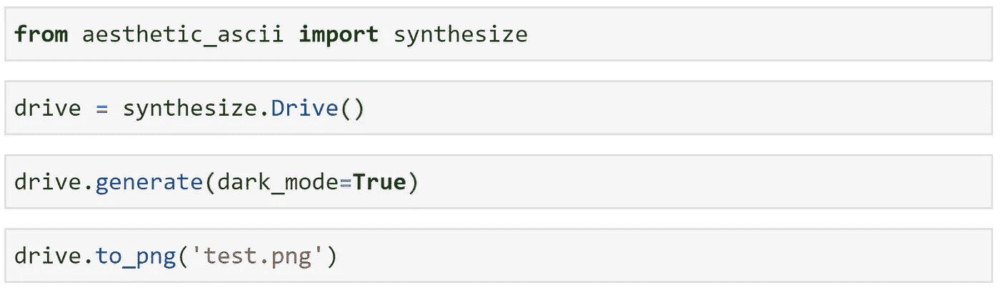
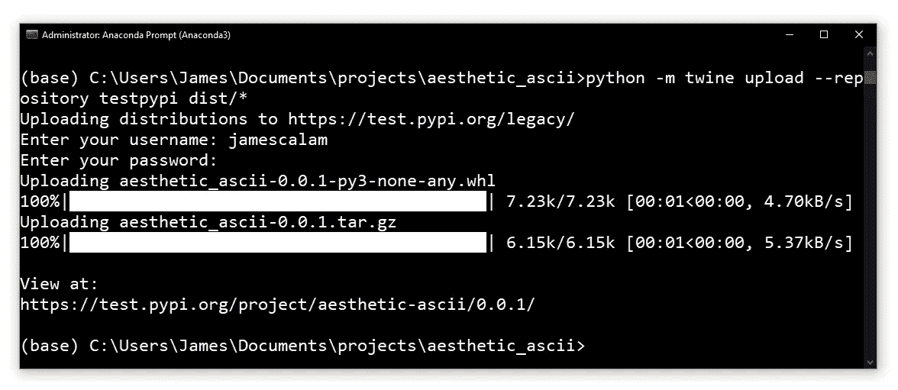
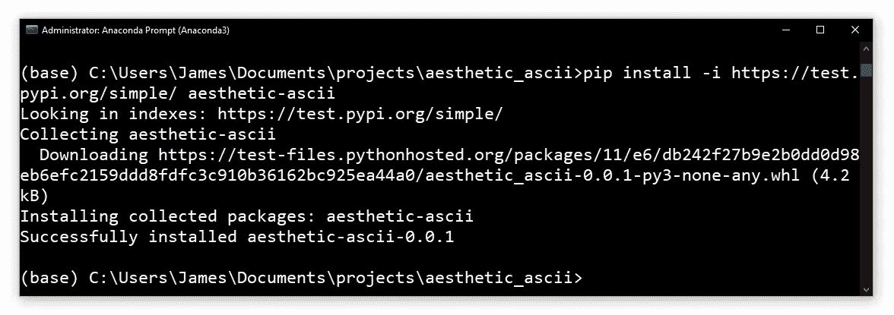
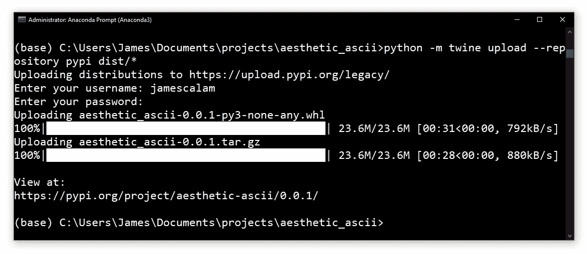
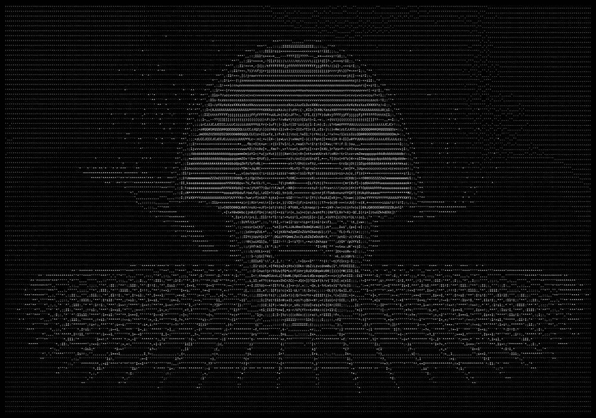
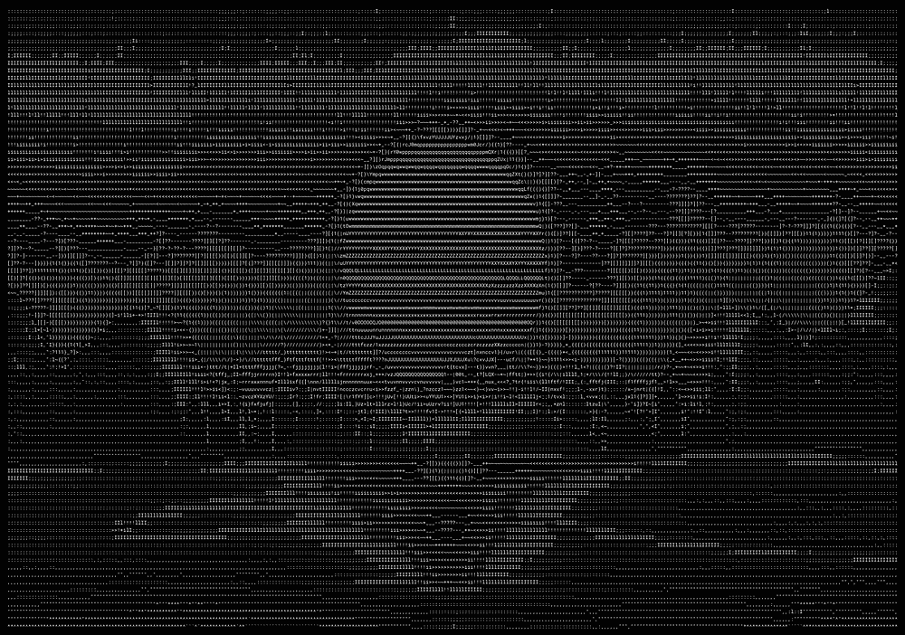
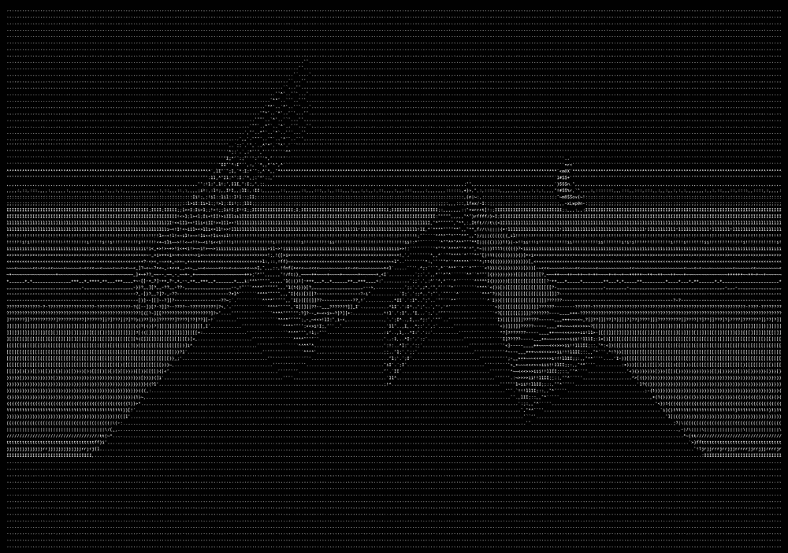

# 如何打包您的 Python 代码

> 原文：<https://towardsdatascience.com/how-to-package-your-python-code-df5a7739ab2e?source=collection_archive---------0----------------------->

## 了解 Python 代码应该如何为 PyPI 打包


[不法分子在](https://unsplash.com/@lawlesscapture?utm_source=medium&utm_medium=referral) [Unsplash](https://unsplash.com?utm_source=medium&utm_medium=referral) 上抓拍的照片

Python 最强大的特性是它的社区。几乎每个用例都有一个专门为它构建的包。

需要发送手机/电子邮件提醒？`pip install knockknock` —构建 ML 应用？`pip install streamlit` —厌倦了你的终端？`pip install colorama`——太简单了！

我知道这是显而易见的，但那些库并没有神奇地出现。对于每一个包，都有一个人，或者许多人，积极地开发和部署这个包。

每一个都是。

全部 30 万以上。

这就是 Python 之所以是 Python 的原因，它的支持程度是惊人的— *令人兴奋*。

在本文中，我们将学习如何构建我们自己的包。并将它们添加到 Python 包索引(PyPI)中。之后，我们将能够使用`pip install`来安装我们的软件包！让我们开始吧。

# 建什么？

第一步是弄清楚我们应该建造什么。一旦我们有了想法，就去 PyPI 搜索相同的包，它存在吗？如果是的话，你的想法有什么新的或更好的吗？

一旦我们得到了一些独特的东西，我们需要再次检查我们的包名是否已经被占用。

在本文中，我们将构建一个名为`aesthetic_ascii`的包——它将产生随机的受 synthwave 启发的 ASCII 艺术。这是一个相当独特的想法，尽管可能不太*有用。*

# 目录设置

我们需要创建一个新的目录来包含我们的包，并作为我们的包名( *aesthetic_ascii* )。

在这个目录中，我们有我们的`__init__.py`文件，它将我们的目录初始化为一个 Python 模块——并成为该模块的顶层脚本。

我们可以通过在包目录中添加子目录并在这些子目录中添加`__init__.py`文件来添加子模块。

比如我们知道可以写`from os import path`。其目录结构如下所示:

```
os/
    LICENSE
    MANIFEST.in
    pyproject.toml
    README.md
    setup.cfg
    ...
    os/
        __init__.py
        ...
        path/
            __init.py__
            ...
```

我们很快会谈到这里的其他文件。但首先，我们需要了解`__init__.py`实际上在做什么。

## __init__。巴拉圭

在其核心`__init__.py`，将一个目录标记为一个 Python 包。因此，我们包含了顶层的`__init__.py`文件，它将目录标记为我们的“包”。

然后我们将实际的代码文件(或*模块*)放在我们的`__init__.py`文件旁边。所以，如果我们有这样的结构:

```
**aesthetic_ascii/**
    *all config files*
 **aesthetic_ascii/**
        __init__.py
        synthesize.py
```

安装包后，我们将像这样导入`synthesize`模块:

```
from aesthetic_ascii import synthesize
```

我们将在整篇文章中使用这种结构。

# 配置文件

## setup.cfg

除了代码文件，我们还需要几个配置文件。配置我们的包最重要的是`setup.cfg`文件。

这个文件很关键，它是我们的*设置配置*文件。在`pip install`期间，这个文件告诉 *pip* 如何安装我们的包。

为了声明我们正在使用 **setuptools** 来打包我们的项目，我们首先在我们的顶层目录中创建一个`pyproject.toml`文件，包含:

然后我们创建我们的`setup.cfg`文件。对于*审美 _ascii* ，看起来是这样的:

这里发生了很多事情，但是每一项都很有描述性，所以我不会一一描述，但是有几项不太清楚。

*   **long_description** —参数名告诉我们这是什么，我们可以在这里提供不同的文件格式。尽管许多软件包坚持降价，这也是我们将要使用的——正如**long _ description _ content _ type**中所指定的。
*   **分类器**——PyPI 将用来对我们的包进行分类的一组标识符，我们可以在这里找到有效分类器的完整列表[。](https://pypi.org/classifiers/)
*   **包** —我们的包运行所需的依赖包列表。
*   **python_requires** —对库的 python 版本要求。
*   **include _ package _ data**——是否包含`MANIFEST.in`中定义的附加文件——稍后将详细介绍。

## 许可证

接下来是我们的许可证，这是软件包中非常重要的一部分——即使你不关心谁在使用它，他们为什么使用它，以及他们是否从中赚钱。

我们包含了一个许可证来消除软件包用户的任何疑虑。选择许可证非常简单，只需从[这里](https://choosealicense.com/)复制并粘贴最合适的文本即可——并且记得更新任何自定义部分！

## README.md

这个文件充当我们的包的`long_description`——我们在`setup.cfg`文件中设置了这个包。

此外，回到我们的`setup.cfg`——我们在`long_description_content_type`中指定了我们将使用一个`text/markdown`文件——因此，我们使用一个降价文本文件！

# 添加资源

我们已经设置了配置文件，但是我们缺少一样东西——我们的图像将在生成随机 ASCII 图片时使用。

这些图像可以是我们的包所依赖的任何类型的文件。从 Python 3.7 开始，我们通过使用`importlib.resources`模块来处理这个问题。

首先，我们需要将它导入到我们的代码中，并更新读取这些文件的代码部分，以使用`importlib.resources`:

这两个函数的第一个参数指的是存储文件的目录。此外，任何资源**必须**存储在包含`__init__.py`文件的目录中。

因此，在我们的例子中，我们需要将所有图像文件存储在`aesthetic_ascii` **子目录**中:



**审美 _ ascii/审美 _ascii** 目录包括我们所有的图像文件和字体文件，以及 **__init__。py** 和**synthese . py**模块

一旦一切就绪，我们必须确保我们的图像文件将包含在包中——我们通过`MANIFEST.in`文件来完成:

然后我们确保`MANIFEST.in`文件被添加到`setup.cfg`:

```
...
[options]
include_package_data = True
...
```

我们准备好了！

# 本地安装

在将我们的包上传到 PyPI 之前，我们可以确认我们的包可以通过`pip install`安装，方法是导航到我们的包目录并输入:

```
pip install .
```

这应该会像通过`pip`安装任何其他软件包一样安装我们的软件包:



本地 **pip 安装的屏幕截图。**测试

然后，我们可以像对待任何其他产品一样`import`包装我们的产品:



现已安装的 **aesthetic_ascii** 包的用法示例

# 建设

一旦我们编写了代码文件、设置了配置并测试了安装——我们就准备好构建我们的包发行版了。

构建过程创建了一个新目录`dist`，其中包含一个`.tar.gz`和`.whl`文件——这是我们将包发布到 PyPI 所需要的。

为了构建我们的`dist`文件，我们创造性地使用了一个名为`build`的工具。首先，我们`pip install build`，然后，在我们的包目录中键入:

```
python -m build
```

一旦完成，我们应该在我们的包目录中找到一个新的`/dist`目录。

## 发布到 TestPyPI

最后，我们准备好发布我们的新 Python 包了！同样，我们使用另一个名为`twine`的包。我们安装该软件时使用了:

```
pip install twine
```

安装完成后，我们上传到*TestPyPI*——一个 PyPI 的“测试”版本，这样我们可以再次检查我们是否已经正确设置了所有内容。我们通过键入以下命令来实现:

```
python -m twine upload --repository testpypi dist/*
```

此时，我们需要登录 TestPyPI——如果您没有帐户，请在这里注册一个。如果一切设置正确，我们的包将被上传:



测试 PyPI 上**审美 _ascii** 的成功上传过程

现在，我们可以通过另一个`pip install`来测试我们的新包是否工作——但是这次是通过 TestPyPI:

```
pip install -i https://test.pypi.org/simple/ aesthetic-ascii
```

(如果发现包已经安装好了——就`pip uninstall aesthetic-ascii`)。



通过 TestPyPI 安装**美学-ascii**

## PyPI

一旦我们确认这个包可以工作，我们就要进行最后一步，发布到 PyPI。同样，你需要在这里注册。

接下来，我们将我们的包上传到 PyPI，包含:

```
python -m twine upload --repository pypi dist/*
```



上传我们的包到 PyPI

我们完事了。

这是我们的第一个 Python 包部署——出乎意料的简单。我们可以继续和`pip install aesthetic_ascii`使用这个包。



我们的一些 ascii 杰作

包括设置/配置文件的完整代码可以在 GitHub [这里](https://github.com/jamescalam/aesthetic_ascii)找到。

我希望你喜欢这篇文章。如果你有任何问题或建议，请通过推特或在下面的评论中告诉我。如果你对更多类似的内容感兴趣，我也会在 [YouTube](https://www.youtube.com/c/jamesbriggs) 上发布。

感谢阅读！

# 进一步阅读

[如何打包你的 Python 代码](https://python-packaging.readthedocs.io/en/latest/index.html)，Python 打包

[打包项目](/*All images are by the author except where stated otherwise)，Python 打包

风筝，[把任何图像变成 ASCII 艺术！(易 Python PIL 教程)](https://www.youtube.com/watch?v=v_raWlX7tZY)，YouTube

页（page 的缩写）伯克，[灰度图像的字符表示](http://paulbourke.net/dataformats/asciiart/) (1997)，paulbourke.net

[🤖《变形金刚》NLP 课程 70%的折扣](https://bit.ly/nlp-transformers)

**除另有说明外，所有图片均出自作者之手*