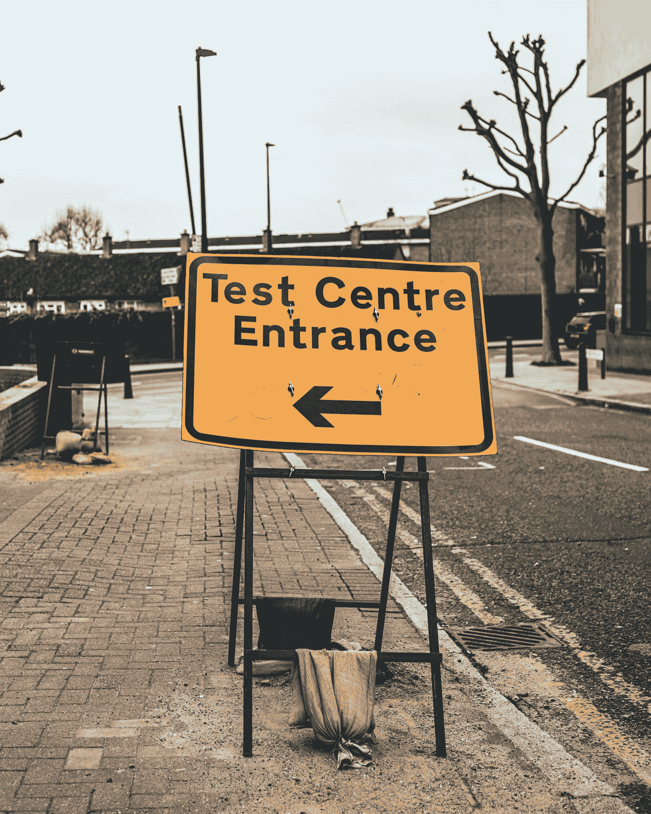
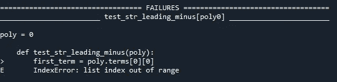

# 如何使用 Pytest 参数化 Python 测试

> 原文：<https://towardsdatascience.com/how-to-parameterize-python-tests-using-pytest-e8800bf288c5?source=collection_archive---------2----------------------->

## 向夹具和测试函数传递参数

Joshua Lawrence 在 [Unsplash](https://unsplash.com?utm_source=medium&utm_medium=referral) 上拍摄的照片

**给不耐烦的人:**

1.  [如何对 Pytest 夹具进行参数化](#6a5b)
2.  [如何使用 Pytest 对测试函数进行参数化](#803a)

# 介绍

软件开发的一个固有挑战是随着功能和范围的增长，保持对代码库的控制。一个软件变得越复杂，这种复杂性失控的威胁就越大。

自动化测试套件可以帮助开发人员处理这种复杂性。随着代码库的增长、发展和成熟，测试套件也在增长、发展和成熟，但是如何确保测试本身也是可管理的呢？

对 python 开发人员来说幸运的是，pytest 提供了重用测试函数和作为测试例程的一部分创建的对象的机制，这有助于保持所有测试逻辑的组织性和可维护性。

# **激励的例子**

我正在开发一个实现单变量多项式的类，这是一个项和的数学表达式，其中每一项都是一个常数乘以变量的非负幂。

举个例子，

**4x - 2x**

是一个多项式表达式。这个多项式可以被建模为一个列表，其中每个元素是一个项，每个项本身是一个具有系数和指数的列表。上述多项式可以用以下方式建模:

**[[4，3]，[-2，1]]**

使用我的多项式类，我可以通过以下方式创建相应的多项式对象:

随着多项式类功能的增加，我需要测试它。多项式的一个特征是指数是非负整数，所以我将编写一个测试来检查指数是否满足该条件。多项式的导数也是多项式，所以我也应该检查那些指数。此外，如果指数最大的系数是负的，那么我的多项式的字符串表示必须有一个前导负号，所以需要检查一下。

现在对于以上的 poly，我有 3 个测试:

1.  所有指数都是非负整数吗？
2.  导数的所有指数都是非负整数吗？
3.  如果指数最高的项的系数为负，字符串表示是否有前导负号？

这里有一种非常直接的方式来编写这些测试:

这让我可以用那些特定的项来测试多项式对象的功能，但是如果我想用不同的项来测试一个多项式，那么我必须编写一个新的测试。

这可能适用于极少数的对象和边缘案例，但是随着更多的对象需要测试，每个对象需要检查更多的测试案例，它将很快变得势不可挡。

# **如何使用 Pytest 夹具**

Fixtures 是返回可以被多个测试访问的对象的函数。在 fixture 函数上方用@pytest.fixture() decorator 声明一个 fixture。然后，将 fixture 函数名作为一个参数放入测试函数的定义中，测试函数现在可以使用 fixture，而无需显式实例化它返回的对象。使用 fixture，我可以如下重构我的测试:

现在，我想添加的任何测试函数都可以访问同一个多项式，测试本身只有测试所需的逻辑。理所应当！

不幸的是，我认为我定义的单个多项式不足以真正测试我的字符串表示。它甚至不需要前导负号。我可以添加另一个装置，但是我必须为每个装置添加测试:

# 如何参数化 Pytest 夹具

@pytest.fixture decorator 允许您向 fixture 传递一个参数列表。对于每一个请求这个 fixture 的测试，这个测试会为这个 fixture 的每一个参数化版本运行一次。例如:

现在，我可以简单地向 TERMS_LIST 添加额外的多项式项列表，每个请求 poly fixture 的测试将使用 TERMS_LIST 中每组项的多项式对象运行一次。

如果测试失败，pytest 将让您知道哪些参数导致了失败的测试:

上面的“test_str_leading_minus[poly0]”指的是 TERMS_LIST 中参数在 0 索引处的 poly fixture。

# **另一个激励的例子**

正如我上面写的，多项式必须有非负指数。当我为我的多项式类实现接口时，我决定如果一个多项式试图用无效的指数创建，我要抛出一个异常。我可以尝试创建一个带有无效术语列表的参数化 fixture，

但这是行不通的！fixture 将尝试创建一个新的多项式对象，如果希望接口引发异常，那么任何引用该 fixture 的测试都不会完成。测试会因为异常而失败，但是失败是预期的结果，所以测试应该通过。那我该怎么办呢？

# **如何使用 Pytest 对测试函数进行参数化**

@ py test . mark . parameterize()decorator 允许您独立于您创建的 fixtures 来参数化测试函数的参数。现在，我可以传递一个无效参数列表，并使用 pytest.raises(AssertionError)断言无效术语会导致预期的异常。

现在，只有当无效术语在对象初始化期间导致断言错误时，测试才会通过。此外，如果有我想定义为无效的其他术语列表，我可以简单地将它们添加到 INVALID_TERMS_LIST 中，而无需编写另一个测试。

# 摘要

您可以在 fixture decorator 中使用 params 关键字参数将参数传递给 fixture，也可以使用@ py test . mark . parameter ize decorator 将参数传递给单独测试的测试。

编码快乐！