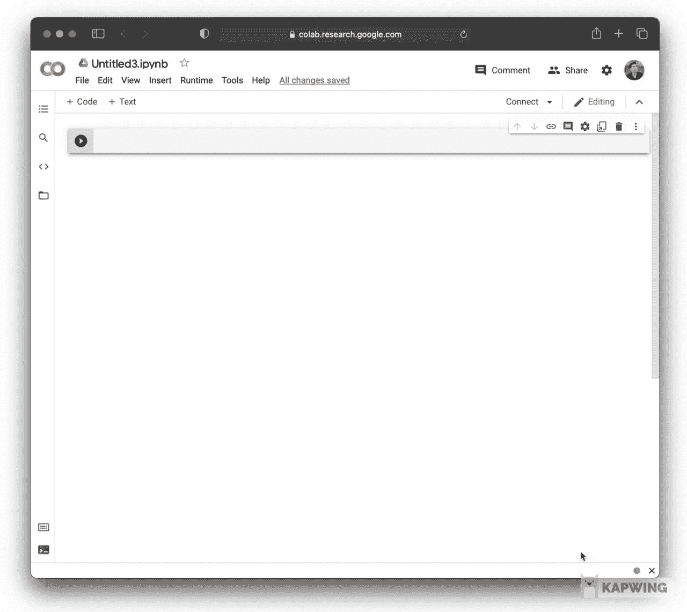
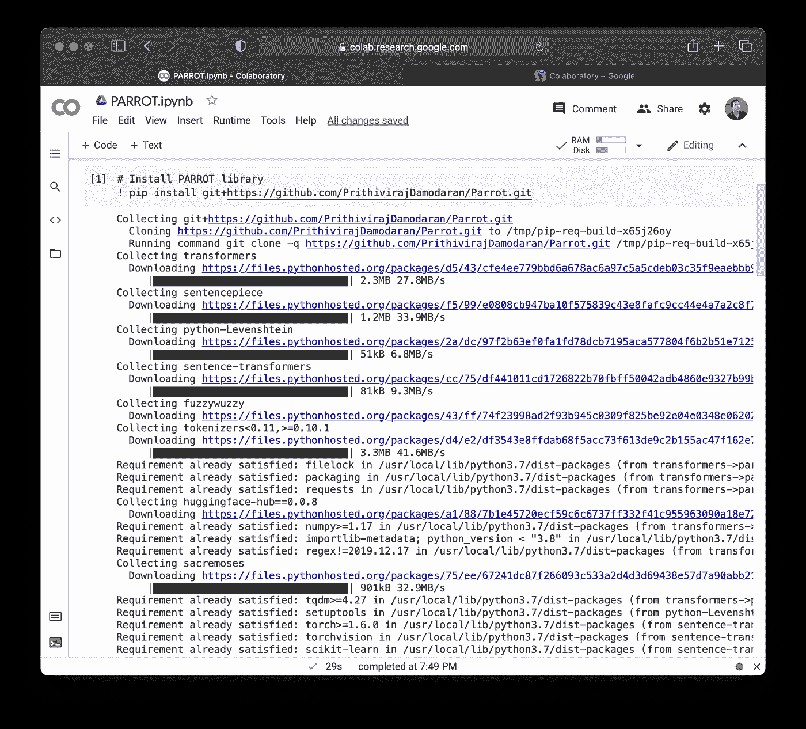
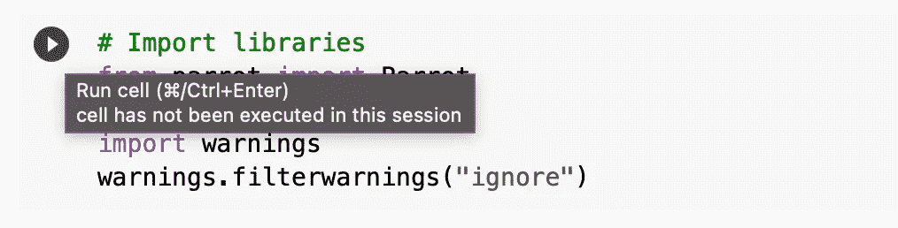
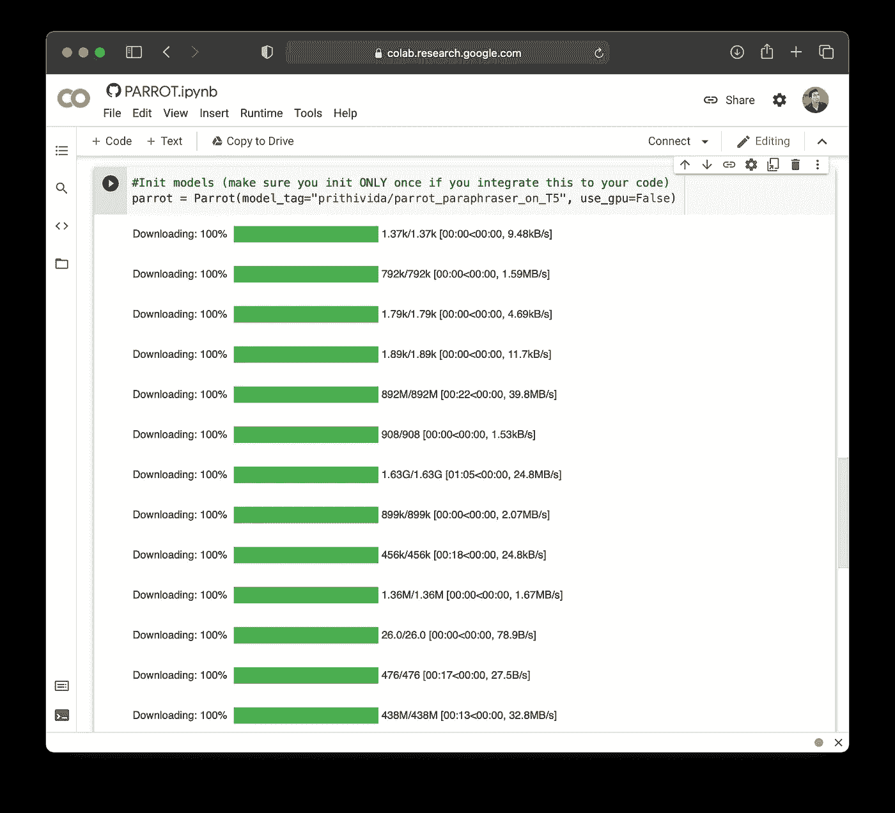
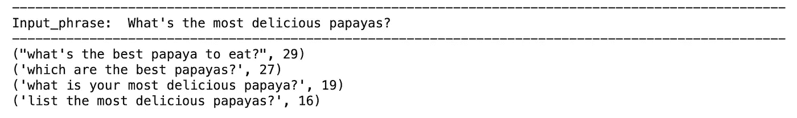

# 如何使用 Python 解释文本

> 原文：<https://towardsdatascience.com/how-to-paraphrase-text-using-python-73b40a8b7e66?source=collection_archive---------5----------------------->


由 [envato elements](https://1.envato.market/c/2346717/628379/4662) 的 [alexdndz](https://elements.envato.com/user/alexdndz) 使用图像创建(经许可)。

## [数据科学](https://medium.com/tag/data-science) | [机器学习](https://medium.com/tag/machine-learning)

## 使用人工智能进行内容创作的循序渐进教程

作为作家，我们经常寻找工具来帮助我们变得更有效率或更有成果。Grammarly 之类的工具可以帮助语言编辑。文本生成工具可以帮助快速生成原始内容，只需给人工智能一些关键字想法即可。

也许这可以帮助结束作家的阻滞？这是一个有争议的问题，最好留待以后解决。

转述内容也是另一种获取现有内容(无论是你自己的还是别人的)并加入你自己观点的好方法。如果我们可以自动解释文本，那不是很好吗？

在本文中，您将学习如何使用[***PARROT***](https://github.com/PrithivirajDamodaran/Parrot)库在 Python 中免费套用文本。特别是，在引擎盖下，PARROT 的解释技术基于 T5 算法([文本到文本转换转换器](https://github.com/google-research/text-to-text-transfer-transformer)的首字母缩写)，该算法最初由 Google 开发(有关更多信息，请参考代码为的论文中的 [T5 资源)。在高层次上，文本生成是自然语言处理(NLP)令人兴奋的领域的利基领域，当向普通观众解释时，通常被称为人工智能或 AI。](https://paperswithcode.com/method/t5)

需要注意的是，一个附带的 YouTube 视频( [*如何使用 PARROT 库套用 Python 中的文本(Ft。*肯吉)](https://youtu.be/C6gBcL9sAIw))此文如下所示。

[如何使用 PARROT 库(Ft。肯吉)](https://youtu.be/C6gBcL9sAIw)

# 1.推出 Google Colab 笔记本电脑

我们将使用 Google Colab 在云上执行文本解释，这是 Jupyter 笔记本的在线版本，允许您在云上运行 Python 代码。如果你是 Google Colab 的新手，你会想在[入门笔记本](https://colab.research.google.com/notebooks/intro.ipynb)中温习一下基础知识。

1.  登录你的 Gmail 账户，然后进入 [**Google Colab**](https://colab.research.google.com/) 。
2.  首先转到`File > Open Notebook`，然后点击`Upload`选项卡(最右边)，启动教程笔记本。
3.  在搜索框中输入`dataprofessor/parrot`
4.  点击`parrot.ipynb`文件



加载鹦鹉教程笔记本截图。

# 2.安装 PARROT 库

PARROT 库可以通过 pip 安装，方法是在 code 单元格中键入以下内容:

```
! pip install git+[https://github.com/PrithivirajDamodaran/Parrot.git](https://github.com/PrithivirajDamodaran/Parrot.git)
```

库安装需要一点时间。



显示 PARROT Python 库安装的屏幕截图。

# 3.导入库

这里，我们将导入由`parrot`、`torch`和`warnings`组成的 3 个 Python 库。您可以将以下内容键入(或复制粘贴)到代码单元格中，然后通过按下`CTRL + Enter`按钮(Windows 和 Linux)或`CMD + Enter`按钮(Mac OSX)来运行它。或者，也可以通过单击代码单元格左侧的播放按钮来运行代码单元格。

```
from parrot import Parrot
import torch
import warnings
warnings.filterwarnings("ignore")
```



允许代码单元运行的 play 按钮的屏幕截图。

`parrot`库包含预训练的文本解释模型，我们将使用它来执行解释任务。

在引擎盖下，预先训练的文本解释模型是使用 PyTorch ( `torch`)创建的，因此我们在这里导入它以便运行该模型。这款机型名为`[parrot_paraphraser_on_T5](https://huggingface.co/prithivida/parrot_paraphraser_on_T5/tree/main)`，在抱脸网站上列出了。需要注意的是，拥抱脸是开发托管`parrot_paraphraser_on_T5`模型的`transformer`库的公司。

正如代码所暗示的，出现的警告将通过`warnings`库被忽略。

# 4.文本释义的再现性

为了允许文本释义的再现性，将设置随机种子号。这样做的目的是对相同的种子号产生相同的结果(即使重新运行多次)。

要为再现性设置随机种子数，请在代码单元格中输入以下代码块:

```
**def** random_state(seed):
  torch.manual_seed(seed)
  **if** torch.cuda.is_available():
    torch.cuda.manual_seed_all(seed)

random_state(1234)
```

# 5.加载文本解释模型

我们现在将加载并初始化 PARROT 模型，方法是在一个代码单元中输入以下内容并运行该单元。

```
parrot = Parrot(model_tag="prithivida/parrot_paraphraser_on_T5", use_gpu=False)
```

模型将按如下所示加载:



初始化模型的屏幕截图。

# 6.输入文本

本例中的输入文本`What’s the most delicious papayas?`将被分配给`phrases`变量，我们一会儿就会用到它。

要找到这个问题的答案，请务必观看随附的 YouTube 视频( [*如何使用 PARROT 库在 Python 中解释文本(Ft。*肯吉)](https://youtu.be/C6gBcL9sAIw))。

```
phrases = ["What's the most delicious papayas?"]
```

# 7.生成释义文本

现在，到了使用 PARROT T5 模型生成释义文本的有趣部分。

## 7.1.代码

将以下代码块输入到代码单元格中，并运行该单元格。

```
for phrase in phrases:
  print("-"*100)
  print("Input_phrase: ", phrase)
  print("-"*100)
  para_phrases = parrot.augment(input_phrase=phrase)
  for para_phrase in para_phrases:
   print(para_phrase)
```

## 7.2.逐行解释

这里，我们将使用一个`for`循环来遍历`phrases`变量中的所有句子(在上面的例子中，我们只给这个变量分配了一个句子或一个短语)。

对于`phrases`变量中的每个`phrase`:

*   打印 100 次`-`字符。
*   打印`"Input phrase: "`，后跟被迭代的`phrase`的返回输出。
*   将`-`字符打印 100 次。
*   使用`parrot.augment()`函数执行解释，该函数将被迭代的`phrase`作为输入参数。生成的释义被分配给`para_phrases`变量。
*   对`para_phrases`变量执行嵌套的`for`循环:
    —打印从`para_phrases`变量返回的重复输出，这些重复已经迭代生成(4 个重复的文本，我们将很快在下一节中看到)。

## 7.3.代码输出

此代码块生成以下输出:



在这里，我们可以看到 PARROT 产生了 4 个释义文本，您可以选择其中的任何一个进行进一步的使用。

# 8.下一步是什么？

恭喜你，你可以成功地使用人工智能产生转述文本！

如果你有兴趣更进一步的话。

这里有一些项目想法，您可以尝试并构建来扩展您自己的项目组合。说到投资组合，你可以从我最近写的这篇文章中免费学习如何建立一个投资组合网站:

[](/how-to-build-a-simple-portfolio-website-for-free-f49327675fd9) [## 如何免费建立一个简单的作品集网站

towardsdatascience.com](/how-to-build-a-simple-portfolio-website-for-free-f49327675fd9) 

## 项目创意 1

创建一个 Colab/Jupyter 笔记本，通过创建一个可以接受多个短语作为输入的版本来扩展这个示例(为单个输入短语生成解释文本)。例如，我们可以将一个由几个短语组成的段落分配给一个输入变量，然后代码使用它来生成解释文本。然后，对于每个短语的返回输出，随机选择单个输出来表示每个短语(即，每个输入短语将相应地具有 1 个释义文本)。把转述的短语组合成一个新段落。比较原始段落和新的转述段落。

## 项目创意 2

使用[***Streamlit***](https://streamlit.io/)(也可以查看 [Streamlit 教程播放列表](https://www.youtube.com/watch?v=ZZ4B0QUHuNc&list=PLtqF5YXg7GLmCvTswG32NqQypOuYkPRUE))或[***PyWebIO***](https://pypi.org/project/pywebio/))将项目想法 1 扩展成一个 web 应用程序。特别是，web 应用程序会将一段短语作为输入，并应用代码来生成释义文本，并将它们作为输出返回到 web 应用程序的主面板中。

## 分享你的创作

我很想看看你的一些作品，所以请随意把它们贴在评论区。快乐创作！

# 信用

本文中使用的代码改编自 Parrot 创建者 Prithiviraj Damodaran 提供的示例。

## [订阅我的邮件列表，获取我在数据科学方面的最佳更新(偶尔还有免费内容)!](http://newsletter.dataprofessor.org/)

# 关于我

我是泰国一所研究型大学的生物信息学副教授和数据挖掘和生物医学信息学负责人。在我下班后的时间里，我是一名 YouTuber(又名[数据教授](http://bit.ly/dataprofessor/))制作关于数据科学的在线视频。在我做的所有教程视频中，我也在 GitHub 上分享 Jupyter 笔记本([数据教授 GitHub 页面](https://github.com/dataprofessor/))。

[](https://www.youtube.com/dataprofessor) [## 数据教授

### 数据科学、机器学习、生物信息学、研究和教学是我的激情所在。数据教授 YouTube…

www.youtube.com](https://www.youtube.com/dataprofessor) 

# 在社交网络上与我联系

YouTube:[【http://YouTube . com/data proper/](http://youtube.com/dataprofessor/)
网站:[【http://data proper . org/](https://www.youtube.com/redirect?redir_token=w4MajL6v6Oi_kOAZNbMprRRJrvJ8MTU5MjI5NjQzN0AxNTkyMjEwMDM3&q=http%3A%2F%2Fdataprofessor.org%2F&event=video_description&v=ZZ4B0QUHuNc)【正在建设】
LinkedIn:[【https://www . LinkedIn . com/company/data proper/](https://www.linkedin.com/company/dataprofessor/)