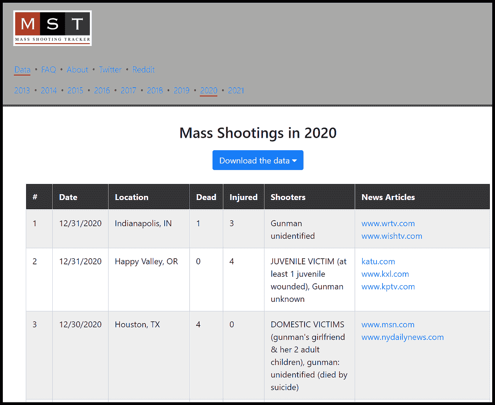
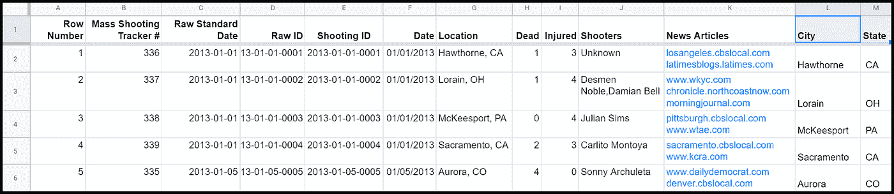
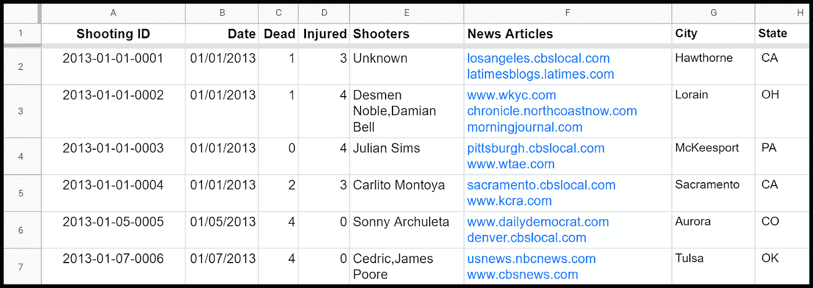
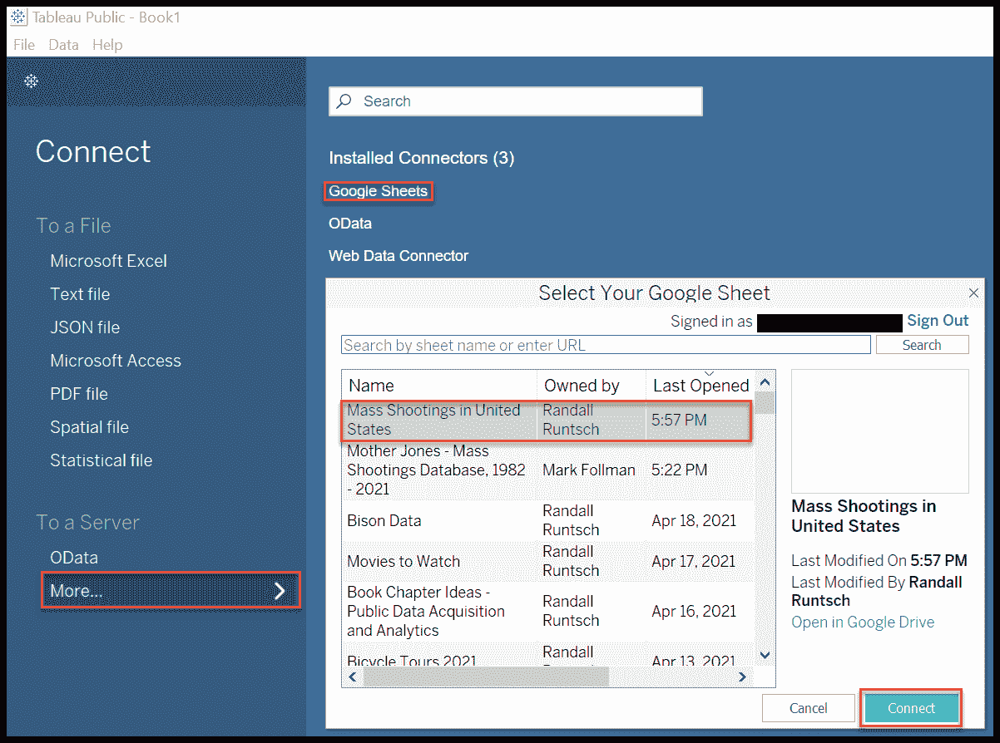
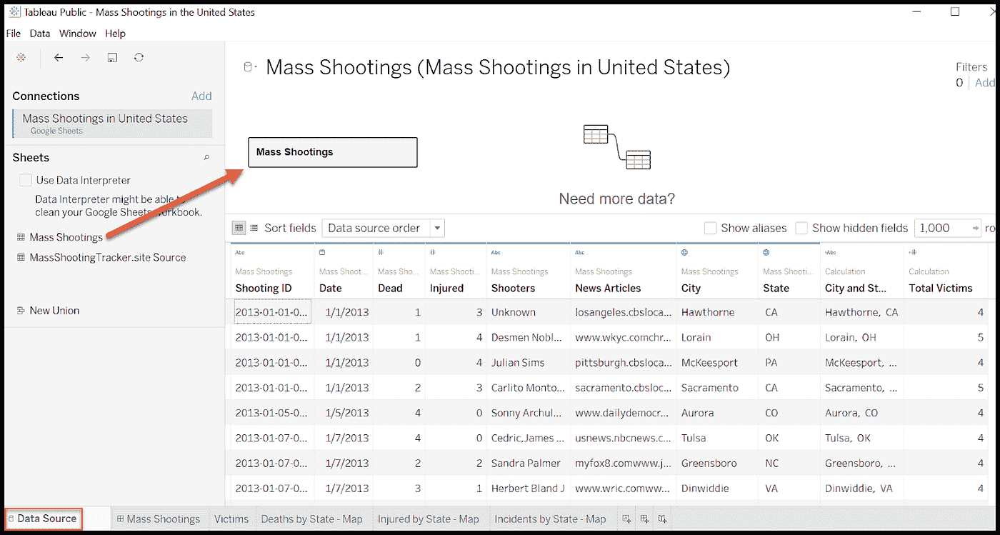
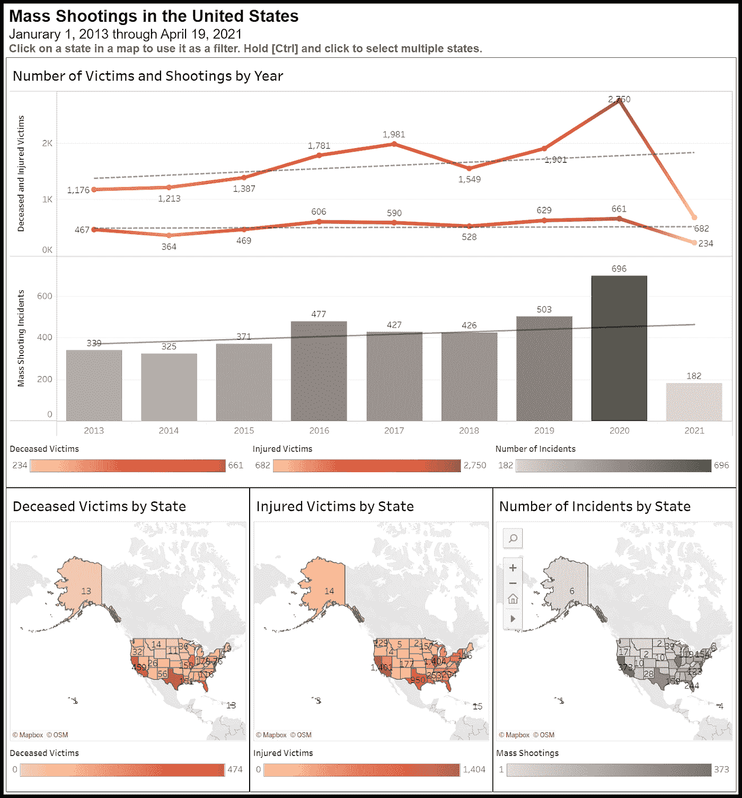
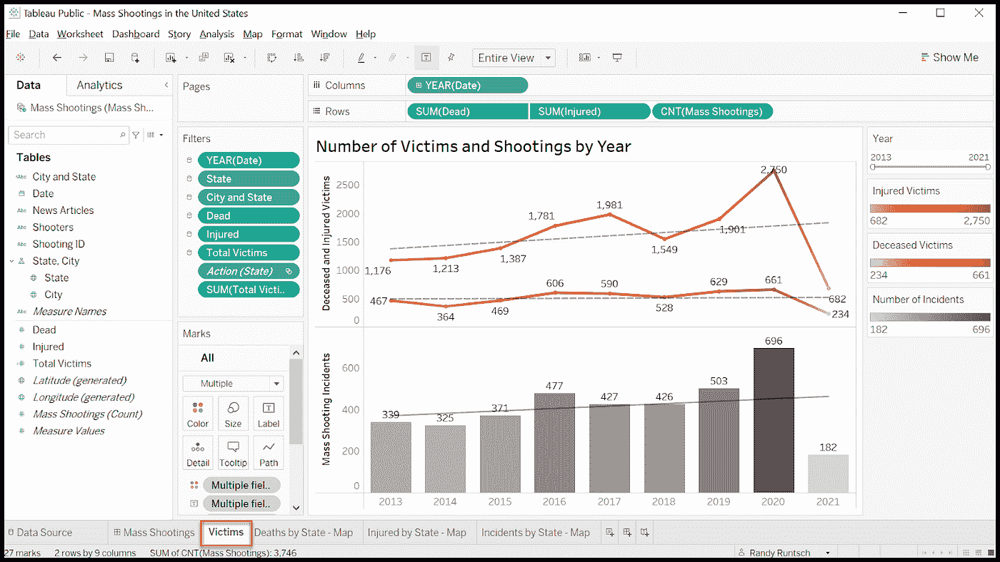

# 使用 Google Sheets 和 Tableau Public 获取和分析大量拍摄数据

> 原文：<https://towardsdatascience.com/how-to-perform-a-data-analysis-of-mass-shootings-in-the-united-states-57a4290f9175?source=collection_archive---------28----------------------->

## 大规模枪击事件每天发生一次以上，不必要地摧毁生命。使用数据创建数据分析和数据科学解决方案，为决策提供信息并推动决策制定，从而降低其频率和规模。

音乐会观众和乐队音乐家在室外舞台上的照片。照片由 [Julio Reynaldo](https://unsplash.com/@reynaldo_gt?utm_source=unsplash&utm_medium=referral&utm_content=creditCopyText) 在 [Unsplash](https://unsplash.com/collections/30074524/concert?utm_source=unsplash&utm_medium=referral&utm_content=creditCopyText) 上提供。

> 内容警告:枪支暴力，大规模枪击。

2017 年 10 月 1 日，数千名狂欢者在拉斯维加斯大道的[91 号公路丰收](https://en.wikipedia.org/wiki/Route_91_Harvest)音乐节上聆听现场音乐。晚上 10 点 05 分，斯蒂芬·帕多克(Stephen Paddock)从他位于曼德勒湾酒店 32 层的套房中用半自动步枪向下面的人群开火。在 10 分钟内，他发射了 1000 多发子弹。帕多克杀害了 60 人，打伤了 411 人。随之而来的恐慌使受伤人数上升到 867 人。

拉斯维加斯的大屠杀震惊了全国和世界。多年来，美国经常发生大规模枪击事件。但是拉斯维加斯枪击案是美国现代史上最血腥的单人大屠杀。尽管如此，大规模枪击事件仍以每年超过 400 起的速度继续发生。

如何利用数据分析来了解更多关于大规模枪击事件的信息？准备充分的数据数据分析仪表板能说服当选官员颁布将有所作为并拯救生命的法律和政策吗？

本文将向您展示如何获取大规模枪击事件数据，为分析做准备，并在 Tableau Public 中创建一个仪表板，以确定大规模枪击事件及其造成的死亡和伤害的趋势。

# 大规模拍摄问题概述

在美国，术语*大规模枪击*没有标准定义。[枪支暴力档案](https://www.gunviolencearchive.org/) (GVA)将其定义为“至少有四名受害者被枪击，要么受伤要么死亡，不包括任何枪手……”的事件[美国国会 2012 年《暴力犯罪调查援助法》](https://www.govinfo.gov/content/pkg/PLAW-112publ265/pdf/PLAW-112publ265.pdf)将大规模杀戮定义为导致至少三名受害者的事件，不包括肇事者。

GVA 报告称，2019 年美国大规模枪击事件造成 417 人死亡。美国联邦调查局(FBI)报告称，2019 年美国发生了[16425 起谋杀案](https://ucr.fbi.gov/crime-in-the-u.s/2019/crime-in-the-u.s.-2019/topic-pages/murder.pdf)。鉴于这些数据，大规模枪击案占当年美国所有凶杀案的 2.54%。

# 主数据源示例

很多机构都提供免费的海量拍摄文件。以下是几个例子。请注意，每个组织可能对大规模枪击事件有不同的定义。

**GVA** — [CSV 文件](https://www.gunviolencearchive.org/mass-shooting)包含 2014 年至 2019 年每起大规模枪击事件的数据。

**大规模枪击事件追踪器(MST)** — [JSON 文件](https://massshootingtracker.site/data/?year=2021)包括 2013 年至 2021 年初每起大规模枪击事件的数据。

**暴力项目**—[Excel 文件](https://www.theviolenceproject.org/mass-shooter-database/)包含 100 多个关于每次大规模枪击的变量。

# 从批量拍摄跟踪器复制和准备数据

我使用下面列出的步骤将 MST 网站上的大量拍摄数据转录到 Google Sheets 的电子表格中。

## 将数据从 MST 复制到 Google Sheets

对于我的海量拍摄数据分析项目，我选择了来自 MST 的数据。虽然我可以下载 JSON 格式的数据，但我直接从它的网页上复制数据，并将其粘贴到名为***mass shooting tracker . site Source***的 [Google Sheets](https://www.google.com/sheets/about/) 中的工作表中。

我通常通过下载文件来获取公共数据。当需要多次检索数据时，如果可能的话，我更喜欢从程序调用应用程序编程接口(API)来获取数据。虽然手动将网页上的数据转录到电子表格中不是我首选的数据获取方法，但从 MST 的网站上复制八年多的大规模拍摄数据只用了不到十分钟。电子表格格式比 JSON 格式更能满足我的需求。

大规模拍摄跟踪器—包含 2020 年数据的网页。作者捕获的图像。

## 准备工作表草稿

本节描述了我从 MST 准备数据以在 Tableau 公共可视化仪表板中使用的步骤。下面显示的 Google Sheets 工作表显示了从 MST 网页复制的数据和我创建的额外的临时列，以便为以后使用这些数据做准备。

Google Sheets 工作表，包含来自 MST 的大量拍摄数据和用于数据准备目的的新增列。图片由作者提供。

将 MST 网页中的数据转录到 Google Sheets 工作表中后，请遵循以下步骤(参考上面显示的工作表):

1.  按 ***日期*** 列对工作表进行升序排序。
2.  通过将单元格 A2 的值设置为 1 并将公式 ***=A2+1*** 粘贴到行号列的所有后续行中，从 1 到 n 计算行号列的值。
3.  将原 ***#*** 列重命名为**批量拍摄跟踪器#** 。
4.  使用此公式创建原始标准日期列:***= TO _ TEXT(YEAR(F2))&"-"&TEXT(MONTH(F2)，" 00") & "-" & TEXT(DAY(F2)，" 00))***
5.  使用以下公式创建原始 ID 列: ***=CONCATENATE(C2，"-"，TEXT(A2，" 0000"))***
6.  接下来，仅将**原始 ID** 列的值复制到**拍摄 ID** 列。**枪击 ID** 是每个大规模枪击事件的唯一标识符。假设稍后将辅助数据源添加到数据分析项目中。在这种情况下，我会将**拍摄 ID** 添加到他们的记录中，以加入各种来源(例如，在关系数据库或 Tableau 这样的商业智能工具中)。
7.  使用以下公式将**位置**列的值拆分到**城市**和**州**列: ***=SPLIT(G2，"，"***

## 复制并简化最终工作表

完成上述准备步骤后，将数据复制粘贴到一个名为*的新工作表中。但是请确保只粘贴没有公式的值。*

*创建新工作表后，删除除以下列之外的所有列:*

*   *拍摄 ID*
*   *日期*
*   *死亡的*
*   *受伤的*
*   *射手*
*   *新闻文章*
*   *城市*
*   *状态*

*大规模枪击案工作表应该如下所示。*

**

*Google Sheets 中完全准备好的大规模拍摄工作表，可用作 Tableau Public 中的数据源。图片由作者提供。*

# *数据分析设计*

*虽然我对大规模拍摄数据有更雄心勃勃的计划，可能来自比 MST 报告的数据更多的来源，但我将演示如何用 Tableau Public 连接数据，为本文构建一个基本的仪表板。以下是我创建的图表和图形，用于查看数据随时间的变化趋势:*

*   *按年份分列的死亡受害者*
*   *按年份分列的受伤受害者*
*   *按年份分列的受害者总数*
*   *按年份分列的大规模枪击事件数量*

*仪表板还显示死亡的受害者，受伤的受害者，以及在地图上按州的事件数量。*

*最后，包括以下过滤器以允许数据的子集:*

*   *年份范围*
*   *死亡受害者范围*
*   *受伤受害者范围*
*   *状态*
*   *城市和州*

# *数据可视化仪表板*

*本节描述了 Tableau Public 中开发的[大规模拍摄仪表盘。请随意下载仪表板，并将其作为您自己项目的起点。](https://public.tableau.com/profile/randall.runtsch#!/vizhome/MassShootingsintheUnitedStates_16189171598960/MassShootings)*

## *Tableau 公共*

*对于这个项目和这篇文章，我使用了 [Tableau Public](https://public.tableau.com/s/) ，一个流行的 Tableau 商业智能和数据可视化软件的免费版本。虽然它可以用来创建令人惊叹和有影响力的数据可视化，但与完整的 [Tableau 桌面](https://www.tableau.com/products/desktop)和服务器产品相比，它有一些局限性:*

*   *仪表板和工作表只能保存到 Tableau 公共服务器，任何人都可以访问。因此，不要用它来展示机密、敏感或可能令人尴尬的信息。*
*   *虽然完整的 Tableau 桌面应用程序可以使用各种数据，包括关系数据库，但 Tableau Public 可以使用相对较少的数据源。*

*要安装 Tableau Public，请在其主页上输入您的电子邮件地址，然后点击[下载应用程序]。*

**

*下载并安装 Tableau 公共商业智能和数据可视化软件。作者捕获的图像。*

## *使用 Tableau Public 连接到 Google Sheets 中的数据*

*Tableau Public 可以连接到各种数据源，包括 Microsoft Excel、文本文件(包括 CSV 文件)、JSON 文件和 Google Sheets。它不能连接到数据库。*

*在本例中，当您打开 Tableau 公共应用程序时，将显示 ***连接*** 页面。*

*按照以下步骤连接到上一节中创建的 Google Sheets 电子表格:*

1.  *在“发送到服务器”标题下，单击[更多…]。*
2.  *点击【谷歌工作表】。*
3.  *点击包含大量拍摄数据的谷歌电子表格的名称。在这个例子中，名字是 ***美国大规模枪击事件*** 。*
4.  *时钟[连接]。*

**

*将 Tableau Public 连接到在 Google Sheets 中创建的大规模枪击电子表格。作者捕获的图像。*

## *选择数据源*

*要选择在 Tableau 公共工作表和仪表板中使用的数据源，请单击屏幕左下角的[数据源]。然后，将 ***批量拍摄*** 表拖动到数据窗格。正如你在下面的截图中看到的，Tableau Public 显示了它从电子表格中导入的数据。*

**

*从 Google Sheets 电子表格中选择一张工作表，用作 mass shooting 仪表盘中的数据源。作者捕获的图像。*

## *Tableau 工作表和仪表板*

*我用 Tableau Public 创建了美国的[大规模枪击事件](https://public.tableau.com/profile/randall.runtsch#!/vizhome/MassShootingsintheUnitedStates_16189171598960/MassShootings)仪表盘，如下所示。虽然本文不是 Tableau 教程，也没有提供关于构建仪表板或其他设计的细节，但是您可以通过[免费培训视频](https://www.tableau.com/learn/training/20204)学习如何创建可视化和仪表板。*

**

*美国仪表盘中的大规模枪击事件描述了自 2019 年以来的大规模枪击事件、受伤的受害者和死亡的受害者。图片由作者提供。*

*其他感兴趣的数据点和潜在的改进*

*如下图所示， ***大规模拍摄*** 仪表盘(如上图)包含这些工作表:*

*   *受害者*
*   *各州死亡人数-地图*
*   *受伤的州-地图*
*   *按州划分的事件—地图*

**

*Tableau Public 中的受害者工作表。此工作表是大规模枪击仪表板的一个组件。图片由作者提供。*

# *来自大规模枪击仪表板的观察*

*虽然 Tableau 可视化中呈现的图表是初步的，包括有限的数据，但我使用它们得出了关于美国大规模枪击事件的以下结论:*

*   *随着时间的推移，大规模枪击事件、死亡和受伤的人数持续增长。*
*   *我听说在新冠肺炎疫情期间，大规模枪击事件减少了。根据给定的数据，相反的情况似乎是准确的。*
*   *2020 年，每次事故的平均死亡人数减少，而事故数量增加。*

# *其他感兴趣的潜在数据点和分析*

*上面描述和显示的基本图表说明了大规模枪击问题的趋势。但是，当增加额外的数据和设计良好的图表、图形和统计数据时，熟练的数据分析师或数据科学家可以创建丰富的信息源和决策工具。*

*以下是扩展和改进大量拍摄数据分析解决方案的一些想法。当然，并不是所有这些数据类型都能被公众轻易获得。*

*   *受害者的人口统计数据(年龄、性别、种族、民族、国籍、宗教、其他群体)*
*   *射击者的人口统计数据(年龄、性别、种族、民族、国籍、宗教、其他分组)*
*   *枪手的动机*
*   *射击运动员的心理健康*
*   *枪手获得枪支(合法或合法)*
*   *枪手的犯罪记录*
*   *枪手和受害者的关系*
*   *枪手与国际或国内恐怖组织的联系*
*   *枪击地点(例如，教堂、学校、企业、农村或城市)*
*   *枪手与枪击地点的关系(例如，枪击是否发生在前雇主的地点？)*
*   *无论枪手是否在事件中死亡或受伤*
*   *枪手死亡原因(自杀或被警察或其他人杀死)*
*   *各州每 100，000 名居民的死亡和受伤人数*
*   *各州枪支管理条例*
*   *对幸存枪手的定罪和监禁*

# *结论*

*虽然大规模枪击是摧毁生命的可怕罪行，但它们只占美国每年凶杀案的一小部分。尽管如此，像其他暴力犯罪一样，它们表明了严重的社会和个人问题。有了适当的数据和良好的演示，精心调整的分析可以更好地让公众了解问题。它们还可以为当选官员提供制定法律法规以拯救生命的工具。*

# *关于作者*

*Randy Runtsch 是一名作家、数据工程师、数据分析师、程序员和摄影师。他和妻子住在美国明尼苏达州东南部。*

*Randy 讲述了如何利用公共数据集中的数据。有关如何在数据分析和数据科学项目中使用公共数据集的更多想法，请参见他最近的文章， [*使用 Python 获取和分析天气和气候数据*和 Tableau](/acquire-and-analyze-weather-and-climate-data-with-python-and-tableau-4878e8759152) 和 [*使用 Data.gov 上编目的公共数据集推动数据科学项目*](/use-public-datasets-cataloged-on-data-gov-to-power-data-science-projects-1a7d84e9212b) 。*