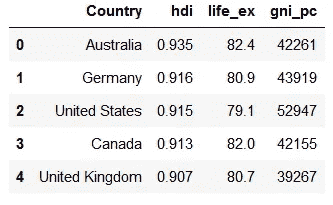
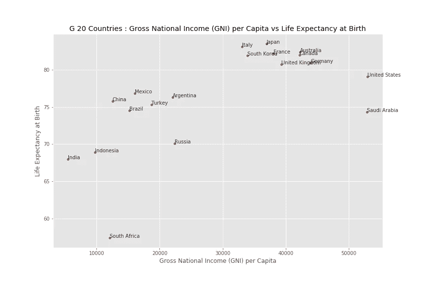
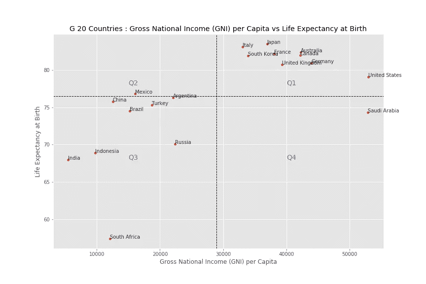

# 什么是象限分析&如何用 Python 进行象限分析

> 原文：<https://towardsdatascience.com/how-to-perform-a-quadrant-analysis-in-python-9f84d36f8a24?source=collection_archive---------10----------------------->

## 解释什么是象限分析以及在哪里使用它。关于如何使用 pandas、matplotlib 和 seaborn 库在 python 中实现的分步指南。

## 什么是象限分析？

象限分析图是一种非常常用的决策工具，尤其是在商业环境中。象限图在技术上是一个散点图，它被分成四个部分或象限，因此得名。在象限分析中，根据两个参数评估每个实体的绩效。根据实体在任一 KPI 下的表现，实体被分组到任一象限。
在确定实体属于哪个象限后，可以采取措施来提高相关 KPI 下的绩效。

在 Power BI 和 Tableau 等数据可视化工具中准备象限分析非常简单。然而，这个过程在 python 中并不那么简单。

我们将使用由[联合国开发计划署](https://www.undp.org/)发布的人类发展指数中的一些 KPI，完整的 [kaggle 数据集可以在这里](https://www.kaggle.com/undp/human-development)访问。



数据集的头部(图片由作者提供)

我们的数据集由以下数据组成:
*一、国家*:国家名称
*二。hdi :* 人类发展指数 *三。life_ex :* 出生时预期寿命 *四。人均国民总收入*

## 象限分析的组成部分

象限分析图有三个组成部分:

**i .轴** 在 X 轴和 Y 轴中定义了图表中绘制数据所基于的参数(KPI)。
我们将对 20 国集团在两个关键绩效指标方面的表现进行象限分析:
*i* 。人均国民总收入
*二*。出生时预期寿命
X 轴代表*人均国民总收入*，Y 轴代表*出生时预期寿命*，数据将根据这两个指标绘制到相应的象限。

**二。基准** X 轴和 Y 轴的阈值极限可定义为基准。
这将轴分成四个象限。当盈利、增长、改善等。都被认为是 y-o-y 基础，一般用‘0’作为客观基准。在一些需要相对比较的情况下，平均值或中间值也可以用作基准。
我们将使用 KPI 的平均值作为基准。

**三世。分组** 分组指定如何对 X 轴和 Y 轴上测量的数据进行分组。在我们的例子中，唯一可能的分组是国家级的。
如果其他数据可用，即洲级、语言级或其他特定类别，也可用于根据用例进行分组。

## 准备散点图

准备散点图，X 轴为*人均国民总收入*，Y 轴为出生时预期寿命*。* 国家标签也被添加到散点图*。*

你可以参考下面这篇关于如何给散点图添加标签的文章*。*

</how-to-add-text-labels-to-scatterplot-in-matplotlib-seaborn-ec5df6afed7a>  

```
plt.figure(figsize=(12,8))
sns.scatterplot(data=hdi_df, x='gni_pc', y='life_ex')plt.title(f"G 20 Countries : {abbr['gni_pc']} vs {abbr['life_ex']}")
plt.xlabel(abbr['gni_pc'])
plt.ylabel(abbr['life_ex'])

for i in range(hdi_df.shape[0]):
          plt.text(hdi_df.gni_pc[i], y=hdi_df.life_ex[i], s=hdi_df.Country[i], alpha=0.8)

plt.show()
```



散点图(图片由作者提供)

## 添加基准线

通过添加将图表分成 4 个象限的基准线，散点图可以转换为象限分析图。
标示为 Q1、Q2、Q3 和 Q4 的象限供以后参考。
散点图中增加了分别对应于 x 轴和 y 轴 KPI 平均值的垂直线和水平线。

作者 GitHub 要点



## 分析

一旦数据被分组为 4 个象限，就可以根据用例对这些组进行分析。它可以用来寻找有利可图的产品，最有生产力的工人，落后的国家等。一旦确定了实体的象限，就可以采取具体的行动来将其 KPI 提高到期望的水平。

如上所示，G20 国家被分为 4 个象限。
水平虚线代表平均预期寿命，垂直虚线代表人均国民总收入。

Q1:人均国民总收入>平均值和预期寿命>平均值
Q2:人均国民总收入<平均值和预期寿命>平均值
Q3:人均国民总收入<平均值和预期寿命<平均值
Q4:人均国民总收入>平均值和预期寿命<平均值

在 bot KPI 下，Q1 的国家比其他国家表现更好。每个国家的目标都应该是到达 Q1。(*这是我的假设* )
墨西哥，Q2 的预期寿命比平均值高，但是这个国家必须提高人均国民总收入。在这两个参数下，第三季度的国家都落后了，这些国家必须采取具体措施来提高到发达国家的标准。
第四季度沙特阿拉伯的人均收入很高，但人均寿命却低于平均水平。该国必须确定影响其公民预期寿命的因素，并解决这些因素，以达到 Q1。

## 资源:

这篇文章的笔记本可以在我的 [Git Repo](https://github.com/abhijith-git/Publications/blob/main/Medium/Quadrant%20Analysis.ipynb) 中找到。

## 成为会员

我希望你喜欢这篇文章，我强烈推荐 [**注册*中级会员***](https://abhijithchandradas.medium.com/membership) 来阅读更多我写的文章或成千上万其他作者写的各种主题的故事。
[你的会员费直接支持我和你看的其他作家。你还可以在 Medium](https://abhijithchandradas.medium.com/membership) 上看到所有的故事。

## 作者的其他文章:

</5-methods-to-check-for-nan-values-in-in-python-3f21ddd17eed>  <https://medium.datadriveninvestor.com/visualizing-option-trading-strategies-in-python-35bfa61151d9>  <https://medium.com/mlearning-ai/stock-market-data-visualization-using-mplfinance-1d35a8d48e4>  

你可以看看我的 EPL 预测系列中的下面这篇文章，在这篇文章中，我使用象限分析来比较基于 xG 得分和 xG 失球的足球队

</epl-analysis-and-gameweek-22-prediction-91982b809802>  

Nicolas Solerieu 在 [Unsplash](https://unsplash.com?utm_source=medium&utm_medium=referral) 上拍摄的照片