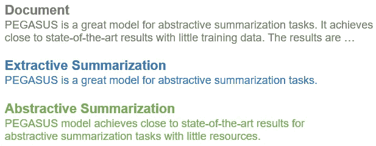
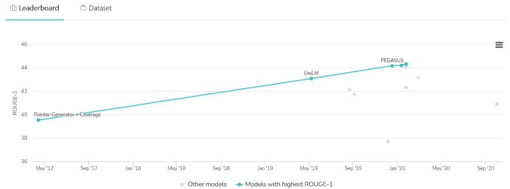
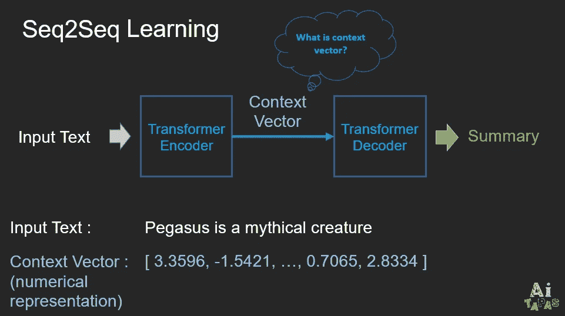
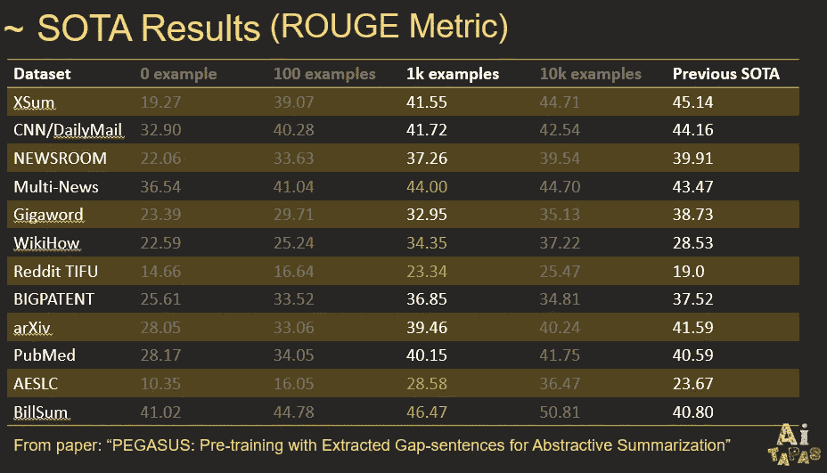
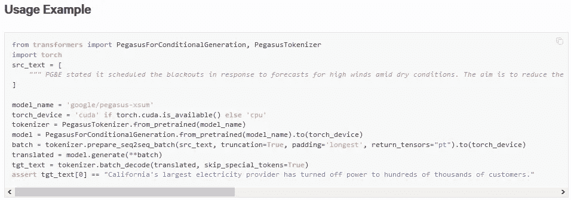
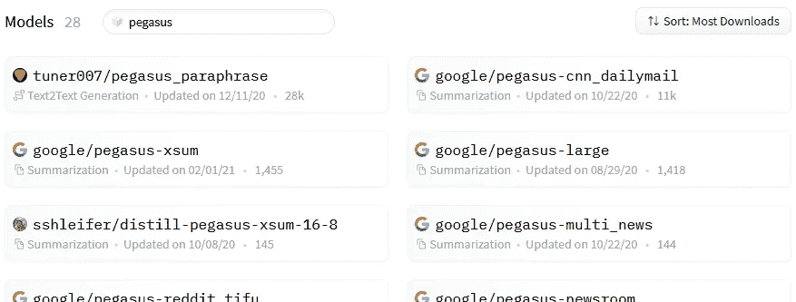
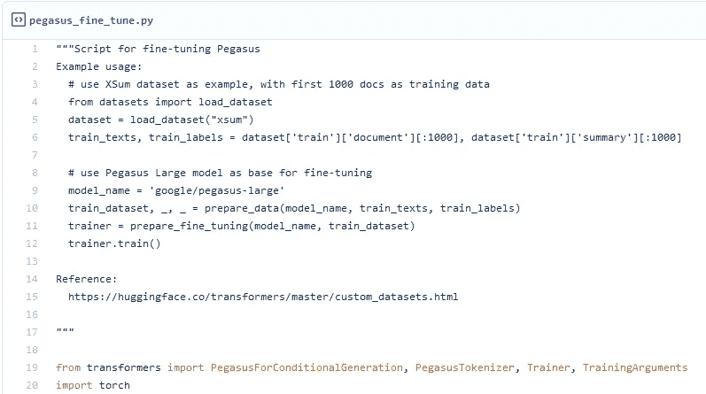
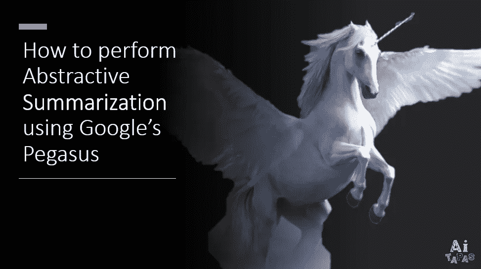

# 如何用 PEGASUS 执行抽象概括

> 原文：<https://towardsdatascience.com/how-to-perform-abstractive-summarization-with-pegasus-3dd74e48bafb?source=collection_archive---------8----------------------->

## 像马一样工作来完成抽象的摘要任务？不，我们可以骑在飞马上取得好成绩

作者提供的视频

*注意:如果你喜欢看视频，请随意播放以上相同内容的视频。*

面对冗长的文件，我们自然倾向于不读，或者至少浏览要点。所以做一个总结对节省我们的时间总是有好处的⏳和大脑处理能力。

然而，自动总结曾经是一项不可能完成的任务。具体来说，抽象概括非常具有挑战性。不同于提取摘要(从文档中提取重要的句子并组合它们以形成一个“摘要”)，抽象摘要涉及释义单词，因此更困难，但可能给出更连贯和更精炼的摘要。

抽象与提取摘要的图解|作者图片

直到 seq2seq 学习和无监督语言模型(如 ELMo 和 BERT)等技术的发展，抽象摘要才变得更加可行。

在自然语言处理(NLP)领域早期突破的基础上，谷歌的 PEGASUS 进一步改进了抽象摘要的最新(SOTA)结果，特别是在资源较少的情况下。更具体地说，与以前的模型不同，PEGASUS 使我们能够通过 1，000 个例子，而不是数万个训练数据，获得接近 SOTA 的结果。

在本文中，我们将着眼于 PEGASUS 的高级工作方式，以及它如何帮助我们完成总结任务。

[代码为](https://paperswithcode.com/sota/abstractive-text-summarization-on-cnn-daily)的论文摘要排行榜(截至 2021 年 2 月 4 日)

# 飞马是如何工作的

## 1.体系结构

PEGASUS 使用编码器-解码器模型|图片由作者提供

在高层次上，PEGASUS 使用编码器-解码器模型进行序列到序列的学习。在这种模型中，编码器将首先考虑整个输入文本的上下文，并将输入文本编码成称为上下文向量的东西，它基本上是输入文本的数字表示。这个数字表示然后将被馈送到解码器，其工作是解码上下文向量以产生摘要。

与最近的 SOTA NLP 模型一致，PEGASUS 也采用了 transformer 架构，如果你想了解更多关于什么是 transformer 的信息，我强烈建议你阅读这篇文章，标题是 Jay Alammar 的[“图解 Transformer”](http://jalammar.github.io/illustrated-transformer/)。

## 2.预培训

飞马座与以前的 SOTA 模型的区别在于预先训练。

作者(张等。艾尔。)假设预训练模型以输出重要的句子是合适的，因为它非常类似于抽象概括需要做的事情。使用一种称为 [ROUGE1-F1](https://www.freecodecamp.org/news/what-is-rouge-and-how-it-works-for-evaluation-of-summaries-e059fb8ac840/) 的度量标准，作者能够自动选择“重要”的句子，并在大型语料库上对模型进行预训练，即 3.5 亿个网页和 15 亿篇新闻文章。

有了预先训练好的模型，我们就可以在数量少得多的实际数据上对模型进行微调。事实上，对各种数据集的评估结果表明，仅用 1000 个训练数据，该模型就取得了与以前的 SOTA 模型相当的结果。这具有重要的实际意义，因为我们大多数人没有资源来收集成千上万的文档摘要对。

评价结果摘自 PEGASUS 的论文

# 如何使用飞马

看到 PEGASUS 的评估结果后，您可能想知道如何编写代码来使用该模型。幸运的是，拥抱脸🤗店内有 PEGASUS 模型，使我们很容易利用 PEGASUS。

## 1.推理

为了进行推理，我们可以遵循[拥抱脸网站](https://huggingface.co/transformers/model_doc/pegasus.html#usage-example)上提供的示例脚本。

[拥抱脸](https://huggingface.co/transformers/model_doc/pegasus.html#usage-example)上的示例代码截图

根据您的用例与用于微调的数据集的相似程度，您可以将 *model_name* 与此处[列出的各种其他微调模型(除了 *google/pegasus-large* )进行交换。](https://huggingface.co/models?search=pegasus)

[抱脸](https://huggingface.co/models?search=pegasus)上的飞马模特截图

## 2.微调

如果您想为您的用例定制一个模型，您可以在您的数据集上微调 *google/pegasus-large* 模型。

为此，请参考[我们的 Github 代码](https://gist.github.com/jiahao87/50cec29725824da7ff6dd9314b53c4b3)，这是我们从 Hugging Face 的[示例代码中改编而来的关于微调的](https://gist.github.com/jiahao87/50cec29725824da7ff6dd9314b53c4b3)。

我们用于微调的 [PyTorch 脚本截图](https://gist.github.com/jiahao87/50cec29725824da7ff6dd9314b53c4b3)

但是请注意，微调编码器和解码器可能会占用大量内存。如果你的本地计算机不幸不能胜任这个任务(像我的)😅)，可以考虑使用谷歌云。由于谷歌云对新注册用户提供免费试用，你可以免费试用。😎

通过上面的指南，我们希望你现在能够适应并采用 PEGASUS 来完成你的抽象概括任务。打个比方，我们不再需要像马一样工作，而是可以骑在飞马上达到很高的高度😉。

感谢阅读，我希望这篇文章是有用的:)也请随时评论您可能有的任何问题或建议。

# 参考

   