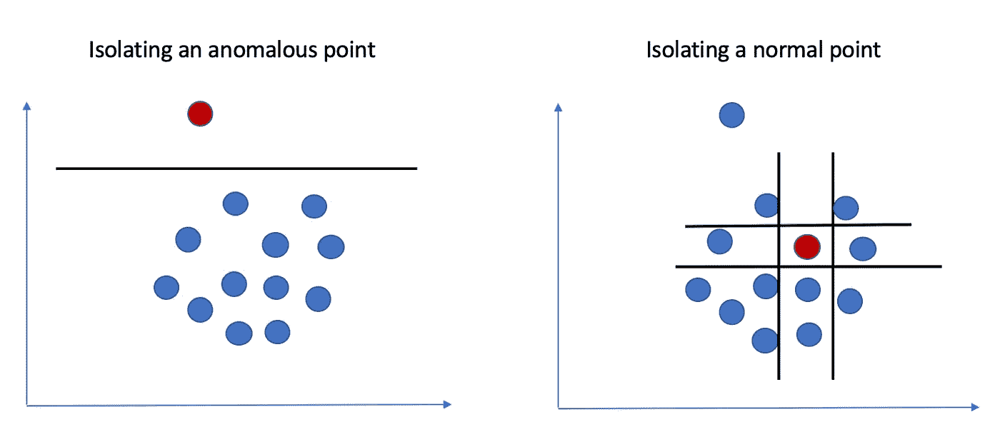
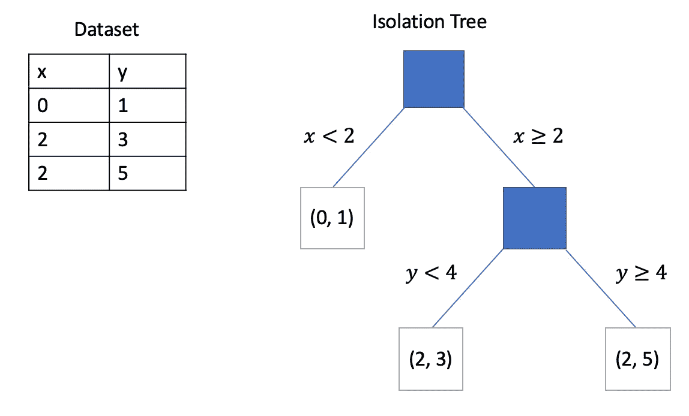
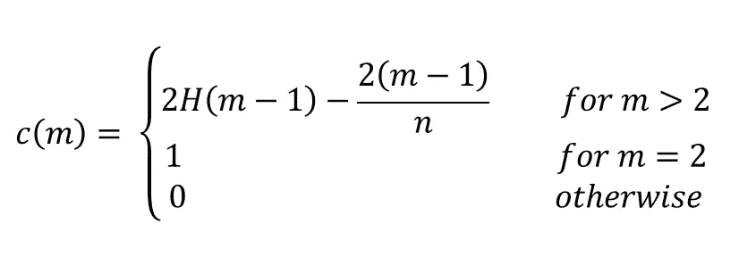
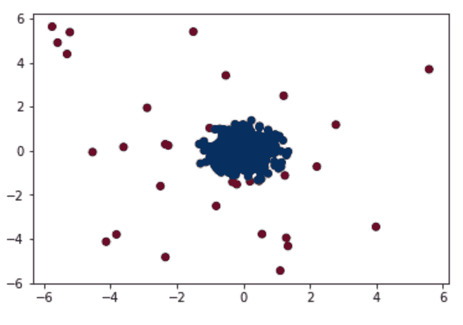
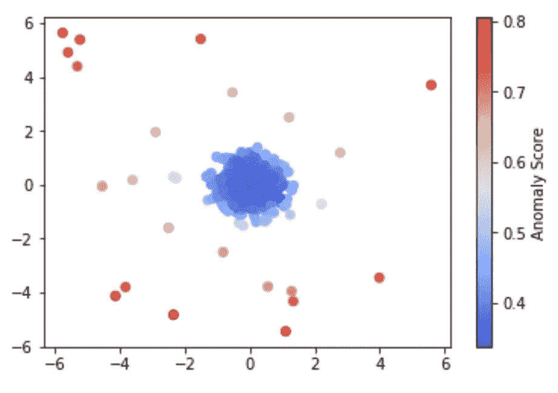

# 如何使用隔离林算法执行异常检测

> 原文：<https://towardsdatascience.com/how-to-perform-anomaly-detection-with-the-isolation-forest-algorithm-e8c8372520bc?source=collection_archive---------7----------------------->

## 如何使用这种基于树的算法来检测数据中的异常值


史蒂文·卡梅纳在 [Unsplash](https://unsplash.com/s/photos/forest?utm_source=unsplash&utm_medium=referral&utm_content=creditCopyText) 上拍摄的照片

异常检测是机器学习中经常被忽视的领域。它看起来不像深度学习或自然语言处理那样浮华，并且经常在机器学习课程中被完全跳过。

然而，异常检测仍然很重要，其应用范围从数据预处理到欺诈检测，甚至系统健康监控。有许多异常检测算法，但在撰写本文时，最快的算法是隔离林，也称为 iForest。

**在本文中，我将简要解释隔离森林算法的工作原理，并演示如何在 Python 中使用该算法进行异常检测。**

# 隔离林算法的工作原理

隔离林算法利用异常样本(通常称为异常值)的以下属性:

*   **少数** —异常样本是少数，在任何数据集中只有少数。
*   **不同** —异常样本的值/属性与正常样本的值/属性非常不同。

与正常点相比，这两个属性更容易将异常样本从其余数据中分离出来。



隔离异常点和正常点。图片由作者提供。

请注意，在上图中，我们只用一条线就可以将异常点从其余数据中隔离出来，而右边的正常点需要四条线才能完全隔离。

## 该算法

给定数据点 *X* 、*、*的样本，隔离森林算法使用以下步骤构建隔离树(iTree)、 *T* 。

1.  **随机选择一个属性 *q* 和一个分割值 *p.***
2.  **使用规则 *q < p* 将 *X* 分成两个子集。这些子集将对应于 *T.*** 中的左子树和右子树
3.  **递归地重复步骤 1-2，直到当前节点只有一个样本或者当前节点的所有值都具有相同的值。**

然后，该算法多次重复步骤 1–3，以创建几个隔离树，从而生成一个隔离林。基于隔离树是如何产生的以及异常点的属性，我们可以说大多数异常点将位于更靠近树的根的位置，因为与正常点相比，它们更容易被隔离。



从小型数据集创建的隔离树示例。图片由作者提供。

一旦我们有了一个隔离森林(隔离树的集合)，给定数据点 *x* 和样本大小 *m* ，算法使用以下异常分数:


隔离林算法的异常分数。图片由作者提供。

在上式中， *h(x)* 表示给定隔离树中数据点 *x i* n 的路径长度。表达式 E(h(x))表示穿过所有隔离树的该路径长度的预期或“平均”值。表达式 *c(m)* 表示给定样本量 *m* 时 *h(x)* 的平均值，并使用以下等式定义。



h(x)的平均值为样本大小 m。图像由作者提供。

上面的等式是从隔离树与二叉查找树具有相同结构的事实中推导出来的。就路径长度而言，隔离树中节点的终止类似于二叉查找树中的不成功搜索。一旦为给定点计算了异常分数 *s(x，m)* ，我们可以使用以下标准来检测异常:

1.  **如果 *s(x，m)* 接近 1，那么 *x* 极有可能是异常。**
2.  **如果 *s(x，m)* 小于 0.5，则 *x* 可能是正常点。**
3.  **如果 *s(x，m)* 对于数据集中的所有点都接近 0.5，那么数据可能不包含任何异常。**

请记住，对于所有点来说，异常分数总是大于零但小于 1，因此它非常类似于概率分数。

# 在 Scikit-learn 中使用隔离森林算法

隔离森林算法是 Scikit-learn 中的一个模块。在本教程中，我将演示如何使用 Scikit-learn 通过该算法执行异常检测。你可以在 [GitHub](https://github.com/AmolMavuduru/IsolationForestTutorial) 上找到本教程的[完整代码](https://github.com/AmolMavuduru/IsolationForestTutorial)。

## 导入库

在下面的代码中，我从 Scikit-learn 导入了一些常用的库以及隔离森林模块。

```
import numpy as np
import pandas as pd
from sklearn.ensemble import IsolationForest
import matplotlib.pyplot as plt
%matplotlib inline
```

## 构建数据集

为了创建一个数据集用于演示目的，我使用了 Scikit-learn 的 **make_blobs** 函数来创建一个集群，并在下面的代码中添加了一些随机离群值。整个数据集包含 500 个样本，在这 500 个样本中，只有 5%或 25 个样本实际上是异常的。

```
from sklearn.datasets import make_blobsn_samples = 500
outliers_fraction = 0.05
n_outliers = int(outliers_fraction * n_samples)
n_inliers = n_samples - n_outliersblobs_params = dict(random_state=0, n_samples=n_inliers, n_features=2)X = make_blobs(centers=[[0, 0], [0, 0]], 
               cluster_std=0.5,
               **blobs_params)[0]rng = np.random.RandomState(42)X = np.concatenate([X, rng.uniform(low=-6, high=6, size=(n_outliers, 2))], axis=0)
```

## 训练算法

使用 Scikit-learn 的 API 训练隔离林很容易，如下面的代码所示。注意，我在 **n_estimators** 参数中指定了 iTrees 的数量。还有另一个名为**污染**的参数，我们可以用它来指定包含异常的数据的百分比。然而，我决定省略这个参数并使用默认值，因为在实际的异常检测情况下，这些信息可能是未知的。

```
iForest = IsolationForest(n_estimators=20, verbose=2)
iForest.fit(X)
```

## 预测异常

预测异常很简单，如下面的代码所示。

```
pred = iForest.predict(X)
```

**预测**函数将为 x 中的每个样本赋值 1 或-1。值 1 表示一个点是正常点，而值-1 表示它是异常点。

## 可视化异常

现在我们已经为 X 中的每个样本预测了一些标签，我们可以用 Matplotlib 可视化结果，如下面的代码所示。

```
plt.scatter(X[:, 0], X[:, 1], c=pred, cmap='RdBu')
```

上面的代码产生了下面的可视化效果。



异常点显示为红色，正常点显示为蓝色。图片由作者提供。

在下图中，标记为异常的点显示为红色，正常的点显示为蓝色。该算法似乎在检测异常方面做得很好，尽管在中心的聚类边缘的一些点可能是被标记为异常的正常点。查看异常分数可能有助于我们更好地理解算法的性能。

## 可视化异常分数

我们可以使用 **score_samples** 函数生成简化的异常分数，如下所示。

```
pred_scores = -1*iForest.score_samples(X)
```

请注意， **score_samples** 函数返回的分数将全部为负，并且对应于本文前面定义的异常分数的负值。为了保持一致，我将这些分数乘以-1。

我们可以使用下面的代码来可视化分配给每一点的分数。

```
plt.scatter(X[:, 0], X[:, 1], c=pred_scores, cmap='RdBu')
plt.colorbar(label='Simplified Anomaly Score')
plt.show()
```

上面的代码给了我们以下有用的可视化。



异常分数的可视化。图片由作者提供。

当查看上面的可视化时，我们可以看到算法确实如预期的那样工作，因为靠近中间蓝色聚类的点具有较低的异常分数，而较远的点具有较高的异常分数。

# 摘要

隔离森林算法是一种快速的基于树的异常检测算法。该算法使用二分搜索法树中路径长度的概念来为数据集中的每个点分配异常分数。该算法不仅快速高效，而且由于 Scikit-learn 的实现，它还可以广泛使用。

像往常一样，你可以在 [GitHub](https://github.com/AmolMavuduru/IsolationForestTutorial) 上找到这篇文章的[完整代码](https://github.com/AmolMavuduru/IsolationForestTutorial)。

# 加入我的邮件列表

你想在数据科学和机器学习方面变得更好吗？您想了解数据科学和机器学习社区的最新图书馆、开发和研究吗？

加入我的[邮件列表](https://mailchi.mp/e8dd82679724/amols-data-science-blog)，获取我的数据科学内容的更新。当你[注册](https://mailchi.mp/e8dd82679724/amols-data-science-blog)时，你还会得到我免费的**解决机器学习问题的逐步指南**！也可以在 [Twitter](https://twitter.com/amolmavuduru1) 关注我，获取内容更新。

当你这么做的时候，考虑加入媒体社区，阅读成千上万其他作家的文章。

# 来源

1.  F.刘，丁国明，周志宏，[隔离森林](https://cs.nju.edu.cn/zhouzh/zhouzh.files/publication/icdm08b.pdf?q=isolation-forest)，(2008)，2008 年第八届 IEEE 数据挖掘国际会议。
2.  F.Pedregosa *等，*[sci kit-learn:Python 中的机器学习](http://jmlr.csail.mit.edu/papers/v12/pedregosa11a.html)，(2011)，机器学习研究杂志。