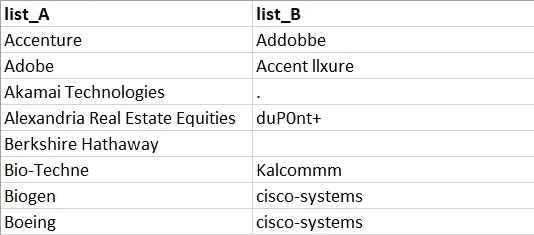
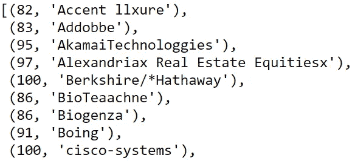
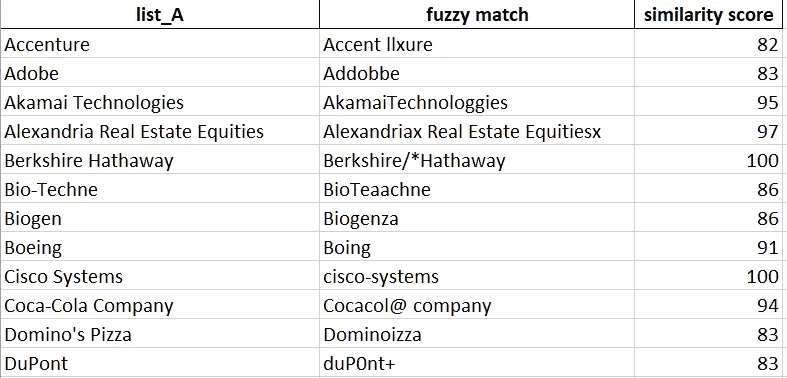

# 如何在一行代码中执行近似的字符串匹配

> 原文：<https://towardsdatascience.com/how-to-perform-approximate-string-matching-in-one-line-of-code-76fae5d7efc?source=collection_archive---------4----------------------->

## 使用 Python 对客户名称列表进行模糊字符串匹配(适用于所有人)


图片由来自 Unsplash 的[托尔加·乌尔坎](https://unsplash.com/@tolga__)拍摄

您是否曾经尝试过使用不完全匹配的键或查找值来连接两个表？也许你在金融或市场部门工作，你必须匹配来自两个不同数据源的两个客户列表。虽然客户名称应该是相同的，但是他们的拼写不同，这对于 VLOOKUP 函数来说是一个不可克服的挑战。如果您要匹配不匹配的字符串列表(例如，客户名称、产品、交易、地址)，请继续阅读——本文可能会节省您的工作时间。

文章首先介绍了用于执行近似匹配的科学方法，即 Levenshtein 距离。然后，通过一个案例研究，展示如何将数据从 Excel 导入 Python，在一行代码中执行匹配，并将 1:1 匹配和相似性得分的结果表导出到 Excel。

# 方法: **Levenshtein 距离和** FuzzyWuzzy

模糊字符串匹配或近似字符串匹配是一种技术，给定一个目标字符串，它将从非精确匹配列表中找到其最接近的匹配。如果您尝试使用 Excel 的近似 VLOOKUP 来执行模糊匹配，您会知道它适用于数字的排序列表，但不适用于字符串。原因是 Excel 函数从查找范围中返回一个低于查找值的匹配项，并且其后继值大于查找值。Excel 逻辑很难应用于字符串，所以我们求助于 **Levenshtein 距离**来进行近似的字符串匹配。

Levenshtein 距离是两个序列之间的距离的稳健且有效的度量。该算法计算编辑距离，即单个单词序列匹配目标序列所需的最小编辑次数(插入、删除或替换)。自 1965 年发明以来，这一指标从未改进过，它有许多应用，包括不同物种基因组的比较。本文不提供算法的[数学解释](https://medium.com/@ethannam/understanding-the-levenshtein-distance-equation-for-beginners-c4285a5604f0)；希望你相信麻省理工学院的研究人员，他们认为[是我们将得到的](https://news.mit.edu/2015/algorithm-genome-best-possible-0610)最好的编辑距离算法。

我们可以写一个计算 Levenshtein 距离的函数，但是 **FuzzyWuzzy 包**已经为我们做了。一旦安装完毕，该软件包将提供一系列方法，最终计算 Levenshtein 距离相似性比率。让我们来看一个案例研究，它将帮助您开始进行近似的字符串匹配。

# 案例研究:两个客户名称列表的近似匹配

## 问题陈述

假设我们的任务是匹配两个客户名称列表。客户名来自两个不同的来源:名单 A 是干净的，而名单 B 是被污染的。30 个客户名称应该是 1:1 匹配，但是列表 B 中的名称拼写错误。此外，列表 B 包含空白单元格、标点符号和重复名称(见下图)。虚拟数据集是通过从标准普尔 500 指数中随机选取公司名称生成的。



图片作者。虚构客户名称列表

解决这个任务的一个选择是手动执行匹配(Accenture:Accent llxure，Adobe:Addobbe 等)。).然而，如果列表太长或者任务需要重复，人们应该选择更有效的解决方案，通过 FuzzyWuzzy 包利用 Levenshtein 距离。

## **第一步:数据导入和数据清理**

第一步是将 customer names 表从 Excel 导入 Python，并准备好匹配的客户列表。如果您已经知道如何做到这一点，请跳到步骤 2，但是要记住导入相关的包。

在导入 FuzzyWuzzy 包之前，我们必须安装它。我们可以在 Anaconda 提示符下使用命令行`pip install fuzzywuzzy`。为了将字符串匹配的速度提高 4-10 倍，我们建议安装 Levenshtein Python C(使用命令行`pip install python-Levenshtein`)。

现在，让我们导入相关的包:

```
# Import packages
import os
import pandas as pd
from fuzzywuzzy import fuzz
```

如果输入文件的位置与 Python 文件的位置不同，则需要更改目录。然后，我们使用`pandas.read_excel()`将客户列表导入到 pandas 数据框架中。使用列表理解，我们遍历列表 A 中的客户名称，删除列表底部的空白。类似地，我们使用列表理解来删除列表 B 中缺少的值，只保留唯一的客户名称。精简列表将减少模糊字符串匹配算法的工作量。

```
# Change directory
# os.chdir(r"Your file path")# Import the customers data
filename = "customers lists input.xlsx"
customers = pd.read_excel(filename)# Clean customers lists
A_cleaned = [customer for customer in customers["list_A"] if not(pd.isnull(customer))]
B_cleaned = [customer for customer in customers["list_B"].unique() if not(pd.isnull(customer))]
```

瞧，客户名称已经准备好匹配了。

## 第二步:用 FuzzyWuzzy 在一行中执行近似匹配

目标是在一行代码中从列表 B 中生成相似性得分和匹配字符串的元组列表。为此，我们使用嵌套列表理解，这被认为比嵌套 For 循环更“pythonic 化”。

> **Python 化**描述了一种编码风格，利用 Python 独有的特性来编写可读性强且美观的代码
> ( [什么是 Python 化风格？| Udacity](https://www.udacity.com/blog/2020/09/what-is-pythonic-style.html)

从下面代码片段中的外部循环开始，对于 *A_cleaned* 中的每个客户名称，我们生成一个元组列表。每个元组由列表 B 中的客户名称及其相对于列表 A 中客户名称的相似性得分组成。列表 *A_cleaned* 计数 30 个客户名称，因此循环生成 30 个列表，每个列表由 31 个元组组成(在 *B_cleaned* 中有 31 个客户名称)。因为我们只对列表 B 中最匹配的客户名称感兴趣，所以我们将内部循环包装到内置函数`max()`中，从而将列表列表转换为元组列表。这样，列表 A 中的每个客户名称只被分配一个元组。

```
# Perform fuzzy string matching
tuples_list = [max([(fuzz.token_set_ratio(i,j),j) for j in B_cleaned]) for i in A_cleaned]
```

相似性得分由函数`token_set_ratio()`生成。在预处理字符串(标记化、小写和删除标点符号)之后，`token_set_ratio()`计算 Levenshtein 距离，控制两个字符串之间的交集。在比较不同长度的字符串时，FuzzyWuzzy 的`token_set_ratio()`是首选比率，就像我们的例子一样。

当打印元组列表时，部分输出类似于下面的代码片段:



图片作者。相似性得分和匹配字符串的元组列表

## 步骤 3:将输出导出到 Excel

最后一步是创建一个熊猫数据框架，并将其导出到 Excel。数据帧应该包括:
1)列表 A 中的客户名称
2)列表 B 中的匹配项
3)相似性得分
为了创建数据帧，我们将元组列表解包为两个列表。这可以通过用`zip(*)`解压缩元组并用内置函数`map()`将元组转换成列表来实现。

```
# Unpack list of tuples into two lists
similarity_score, fuzzy_match = map(list,zip(*tuples_list))# Create pandas DataFrame
df = pd.DataFrame({"list_A":A_cleaned, "fuzzy match": fuzzy_match, "similarity score":similarity_score})
```

创建数据框架后，我们将其导出到名为模糊字符串匹配的新 Excel 工作簿中:

```
# Export to Excel
df.to_excel("Fuzzy String Matching.xlsx", sheet_name="Fuzzy String Matching", index=False)
```

查看您保存 Jupyter 笔记本的文件夹，您会发现带有数据框的 Excel 工作簿。看起来所有的比赛都进行的很正确。工作表的一部分应该如下图所示:



图片作者。Excel 工作表输出

# 结论

在 Excel 中，尝试匹配两个不完全匹配的字符串列表是一项具有挑战性的任务。这篇文章展示了如何使用 Python 使近似字符串匹配这一艰巨任务变得简单。事实上，通过利用强大的软件包 FuzzyWuzzy 和 Python 的 list comprehensions，只需一行代码就可以完成匹配。

下面，您可以找到 Jupyter 笔记本，以便于复制。

# 关于我

我现在是诺维信公司的国际金融毕业生。此前，我在 Novo Holdings 担任初级分析师，同时在哥本哈根商学院完成了金融和投资硕士学位。我对金融数据科学充满热情📈🐍。

如果你对这篇文章有任何问题或建议，你可以写信给 lorenzotracanna@gmail.com 或通过 LinkedIn 联系我。