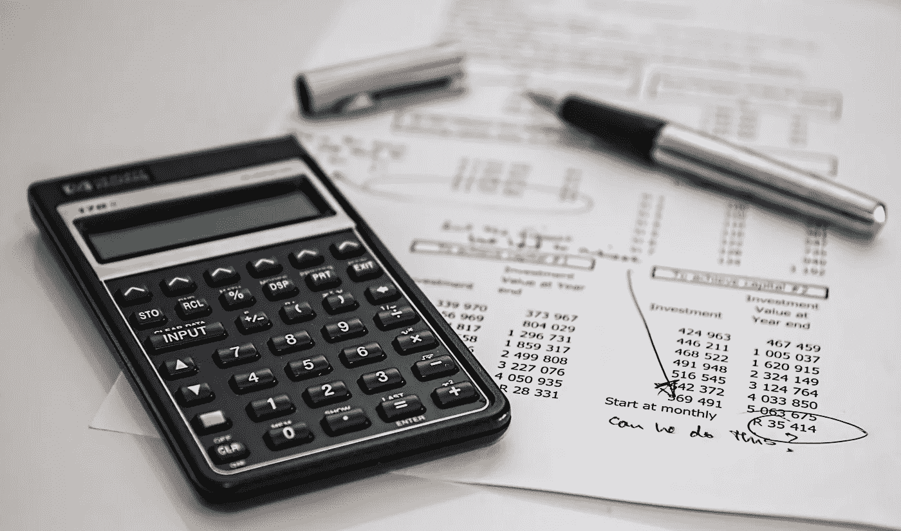
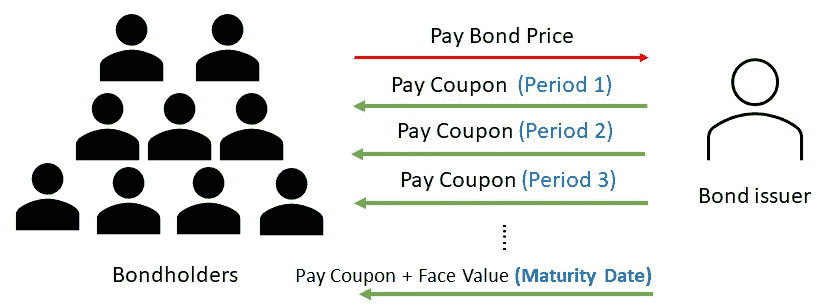
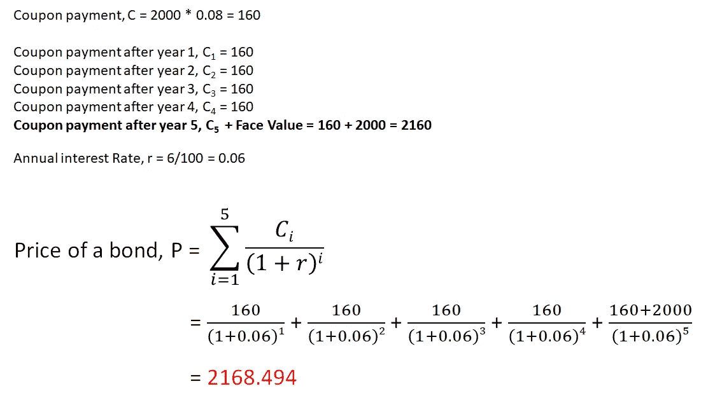
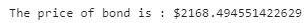
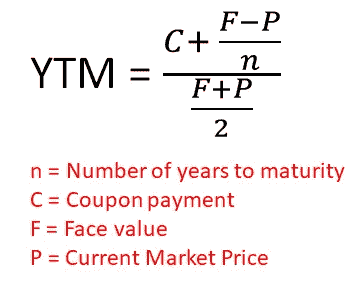
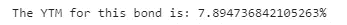

# 如何使用 Python 进行债券估值

> 原文：<https://towardsdatascience.com/how-to-perform-bond-valuation-with-python-bbd0cf77417?source=collection_archive---------12----------------------->

## Python 中通过贴现现金流分析进行债券估值的实用介绍。

照片由[像素](https://www.pexels.com/photo/black-calculator-near-ballpoint-pen-on-white-printed-paper-53621/?utm_content=attributionCopyText&utm_medium=referral&utm_source=pexels)的[皮克斯拜](https://www.pexels.com/@pixabay?utm_content=attributionCopyText&utm_medium=referral&utm_source=pexels)拍摄

债券是一种[固定收益证券](https://www.investopedia.com/terms/f/fixed-incomesecurity.asp)，也总是被称为债券持有人和债券发行人之间的 [I.O.U](https://www.investopedia.com/terms/i/iou.asp) ，包括贷款及其支付的细节。债券就像一种“债务资产”，每天都可以在市场上买卖。

在本文中，我们将了解如何使用 **Python** 对债券进行估值。这将给我们一些关于“债务”如何变成资产的想法。我们将从理解债券过程开始，然后对债券的估值进行贴现现金流分析。

# 必备 Python 库

1.  **数字财政**——[https://numpy.org/numpy-financial/](https://numpy.org/numpy-financial/)

# 开源代码库

本文中的原始完整源代码可以在我的 [Github Repo](https://github.com/teobeeguan/Python-For-Finance/blob/32f618f052ac76a6cecef2d324b0f141b8f5419b/Time%20Value%20of%20Money/Bond_Valuation.ipynb) 上获得。如果你想用它来关注我的文章，请随意下载(*Bond _ evaluation . ipynb*)。

# 粘合过程

债券支付固定金额的利息——以向债券持有人支付息票的形式。一旦债券发行过程开始，债券发行人将开始在特定的时间间隔向债券持有人支付利息(例如每年一次或每年两次等)。在到期日结束时，债券持有人还将获得贷款本金或面值。

作者准备的图像

债券持有人作为债券的所有者，有权在到期日之前收到所有的息票付款。这意味着债券持有人从支付给债券发行人的债券价格中获得利息，同时等待到期日结束以收回贷款本金。

# 债券价格的计算

我们购买债券时的价格是所有未来支付流的现值。

*例如，有一种面值为 2000 美元的债券，每年支付 8%的票面利率。如果债券将在 5 年内到期，所有贷款期限的年复合利率为 6%，债券的价格是多少？*

债券价格的计算过程如下:

作者准备的图像

从上面债券价格计算的图解中，我们可以看到价格是债券期限内 [**贴现现金流**](https://www.investopedia.com/terms/d/dcf.asp) 的总和。利率越高，债券价格越低。这意味着债券价格与利率负相关。

我们可以很容易地使用 *Python Numpy-Financial pv 函数*将整个计算过程简化成几行脚本。

**第 1–2 行:**导入所需的库。

**第 4–7 行:**定义并给所有需要的参数赋值。

**第 9 行:**应用 Python Financial-Numpy pv 函数计算债券价格。

*(注意:原始结果值将是负值，这就是我们将该值乘以-1 以将其变为正值的原因。)*

**第 10 行:**显示结果。

作者准备的图像

如上面的脚本所示，所有繁琐的计算都被封装在 *Numpy-Financial pv 函数*中。我们需要做的就是将适当的参数应用到函数中。

# 到期收益率

债券收益率是衡量我们购买的债券投资回报的指标。最常见的债券收益率指标是**到期收益率(YTM)** 。YTM 是投资者持有债券至到期时的总预期回报，用年利率表示。YTM 也被认为是债券投资的内部收益率。

近似 YTM 的公式如下:

作者准备的图像

例如，我们支付 9000 美元购买面值为 10000 美元的债券。该债券的票面年利率为 5%，将于 4 年后到期。债券投资的 YTM 是多少？

**第 1–4 行:**定义并给所有需要的参数赋值。

**第 6 行:**应用公式近似 YTM。

**第 7 行:**显示结果

该债券的 YTM 约为 7.89%。由于债券票面利率(5%)低于其 YTM，债券被折价出售。另一方面，如果票面利率高于 YTM，债券溢价出售。

YTM 有助于投资者判断购买债券是否划算。因为所有债券的所有 YTM 都以相同的年期表示，所以它可以用来比较不同到期日和票面利率的债券。

# 结论

在本文中，我们已经完成了确定债券理论公允价值的过程，并估算了 YTM。值得注意的是，息票的支付频率可以是一年一次、半年一次、每季度一次或其他周期性间隔，尽管为了简单起见，我们只关注年度支付。无论支付频率如何，债券票面利率总是以年利率表示。

我希望你喜欢阅读这篇文章。

**如果你喜欢我关于 Python for Finance 的文章，可以随意** [**订阅 Medium**](https://teobguan2013.medium.com/membership) **。我会坚持不懈地不时发表相关文章。**

# 参考

1.  [https://www.investopedia.com/terms/b/bond-valuation.asp](https://www.investopedia.com/terms/b/bond-valuation.asp)
2.  [https://courses . lumen learning . com/unlimited-finance/chapter/validating-bonds/](https://courses.lumenlearning.com/boundless-finance/chapter/valuing-bonds/)
3.  [https://www.investopedia.com/terms/y/yieldtomaturity.asp](https://www.investopedia.com/terms/y/yieldtomaturity.asp)
4.  [https://financeformulas.net/Yield_to_Maturity.html](https://financeformulas.net/Yield_to_Maturity.html)
5.  [https://scripbox . com/MF/yield-to-maturity/# yield-to-maturity-formula](https://scripbox.com/mf/yield-to-maturity/#yield-to-maturity-formula)