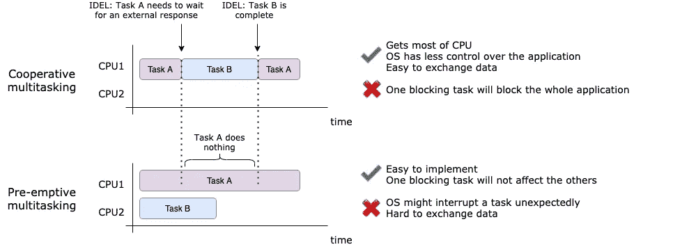

# 如何在 Flask 和 Tornado 中执行多任务处理

> 原文：<https://towardsdatascience.com/how-to-perform-multitasking-in-flask-and-tornado-3f00945f4510?source=collection_archive---------2----------------------->

## 提高阻塞和非阻塞 web 服务器的性能

马文·迈耶在 [Unsplash](https://unsplash.com/) 上的照片

M 多任务处理是指(几乎)同时执行多个任务或流程的能力。像 Flask、Django 和 Tornado 这样的现代 web 服务器都能够同时处理多个请求。由于多种解释，多任务的概念实际上非常模糊。您可以使用多重处理、多线程或异步来执行多任务处理。在本文中，我将解释这些概念之间的区别，以及如何在 Flask 和 Tornado 中执行多任务处理。如果你有使用这两个框架的经验，请告诉我们你什么时候更愿意使用其中一个。我挺好奇的:)

## **抢占式多任务 vs .协作式多任务**

一个操作系统有两种多任务选择:抢占式和协作式。在抢占式多任务处理中，应用程序可以共享操作系统(OS)及其底层资源。换句话说，允许操作系统停止当前正在运行的进程，并切换到不受应用程序控制的另一个进程。这意味着操作系统必须优雅地切换上下文。进程的隔离确保了一个进程的无限循环不会阻塞其他进程，但是，当涉及到与其他进程交换数据时，它会带来更多的复杂性。

另一方面，在协同多任务中，一个应用只使用一个主机进程，应用中的任务共享这个单个主机进程的资源。当每个任务不再需要资源时，它必须将控制权让给宿主进程。因此，操作系统对应用程序的控制较少，因为它不允许执行上下文切换。这种方法在某种程度上获得了大部分 CPU，易于扩展，并且易于与其他任务交换数据。但是如果任何一个任务停滞不前(不放弃控制权)，整个应用程序也会停滞不前。这就是 asyncio 的基本工作原理，我们将在后面详细讨论。

这张图表直观地显示了这两种类型之间的区别。

合作多任务 vs .抢先多任务，由[高](https://medium.com/u/2adc5a07e772?source=post_page-----3f00945f4510--------------------------------)创造

## **并行性与**并发性

多任务处理是在同一时间内运行几项任务的能力。这并不一定意味着这些任务必须在完全相同的时刻开始。这两种场景有不同的名称:并行和并发。

并行是指任务实际上同时开始。这可能发生在多核处理器或多线程处理器上，其中每个核/线程可以独立地启动一个任务。并发是指任务在重叠的时间段内开始、运行和完成，这可能发生在单核服务器上。如果你熟悉 Python 中的全局解释器锁(GIL)，你一定知道 Python 在一个进程中只允许一个线程控制解释器，也就是说[一个单进程多线程程序最多可以达到 100%的 CPU 利用率](https://leimao.github.io/blog/Python-Concurrency-High-Level/)。真正的 Python 已经给出了关于 GIL 的很好的教程。

 [## 什么是 Python 全局解释器锁(GIL)？-真正的蟒蛇

### Python 的全局解释器锁或 GIL，简单来说就是一个互斥体(或锁)，只允许一个线程持有…

realpython.com](https://realpython.com/python-gil/) 

在我看来，并行性相当于抢先式多任务处理，并发性相当于协作式多任务处理。

## 多重处理 vs .多线程 vs .异步

Python 中的多任务问题一般可以使用这些库之一来解决:`multiprocessing`、`threading`和`asyncio`。就使用哪个库而言，取决于用例，用例可以分为 CPU 受限或 I/O 受限。

CPU 绑定问题是指性能由 CPU 的能力决定的情况。CPU 越快或者 CPU 的内核越多，程序的性能就越高。例如处理图像、进行计算等。

I/O 受限问题是指性能由输入/输出操作完成的等待时间决定的情况。I/O 越快，我们获得的性能就越高。例如发出 HTTP 请求、读取文件等。

一个简单的规则是，`multiprocessing`适合 CPU 受限的问题，`threading`和`asyncio`适合 I/O 受限的问题。但是`threading`和`asyncio`有什么不同呢？如果用我们目前掌握的知识，`threading`解决抢占式多任务，`asyncio`解决协作式多任务。Python 维护一个线程池，当需要时，可以从池中检索新的线程。应该注意的是，所有线程共享相同的内存，因此需要锁定来确保一次只有一个线程可以写入内存中的相同对象。

在`asyncio`中你不用担心这个，因为它在单个进程中使用单线程。但是，`asyncio`的缺点是你应该记得把控制权还给事件循环(通过`yield`)，否则程序会被阻塞。此外，一旦你使用了`asyncio`，所有的内部函数/库也应该支持异步。这需要在编码方面付出更多的努力。

如果你想深入研究`threading`和`asyncio`，我也推荐以下来自《真实的 Python》的优秀文章。

 [## Python 线程介绍——真正的 Python

### 立即观看本教程有一个由真正的 Python 团队创建的相关视频课程。和书面的一起看…

realpython.com](https://realpython.com/intro-to-python-threading/)  [## Python 中的异步 IO:完整的演练-真实的 Python

### 以下是您将涉及的内容:您需要 Python 3.7 或更高版本来完整地阅读本文，以及…

realpython.com](https://realpython.com/async-io-python/) 

我花了相当多的时间介绍多任务处理的问题和理论，我认为在进入代码之前了解这些是非常重要的。我希望你现在已经打好了基础。让我们进入有趣的部分吧！

## 烧瓶 vs .龙卷风

Flask 和 Tornado 都是 Python 世界中流行的 web 框架，目的不同。Flask 是一个基于 WSGI 的轻量级 web 框架，Tornado 是一个 web 框架，也是一个异步网络库。

***如何处理并发请求？***

这种不同的设置也意味着它们将以不同的方式处理并发请求。从 Flask 1.0 开始，默认情况下 flask server 是多线程的。每个新请求都在一个新线程中处理。

这是一个使用默认设置的简单烧瓶应用程序。出于演示目的，我在返回响应之前放置了`sleep(1)`。它能够在大约 2 秒钟内处理 10 个并发请求。

带螺纹的烧瓶应用程序=True

如果我禁用线程模式，您可以看到性能的巨大差异。是因为这个同步服务器现在只有一个线程，所以每个请求都是在前一个完成之后开始的。

带螺纹的烧瓶应用程序=假

现在，让我们来看看龙卷风。这也是一个响应中带有`sleep(1)`的简单例子。然而，处理 10 个并发请求需要 10 秒钟。嗯，这里出了什么问题？

带同步代码的 Tornado 应用

原因是 Tornado 是一个只有一个线程的异步服务器。这个例子实际上与第二个烧瓶例子的情况相同。为了使用异步服务器，阻塞代码`time.sleep(1)`(实际上是您可能有的所有阻塞代码)必须被非阻塞代码替换。这就是为什么我之前说过，我们需要更多地了解异步中的编码部分，因为任何隐藏的阻塞代码都可能阻塞整个应用程序，而且我们大多数人更习惯于编写同步代码而不是异步代码。

解决方案之一是使用异步版本的`sleep`，即`tornado.gen.sleep`。结果与第一个烧瓶示例相同。此外，完整功能与`async/await`关键字异步。

带有异步代码的 Tornado 应用程序

***如何在请求过程中进行多任务处理？***

我们讨论了如何在 Flask 和 Tornado 中处理并发任务，这是多任务处理的一种。另一种类型的多任务发生在请求的处理过程中。例如，在返回响应之前，服务器需要从 5 个不同的端点收集数据。如果服务器逐个执行请求，将会对性能产生巨大影响。

在这种背景下，我们不需要太依赖框架本身。这是如何在同步和异步应用程序中处理并发 web 请求的问题。由于是 I/O 操作，`threading`和`asyncio`比`multiprocessing`要好。

下面是`ThreadPoolExecutor`在 Flask 中的实现。性能和前面的例子一样高。

Flask 中的并发请求

这就是你在龙卷风中可以做到的。请记住，在异步应用程序中，一切都应该是异步的。出于演示的目的，我使用了一个模拟函数，但是实际上，您应该使用一个类似于`aiohttp`的异步 HTTP 库。

Tornado 中的并发请求

***如何运行后台任务？***

最后但同样重要的是，我想向您展示如何在 Flask 和 Tornado 应用程序中运行后台任务。如果您想要调度作业或让某些东西连续运行而不干扰主进程，后台任务会非常有用。

一般来说，Tornado 更支持后台任务，但您也可以在 Flask 中实现这一点。

就像前两个场景一样，我们可以再次使用`threading`在 Flask 中实现这一点。需要注意的是，后台作业的启动要在 Flask app 启动之前完成。

烧瓶中的后台任务

查看[这个博客](https://smirnov-am.github.io/background-jobs-with-flask/)，看看如何使用 uWSGI 在 Flask 中进行后台作业。

在这种情况下，Tornado 有两种不同的方式使用其本机功能来实现这一点:`[spawn_callback](https://www.tornadoweb.org/en/stable/ioloop.html#tornado.ioloop.IOLoop.spawn_callback)`和`[PeriodicCallback](https://www.tornadoweb.org/en/stable/ioloop.html#tornado.ioloop.PeriodicCallback)`。它们的主要区别在于，`spawn_callback`是一个“一劳永逸”的功能，在启动作业后你没有任何控制权，而`PeriodicCallback`返回给你一个任务实例，你可以在以后启动和停止。

在龙卷风中使用 spawn_callback

这是一个周而复始的例子。在启动 web 服务器之前，不要忘记启动该任务。

在 Tornado 中使用 PeriodicCallback

## 结论

在本文中，我们从 3 个不同的角度讨论了如何在 Flask 和 Tornado 中执行多任务。在此之前，我们详细介绍了两种多任务模式以及多处理、多线程和异步之间的区别。

希望这篇文章对你有帮助！如果你有任何想法，请在下面留下你的评论。

## 参考

 [## Python 中的多处理 VS 线程 VS 异步

### 在现代计算机编程中，经常需要并发来加速解决问题。在 Python 编程中…

雷猫. github.i](https://leimao.github.io/blog/Python-Concurrency-High-Level/)