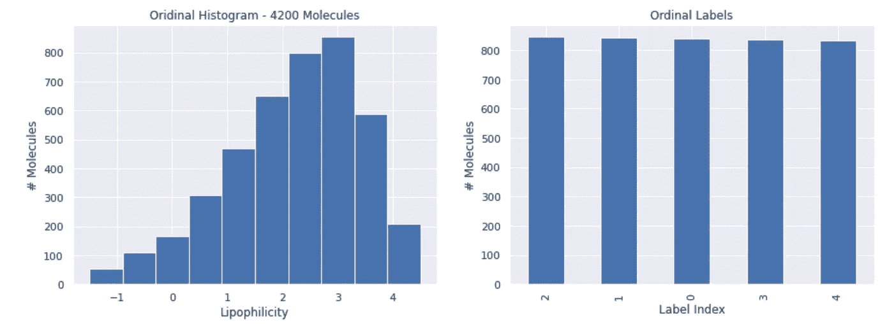
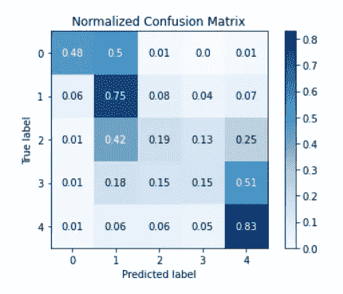
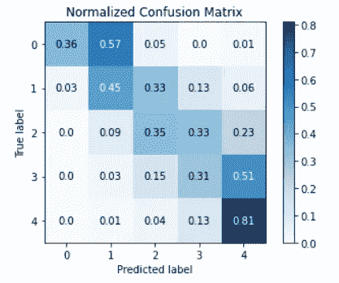
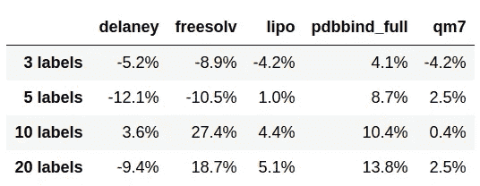

# 如何在 PyTorch 中执行有序回归/分类

> 原文：<https://towardsdatascience.com/how-to-perform-ordinal-regression-classification-in-pytorch-361a2a095a99?source=collection_archive---------4----------------------->

## 订购标签时提高模型性能的一个简单技巧。


由 vectorjuice 创建的抽象向量—[www.freepik.com](http://www.freepik.com)

当你有一个多类分类问题，并且这些类是有序的，这就是所谓的“有序回归”问题。一个例子可以是将学生的表现分类为 A > B > C > D > E。使用普通分类器解决这类问题的问题是，模型会假设将 *A* 误分类为 *D* 的错误与将 *A* 误分类为 *B* 的错误一样严重——这显然是不正确的，因为 *A* 和 *D* 之间的差异要比它们之间的差异大得多有序回归的另一个名字是*有序分类*或者甚至*排序学习；*你可能已经猜到了，这些方法让模型知道类的顺序关系，让模型*学习排序*，而不是*学习分类*。

这篇文章将展示一个使用自定义损失函数在 PyTorch 中执行有序回归的简单技巧。虽然我将针对一个特定的问题介绍这个技巧，但是你可以将它应用于任何顺序回归问题和任何其他框架。

## 一个序数问题的例子

让我们首先找到一个数据集进行测试。我最近写了一篇关于[如何预测化学分子的性质](/chemical-predictions-with-3-lines-of-code-c4c6a4ce7378)的帖子——通常对于这类问题，预测分子性质是否在给定范围内是很有趣的，例如，我们可能在预测不同分子对于给定任务的效率，我们希望将这种效率分为*高>中>低*。

[](/chemical-predictions-with-3-lines-of-code-c4c6a4ce7378) [## 三行代码的化学预测

### 使用 Chemprop & graph 神经网络的最新结果

towardsdatascience.com](/chemical-predictions-with-3-lines-of-code-c4c6a4ce7378) 

为了测试，我从 [GitHub](https://github.com/chemprop/chemprop) 获取了一个“亲脂性”回归数据集，其中包含 2100 个分子及其相关的亲脂性测量值(在油中的溶解度)。我将数据集转换为多类有序分类问题，目标是将分子分为 5 类:*最低<低<中<高<最高。*

以下是序数问题的数据分布概述:



**左)**回归数据集中目标的原始分布。**右)**左边的数据集转换成五个大小相等的顺序标签，对应*最低<低<中<高<最高。由作者策划。*

## 基线模型:正常分类

正如我在[上一篇文章](/chemical-predictions-with-3-lines-of-code-c4c6a4ce7378)中所展示的，很容易为我们的数据集快速训练一个标准分类模型，“标准”，这意味着它是用给定 5 个定义的类的正常交叉熵损失函数来训练的。作为最初的评估，我将数据集分为 50%的训练和 50%的测试，并在测试数据集上运行我的评估。结果如下:



用交叉熵损失训练的模型的混淆矩阵。由作者策划。

它的表现不太稳定；它在划分低等级和高等级方面相当不错，但是对于中等等级就不那么好了。

## 有序回归模型

现在让我们试着训练一个序数模型；我们使用的技巧是由程等人在 2008 年介绍的。我们的想法是将每个类转换成以下向量:

```
Lowest  -> [1,0,0,0,0]
Low     -> [1,1,0,0,0]
Medium  -> [1,1,1,0,0]
High    -> [1,1,1,1,0]
Highest -> [1,1,1,1,1]
```

这个简单编码(或类似的变体)的酷之处在于，类之间的差异遵循一个顺序尺度；即*最低*与*最高*之差大于*最低*与*中等*之差。

我们的网络的想法是为每个标签输出一个具有二进制分数的 5 维向量(例如，最终层上的 sigmoid 激活函数),并训练它来预测这些独一无二的嵌入。一旦我们对其进行了训练，我们就可以通过对我们的预测应用大于 0.5 的阈值，并从左到右计数预测中(即代码中)出现了多少个连续的`True`值，来将预测转换回目标标签:

显示如何将预测转换为目标标签的示例代码。作者代码。

为了训练网络，我们需要一个合适的损失函数。2008 年的论文指出，这可以是二元交叉熵损失，也可以是平方误差损失。要了解误差如何随着类间距离的增加而增加，请考虑以下平方误差函数的情况:

```
Lowest vs. Lowest: (1-1)²+0+0+0+0 = 0
Lowest vs. Low: (1-1)²+(0–1)²+0+0+0 = 1
Lowest vs. Medium: (1–1)²+(0–1)²+(0–1)²+0+0 = 2
Lowest vs. High: (1–1)²+(0–1)²+(0–1)²+(0–1)²+0 = 3
Lowest vs. Highest: (1–1)²+(0–1)²+(0–1)²+(0–1)²+(0–1)² = 4
```

损失函数应该以两个参数作为输入，即`predictions`和`targets`。在我们的设置中，`predictions`数组的输入维数是[batch_size × 5]，而`targets`数组只是一个标签 id 列表。为了执行有序回归，我们需要根据我们之前的编码将`targets`列表扩展为`[batch_size, num_labels]`张量，并返回预测和扩展目标之间的均方误差损失:

损失函数的代码，它首先对目标标签进行编码，然后计算 MSE。作者代码。

如果我们用这个损失函数重新训练我们的模型，结果是:



用有序损失函数训练的模型的混淆矩阵。由作者策划。

显然，结果看起来比之前的分类运行更“斜”，这表明，事实上，我们更多地惩罚了在序数尺度上偏离几个标签的模型。我们能量化这种方法的效果吗？一种选择是查看标签指数的均方根误差(RMSE ),即我们的预测距离目标大约有多少个类别。在这个测试案例中，分类模型的 RMSE 是 1.06，而顺序模型的是 0.93，提高了 12%！

但是！这只是针对一个数据集的一个随机训练测试分割——为了完整起见，我使用 10 倍交叉验证(CV)对多个数据集和不同数量的标签进行了量化；这应该让我们更现实地了解这两种方法的优劣。折叠外的结果如下，其中我列出了 RMSE 误差的%改进:



顺序训练代替交叉熵训练对 RMSE 的改进。每一列都是一个独立的数据集，分为 3、5、10 或 20 个标签。

在大多数情况下，我们实现了改进，但是偶尔结果是相反的——性能*随着顺序损失而降低*。怎么会这样呢？除了数据集和我们正在建模的内容的根本差异之外，还有一些潜在的因素浮现在脑海中:

*   **数据集大小；**如果我们有一个大的数据集，我们可能对每个标签有足够数量的样本来执行正常分类，交叉熵损失可能比有序损失函数表现得更好。为了测试这一点，我们可以运行相同的 CV，其中我们只从每个数据集挑选 500 个分子(明显少于完整的数据集)。结果(如下所示)好得多；但是，对于某些数据集组合，有序损失函数的性能仍然比多类模型差。天下没有免费的午餐，所以这种序数伎俩显然不能保证奏效。


在只有 500 个分子的数据集上，通过顺序训练而不是交叉熵训练来改善 RMSE。每一列都是一个独立的数据集，分为 3、5、10 或 20 个标签。

*   **排名不一致；**如果我们的顺序预测输出`[0.9, 0.9, 0.49, 0.72, 0.1]`会怎么样。从左到右的迭代将导致预测标签为 2(因为 0.49 < 0.5)，即使正确答案也可能是 4(因为 0.72 > 0.5)。我发现在任何预测中几乎没有等级不一致，所以这不是性能下降的原因。

## 结束语

使用有序目标类时，使用有序损失函数可以快速获得显著的性能提升。然而，没有免费的午餐，我们应该用不同的损失函数训练模型，看看什么对给定的数据集最有效

在 2020 年，Cao *等人*在[2]中发表了一种方法，该方法使用神经网络的共享倒数第二层，对每个二进制输出使用单独的偏置单元，以秩一致的方式执行有序回归。他们在这个 [Github 库](https://github.com/raschka-research-group/coral_pytorch)中发布了他们的 *Coral* 方法。尽管本帖中提出的问题集中没有等级不一致，但我确实尝试在本帖中执行的 CV 测试中使用 Coral，但这些数据集的性能一直较差。这再次表明，没有免费的午餐，一个人应该总是尝试多种事情。

[1] [简麟程](https://ieeexplore.ieee.org/author/37673823700)；[郑旺](https://ieeexplore.ieee.org/author/37675519600)； [Gianluca Pollastri](https://ieeexplore.ieee.org/author/37694852700) ，有序回归的神经网络方法(2008 年) [IEEE 国际神经网络联合会议](https://ieeexplore.ieee.org/xpl/conhome/4625775/proceeding)

[2]曹，瓦希德米尔贾利利，塞巴斯蒂安拉什卡，秩一致序贯回归神经网络及其在年龄估计中的应用(2020)，[模式识别字母](https://www.sciencedirect.com/science/article/pii/S016786552030413X?via%3Dihub)。