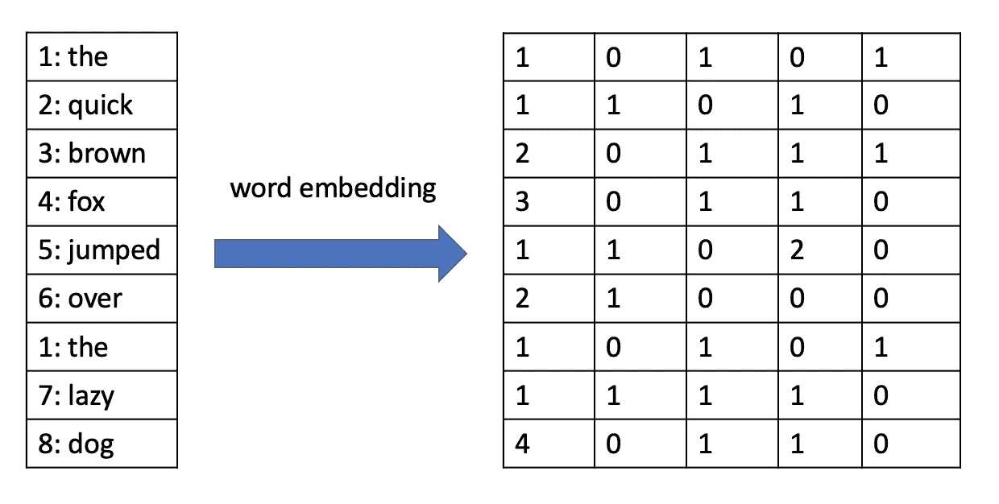
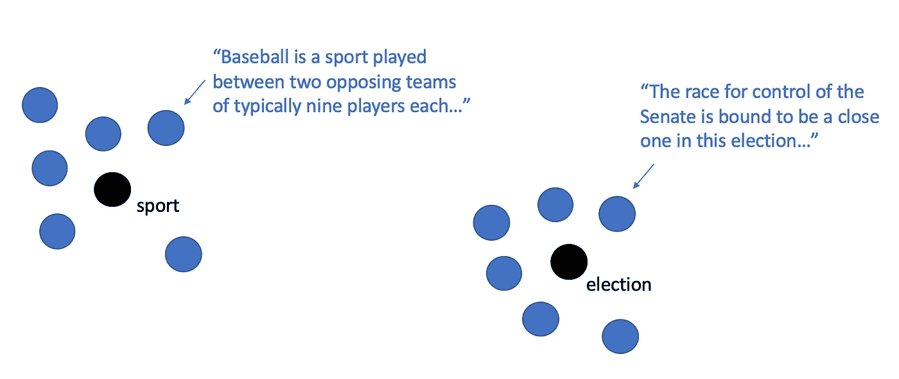
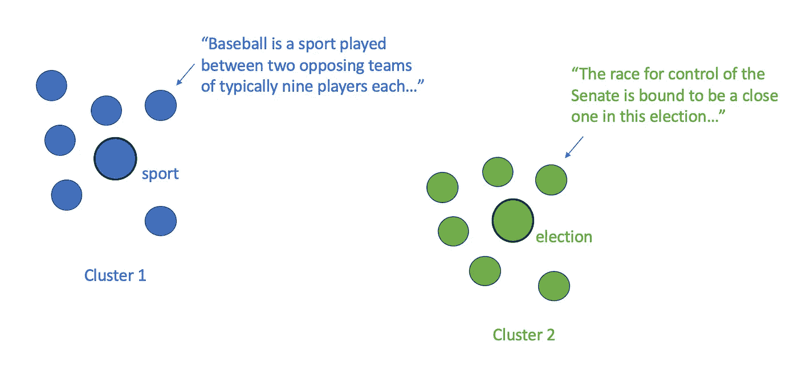
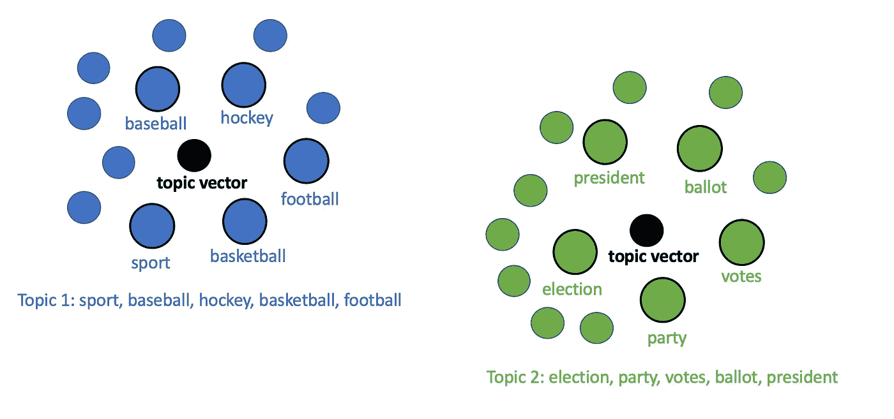
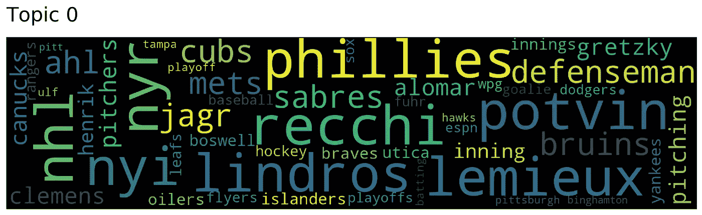

# 如何用 Top2Vec 进行主题建模

> 原文：<https://towardsdatascience.com/how-to-perform-topic-modeling-with-top2vec-1ae9bb4e89dc?source=collection_archive---------3----------------------->

## 介绍一种更复杂的主题建模方法。


格伦·卡丽在 [Unsplash](https://unsplash.com/s/photos/words?utm_source=unsplash&utm_medium=referral&utm_content=creditCopyText) 拍摄的照片

主题建模是自然语言处理中的一个问题，在现实世界中有许多应用。能够在大段文本中发现主题有助于我们更详细地理解文本数据。

多年来，潜在狄利克雷分配(LDA)一直是主题建模最常用的算法。该算法于 2003 年首次推出，将主题视为不同单词出现的概率分布。如果你想看看 LDA 的实际应用，你应该看看我下面的文章，我在假新闻分类数据集上执行了 LDA。

</fake-news-classification-with-recurrent-convolutional-neural-networks-4a081ff69f1a>  

然而，随着 transformer 模型和嵌入算法(如 Doc2Vec)的引入，我们可以创建更复杂的主题模型来捕捉单词中的语义相似性。事实上，一种叫做 [Top2Vec](https://arxiv.org/pdf/2008.09470.pdf) 的算法使得使用嵌入向量和聚类建立主题模型成为可能。在本文中，我将展示如何使用 Top2Vec 通过嵌入向量和聚类技术来执行无监督的主题建模。

# Top2Vec 是如何工作的？

Top2Vec 是一种算法，它检测文本中存在的主题，并生成联合嵌入的主题、文档和单词向量。在高层次上，该算法执行以下步骤来发现文档列表中的主题。

1.  **为文档和文字生成嵌入向量。**
2.  **使用 UMAP 等算法对向量进行降维。**
3.  **使用聚类算法(如 HDBSCAN)对向量进行聚类。**
4.  **给每个集群分配主题。**

我在下面详细解释了每个步骤。

## 为文档和单词生成嵌入向量

嵌入向量是允许我们在多维空间中表示单词或文本文档的向量。嵌入向量背后的思想是相似的单词或文本文档将具有相似的向量。



一个句子的单词嵌入，每个单词有 5 维向量。图片由作者提供。

生成嵌入向量的算法有很多。Word2Vec 和 Doc2Vec 非常流行，但近年来，NLP 开发人员和研究人员已经开始使用转换器来生成嵌入向量。如果你有兴趣了解更多关于变形金刚的知识，可以看看我下面的文章。

</what-are-transformers-and-how-can-you-use-them-f7ccd546071a>  

为每个文档创建嵌入向量允许我们将每个文档视为多维空间中的一个点。Top2Vec 还创建了联合嵌入的单词向量，这使得我们可以在以后确定主题关键词。



联合嵌入的单词和文档向量。图片由作者提供。

一旦我们有了一组单词和文档向量，我们就可以进入下一步。

## 执行降维

在我们有了每个文档的向量之后，下一个自然的步骤是使用聚类算法将它们分成簇。然而，根据所使用的嵌入模型，从第一步生成的向量可以具有多达 512 个分量。

因此，执行某种降维算法来减少数据中的维数是有意义的。Top2Vec 使用一种称为 UMAP(均匀流形逼近和投影)的算法来为每个文档生成低维嵌入向量。

## 聚集向量

Top2Vec 使用 HDBSCAN(一种基于密度的分层聚类算法)来查找文档的密集区域。HDBSCAN 基本上只是 DBSCAN 算法的扩展，它将 DBSCAN 算法转换为层次聚类算法。使用 HDBSCAN 进行主题建模是有意义的，因为较大的主题可以由几个子主题组成。



聚类文档和单词向量。图片由作者提供。

## 为每个集群分配主题

一旦我们有了每个文档的集群，我们就可以简单地将每个文档集群视为主题模型中的一个单独的主题。每个主题可以被表示为主题向量，该主题向量实质上就是属于该主题聚类的原始文档的质心(平均点)。为了使用一组关键词来标记主题，我们可以计算与主题质心向量最近的 n 个单词。



主题群和关键词。图片由作者提供。

一旦我们有了每个主题的关键词，算法的工作就完成了，由我们人类来解释这些主题的真正含义。虽然 Top2Vec 比主题建模的标准 LDA 方法复杂得多，但它可能会给我们带来更好的结果，因为单词和文档的嵌入向量可以有效地捕捉单词和短语的含义。

# 安装 Top2Vec

您可以使用 pip 和以下命令安装 Top2Vec:

```
pip install top2vec
```

您还可以安装带有附加选项的 Top2Vec，如 [Top2Vec GitHub 库](https://github.com/ddangelov/Top2Vec)中的 README 文档所示。

为了让 Top2Vec 安装本教程所需的预训练通用语句编码器，您应该运行以下命令。

```
pip install top2vec[sentence_encoders]
```

# Top2Vec 教程

在本教程中，我将演示如何使用 Top2Vec 在 [20 个新闻组文本数据集](https://scikit-learn.org/0.19/datasets/twenty_newsgroups.html)中发现主题。这个数据集包含大约 18000 个新闻组帖子，涉及 20 个主题。你可以在 [GitHub](https://github.com/AmolMavuduru/Top2Vec-Tutorial) 上访问本教程的[完整代码](https://github.com/AmolMavuduru/Top2Vec-Tutorial)。

## 导入库

```
import numpy as np
import pandas as pd
from top2vec import Top2Vec
```

## 读取数据

对于本教程，我将使用 [20 个新闻组文本数据集](https://scikit-learn.org/0.19/datasets/twenty_newsgroups.html)。这个数据集包含大约 18000 个新闻组帖子，涉及 20 个主题。我们可以通过 Scikit-learn 下载数据集[，如下所示。](https://scikit-learn.org/0.19/datasets/twenty_newsgroups.html)

```
from sklearn.datasets import fetch_20newsgroupsnewsgroups = fetch_20newsgroups(subset='all', remove=('headers', 'footers', 'quotes'))
```

## 训练 Top2Vec 模型

训练 Top2Vec 模型非常容易，只需要一行代码，如下所示。

```
from top2vec import Top2Vecmodel = Top2Vec(articles_df['content'].values, embedding_model='universal-sentence-encoder')
```

注意，我使用了上面的通用句子编码器嵌入模型。如果您安装了带有句子编码器选项的 Top2Vec，那么您可以使用这个模型。否则，只需删除该参数，默认情况下，模型将使用 Doc2Vec 嵌入进行训练。

## 查看主题的数量

一旦 Top2Vec 模型根据数据进行了训练，我们就可以使用 model 对象来获取关于所提取主题的信息。例如，我们可以查看使用 **get_num_topics** 函数发现的主题数量，如下所示。

```
model.get_num_topics()
```

运行上面的代码会产生以下输出。

```
100
```

## 获取每个主题的关键词

Top2Vec 模型有一个名为 **topic_words** 的属性，它基本上只是一个 Numpy 数组，包含每个主题的单词列表。

```
model.topic_words
```

在 Jupyter 笔记本单元格中运行上面的代码会产生以下输出。

```
array([['recchi', 'potvin', 'nyr', ..., 'pittsburgh', 'binghamton',
        'pitt'],
       ['diagnosed', 'symptoms', 'diagnosis', ..., 'mfm', 'affected',
        'admitted'],
       ['spacecraft', 'jpl', 'orbiter', ..., 'scientist', 'convention',
        'comet'],
       ...,
       ['liefeld', 'wolverine', 'comics', ..., 'requests', 'tickets',
        'lemieux'],
       ['vice', 'pacific', 'bay', ..., 'projects', 'chapter', 'caps'],
       ['armenians', 'ankara', 'armenian', ..., 'discussed',
        'azerbaijani', 'whom']], dtype='<U15')
```

如果我们想看到特定主题的单词，我们可以简单地索引这个数组，如下所示。

```
model.topic_words[0]
```

上面的代码给出了主题 0 的单词列表。

```
array(['recchi', 'potvin', 'nyr', 'nyi', 'lemieux', 'lindros', 'nhl',
       'phillies', 'defenseman', 'mets', 'ahl', 'jagr', 'bruins',
       'sabres', 'cubs', 'gretzky', 'alomar', 'pitchers', 'pitching',
       'clemens', 'canucks', 'inning', 'henrik', 'innings', 'yankees',
       'oilers', 'utica', 'islanders', 'boswell', 'braves', 'hockey',
       'rangers', 'leafs', 'flyers', 'sox', 'playoffs', 'wpg', 'baseball',
       'dodgers', 'espn', 'goalie', 'fuhr', 'playoff', 'ulf', 'hawks',
       'batting', 'tampa', 'pittsburgh', 'binghamton', 'pitt'],
      dtype='<U15')
```

正如我们所看到的，这个话题似乎主要是关于体育，尤其是棒球和曲棍球，因为我们看到了流行的棒球队的名字以及曲棍球运动员的姓氏。

## 创建主题词云

我们可以轻松地为主题生成词云，以便更好地了解主题中关键词的频率。

```
model.generate_topic_wordcloud(0)
```

运行上面的代码会产生下面的单词 cloud。



话题 0 的词云。图片由作者提供。

上面的单词云很有用，因为它让我们直观地了解不同单词与主题的相对频率。我们可以看到“费城人”和“雷米尔”这样的词比“季后赛”或“坦帕”这样的词出现的频率更高。

## 访问主题向量

**topic_vectors** 属性允许我们访问每个主题的主题向量，如下所示。

```
model.topic_vectors
```

正如我们在下面的输出中看到的，Top2Vec 模型的主题向量存储为一个二维 Numpy 数组，其中每一行对应一个特定的主题向量。

```
array([[-9.1372393e-03, -8.8540517e-02, -5.1944017e-02, ...,
         2.0455582e-02, -1.1964893e-01, -1.1116098e-04],
       [-4.0708046e-02, -2.6885601e-02,  2.2835255e-02, ...,
         7.2831921e-02, -6.1708521e-02, -5.2916467e-02],
       [-3.2222651e-02, -4.7691587e-02, -2.9298926e-02, ...,
         4.8001394e-02, -4.6445496e-02, -3.5007432e-02],
       ...,
       [-4.3788709e-02, -6.5007553e-02,  5.3533200e-02, ...,
         2.7984662e-02,  6.5978311e-02, -4.4375043e-02],
       [ 1.2126865e-02, -4.5126071e-03, -4.6988029e-02, ...,
         3.7431438e-02, -1.2432544e-02, -5.3018846e-02],
       [-5.2520853e-02,  4.9585234e-02,  5.9694829e-03, ...,
         4.1887209e-02, -2.1055080e-02, -5.4151181e-02]], dtype=float32)
```

例如，如果我们想要访问任何主题的向量，我们可以简单地基于我们正在寻找的主题编号来索引 Numpy 数组。

## 使用模型的嵌入函数

我们还可以使用 Top2Vec 模型使用的嵌入模型来为文本的任何部分生成文档嵌入，如下所示。请注意，如果在训练 Top2Vec 模型时没有指定嵌入模型，这是不可能的。

```
embedding_vector = model.embed(["This is a fake news article."])
embedding_vector.shape
```

运行上面的函数会产生以下输出。

```
TensorShape([1, 512])
```

根据上面的输出，我们可以看到嵌入模型将文本转换为 Python 张量对象形式的 512 维向量。

## 使用关键词搜索主题

我们可以使用关键字搜索主题，如下所示。请注意，该函数返回搜索中找到的每个主题的主题关键字、单词分数、主题分数和主题编号的列表。

```
topic_words, word_scores, topic_scores, topic_nums = model.search_topics(keywords=["politics"], num_topics=3)
```

我们可以看看主题单词和主题分数，看看搜索返回了什么主题。

```
topic_words, topic_scores
```

上面的代码在 Jupyter 中产生以下输出。

```
([array(['clinton', 'bush', 'president', 'reagan', 'democratic',
         'republicans', 'elected', 'congress', 'wiretap', 'administration',
         'election', 'johnson', 'politically', 'politicians', 'politics',
         'political', 'executive', 'senate', 'bill', 'constitutional',
         'democracy', 'lib', 'government', 'gov', 'iraq', 'corrupt',
         'convention', 'rockefeller', 'nist', 'ford', 'grant',
         'libertarian', 'nuy', 'govt', 'feds', 'libertarians', 'decades',
         'recall', 'ws', 'bureau', 'bullshit', 'nsa', 'stephanopoulos',
         'weren', 'liar', 'koresh', 'affairs', 'barry', 'conservative',
         'secretary'], dtype='<U15'),
  array(['um', 'ci', 'oo', 'll', 'ye', 'hmm', 'un', 'uh', 'y_', 'wt', 'on',
         'uu', 'actually', 'an', 'eh', 'way', 'des', 'er', 'se', 'not',
         'has', 'huh', 'of', 'ya', 'so', 'it', 'in', 'le', 'upon', 'hm',
         'one', 'is', 'es', 'ne', 'at', 'what', 'no', 'au', 'est', 'shut',
         'mm', 'got', 'dont', 'lo', 'tu', 'en', 'the', 'have', 'am',
         'there'], dtype='<U15'),
  array(['libertarian', 'libertarians', 'govt', 'liberties', 'democracy',
         'democratic', 'government', 'conservative', 'gov', 'republicans',
         'governments', 'liberty', 'constitutional', 'opposed', 'communist',
         'politically', 'advocate', 'citizens', 'premise', 'opposition',
         'patents', 'fascist', 'opposing', 'compromise', 'feds', 'liberal',
         'politicians', 'independent', 'reform', 'johnson', 'philosophy',
         'ron', 'citizen', 'aclu', 'politics', 'frankly', 'xt', 'defend',
         'political', 'regulated', 'militia', 'republic', 'radical',
         'against', 'amendment', 'unified', 'argument', 'revolution',
         'senate', 'obey'], dtype='<U15')],
 array([0.23019153, 0.21416718, 0.19618901]))
```

我们可以看到题目也是按照题目分值来排序的。相似性得分最高的主题首先显示在上面的第一个列表中。

## 按主题搜索文档

通过**search _ documents _ by _ topic**功能，我们可以很容易地找到属于特定主题的文档。这个函数需要一个主题号和我们想要检索的文档数。

```
model.search_documents_by_topic(0, num_docs=1)
```

运行上面的函数会产生以下输出。

```
(array(['\nI think this guy is going to be just a little bit disappointed.  Lemieux\ntwo, Tocchet, Mullen, Tippett, and Jagr.  I buzzed my friend because I forgot\nwho had scored Mullen\'s goal.  I said, "Who scored?  Lemieux two, Tocchet,\nTippett, Jagr."  The funny part was I said the "Jagr" part non-chalantly as\nhe was in the process of scoring while I was asking this question!!! :-)\n\nAll in all ABC\'s coverage wasn\'t bad.  On a scale of 1-10, I give it about\nan 8\.  How were the games in the Chi/St. Louis/LA area???\n\n\nThat\'s stupid!!!  I\'d complain to the television network!  If I were to even\nsee a Pirates game on instead of a Penguins game at this time of the year, I\nand many other Pittsburghers would surely raise hell!!!\n\n\nTexas is off to a good start, they may pull it out this year.  Whoops!  That\nbelongs in rec.sport.baseball!!!'],
       dtype=object),
 array([0.75086796], dtype=float32),
 array([12405]))
```

我们可以看到上面的文章肯定是关于棒球的，这与我们对第一个话题的解读相吻合。

## 减少话题的数量

有时 Top2Vec 模型会发现许多小主题，很难处理这么多不同的主题。幸运的是，Top2Vec 允许我们执行分层主题缩减，它迭代地合并相似的主题，直到我们达到期望的主题数量。我们可以将模型中的主题数量从 100 个减少到 20 个，如下面的代码所示。

```
topic_mapping = model.hierarchical_topic_reduction(num_topics=20)
```

该函数返回的主题映射是一个嵌套列表，它解释了哪些主题已经合并在一起形成了 20 个更大的主题。

如果我们想查看 topic 1 中的原始主题，我们可以在 Jupyter 中运行以下代码。

```
topic_mapping[1]
```

上面的代码产生了下面的合并主题编号列表。

```
[52, 61, 75, 13, 37, 72, 14, 21, 19, 74, 65, 15]
```

然而，使用这种映射可能有点乏味，所以 Top2Vec 允许我们访问具有新属性的新主题的信息。例如，我们可以使用 **topic_words_reduced** 属性来访问新的主题关键字。

```
model.topic_words_reduced[1]
```

运行上面的代码为我们提供了以下主题 1 的关键字更新列表:

```
array(['irq', 'mhz', 'processor', 'sgi', 'motherboard', 'risc',
       'processors', 'ati', 'dma', 'scsi', 'cmos', 'powerbook', 'vms',
       'vga', 'cpu', 'packard', 'bsd', 'baud', 'maxtor', 'ansi',
       'hardware', 'ieee', 'xt', 'ibm', 'computer', 'workstation', 'vesa',
       'printers', 'deskjet', 'msdos', 'modems', 'intel', 'printer',
       'linux', 'floppies', 'computing', 'implementations',
       'workstations', 'hp', 'macs', 'monitor', 'vram', 'unix', 'telnet',
       'bios', 'pcs', 'specs', 'oscillator', 'cdrom', 'pc'], dtype='<U15')
```

基于上面的关键词，我们可以看到这个话题似乎大多是关于电脑硬件的。

关于 Top2Vec 中可用功能的更多细节，请查看 [Top2Vec GitHub 库](https://github.com/ddangelov/Top2Vec)。我希望这篇教程对你有用。

# 摘要

Top2Vec 是最近开发的主题建模算法，可能在不久的将来取代 LDA。与 LDA 不同，Top2Vec 生成联合嵌入的单词和文档向量，并对这些向量进行聚类，以便在文本数据中找到主题。开源的 Top2Vec 库也非常容易使用，并允许开发人员在一行代码中训练复杂的主题模型。

像往常一样，你可以在 [GitHub](https://github.com/AmolMavuduru/Top2Vec-Tutorial) 上找到这篇文章的完整代码。

# 加入我的邮件列表

你想在数据科学和机器学习方面变得更好吗？您想了解数据科学和机器学习社区的最新图书馆、开发和研究吗？

加入我的[邮件列表](https://mailchi.mp/e8dd82679724/amols-data-science-blog)，获取我的数据科学内容的更新。当你[注册](https://mailchi.mp/e8dd82679724/amols-data-science-blog)的时候，你还会得到我免费的**解决机器学习问题的逐步指南**！你也可以在 [Twitter](https://twitter.com/amolmavuduru1) 上关注我的内容更新。

当你这么做的时候，考虑加入媒体社区，阅读成千上万其他作家的文章。

# 来源

1.  D.M. Blei，A. Y. Ng，M. I. Jordan，[潜在狄利克雷分配](https://www.jmlr.org/papers/volume3/blei03a/blei03a.pdf)，(2003)，机器学习研究杂志 3。
2.  D.arXiv.org，安杰洛夫， [Top2Vec:主题的分布式表示](https://arxiv.org/pdf/2008.09470.pdf)，(2020)。
3.  长度 arXiv.org，麦金尼斯，j .希利和 j .梅尔维尔， [UMAP:一致流形近似和降维投影](https://arxiv.org/pdf/1802.03426.pdf)，(2020)。
4.  C.Malzer 和 M. Baum，(2021)，arXiv.org。