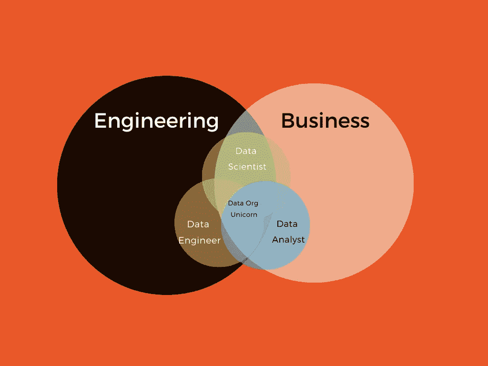

# 如何在数据世界中选择合适的职业

> 原文：<https://towardsdatascience.com/how-to-pick-the-right-career-in-the-data-world-1cec8a084767?source=collection_archive---------10----------------------->

科里·伍德沃在 [Unsplash](https://unsplash.com?utm_source=medium&utm_medium=referral) 上拍摄的照片

## [办公时间](https://towardsdatascience.com/tagged/office-hours)

## 数据科学家，数据分析师，还是数据工程师？你怎么知道哪个适合你呢？

众所周知，数据工程师、数据科学家和数据分析师是当今许多人关注并希望进入的热门角色。普华永道将这三个职位描述为“T6”美国最受欢迎的职位，而数据科学家和数据工程师在 LinkedIn 的 2020 年新兴工作报告中分别排名第 3 和第 8。

这些角色彼此关系非常密切；事实上，许多公司甚至可以互换使用这两个术语。因此，如果你正在考虑进入数据世界，选择正确的角色可能看起来是一项艰巨的任务，伴随着许多问题:没有博士学位，我能成为一名数据科学家吗？想做数据分析师需要懂 Python 或者 R 吗？作为一名曾经从事数据科学家工作，目前从事数据分析师工作，并且在这两项工作中都与许多数据工程师密切合作的人，我将尝试为您打破差异，并为您指出每项工作的正确资源。

# 概述—高层次的差异和重叠

如果我们粗略地将公司分为两个方面——工程方面和业务方面——我们可以使用下面的文氏图来说明角色与公司任何一方之间的关系和重叠。请注意，这种区别适用于大多数中型和大型公司；然而，在小型创业公司中，这些角色之间的界限变得模糊；很多时候，这些角色可能是所有三种角色的混合。

作者图片

**数据工程师**是三者中最接近典型工程师角色的，离业务端最远的。数据工程师将大部分时间花在设计、构造、构建和维护数据库上。大多数公司的数据来自很多不同的来源，内部的和外部的；数据工程师的工作是构建和维护数据仓库，使公司的其他部门能够轻松访问和使用数据。不同的数据表如何相互连接？每个表的主键应该是什么？这些是数据工程师在工作中做出的一些决策示例。数据工程师偶尔会与公司的业务部门合作定义表的结构，因为业务团队通常是数据工程师构建的许多表的最终用户。

**数据科学家**可能是这三个职位中最知名、被提及最多的一个。对这个角色的一个误解是，你必须拥有机器学习或类似领域的博士学位。对于专注于建模和算法的数据科学家来说，这是事实。这些数据科学家(在一家公司的所有数据科学家中约占 30%)通常来自非常强大和高度量化的学术背景，并在高级 ML 主题中具有丰富的理论知识和实践经验。然而，**大部分(~70%)的数据科学家来自更加多样化的背景。**他们花大部分时间进行与不同业务指标相关的 AB 测试和分析；他们建立的模型可能用于需求预测或特别分析，而不是强化学习或深度神经网络。本文在提到数据科学家时会提到后一类人。

**数据分析师**在许多公司中与数据科学家互换使用，因为这两个团队都与指标和特别分析密切相关。如果一定要进行区分，那可能是数据分析师更多地致力于业务解释和指标的可视化，而数据科学家则花费大量时间进行统计分析。

**重叠**在三个角色中很常见。从事数据科学项目的每个人都知道，通常大约 80%的时间花在数据清理上，而回归或分类最终只需要大约 20%,如果不是更少的话。这就是数据科学家和数据分析师与数据工程师密切合作如此重要的原因；他们可以通过在数据进入表格之前预先构建和清理数据，将任何人从坏数据中解救出来。

我对每个项目的数据工程师(GIF by [GIPHY](https://media.giphy.com/media/Q59vHbrZmwZE49KmCw/giphy.gif) )

为了更好地说明这三个角色是如何协同工作的，想象一家公司想要为他们的应用程序的新功能推出 AB 测试；数据科学家将领导**确定实验**的规模，并决定如何划分对照组和测试组；数据工程师将在后台建立数据库，以确保当 AB 测试启动时，用户活动和事件被记录，并且**数据以正确的格式和结构流入数据库**。实验结束后，数据科学家和数据分析师将对 AB 测试的结果执行**统计分析**，深入研究他们关心的一些指标，并为报告目的构建可视化。

# 技术要求

某种程度的编码技能对这三者来说都是必须的，但是到底什么样的编程语言和什么样的分析平台对每一个都是必须的呢？

GIF by [GIPHY](https://media.giphy.com/media/fAnzw6YK33jMwzp5wp/giphy.gif)

**数据工程师**是不同数据仓库和云计算平台，以及如何构建提取/转换/加载(ETL)数据管道的专家。他们在日常工作中使用 AWS、谷歌云、雪花和许多其他工具。数据工程师熟悉 SQL 和 Python，有的擅长 C++和 Java。

**数据科学家**拥有深厚的统计知识，对 SQL、R 和 Python 并不陌生。一个好的数据科学家也知道一些基本的理论上的机器学习算法，以及如何应用它们。

**数据分析师**是 SQL 方面的专家，拥有实用的统计知识。他们知道如何快速将业务问题转化为分析问题，并利用 Tableau 和 Looker 等工具来构建良好的可视化效果。

# 其他重要技能

知道如何使用谷歌。说真的，知道谷歌什么，怎么谷歌。你将不可避免地陷入困境，当你陷入困境时，谷歌和 StackOverflow 是你的朋友。

**边工作边学习。这与最后一点有些联系。很多人在工作中通过谷歌搜索或与公司的同事交谈来学习。每个公司都有不同的数据库和工具、不同的数据文化(不总是完美的)、工作流和最佳实践；因此，对于公司数据组织中的任何人来说，保持开放并能够在工作中不断学习是至关重要的。**

**利益相关者管理。**所有分析工作最终都将用于推动业务决策。因此，向业务利益相关者解释分析结果和概念，并将它们与业务成果联系起来，是数据人才工作描述的重要部分。优秀的数据人才拥有足够的分析知识，同时拥有商业头脑。

# 那么，你怎么知道该追求什么样的角色呢？

要回答这个问题，有两个独立的因素在起作用:1 .你想干嘛?第二。根据你目前的技能和经验，你有资格担任什么角色？

## 你想干嘛?

本文中讨论的三个角色对业务方面有不同程度的暴露，这意味着它们需要不同级别的涉众管理。或者更抽象地说，更多的人际互动和更大规模的会议，这是我们许多内向的分析者所害怕的。但另一方面，更多的商业曝光也意味着对决策者更有形/可见的影响和曝光。

也许这个心理实验会有帮助:回想一下我们的 AB 测试例子；如果你进行彻底的统计分析来解释测试控制组中的偏差或建立模型来避免[网络效应](https://engineering.linkedin.com/blog/2019/06/detecting-interference--an-a-b-test-of-a-b-tests)污染 AB 测试结果，你会最满意吗(数据科学家)？或者当你花数周时间编写数据管道和调试，但最终像魔术师(数据工程师)一样看到数据流入结构整齐的数据库时？或者，当你密切关注你帮助企业定义的指标时，当你听到你的朋友谈论他们非常喜欢的应用程序新功能时，你知道你的可视化有助于推动决策(数据分析师)。

## 你能胜任哪个角色？

或者，你有时间为哪个角色培养技能？不考虑你无法改变或弥补的因素，比如多年的经验(幸运的是，大多数与数据相关的角色对背景或学校专业没有严格的要求)，职位描述和简历之间的大部分差异可以通过在线课程和面试准备来弥补(我将很快就如何为这些角色准备面试写一篇单独的帖子，敬请关注！).几周的 SQL 和基本 R/Python 在线课程以及麦肯锡式的案例研究实践将帮助你通过面试的技术筛选和商业敏锐度部分，从而为你进入数据分析师职位迈出一步。但是，如果您想为数据工程师角色配备足够的编程和 ETL 知识，或者如果您想成为更高级的数据科学家角色的统计和建模领域的专家，可能需要几个月或几年的时间。

但是好消息是，大多数公司使不同数据角色之间的转换变得非常容易；由于数据技能集的可转移性，你几乎永远也不会陷入错误的职业道路。所以…如果你真的不知道你想要什么样的角色，从任何与数据相关的角色开始，尝试一下，像一个早期的创业公司一样。

试图找出我在数据世界中的位置，就像…(GIF 来自 [GIPHY](https://media.giphy.com/media/3oz8xQYqSFkvN2n1gk/giphy.gif) )