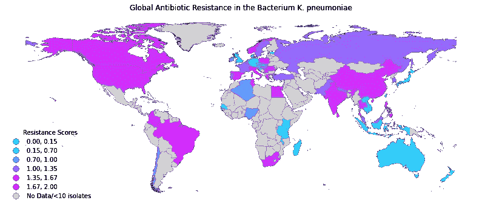
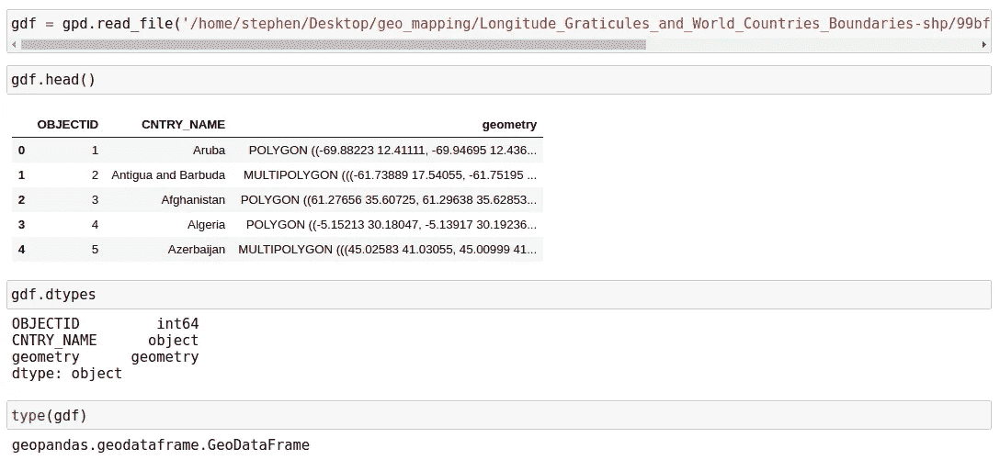
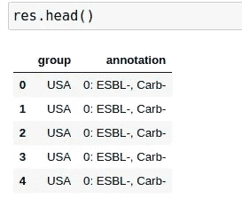
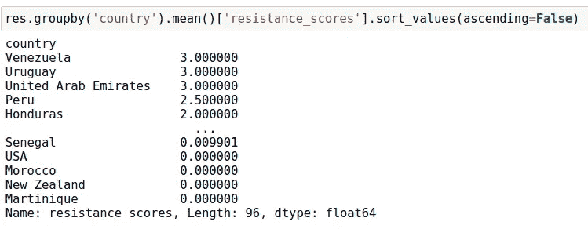
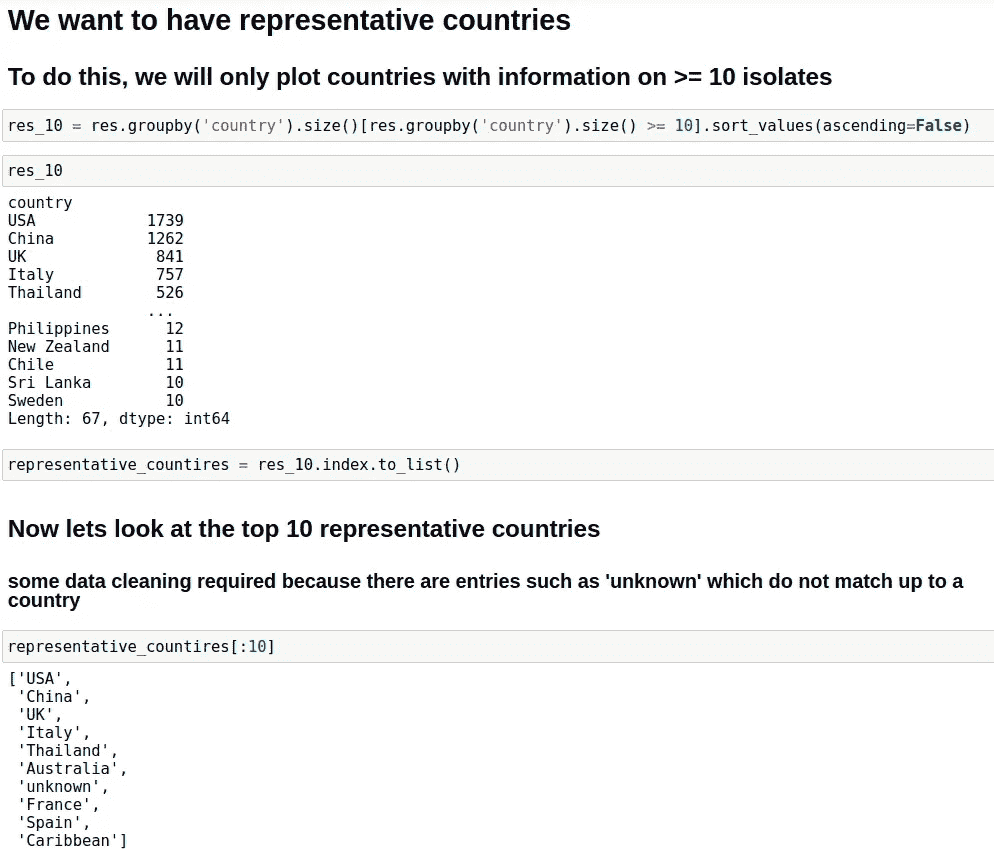
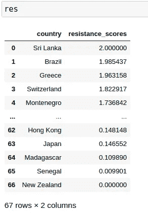
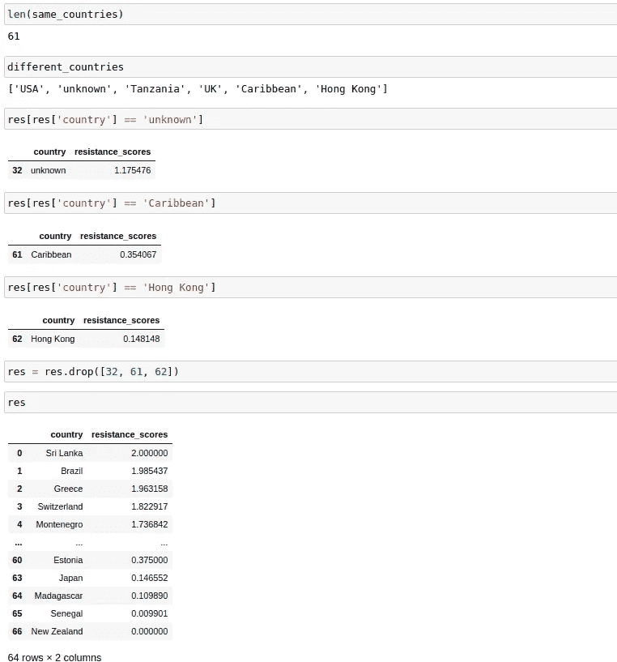
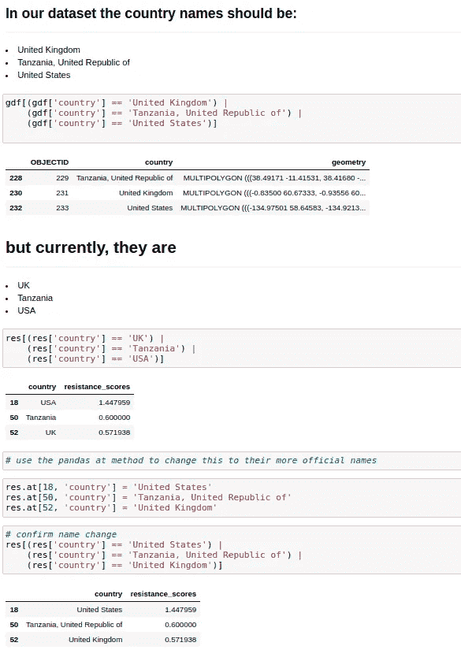
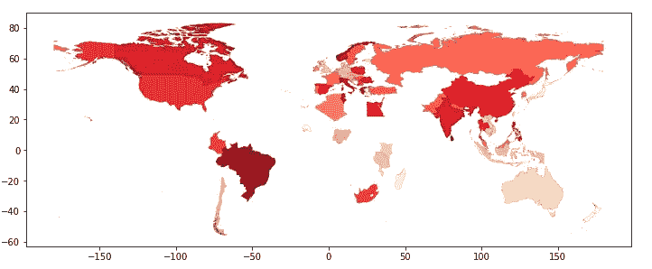
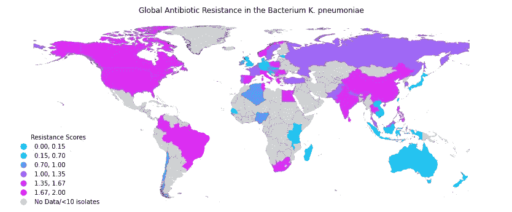

# 如何使用 Python 中的 Geopandas 绘制全球抗生素耐药性数据

> 原文：<https://towardsdatascience.com/how-to-plot-worldwide-antibiotic-resistance-data-using-geopandas-in-python-3be4d03f28ef?source=collection_archive---------42----------------------->

## 制作信息丰富的 Geopandas 图

Stephen Fordham(作者)使用 Python 中的 Geopandas 库制作的图像

## 介绍

越来越多的细菌出现了抗生素耐药性。令人担忧的是，对最后手段抗生素的耐药性正在上升。在本教程中，我将演示如何使用 Python 中的 Geopandas 库作为工具来引起全球对抗生素耐药性的关注。为此，我使用了两个数据源:

1.  抗性评分数据集，其中抗性评分 1 至 3 对应于细菌对最终抗生素的抗性增加。
2.  来自 ArcGIS 的数据集，包含每个国家的地理坐标。

## 如何绘制阻力位

目标是获取世界上所有国家的几何信息，并将这些数据与另一个列出全球抗生素耐药性得分的数据源合并。最后，我将演示如何绘制全球抗生素耐药性地图，这将作为一个有用的汇总信息图，有助于检测高和低耐药性区域。此外，通过绘制包括没有可用信息的区域的整个地图，将暴露可能缺乏监控的区域(至少对于此处使用的数据集而言)。

我遵循以下工作流程:

1.  读入数据集
2.  代表性提取(消除偏倚)
3.  数据清理
4.  合并数据集
5.  测绘

如果您想访问这里使用的 Jupyter 笔记本，可以在我的 [Github 页面](https://github.com/StephenFordham/Geopandas_mapping_tutorial)上找到。

## 1.解析数据集:世界各国和抗生素耐药性得分

首先，使用 geopandas read_file 函数读取来源于 [rcG](https://hub.arcgis.com/datasets/a21fdb46d23e4ef896f31475217cbb08_1?geometry=151.172%2C-89.998%2C-151.172%2C-79.513) 的形状文件。该文件包含与每个国家相关的必要几何信息。生成的对象是一个 geopandas 数据帧，其行为类似于本地 pandas 数据帧。

接下来，我们将使用 pandas read_csv 函数读取阻力分数数据集。我们可以简单地检查数据帧的头部，以确认数据已经被正确解析。我们现在可以创建一个新的列，使用 lambda 函数提取分数，如代码片段所示。我还重命名了这些列，以更准确地反映它们的内容。

## 2.代表性国家抽样

理想情况下，阻力分数应尽可能提供更多信息。为了实现这一点，明智的做法是对有≥ 10 个分离株的国家进行代表性采样。这将有助于避免我们在以后绘图时引入偏差。这可以通过对 country 列执行 groupby 方法调用并对这个 groupby 对象调用 size 方法来实现。然后，我们可以根据没有应用大小筛选的 groupby 对象进行筛选，对值进行排序，并检索由≥ 10 个隔离区表示的所有国家/地区。下面的代码片段演示了如何实现这一步。

现在我们有了一个代表性国家的列表，我们可以过滤原始 res 数据框架以产生一个新的数据框架，该数据框架对平均耐药性得分进行平均，并且只包括≥ 10 个分离物的国家。

res 数据框架现在在国家和抗性分数之间有一个很好的连接关系。

## 3.数据清理

我们接下来需要执行一点数据清理。这是必需的，因为有时国家可能有不同的名称。合并时，我们需要一个通用名称，因此包括美国在内的国家信息不会出现在单独的行中，例如一行代表“美国”，另一行代表“美国”。为了识别共享国家和非共享国家，我创建了一个简单的 for 循环，遍历 resistance score 数据帧中的国家。对于不在 geopandas 数据框架 gdf 中的每个国家，它将被添加到名为 different_countries 的列表中。

这两份清单显示了 61 个共同的国家和 6 个在两个数据框架之间不同的国家。我们必须要么删除这些国家，要么重新命名。对于重命名，我们将使用 geopandas 数据框架中的国家名称作为正式名称。

我选择删除条目:“未知”、“加勒比”和“香港”。未知不能被合理地绘制出来，加勒比海不够精确，我选择不把香港和中国捆绑在一起，因为我希望看到 mainland China 单独的阻力分数。这些条目在 res 数据帧中标识，随后使用 pandas drop 方法删除。这可以在下面的结果数据帧中看到，特别是索引 61 和 62 处的行*现在*缺失。

现在需要更改国名，英国、坦桑尼亚和美国。这包括首先确认它们在 geopandas 数据帧 gdf 中的原始名称。我们可以在 res 数据帧中找到它们的原始名称，并使用 pandas at 方法轻松地更改它们。要使用这种方法，我们只需要与行相关的索引和列名。

## 4.合并数据帧

最后，我们只需要合并两个数据源，这样我们就有了一个包含每个国家的阻力分数和几何图形的数据框架。为此，我们从 res 数据框架中的国家中过滤 geopandas 数据框架。然后，我们可以将结果对象 data 与相似国家列上的 res 数据帧合并，现在我们有一个名为 res_df 的数据帧，其中包含阻力分数和几何信息。

我们可以在这里停下来，绘制 res_df 数据框架，但是最好包括所有国家，甚至那些没有记录监测数据的国家。

为此，我们使用波浪符号并过滤 geopandas 数据框架 gdf，以查找不在原始 res 数据框架中的国家。我们将这个新的数据帧标记为 others，并将其指定为 a 列，其中阻力分数列为 np.NaN。我们最后将 res_df 和 others 数据帧连接到公共对象 res_geo 中。下面的代码片段演示了这是如何实现的。

注意:可以画 np。在 Geopandas 对象上使用 plot 方法。

合并后的数据帧如下所示。然而，对象 res_geo 是一个 pandas 数据帧，需要转换为 geopandas 数据帧以便绘图。这可以通过实例化 GeoDataFrame 类的实例并将 res_geo 作为参数传递来实现。

## 5.测绘

我们可以绘制地图，指定图形大小、我们要用于绘制数据的列、颜色映射以及国家之间的边缘颜色和宽度。这产生了一个需要进一步优化的拼凑的情节。

我们已经做了艰苦的工作，创建了资源地理数据库作为数据框架。通过一些小的修改，我们可以极大地改善映射，使其更具吸引力和可解释性。为了改善这一点，我们可以添加一个图例，一个更生动配色方案，包括没有监测数据的国家，并给它们贴上这样的标签，并提供一个合理的标题。

这些变化显示为传递给方法图的参数。如果您对其他颜色映射选项感兴趣，Geopandas 构建所基于的库 matplotlib 有大量颜色字符串可供选择。

## 摘要

Geopandas 是支持地理绘图的有用工具。对于本教程，我创建了一个 conda 虚拟环境，并按照安装说明[在这里](https://geopandas.org/getting_started.html)通过 conda 安装 geopandas，并在 Jupyter 笔记本中进行在线绘图。如果你感兴趣，我已经创建了一个 Jupyter 笔记本，在我的 [GitHub 页面](https://github.com/StephenFordham/Geopandas_mapping_tutorial)上详细描述了所有这些步骤，在那里也可以找到这两个数据集。虽然这里给出的例子是专门针对抗生素耐药性的，但概述的过程可以作为支持任何其他地理空间绘图的指南。