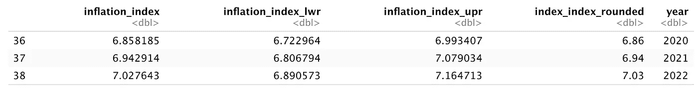

# 如何在一个图表中预测和可视化数据

> 原文：<https://towardsdatascience.com/how-to-predict-and-visualize-data-in-one-chart-62901cecbd70?source=collection_archive---------23----------------------->

蒂姆·波格丹诺夫在 [Unsplash](https://unsplash.com/collections/95135508/medium/af07ddeda5faed6872d60437a48d9819?utm_source=unsplash&utm_medium=referral&utm_content=creditCopyText) 上的照片

## 教程-预测-R

## 如何使用 R 和 ggplot2 以及线性回归的分步教程

在我最近的一个项目中，我被要求执行一个简单的线性回归来预测可能的价格发展。为了比较实际的价格发展，我们使用[消费者价格指数](https://en.wikipedia.org/wiki/Consumer_price_index)作为基线。本文将向您展示我如何尝试使用不同的数据集来实现这一点——使用 ggplot2 进行绘图，使用线性回归进行预测。

# 1.设置

我将简要解释我的设置，包括我正在使用的数据和 R 包。

## 包装

一般来说，我总是使用 [Tidyverse 包](https://www.tidyverse.org/)。它包括像 [ggplot2](https://ggplot2.tidyverse.org/) 这样的软件包，以非常直观的方式创建美丽的图形， [dplyr](https://dplyr.tidyverse.org/) 使数据操作如此简单，等等。

此外，我使用了 [ggthemes](https://github.com/jrnold/ggthemes) 包，为你的剧情提供了更多开箱即用的主题。

作者图片

## 啤酒节啤酒价格和通货膨胀指数数据

作为 focus 中的领先价格指数，我使用了世界上最大的啤酒节啤酒节的可用数据。该数据不仅包含啤酒价格信息，还包含游客数量、鸡肉价格和啤酒销量。

作者创建的表(限于三行)

我将使用德国消费者价格指数的可用信息来比较啤酒价格的发展。

> “**消费者价格指数** ( **CPI** )是衡量经济中[消费品](https://simple.wikipedia.org/wiki/Goods)和[服务](https://simple.wikipedia.org/w/index.php?title=Services_marketing&action=edit&redlink=1)的总体价格水平的一种方式。”—来源维基百科。

数据本身来自德国联邦统计局的[数据库。请注意](https://www-genesis.destatis.de/genesis/online?operation=sprachwechsel&language=en)[Verbraucherpreisindex](https://www-genesis.destatis.de/genesis/online?operation=result&code=61111-0001&deep=true#abreadcrumb)(VPI)是德语的消费价格指数(CPI)。

以 1991 年为基准年的消费者价格指数与啤酒价格一致；作者创建的表(限于三行)

# 2.我预测和可视化价格发展的工作流程

## 加入啤酒价格和 VDI 数据

## 创建线性回归模型

啤酒价格预测；作者创建的表(限于三行)

消费价格预测；由作者创建的表(限于三行)

## 连接所有数据集

联合数据集(原始数据、预测数据)；由作者创建的表(限于三行)

## 创建一个包括预测和置信水平的线形图

啤酒节啤酒价格的发展与预测:作者创造的形象

啤酒节啤酒价格的发展与预测:作者根据 ggplot2 结果创建的图像

# 结论

本文向您展示了我如何可视化价格发展，以及我如何使用线性回归模型整合价格预测。当我查看结果时，我看到了两个明显的局限性。

首先，我知道线性回归通常不是价格的最佳预测工具，尽管在这种情况下它可能是合理的(例如，预测每年啤酒节啤酒价格的变化)。尽管我在可视化中包括了误差幅度，但它并没有考虑未来每一年不确定性的增加。而这一点并没有在这个模型中体现出来。我认为有必要研究一下[霍尔特-温特斯](https://otexts.com/fpp2/holt-winters.html)预测方法和时间序列来应对这个问题。霍尔特-温特斯也考虑到了季节性。

其次，通过包含文本注释来创建可再现的图表会使代码变得非常混乱，难以维护(甚至难以编写)。此外，我不确定情节本身是否不平衡，是否充斥着所有的文本注释。

> 你认为我可以做些什么来改进这个解决方案？

如有任何问题和意见，请随时联系我。谢谢你。**在这里找到更多我的文章**:

1.  [学习如何从你的个人资料中创造美丽的艺术作品](/create-beautiful-art-from-your-personal-data-9dc0abfeeaf)
2.  [了解我如何获得和分析我的 Garmin 跑步数据](/how-to-visualize-your-runners-high-with-python-and-altair-45dde7803141)
3.  [了解如何为您的 Python 代码设置日志记录](/how-to-setup-logging-for-your-python-notebooks-in-under-2-minutes-2a7ac88d723d)
4.  [学习如何使用链接(或管道)在 Python 中编写干净的代码](/the-flawless-pipes-of-python-pandas-30f3ee4dffc2)