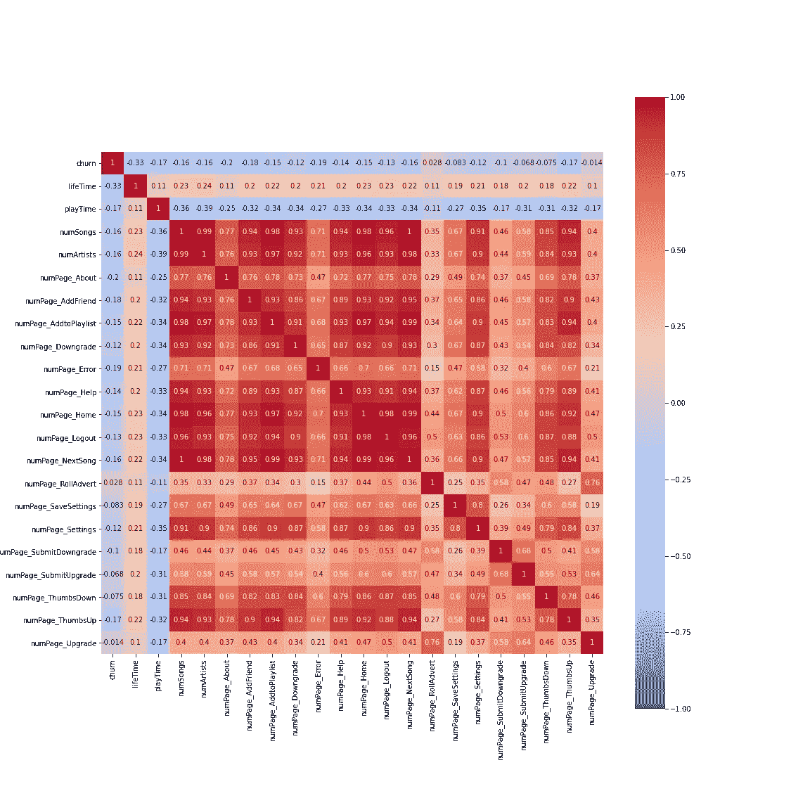

# 如何从你的网站日志中预测客户流失

> 原文：<https://towardsdatascience.com/how-to-predict-customer-churn-from-your-website-logs-bb02ea58385a?source=collection_archive---------14----------------------->

## [实践教程](https://towardsdatascience.com/tagged/hands-on-tutorials)

## 大规模音乐流媒体服务流失分析和预测实用指南(PySpark 和 Plotly)


照片由[布鲁斯·马尔斯](https://unsplash.com/@brucemars?utm_source=medium&utm_medium=referral)在 [Unsplash](https://unsplash.com?utm_source=medium&utm_medium=referral) 上拍摄

[简介](#7942)
[如何预测客户流失？](#dbeb)
∘ [第一步:清理网站日志数据](#9092)
∘ [第二步:将您的网站日志转换为用户日志数据集](#7ec3)
∘ [第三步:探索两个用户群的数据(流失与停留)](#0e3f)
∘ [第三步:使用 ML 算法预测客户流失](#7039)
[结论](#f118)

# 介绍

许多在线公司从订阅模式中获得很大一部分收入，因此追踪有多少客户停止使用他们的产品或服务是非常重要的。**客户流失定义为现有客户取消订阅。如果我们能建立一个模型来预测一个当前客户是否会流失(1)或者不会流失(0)，那么公司就可以通过提供更多的促销或者改善服务来防止他们的用户流失。如果你想了解更多关于客户流失的信息，请查看这个[博客](https://www.profitwell.com/customer-churn/calculate-churn-rate)。**

在许多面向客户的企业中，Spotify 等音乐流媒体服务可以利用其网站和应用程序上的庞大用户交互数据来预测客户流失。由于网站日志通常是“大数据”，因此使用 Spark 等大数据库来分析它们并预测大规模流失是非常必要的。在本文中，我将从一个高层次的角度来指导您的流失预测项目，并分享一些可视化和预测结果。如果想跳转到实用教程，请查看我的 [Kaggle 帖子](https://www.kaggle.com/suhong/a-tutorial-using-plotly-spark-churn-prediction)(复制我的笔记本可以在线玩笔记本)或者 [Github 资源库](https://github.com/suhongkim/Churn-Prediciton-At-Scale) (fork 或者下载代码到你的本地系统)

> 你想先看看我的代码吗？请检查我的 Kaggle 笔记本或 Github 库。

<https://www.kaggle.com/suhong/a-tutorial-of-customer-churn-analysis-prediction>  <https://github.com/suhongkim/Churn-Prediciton-At-Scale.git>  

# 如何预测客户流失？

为了展示如何在实践中建立预测模型，我们将使用从虚拟音乐流媒体公司收集的虚构网站日志数据，该公司名为“Sparkify”，来自 Udacity 的数据科学 Nanodegree。首先，我们需要将这些疯狂的网站日志转换成一个干净的、聚合的用户日志数据集。然后，我们将使用 Plotly 可视化库分析数据集中与客户流失相关的要素。最后，我们将提取有意义的特征，并选择适当的机器学习算法来预测客户流失。让我们开始吧！

## 第一步:清理网站日志数据

让我们看看网站日志数据集的模式，并检查描述，以了解从网站收集了哪些类型的信息。请注意，粗体列名与客户流失有关，其他列名与网站日志信息有关。

```
| Column        | Type   | Description                           
|---------------|--------|---------------------------------------- 
| **ts**            | long   | the timestamp of user log                
| sessionId     | long   | an identifier for the current session   
| auth          | string | the authentification log                
| itemInSession | long   | the number of items in a single session 
| method        | string | HTTP request method (put/get)                                   
| status        | long   | http status 
| userAgent     | string | the name of HTTP user agent             
| **userId**        | string | the user Id                             
| **gender**        | string | the user gender (F/M)                         
| **location**      | string | the user location in US             
| firstName     | string | the user first name                     
| lastName      | string | the user last                           
| **registration**  | long   | the timestamp when user registered      
| **level**         | string | the subscription level (free, paid)                                  
| **artist**        | string | the name of the artist played by users 
| **song**          | string | the name of songs played by users
| length        | double | the length of a song in seconds  
| **page**          | string | the page name visited by users** the categories of **page**:  Home, Login, LogOut, Settings, Save Settings, about, NextSong, Thumbs Up, Thumbs Down, Add to Playlist, Add Friend, Roll Advert, Upgrade, Downgrade, help, Submit Downgrade, Cancel, **Cancellation Confrimation**
```

我删除了一些`userId`为空的记录，然后添加了一个目标列(`churn`)和三个额外的列，如下所示。

*   `churn`(整数):使用`Cancellation Confirmation`事件为付费和免费用户定义的流失状态(1:流失，0:停留)
*   `ds`(日期):时间戳数据转换成的日期戳`ts`
*   `dsRestration`(日期):从时间戳数据转换的日期戳`registration`
*   `locCity`(字符串):来自`location`数据的城市名称

```
Below is the sample of new columns
+------+-----+----------+--------------+--------------+
|userId|**churn**|        ds|dsRegistration|       locCity|
+------+-----+----------+--------------+--------------+
|100010|    0|2018-10-08|    2018-09-27|    Bridgeport|
|200002|    0|2018-10-01|    2018-09-06|       Chicago|
|   125|    1|2018-10-12|    2018-08-01|Corpus Christi|
+------+-----+----------+--------------+--------------+
```

网站日志数据集

## 第二步:将你的网站日志转换成用户日志数据集

为了预测用户的流失状态，需要为每个用户转换网站日志数据。首先，我们需要丢弃一些与客户流失事件无关的列，比如会话日志和用户名。然后，我们可以基于`userId`转换数据，有两种类型的数据:用户信息和用户活动。我们的数据中的用户信息列是`churn`、`gender`、`level`和`locCity`，对于每个用户必须是相同的。

```
+------+-----+------+-----+--------------+
|userId|churn|gender|level|       locCity|
+------+-----+------+-----+--------------+
|100010|    0|     F| free|    Bridgeport|
|200002|    0|     M| free|       Chicago|
|   125|    1|     M| free|Corpus Christi|
+------+-----+------+-----+--------------+
```

对于用户活动数据，我们需要聚集日志数据来创建一些有意义的特性。我在下面列出了添加到用户日志数据集中的新列。

*   `lifeTime` (long):用户生存期是用户在网站上存在的时间，数字表示从注册日期到最后一次活动登录日期的天数
*   `playTime` (double):歌曲播放时间是指用户访问`next song`页面时，总播放歌曲的平均时间(秒)
*   `numSongs` (long):每个用户的歌曲名称总数
*   `numArtists` (long):每个用户的艺术家姓名总数
*   `numPage_*` (long):每个页面、每个用户的页面访问总数。请注意，`Cancellation`和`Conform cancellation`页面不考虑用于特征组，因为它们用于生成`churn`标签。另外，`Login`和`Register`在我们的数据集中对所有用户都没有计数，所以它们会被自动删除

```
+--------------+-----------------+--------+----------+-------------+
|lifeTime(days)|    PlayTime(sec)|numSongs|numArtists|    numPage_*|
+--------------+-----------------+--------+----------+-------------+
|            55|318224.4166666667|     269|       252|            1|
|            70|187044.0476190476|     378|       339|            3|
|            72|           1762.0|       8|         8|            0|
+--------------+-----------------+--------+----------+-------------+
```

用户日志数据集

在开始可视化之前，让我们用几个数字总结一下我们到目前为止所做的工作！

```
The shape of the raw data: (286500, 18)
The shape of the clean data: (278154, 18)
The shape of the website-log data: (278154, 22)
The shape of the User-Log data(df_user): (225, 26)The number of users (unique userId): 225
The count of churned users (1): 52
The count of Not-Churned users (0): 173The logging period: 2018-10-01 - 2018-12-03
```

## 第三步:探索两个用户群的数据(搅动与停留)

将与我们的目标价值相关的特征可视化非常重要，因为我们对客户流失事件背后的机制有更好的直觉。让我们从揭示每月被搅动的用户数量是如何变化的开始(这个小型数据集的记录周期是 2 个月长)

图片作者:苏红·金

> 总用户数从 10 月份的 213 人下降到 11 月份的 187 人。具体来说，停留用户数略微增加了 4 人，而流失用户数减少了一半以上(10 月份为 55 人，11 月份为 22 人)，这表明 Sparkify 服务成功地留住了现有客户。如果我们有更多关于 Sparkify 业务和活动的数据，我们就可以从这一观察中分析什么样的因素会影响更少的客户流失。

图片作者:苏红·金

> 我们可以观察到男性用户倾向于搅拌更多。
> 
> 免费订阅级别的用户在请求`Submit Downgrade`但未到达`cancellation confirmation`页面时可能处于流失状态—请注意，我们仅在用户访问取消确认页面时定义流失状态。因此，这一类别中的那些过去的订户可以成为营销人员为该网站留住更多用户的主要目标。

图片作者:苏红·金

> 你可以从上面的散点图中看到的流失率是每个城市中流失用户与人口的比例。由于该数据集是合成的，城市的流失率显示出许多极值，如 0%或 100% ，这导致**我们需要为我们的预测模型排除该特征的结论。**

到目前为止，我们已经探索了分类特征，如性别、订阅级别和位置(第一个图表“时间分析”只是为了了解被搅动的用户的趋势)。正如您在步骤 2 部分看到的，我们生成了新的数字特征来描述网站上的用户活动。让我们把它们形象化！

图片作者:苏红·金

> 搅动的用户倾向于比停留的用户具有更短的寿命和歌曲播放时间。
> 
> 兴奋组倾向于选择种类稍少的歌曲和艺术家(两张图看起来相似，可能有很高的相关性)

图片作者:苏红·金

> 当我们从原始数据集中的页面列中创建 17 个不同的特征时，我选择了一些重要的特征来在上面的图表中可视化。其中，**我注意到页面** `**SubmitDowngrade**` **与其他页面相比似乎具有离散分布，因此我决定将该特征从预测模型的数值变量更改为分类变量。**

## 第三步:使用 ML 算法预测客户流失

通过可视化，我们最终可以通过修改用户日志数据集来为预测模型选择我们的特征，如下所示。

*   `LocCity`将从特征集中删除，因为它有许多极值
*   `numSongs`和`numArts`高度相关(0.99)，因此`numSongs`将仅被选择用于特征集
*   `numPage_SubmitDowngrade`将被转换为只有两个值的分类特征`page_SubmitDowngrade`:已访问或无
*   与`page`栏相关的特征相互之间有很多关联，所以我只选择了 7 个特征:`numPage_About`、`numPage_Error`、`numPage_RollAdvert`、`numPage_SaveSettings`、`numPage_SubmitDowngrade`、`numPage_ThumbsDown`、`numPage_Upgrade`



图片作者:苏红·金

```
The schema of df_feat
 |-- userId: string, User Identification Info (not used for feature)
 |-- **label**: integer, the target(Churn) for the prediction model
 <Categorical Features>
 |-- gender: string ('F' or 'M')
 |-- level: string ('paid' or 'free')
 |-- page_SubmitDowngrade: string ('visited' or 'none')
 <Numerical Features> 
 |-- lifeTime: integer 
 |-- playTime: double 
 |-- numSongs: long 
 |-- numPage_About: long 
 |-- numPage_Error: long 
 |-- numPage_RollAdvert: long 
 |-- numPage_SaveSettings: long 
 |-- numPage_SubmitUpgrade: long 
 |-- numPage_ThumbsDown: long 
 |-- numPage_Upgrade: long 
```

让我们开始使用 Spark 中的 ML 库来构建预测模型的管道。为了更好的交叉验证，我将所有的特征转换和一个估计器合并到一个管道中，并将其送入`CrossValidator`。管道有三个主要部分。

1.  **特征转换**:类别变量将被`StringIndexer`和`OneHotEncoder`转换成一个热点编码向量。然后，使用`VectorAssembler.`将分类向量和数值变量组装成密集特征向量
2.  **特性重要性选择**:我构建了一个定制的`FeatureSelector`类，使用一个基于树的评估器只提取重要的特性。这一步是可选的，所以我没有将它用于逻辑回归或 LinearSVC 模型。
3.  **估计器**:最后一步是使用 ML 算法来估计每个用户的流失标签。

有了这个管道，我选择了五个不同的估值器来根据 F1 分数选择带有默认参数的最佳算法，因为我们的数据是不平衡的。作为下面的结果，我为我们的预测模型选择了`RandomForestClassifier`，它显示了最高的验证分数(0.78)。

```
<The result of the model selection>
--------------------
**LogisticRegressionModel**: numClasses=2, numFeatures=16
train_f1: 0.8275, test_f1: 0.7112
--------------------
**LinearSVCModel**: numClasses=2, numFeatures=16
train_f1: 0.8618, test_f1: 0.7472
--------------------
**DecisionTreeClassificationModel**: depth=5, numNodes=31, numFeatures=7
idx                name     score
0    0            lifeTime  0.439549
1    1            numSongs  0.207649
2    2  numPage_ThumbsDown  0.137043
3    3  numPage_RollAdvert  0.096274
4    4            playTime  0.062585
5    5       numPage_Error  0.045681
6    6       numPage_About  0.011218train_f1: 0.9373, test_f1: 0.7667
--------------------
**RandomForestClassificationModel**:numTrees=20, numFeatures=12
    idx                   name     score
0     0               lifeTime  0.315996
1     1               playTime  0.174795
2     2     numPage_ThumbsDown  0.101804
5     5               numSongs  0.089395
3     3     numPage_RollAdvert  0.080125
6     6        numPage_Upgrade  0.053891
4     4          numPage_About  0.053557
7     7          numPage_Error  0.051073
8     8   numPage_SaveSettings  0.033237
9     9  numPage_SubmitUpgrade  0.024314
11   11            genderVec_M  0.012589
10   10          levelVec_paid  0.009225train_f1: 0.9086, test_f1: 0.7788
--------------------
**GBTClassificationModel**: numTrees=20, numFeatures=11
    idx                   name     score
0     0     numPage_ThumbsDown  0.276418
1     1               lifeTime  0.191477
2     2               numSongs  0.104416
4     4     numPage_RollAdvert  0.080323
5     6          numPage_About  0.074554
9     5          levelVec_free  0.068573
3     3               playTime  0.067631
6     7        numPage_Upgrade  0.050553
7     8          numPage_Error  0.042485
10    9            genderVec_M  0.029921
8    10  numPage_SubmitUpgrade  0.013649train_f1: 1.0, test_f1: 0.7615
```

最后，我运行了交叉验证来调整`RandomForestClassifier`的超参数。由于我们的数据集非常小，您可以观察到几乎完美的训练分数，表明模型过度拟合。因此，我选择了一些交叉验证参数映射，以使该模型与我在上述模型选择中使用的默认模型(numTrees=20)相比不那么复杂。**结果显示，具有 10 棵树和 16 个最大箱的模型具有稍好的性能，但是没有很好地克服过拟合问题。我假设这个问题可以通过增加更多的数据来解决。**

```
**RandomForestClassificationModel**: numTrees=10, numFeatures=11
**Best parameters**:[('bootstrap', True), ('cacheNodeIds', False), ('checkpointInterval', 10), ('featureSubsetStrategy', 'auto'), **('impurity', 'gini'), ('maxBins', 16), ('maxDepth', 5), ('numTrees', 10)**, ('maxMemoryInMB', 256), ('minInfoGain', 0.0), ('minInstancesPerNode', 1), ('minWeightFractionPerNode', 0.0), ('seed', -5400988877677221036), ('subsamplingRate', 1.0)]
    idx                             name     score
0     0                         lifeTime  0.346846
1     1                         playTime  0.160187
2     2                         numSongs  0.104921
5     5               numPage_ThumbsDown  0.102716
6     6                    numPage_About  0.075681
4     4                  numPage_Upgrade  0.075326
3     3               numPage_RollAdvert  0.048552
7     7                    numPage_Error  0.044421
8     8             numPage_SaveSettings  0.028647
9     9                    levelVec_free  0.009174
10   10  page_SubmitDowngradeVec_visited  0.003529**train_f1: 0.9287, valid_f1: 0.7608 test_f1: 0.7255**
```

# 结论

在本文中，我们解决了最具挑战性和最常见的业务问题之一——如何预测客户流失。从令人讨厌的巨大网站日志中，我们提取了每个用户的几个有意义的特征，并基于两个用户组(搅动与停留)将它们可视化，以进行更多分析。最后，我们建立了包括特征变换和估计器的 ML 流水线，它被馈送到交叉验证器用于模型选择和超参数调整。最终模型显示了相当高的测试分数(f1 分数:0.73)，但由于小数据集大小(128MB)的限制，它也存在过拟合问题。由于 Udacity 在 AWS cloud 上提供了完整的数据集(12GB ),我有一个计划来部署这个 Spark 集群，以便很快处理过拟合问题。

当然，在不考虑数据大小的情况下，我们可以做很多事情来改进这个模型。首先，不管时间因素如何，大多数特征都是聚合的。日志收集时间为 2 个月，因此最好使用不同的方法(如加权总和)强调最近的日志。此外，我们可以应用一些策略来处理数据不平衡(这个[博客](https://www.analyticsvidhya.com/blog/2017/03/imbalanced-data-classification/)将帮助你得到一些想法)。此外，我们可以将这个问题建模为时间序列模型，因为流失率应该定期报告给业务利益相关者。

我希望这个项目能够为您提供一个教程，教您如何使用数据科学和机器学习技能来处理大数据，以解决现实世界中的一个问题。另外，使用 Spark 和 Plotly 库也是很好的练习。感谢您的阅读，并希望通过我的 [LinkedIn](http://www.linkedin.com/in/suhongkim) 随时与您联系！