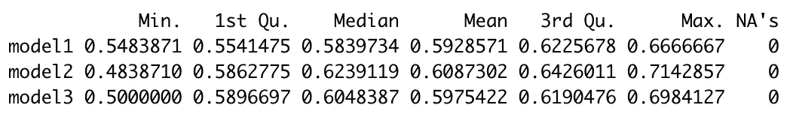

# 如何预测 NBA 两双

> 原文：<https://towardsdatascience.com/how-to-predict-nba-double-doubles-f4c30be08ca0?source=collection_archive---------31----------------------->

## [实践教程](https://towardsdatascience.com/tagged/hands-on-tutorials)

## 学习在 R 中建立一个逻辑回归模型，预测 NBA 全明星球员尼古拉·武切维奇是否会取得两双。


作者图片*。2018 年 3 月 2 日，奥兰多魔术队主场比赛大屏幕上的武切维奇。*

逻辑回归模型允许我们基于一个或多个称为预测变量的输入来估计分类响应变量的概率。传统上，响应是二进制真/假值，但也可以是其他组合，如通过/失败，甚至是分类小/中/大。

这篇文章将着重于创建一个模型来预测一个 NBA 球员尼古拉·武切维奇在一场 NBA 篮球赛中获得两双的概率。这将通过提供在 r 中构建逻辑回归模型的必要步骤来演示。

逻辑回归模型目标的一个例子是，在 95%的置信度下，我们可以根据预测变量 X、Y 和 z 在 80%的时间内预测响应变量的结果。百分比将根据测试规格和模型质量而变化。

尼古拉·武切维奇是奥兰多魔术队的全明星中锋。除了为我的家乡球队效力之外，他还是一名在同一支球队长期任职的稳定球员，这使得他的篮球统计非常适合数据科学项目。

在他 10 年的职业生涯中，武切维奇取得了超过 344 次两双。在 NBA，两双的定义是在得分、篮板、助攻、抢断或盖帽这两个类别中得到 10 分或更多。这通常是通过在一场比赛中得到 10 分或更多，10 次或更多的助攻，或者在一场比赛中得到 10 分或更多，10 个或更多的篮板来实现的。

# 导入数据

构建任何模型的第一步都是获取准确的数据集。Basketball-Reference 跟踪 NBA 球员的数据点，通常是建立预测模型的起点。从一个 [**玩家的页面**](https://www.basketball-reference.com/players/v/vucevni01.html)**获取游戏数据有两种方法。**

1.  **使用像 rvest 这样的 R 包来抓取每个赛季的球员数据。**
2.  **下载每个赛季的 CSV 文件然后上传到 r。**

**在 Vucevic 的例子中，你应该有 10 个数据集代表 2012 到 2021 赛季。**

**一旦游戏日志数据在 R 中，向每个数据集添加一个新列“Season ”,然后使用 rbind()将各个数据集合并成一个“Vucevic”数据集。**

```
#Add Column to Indicate Season
Vucevic2021$Season <- 2021#Use rbind() to Combine Data Frames
Vucevic <- rbind(Vucevic2012, Vucevic2013, Vucevic2014, Vucevic2015, Vucevic2016,Vucevic2017, Vucevic2018, Vucevic2019, Vucevic2020, Vucevic2021)
```

# **清理数据**

**虽然高度准确，但是来自 Basketball-Reference 的数据需要进行一些清理，然后才能在我们的模型中使用它。特别是对于这个数据集，我们需要删除不代表所玩游戏的行，更新缺少的列名，并更新 Location 和 WinLoss 列中的数据值。**

```
#Remove rows that do not correspond to a basketball game.
Vucevic <- Vucevic [!(Vucevic$GS == "Did Not Play" |
                      Vucevic$GS == "Did Not Dress" |
                      Vucevic$GS == "GS" |
                      Vucevic$GS == "Inactive" |
                      Vucevic$GS == “Not With Team”),]#Use the index method to add missing column names
colnames(Vucevic)[6] <-c("Location")
colnames(Vucevic)[8] <-c("WinLoss")
```

**在位置栏中，一个“@”代表客场，空代表主场。稍后，通过将这些值转换为“Away”和“Home ”,我们可以将其转换为 factor 数据类型来测试我们的模型。**

```
#Use an ifelse() to specify “Away” and “Home” games
Vucevic$Location <- ifelse(Vucevic$Location == "@", "Away", "Home")
```

**类似地，WinLoss 列具有遵循“W (+6)”格式的字符值。虽然阅读统计行的人可以将“W (+6)”解释为游戏以 6 分获胜，但对于模型构建来说，WinLoss 列包含“W”或“L”更有用。**

```
#Split the column using str_split_fixed()
Index <- str_split_fixed(Vucevic$WinLoss, " ", 2)#Add the new column to the Vucevic dataframe
Vucevic <- cbind(Vucevic, Index) #Add Matrix to DataFrame#Remove the previous WinLoss column
Vucevic <- Vucevic %>% select(-WinLoss)#Update the new WinLoss column
names(Vucevic)[names(Vucevic) == "1"] <- "WinLoss"#Remove the column containing (+6)
Vucevic <- Vucevic %>% select(-"2")
```

**有些清洁步骤取决于个人喜好。这里我们将“Rk”和“G”变量改为更具描述性的“TeamGameSeason”和“PlayerGameSeason”。**

```
#Update Column Names 
names(Vucevic)[names(Vucevic) == "Rk"] <- "TeamGameSeason"
names(Vucevic)[names(Vucevic) == "G"] <- "PlayerGameSeason"
```

# **数据转换**

**与数据清理密切相关的是数据转换，即将数据从一种数据类型转换为另一种数据类型。对数据建模时，整数、数字和因子数据类型很有帮助。为了理解为什么记住逻辑回归是一个数学公式很重要，其中:**

**响应变量=截距+(斜率效率 1 *变量 1) +误差**

**求解数学公式需要使用数字、整数或因子输入。虽然诸如“Home”和“Away”等因子值显示为文本标签，但在 R 中，因子存储为整数。**

**目前，Vucevic 数据框中的大多数变量都存储为字符文本值。要同时转换多个变量的数据类型，请使用 hablar 库和 tidyverse。**

```
#View the column names in your dataset
colnames(Vucevic)#View the current datatype of an individual column variable
datatype(Vucevic$TeamGameSeason) #Convert variable datatypes 
Vucevic <- Vucevic %>% convert(
                   int("TeamGameSeason", "PlayerGameSeason", "FG",   
                       "FGA", "3P", "3PA", "FT", "FTA", "ORB", 
                       "DRB", "TRB", "AST", "STL", "BLK", "TOV", 
                       "PF", "PTS", "+/-", "PlayerGameCareer"),
                   num("FG%", "3P%", "FT%", "FG%", "FT%", "3P%", 
                       "GmSc"),
                   dte("Date"),
                   fct("Team", "Location", "Opponent", "WinLoss", 
                       "GameStarted"))
```

# **创建 Double-Double 响应变量**

**要预测武切维奇未来是否会取得两双，我们需要计算他过去有哪些比赛取得了两双。**

**如前所述，两双的定义是在得分、篮板、助攻、抢断或盖帽这两个方面得到 10 分或更多。**

**一个嵌套的 ifelse()可以用来计算武切维奇在之前的哪些比赛中取得了两双。创建新变量后，我们可以使用 ggplot2 来可视化结果。**

```
#Create a variable that calculates DoubleDoubles
Vucevic$DoubleDouble <- 
                   ifelse(Vucevic$PTS>=10 & Vucevic$AST>=10,TRUE,
                   ifelse(Vucevic$PTS>=10 & Vucevic$TRB>=10,TRUE,
                   ifelse(Vucevic$PTS>=10 & Vucevic$BLK>=10,TRUE,
                   ifelse(Vucevic$PTS>=10 & Vucevic$STL>=10,TRUE,
                   ifelse(Vucevic$AST>=10 & Vucevic$TRB>=10,TRUE,
                   ifelse(Vucevic$AST>=10 & Vucevic$BLK>=10,TRUE,
                   ifelse(Vucevic$AST>=10 & Vucevic$STL>=10,TRUE,
                   ifelse(Vucevic$TRB>=10 & Vucevic$BLK>=10,TRUE,
                   ifelse(Vucevic$TRB>=10 & Vucevic$STL>=10,TRUE,
                   ifelse(Vucevic$BLK>=10 & Vucevic$STL>=10,TRUE,
                   FALSE))))))))))
```

****

**(*作者在 RStudio* 中创建的图像)**

# **将数据分成训练集和测试集**

**在运行我们的模型之前，我们需要将 Vucevic 数据集分成单独的训练和测试数据集。分割我们的数据允许我们使用一组数据来训练我们的模型，使用一组数据来测试模型的效果。**

**使用 rsample 包指定分层重新采样方法中使用的数据分割和变量。**

**这里的数据使用 70/30 分割成 VucevicTrain 和 VucevicTest 数据集。然后标识 DoubleDouble 以确保两个数据集中的真/假值比率相似。**

```
#Identifying the split 
set.seed(123)
VucevicSplit <- initial_split(Vucevic, prob = 0.7, strata = "DoubleDouble")#Creating training dataset 
VucevicTrain <- training(VucevicSplit)#Creating testing dataset
VucevicTest <- testing(VucevicSplit)
```

# **准备多元逻辑回归**

**提高模型准确性的一种方法是在进行预测时合并多个变量。以下方法用于确定包括哪些变量:**

1.  **确定左侧泄漏变量，并将其从 Vucevic 数据集中移除。**
2.  **去掉赛后变量和其他意义不大的。**
3.  **使用相关矩阵从 Vucevic 数据集中删除统计上相似的变量。**
4.  **创造提供附加值的新变量。**

# **左侧数据泄漏**

**在回归模型中，响应变量在左边，预测变量在右边。左侧泄漏是指输入到模型中的变量也用于计算响应变量的值。**

**当预测武切维奇是否会有两双时，我们需要确保预测不是基于任何用来计算两双的变量。**

**分，篮板，助攻，抢断，盖帽都和我们如何计算两双有直接关系，会被去掉。作为这 5 个变量组成部分的其他变量也需要删除。比如进攻篮板，罚球，罚球尝试。**

```
#Removing left side leakage variables
Vucevic <- Vucevic %>% select(-FG, -FGA, -FT, -FTA, -ORB, -DRB, 
                              -TRB, -AST, -STL, -BLK, -PTS, -GmSc)#Any variable names that start with a number, or include % will need "" to remove
Vucevic <- Vucevic %>% select(-'FG%', -'3P', -'3PA', -'3P%', -'FT%')
```

# **移除赛后变量**

**我们模型的目标是 ***预测*** 武切维奇是否会拿下两双。虽然我们可以在比赛后统计失误和犯规次数时这样做，但我们更有可能在比赛开始前使用这个模型。为了说明这一点，我们去掉了所有在游戏结束后才可用的变量。**

```
#Remove post-game variables 
Vucevic <- Vucevic %>% select(-TOV, -PF, -"+/-", -WinLoss)
```

**移除任何其他不太可能影响模型的变量。在这里，分钟和秒非常类似于可变分钟，而年龄则类似于游戏玩家。球员变量从 Vucevic 数据集中删除，因为我们分析的唯一球员是 Vucevic。**

```
#Remove additional variables 
Vucevic <- Vucevic %>% select(-Age, -MinsPlayed, -Player, -Seconds)
```

# **确定统计相似变量的相关矩阵**

**通过创建剩余变量的相关矩阵，我们可以确定是否有任何变量在统计上彼此相似。**

****

**(*作者在 RStudio* 中塑造的形象)**

**上图显示 TeamGameSeason 和 PlayerGameSeason 之间有很强的相关性，这由两个变量相交的深绿色和 0.97 值表示。**

**PlayerGameSeason 是以武切维奇一个赛季的出场次数来计算的，TeamGameSeason 是以他的球队一个赛季的出场次数来计算的。如果武切维奇长期或频繁受伤，这些计算将显示更多的变化。既然他们没有，我们可以摆脱任何一个。这里删除了变量 TeamGameSeason。**

**TeamPHI 和 TeamORL 都会影响多个其他变量。这很可能是因为武切维奇在新秀年只为费城打过球。作为一名新秀，他不太可能首发(GameStarted1)，参加过更少的比赛(PlayerGameCareer)，也不太可能拿下两双。**

**我们可以放心地去掉团队变量，因为其他变量将是更好的预测因素。**

# **创建附加变量**

**现在只剩下四个变量，PlayerGameSeason、Location、GameStarted 和 PlayerGameCareer 来建立多元逻辑回归模型。**

**虽然我们的模型可能会使用这四个变量，但其他变量可能会提供更好的见解。**

*   ****Back to Back:** 使用 mutate()和 lag()创建，表示前一天晚上是否玩了游戏。**
*   ****Conference:** 使用东方或西方会议的嵌套 ifelse()创建。**
*   ****时区:**使用带有 or 运算符的嵌套 ifelse()创建。**

```
#Create New Variable DaysSinceLastGame 
Vucevic <- Vucevic %>%
arrange(Vucevic$Date) %>%
mutate(DaysSinceLastGame = Vucevic$Date - lag(Vucevic$Date))#Create New Variable BackToBack
Vucevic$BackToBack <- ifelse(Vucevic$DaysSinceLastGame == 1, TRUE, FALSE)#Delete DaysSinceLastGame 
Vucevic <- Vucevic %>% select(-Date, -DaysSinceLastGame)
```

**请注意，由于篇幅限制，创建会议和时区变量的代码被截断，仅显示亚特兰大和波士顿。**

```
#Create New Variable Conference
Vucevic$Conference <-  ifelse(Vucevic$Opponent == "ATL", "Eastern",
                       ifelse(Vucevic$Opponent == "BOS", "Eastern",#Create New Variable TimeZone
Vucevic$TimeZone <- ifelse(Vucevic$Location == "Home", "Eastern",
                    ifelse(Vucevic$Location == "Away" &  
                           Vucevic$Opponent == "ATL", "Eastern",
                    ifelse(Vucevic$Location == "Away" &  
                           Vucevic$Opponent == "BOS", "Eastern",
```

# **运行多元逻辑回归模型**

**在测试了逻辑回归模型中七个剩余独立变量的多种组合后，由于独立变量的 p 值较低，选择了以下两个模型进行进一步检验。**

```
#Logistic Regression Model 1
LogisticRegMultiple1 <- glm(DoubleDouble ~ BackToBack +GameStarted 
                           +PlayerGameSeason, family = "binomial", 
                           data = VucevicTrain)#Logistic Regression Model 2
LogisticRegMultiple2 <- glm(DoubleDouble ~ +GameStarted +BackToBack 
                           +PlayerGameSeason +PlayerGameCareer, 
                           family = "binomial", data = VucevicTrain) 
```

****

**(图片由作者在 RStudio 中创建)**

****

**(图片由作者在 RStudio 中创建)**

**通过在评估阶段测试这些模型，我们可以进一步评估多个模型的准确性。**

# **评估多元逻辑回归模型**

**由于我们的总数据集的样本大小只有 621 个游戏，基于测试数据集的 30%中的特定游戏，单个测试数据集的验证可能会有很大差异。**

**k 重交叉验证是一种重采样方法，将训练数据随机分为 k 组。它在 K-1 个折叠(也称为组)上拟合模型，然后被遗漏的组用于测试性能。这意味着它测试模型 K 次，平均 K 测试误差是交叉验证估计值。**

```
#Convert response column to factor if necessary  
Vucevic$DoubleDouble <- as.factor(Vucevic$DoubleDouble)
class(Vucevic$DoubleDouble)#Example of K-fold Cross Validation Model 
set.seed(123)
cv_model3 <- train(
  DoubleDouble ~ TeamGameSeason +PlayerGameSeason +GameStarted +PlayerGameCareer +BackToBack, 
  data = Vucevic, 
  method = "glm",
  family = "binomial",
  trControl = trainControl(method = "cv", number = 10), 
  na.action = na.exclude)#Compare 3 Models 
summary(resamples(list(
      model1 = LogisticRegMultiple1, 
      model2 = LogisticRegMultiple2, 
      model3 = cv_model3)))$statistics$Accuracy
```

****

**(图片由作者在 RStudio 中创建)**

**虽然 59%、60%和 59%的平均模型分数表示弱模型，但是可以使用混淆矩阵进一步评估这些模型。**

**从下面的矩阵中我们可以看到，当武切维奇拿下两双(参考正确)时，该模型预测武切维奇不会拿下两双(预测错误)的可能性几乎与他会拿下两双(预测正确)的可能性一样大。**

**虽然这个模型在预测武切维奇不会得到两双时更加准确，但它仍然只有 68%的准确率。**

```
# predict class
pred_class <- predict(cv_model3, Vucevic, )# create confusion matrix
confusionMatrix(
  data = relevel(pred_class, ref = "TRUE"), 
  reference = relevel(Vucevic$DoubleDouble, ref = "TRUE"))
```

****

**(*作者在 RStudio* 中创建的图片)**

# **结论**

**在这里，最准确的逻辑回归模型只能预测武切维奇是否会在平均 61%的时间里拿下两双。**

**虽然这种模式并不是压倒性的，但统计数据仍然显示，与机会相比，它是成功的。在不使用任何信息的情况下，电脑猜对了武切维奇是否会有 54.74%的几率拿下两双。逻辑回归模型的准确率为 61.32%，比随机猜测的准确率提高了 6.5%。**

**虽然模型的准确性并不惊人，但通过观察 p 值，我们可以确定比这更极端的观察结果预计只会在 1000 万次试验中随机出现 5254 次。**

**因此，在 95%的信心下，我们可以预测尼古拉·武切维奇是否会在 61%的时间里获得两双，这是基于 TeamGameSeason，player gamesasonage，GameStarted，PlayerGameCareer 和 BackToBack 的预测变量。**

# **未来分析**

**每位数据科学家将使用略有不同的变量和方法来创建模型。在这个例子中，我们创建了一个变量 BackToBack。如果您的数据集没有该变量，您的模型结果将会不同。**

**同样，每个 NBA 球员都有不同的比赛风格，受相同变量的影响也不同。有些人在主场或对阵前球队时表现明显更好。其他人在背靠背的第二个晚上或在特定时区表现不佳。这种变化意味着每个 NBA 球员都将有一个独特的逻辑回归模型来预测他们是否会得到两双。**

**为了提高准确性，我们可以从额外的数据集中整合其他变量，或者通过纳入其他参与者来扩大观察的数量。**

**扩大观察数量的一个例子是包括奥兰多魔术队任何现任成员参加的所有 4，555 场 NBA 常规赛。**

****

**然后在 95%的置信度下，我们可以根据预测变量 player、Season、PlayerGameSeason、GameStarted 和 PlayerGameCareer 来预测奥兰多魔术队的球员是否会在 90%的时间里获得两双。**

**如果你发现一个 NBA 球员或变量组合增加了逻辑回归模型的准确性，请在下面发表评论。**

**有关获取数据集的更多信息，请查看我的另一篇文章:**

**[](https://medium.com/@ajpiter/web-scraping-nba-all-star-data-8788a7136727) [## 网络搜集 NBA 全明星数据

### 了解如何在 R 中使用 rvest、gateway 和 hablar 包来抓取、清理和合并数据帧。

medium.com](https://medium.com/@ajpiter/web-scraping-nba-all-star-data-8788a7136727)**