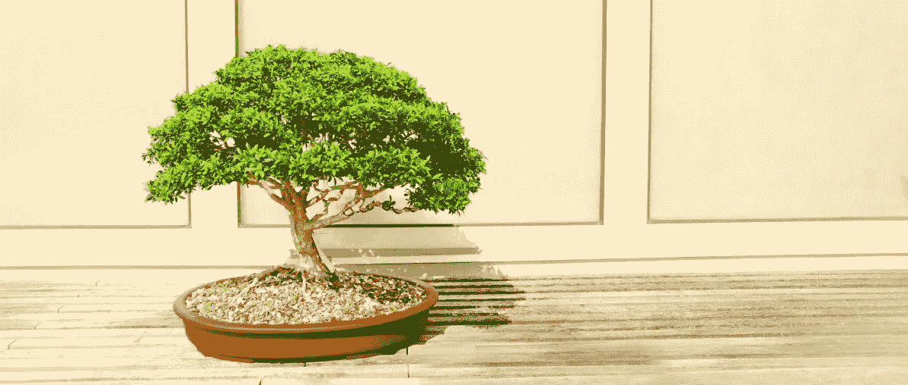

# 如何预测没有数据的事物——还有盆景树

> 原文：<https://towardsdatascience.com/how-to-predict-something-with-no-data-and-bonsai-trees-b6ebc6471da3?source=collection_archive---------22----------------------->

## 在日常生活中，我们经常不得不在没有数据的情况下做出预测。这里有一些更好的猜测方法。



托德·特拉帕尼在 [Unsplash](https://unsplash.com/?utm_source=unsplash&utm_medium=referral&utm_content=creditCopyText) 上的照片

在生活中，你常常不得不用很少或没有数据来预测事情。或者只是你将知道人口的分布，仅此而已。例如，你在圣诞节收到的一棵盆景树出现在尴尬的家庭聚会上的概率有多大？

在本文中，我将简要讨论一些来自统计数据的深刻见解，这些见解将有助于您回答这些问题。我并不承诺预测未来，我只是要向你展示我们所拥有的最好的技术，尽管我们缺乏数据，但这些技术通常会产生令人惊讶的好结果。

*以下灵感来自布莱恩·克里斯蒂安和汤姆·格里菲斯的《* [*算法靠*](https://www.goodreads.com/book/show/25666050-algorithms-to-live-by) *》中的一章。*

## 预测盆景树的寿命——哥白尼原理

你的陌生叔叔送了你一棵盆景树，这显然是一份恐慌性购买的圣诞礼物。它甚至没有护理手册或说明书。他们显然对盆景树一无所知。你也不知道，但是你知道他们因为一件事而出名——死亡。

因此，就像一个优秀的(有点虐待狂的)数据科学家一样，你的思维会立即试图预测它的死亡。问题是，你只知道这棵树已经 4 岁了。你不知道盆景树能活多久，你也不知道它们决定放弃生存意志的原因。那么，你究竟是如何预测的呢？

在一个理想的大数据世界中，你将拥有数百万棵盆景树的海量数据集，你将拥有足够的盆景知识，能够从你自己的潜在自杀小朋友那里提取特征。然后，你可以运行一些机器学习模型，并很好地预测你的小家伙会活多久。但是，你没有丰富的数据。

那么你能做什么呢？

*进入哥白尼和约翰·理查德·戈特三世。*

天体物理学家理查德·戈特三世(Richard Gott III)在 1969 年站在那里凝视着柏林墙并思考它会持续多久时，第一次想到了他的“哥白尼方法”。戈特提出理论，认为[哥白尼原理](https://en.wikipedia.org/wiki/Copernican_principle)适用于一无所知的情况；除非他的访问有什么特别之处(他并不认为有)，否则他有 50%的可能在生命的前半段之后看到长城，有 75%的可能在第一季度之后看到长城。


基于它在 1969 年的年龄(8 岁)，Gott 离开长城时有 50%的信心认为它在 1993 年不会在那里(1969 + 8 (1.5/0.5))。

因此，我们可以将同样的逻辑应用于我们的盆景树。根据其年龄(2021 年为 4 岁)，我们可以使用 Gott 逻辑得出类似的结果——(2021+4)*(1.5/0.5)。

因此，我们可以满怀信心地期待，我们的小朋友将会在 2033 年重返故土。

然而，50%置信区间不是很有用，是吗？那么，如果我们提高到 95%的标准置信度会发生什么呢？我们得到的结果表明，95%的人相信我们的盆景能够存活 0.1 至 36 年。

## 如何提高你的猜测能力

哥白尼原理实际上只是对 T4 贝叶斯法则的一种适应，即所谓的无信息先验(我们对盆景生命的潜在分布一无所知)。

显然，如果我们知道盆景预期寿命的潜在分布，我们可以做出更好的猜测。

盆景树遵循所谓的 [*幂律分布*](https://en.wikipedia.org/wiki/Power_law) *。*幂律分布是一种允许多尺度的分布。盆景可以活一个月、一年、十年、一个世纪甚至几千年。当将贝叶斯定律应用于幂律分布时，适当的预测策略是*乘法规则*，其中您将经过的时间乘以一个常数因子。在哥白尼原理的例子中，这个常数将是 2。因此，如果您之前没有任何信息，也不知道它的分布，那么您应该猜测您的盆景*应该一直活下去。*

当应用贝叶斯定理时，许多其他分布具有不同的最佳预测策略。例如，正态分布需要一个平均值规则，如果盆景低于平均值，您应该预测平均值，如果盆景超过平均值，您应该预测稍长一点的时间。

## 对日常生活的影响

那么，这对日常生活意味着什么呢？事实证明，一般来说，人类非常擅长使用正确的预测规则。格里菲斯和特南鲍姆在一项实验中强调了这一点。他们将人类直觉与应用贝叶斯法则的真实世界数据进行比较，发现结果非常接近。

因此，在万不得已的情况下相信自己的直觉是有意义的——如果真的没有数据的话。可能没有任何数据，但是你的大脑已经通过潜移默化发展了自己对分布的理解。

> “小数据是伪装的大数据”。
> 
> —布莱恩·克里斯蒂安和汤姆·格里菲斯

然而，你固有的前科是提供给你的信息的函数。因此，要想做出更好的预测，你只需在对世界的理解上消息灵通且不带偏见。

在算法向你提供你想看的耸人听闻的新闻的现代，让你的新闻输入多样化是有意义的，正如克里斯蒂安和格里菲斯所说，关掉新闻甚至可能是一个好主意。

如果你在圣诞节收到了一个盆景，只要谷歌一下如何照料它就行了。

感谢阅读，我希望你喜欢它。我的一些其他文章的链接可以在下面找到。

```
If I’ve inspired you to join medium I would be really grateful if you did it through this [link](https://jamesasher4994.medium.com/membership) — it will help to support me to write better content in the future.If you want to learn more about data science, become a certified data scientist, or land a job in data science, then checkout [365 data science](https://365datascience.pxf.io/c/3458822/791349/11148) through my [affiliate link.](https://365datascience.pxf.io/c/3458822/791349/11148)
```

</how-to-analyze-survey-data-in-python-c131764ea02e>  </how-to-easily-show-your-matplotlib-plots-and-pandas-dataframes-dynamically-on-your-website-a9613eff7ae3>  

干杯，

詹姆斯。