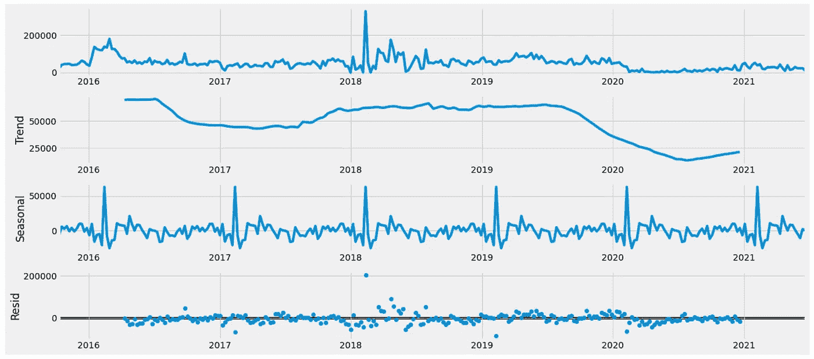
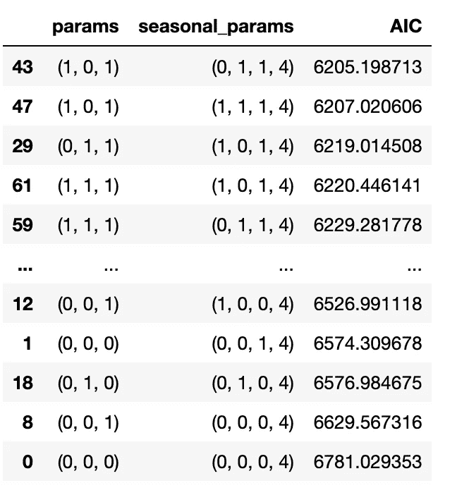

# Python 中的时间序列预测

> 原文：<https://towardsdatascience.com/how-to-predict-your-step-count-for-next-week-a16b7800b408?source=collection_archive---------8----------------------->

## 基于 ARIMA 模型的端到端时间序列预测


林赛·亨伍德在 [Unsplash](https://unsplash.com/s/photos/steps?utm_source=unsplash&utm_medium=referral&utm_content=creditCopyText) 上的照片

自从 Covid 和封锁开始以来，自由行走对包括我自己在内的许多人来说都是一种奢侈。就我个人而言，我每天都试图离开我的笔记本电脑，出去呼吸一些新鲜空气。每周，我都会从手机上查看我的步数，看看我是否做了足够的锻炼。

> 如果我们能准确预测下一周的步数，那该多好啊！

在本文中，我将使用基本的时间序列分析来观察自己的步数趋势，并使用历史步数预测未来。本文的主要目的是**展示时间序列预测**的主要思想，并使用我自己的步数作为实际的编码示例。

# 我们使用的数据

我正在使用从我的 iPhone 苹果健康下载的步数数据。如果您也使用 iPhone，您可以从 Apple Health application 个人资料页面下载健康数据，如下所示


截图来自[苹果网站](https://www.apple.com/sg/ios/health/)

下载的数据将是一个 XML 文件，包含 Apple Health 的多个部分，包括步数、心率、睡眠分析等。我利用链接中的脚本[将 XML 文件转换成 CSV 格式进行分析。文件的输出将是多个 CSV 文件，您可以使用 Python 直接连接到 CSV 文件。**它也是** **一个有趣的数据源，供您使用自己的健康数据探索其他数据分析或数据可视化方式**。](https://github.com/markwk/qs_ledger/blob/master/apple_health/apple_health_extractor.ipynb)

# 数据探索

步数数据看起来像下面的截图，其中包含每次移动时的步数数值。它还包含开始日期、结束日期和创建日期。这里的创建日期是指该记录的创建日期和时间，因此我使用开始日期来记录时间。


步骤计数的原始数据

对于我的分析，我只需要“开始日期”和“值”两列。对我来说，第一步是将日期列转换成日期时间格式，然后将数据汇总成每周总和。这是因为许多 python 函数或时间序列包需要一个时间格式的列，如果我预测每天的数据，波动性会太高。

```
#read data from extracted csv
steps=pd.read_csv('apple_health_export/StepCount.csv')#convert start date into time format
steps['date']=pd.to_datetime(steps['startDate'].str[:19])#Aggregate data into weekly sum
sample=steps[['date','value']]
weekly=sample.resample('W', on='date').sum()#visualize weekly data
weekly.plot(figsize=(15, 6))
plt.show()
```


每周步数的可视化

从上面的可视化中，我们可以看到，即使是每周的步数数据也有很高的波动性。为了消除像每周 300k 步数或每周少于 2000 步这样的极值的影响，我使用 winsorization 使数据更正常。

> Winsorization:通过将极值限制在某个界限内来消除异常值的影响，从而对数据进行转换。

我不直接在每周级别上 winsorize，而是限制在每天的步数级别上。例如，如果我一天走得太多，每天的步数将被降低到上限值，然后我将这些 winsorized 每天的步数再次汇总到每周的总数中。

我选择的边界限制是更高的 2%和更低的 2%(这个**百分比值可以由我们根据数据**的分布来确定)。我使用了[‘winsorize’Python 包](https://docs.scipy.org/doc/scipy/reference/generated/scipy.stats.mstats.winsorize.html)，在其中你可以直接指定百分比的上限和下限。

```
#remove the first part of data with no steps
sample=steps[steps['date']>'2015-09-01'][['date','value']]#aggregate data on daily level
daily=sample.resample('D',on='date').sum()#Winsorize daily data
daily['winsorized_value']=winsorize(daily['value'], limits=[0.02, 0.02])#Aggregate daily data into weekly data again
weekly=daily.resample('W').sum()
#visualize new weekly data
weekly.plot(figsize=(15, 6))
plt.show()
```


winsorized 步数的可视化

您可以从上面的可视化中看到，winsorized 数据具有较少的极值，因此为我们提供了一个更通用的部分。然而，有一点需要注意的是**这个平滑步骤不是强制性的**，因为大多数时间序列方法会有一些其他的平滑步骤。

您还可以通过使用 [**季节性 _ 分解**](https://www.statsmodels.org/stable/generated/statsmodels.tsa.seasonal.seasonal_decompose.html) **包**来**查看季节性模式和总体趋势**。这里的趋势是由移动平均确定的，然后在从原始数据中去除趋势后提取季节性元素。

```
extract=train.set_index('date')
from pylab import rcParams
rcParams['figure.figsize'] = 18, 8
decomposition = sm.tsa.seasonal_decompose(extract, model='additive')
fig = decomposition.plot()
plt.show()
```



季节和趋势元素

从上图可以看出，步数中有一些轻微的季节性因素。总体趋势有一个强烈的变化，特别是从 covid 时期开始以来。

# 时间序列预测

研究完数据后，我们可以使用不同的时间序列预测方法开始预测。

> **问题陈述:**根据历史步数数据预测下周步数有多准确？

**数据准备:**步骤与正常的机器学习训练-测试拆分略有不同。这是因为**训练数据和测试数据是动态的**取决于您预测的周(我们使用**该周之前的所有历史数据作为训练数据**)。我们使用 2021 年的步数作为基准来衡量我们模型的准确性。

```
#determine training and testing group
data=weekly.reset_index()
test=data[data['date']>'2021-01-01'][['date','value']]
train=data[['date','value']]
```

我们将使用平均误差(MAE)来衡量所有模型的准确性。您也可以选择“均方误差”、“均方根误差”或“平均误差百分比”进行测量。如果想了解更多关于度量回归或预测模型的内容，可以参考这里的。

## 方法 1:移动平均线

移动平均线仅仅意味着前 X 个周期的平均值，X 由你来决定。这是时间序列数据最常用的技术/概念之一。它可以帮助**平滑数据**趋势，从而给你一个更真实的结果近似值。

在我的例子中，我使用的是过去 10 个时间段的移动平均值，这意味着我认为步数主要受前 10 周的步数影响。您可以选择使用不同的号码。移动平均线中使用的**常见时间段为 10、20、30、50、100** ，具体视场景而定。

```
#get rolling moving average for previous 10 weeks
data['SMA_10']=train['value'].rolling(window=10).mean().shift(1)#Measure the MAE for this measure
test=data[data['date']>'2020-12-31']
from sklearn.metrics import mean_absolute_error
print(mean_absolute_error(test['value'], test['SMA_10']))
#10415.972
```

## 方法 2:指数加权移动平均

方法 1 移动平均线是过去 10 周的简单平均值。你可能想说离预测日期越近的那一周应该有更大的权重，而不是简单的平均值。这时我们可以使用指数加权移动平均线。

指数加权移动平均给予较近的数据较大的权重，权重的分配遵循指数逻辑。让我们看看它与简单的移动平均线方法相比表现如何。

```
#Calculate ewm average value
data['ewma_10']=train['value'].ewm(span=10).mean().shift(1)test=data[data['date']>'2020-12-31']
from sklearn.metrics import mean_absolute_error
print(mean_absolute_error(test['value'], test['ewma_10']))
#9613.11
```

与简单移动平均相比，指数加权移动平均给出了更低平均误差的更好结果。

```
test_plot_data=test.set_index('date')[['SMA_10','ewma_10']]
train_plot=train[train['date']>'2020-01-01'].set_index('date')
plt.figure(figsize=(15,10))
plt.plot(train_plot,label='Actual Step')
plt.plot(test_plot_data['SMA_10'],label='sma_10')
plt.plot(test_plot_data['ewma_10'],label='ewma_10')
plt.legend(loc='Left corner')
plt.show()
```


简单移动平均线与指数加权移动平均线

如果绘制两个预测值与实际步数的关系图，可以看到两种移动平均法的预测值都比实际步数平滑得多。与简单移动平均线(红线)相比，指数加权移动平均线(黄线)更快地捕捉到趋势，并且更接近真实步数。

## 方法 3: SARIMA 模型—手动调谐

萨里玛模型是具有季节性趋势的 ARIMA 模型。ARIMA 模型的全称是自回归综合移动平均。在我开始介绍这个方法之前，让我们快速浏览一下 ARIMA 到底是什么，以及我们在建模时考虑了哪些因素。

> 快速总结:

**自回归/AR:** 输出预测依赖于先前的观测值/滞后观测值

**Integrated/I:** 数据不是平稳的，它需要一定阶的差分来实现平稳性

**移动平均/移动平均:**输出预测取决于之前的误差项/滞后误差

对于 SARIMA 模型，您需要指定 **7 个不同的参数**:

*   **p**:AR 项的滞后数
*   **d** :达到平稳所需的差分次数
*   **q**:MA 期限的滞后数
*   季节性周期。指同一模式再次出现的时间周期数。
*   **P，D，Q** :与 P，D，Q 相同，但为季节性参数

网上有文章介绍我们如何根据对数据的观察来确定不同的参数。对于这个方法，我使用的是来自 [statsmodel](https://www.statsmodels.org/dev/generated/statsmodels.tsa.statespace.sarimax.SARIMAX.html) 的包。

对于您运行的每个模型，您可以有一个**结果摘要和一个 AIC 值**来衡量模型的样本内适合度。我对所有参数使用不同值的迭代，**找出最低的 AIC 值** e(样本内数据的最佳拟合模型)。我是从这里的链接[学到这个方法的。](https://www.digitalocean.com/community/tutorials/a-guide-to-time-series-forecasting-with-arima-in-python-3)

```
# Define the p, d and q parameters for value between 0-2 and iterate for all the value in the range
p = d = q = range(0, 2)
pdq = list(itertools.product(p, d, q))# Generate all different combinations of seasonal p, q and q 
seasonal_pdq = [(x[0], x[1], x[2], 4) for x in list(itertools.product(p, d, q))]params=[]
seasonal=[]
aic=[]
for param in pdq:
    for param_seasonal in seasonal_pdq:
        mod = sm.tsa.statespace.SARIMAX(train_set,order=param,                                 seasonal_order=param_seasonal,                                    
enforce_stationarity=False,                                          enforce_invertibility=False)#append all the parameters and result AIC value
results = mod.fit()
        params.append(param)
        seasonal.append(param_seasonal)
        aic.append(results.aic)
parameter_options=pd.DataFrame({'params':params,'seasonal_params':seasonal,'AIC':aic})#sort the AIC value to find the best fitted model
parameter_options.sort_values(by='AIC')
```



ARIMA 模型参数和分类 AIC

从上面的结果中，我们可以看到性能最好的几个参数集。但是，这并不一定等于预测的最佳参数集，因为样本外精度可能与样本内精度有很大不同。你可以参考这个列表，试着找出最合适的型号。

```
data_updated=data.set_index('date')
train=data[data['date']<'2021-01-01']
prediction=[]
my_order = (0, 1, 1)
my_seasonal_order = (1, 0, 1, 4)
initial=len(train)initial_train=data_updated.iloc[:initial]
model = sm.tsa.statespace.SARIMAX(initial_train['value'], order=my_order, seasonal_order=my_seasonal_order)
results=model.fit()#Iteratively update the training data and predict following week
for i in range(initial,len(data)):
    updated_data=data_updated.iloc[i:i+1]['value']
    results=results.append(updated_data,refit=False)
    prediction.append(results.forecast()[0])from sklearn.metrics import mean_absolute_error
print(mean_absolute_error(test['value'], prediction))#8469.6746
```

该模型的性能比两个移动平均结果好得多，平均误差值减少了 15%。

## 方法 4:自动 ARIMA(自动调整参数)

方法 4 使用相同的 ARIMA 模型，但是具有提供自动调谐功能的**不同的封装**。我使用的是 pm.auto_arima 包，你可以通过链接了解更多关于这个包的功能。

和前面的方法一样，你需要确定所有参数的取值范围。您也可以在您的步进参数中指定**是使用步进还是网格搜索。如果没有设置 stepwise=True，默认情况下它会使用网格搜索，这可能会很慢。**

```
train_index=train.set_index('date')#Spesify the value range for parameters
model = pm.auto_arima(train_index['value'], 
                          start_p=0, start_q=0,d=1, max_p=5, 
                          max_q=5, start_P=0, D=None, start_Q=0, max_P=5, 
                          max_D=5, max_Q=5,stepwise=True,seasonal=True)prediction=[]#Recurrently predict following week and add the data into training model once we have predicted that week
for i in test['value']:
    predict=model.predict(n_periods=1)[0]
    prediction.append(predict)
    model.update(i)
from sklearn.metrics import mean_absolute_error
print(mean_absolute_error(test['value'], prediction))
#8863.74
```

该模型有一个**更新功能**，允许我使用动态的历史数据循环计算下一周的数据。有趣的是，最终结果比手动调优方法的错误数略高，这可能是由于分步方法或不同软件包之间的算法略有不同。


SARIMA 手动调谐与自动调谐

当我绘制这两种 SARIMA 方法的预测图时，我可以看出这两种方法比简单或指数加权移动平均方法更接近实际步数趋势。然而，SARIMA 模型也不能非常准确地捕捉波动。误差率范围在 20–30%之间。

# 结论或建议

1.  在本例中，我对以下一周的值进行递归计算。但是，您很可能需要使用历史数据来预测接下来 N(N>1)周的值。这实际上要简单得多，因为一旦得到模型，您可以将 n_periods 指定为您想要预测的时间段的数量(不需要迭代地更新模型)
2.  网上有文章介绍如何确定数据是平稳的，或者我们如何使用统计方法(如“扩展的 Dickey Fuller 测试”)来确定 AR 和 MA 项的值。这可以更好地确定数据的分布并防止过度拟合。
3.  萨里玛或 ARIMA 方法通常比简单移动平均或指数加权移动平均方法更好，因为它考虑了误差项
4.  需要注意的一件非常重要的事情是，我们应该始终记住使用我们预测的日期之前的数据作为训练数据，这对我们来说很难使用交叉验证。

最后，最后的结论是:在高精度水平上预测步数真的很难！

# 参考或推荐阅读

1.  [https://www . digital ocean . com/community/tutorials/a-guide-to-time-series-forecasting-with-arima-in-python-3](https://www.digitalocean.com/community/tutorials/a-guide-to-time-series-forecasting-with-arima-in-python-3)(如何使用最低 AIC 选择 ARIMA 参数)
2.  [https://www . machine learning plus . com/time-series/ARIMA-model-time-series-forecasting-python/](https://www.machinelearningplus.com/time-series/arima-model-time-series-forecasting-python/)(如何统计确定参数值)
3.  [https://github . com/markwk/QS _ ledger/blob/master/apple _ health/apple _ health _ extractor . ipynb](https://github.com/markwk/qs_ledger/blob/master/apple_health/apple_health_extractor.ipynb)。(从 Apple Health 提取数据的代码)
4.  https://towards data science . com/what-the-best-metrics-to-evaluate-your-regression-model-418 ca 481755 b(如何评估你的回归模型)
5.  [https://www . stats models . org/dev/generated/stats models . TSA . statespace . sarimax . sarimax . html](https://www.statsmodels.org/dev/generated/statsmodels.tsa.statespace.sarimax.SARIMAX.html)(SARIMA 模型包，手动调优)
6.  [https://alkaline-ml . com/pmdarima/modules/generated/pmdarima . ARIMA . auto _ ARIMA . html](https://alkaline-ml.com/pmdarima/modules/generated/pmdarima.arima.auto_arima.html)(SARIMA 模型包，自动调优)

感谢阅读！如果你有任何问题或任何你想了解更多的话题，请把它们放在评论框里！