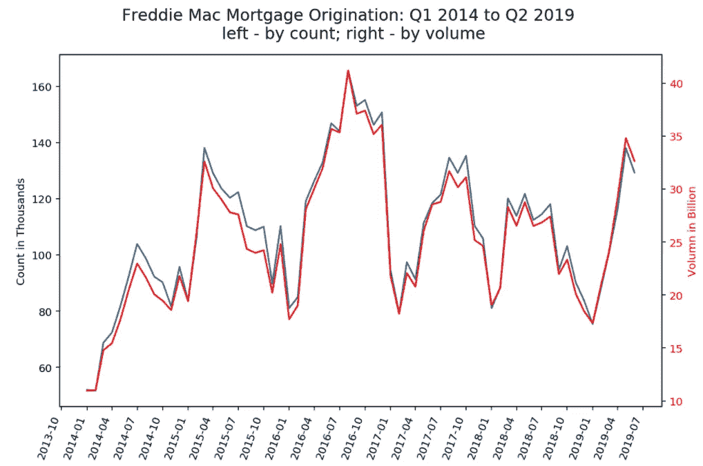
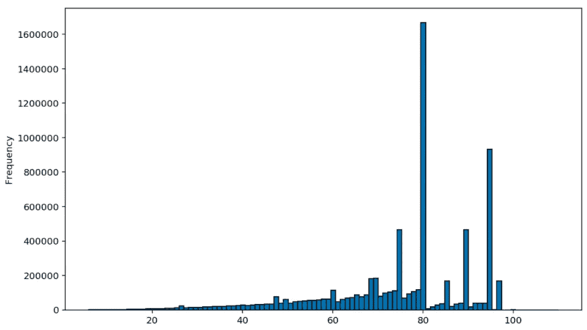
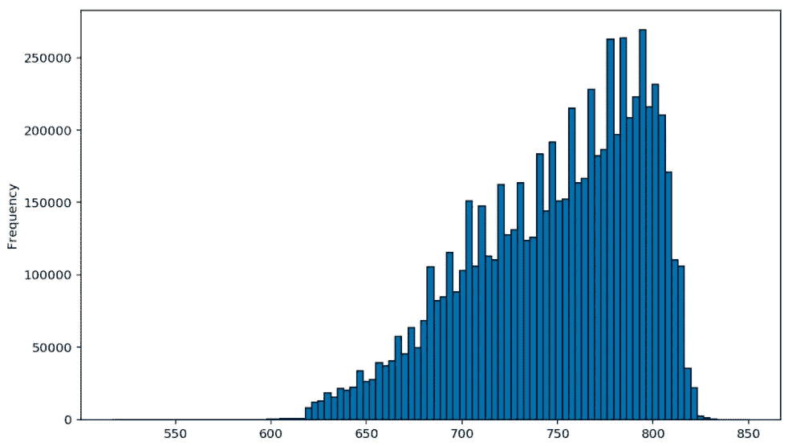
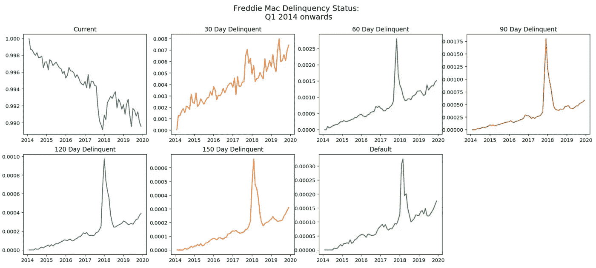
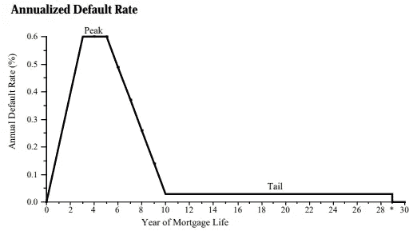
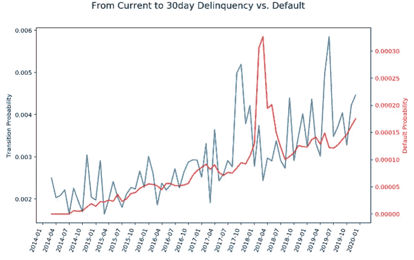
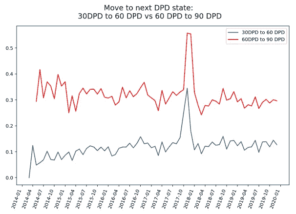
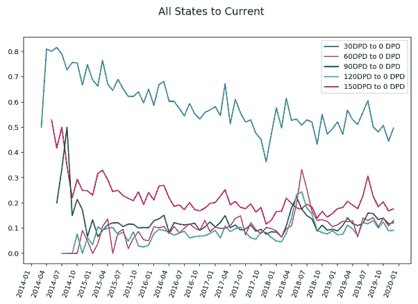

# 如何为信用风险建模准备数据

> 原文：<https://towardsdatascience.com/how-to-prepare-data-for-credit-risk-modeling-5523641882f2?source=collection_archive---------6----------------------->

## 介绍使用房地美单户贷款级别数据集的违约概率和转移矩阵分析


艾萨克·史密斯在 [Unsplash](https://unsplash.com?utm_source=medium&utm_medium=referral) 上拍摄的照片

信贷风险衡量借款人无法偿还债务从而违约的概率。信用风险建模在银行业中被广泛用于多种应用:从承销、账户管理(如扩大信用额度)、信用备抵(GAAP 下的 [CECL](https://www.occ.treas.gov/topics/supervision-and-examination/bank-operations/accounting/current-expected-credit-losses/index-current-expected-credit-losses.html) 和 [IFRS-9](https://www.moodysanalytics.com/risk-perspectives-magazine/convergence-risk-finance-accounting-cecl/spotlight-cecl/ifrs-9-impairment-model-interaction-with-the-basel-framework) )、压力测试( [CCAR](https://www.federalreserve.gov/supervisionreg/stress-tests-capital-planning.htm) )和监管资本计算([巴塞尔 II](https://www.bis.org/publ/bcbsca05.pdf) )。

信用风险度量有两个关键组成部分:1)违约概率(PD)，通常定义为一段时间内违约的可能性；2)违约损失(LGD)，通常指借款人违约后无法收回的金额。这两个分量的乘积给出了预期损耗。

在本文中，我们将使用[房地美单户贷款级别数据集](http://www.freddiemac.com/research/datasets/sf_loanlevel_dataset.page)作为示例，向您展示如何准备开发数据(包括目标变量和贷款级别特征)以应对任何信用风险建模练习。让我们开始吧。

# 数据下载

房地美提供公共访问(需要免费注册)该机构从 1999 年到 2020 年购买的单户抵押贷款的贷款级别数据集。数据集是按季度年份组织的。在每个年份中，它包括两个文件:

1.  *发起数据*:包含发起时的贷款特征(如期限、利率、信用评分、贷款价值比、债务收入比等)。)
2.  *绩效数据*:包含贷款级月度绩效(包括未偿余额、拖欠状态等。)从发起到最近一个季度。

由于数据集是一个“活的”文件，新的演奏会定期添加到每个 vintage 文件中，并且鉴于此数据集的庞大数量，您可能需要编写一个自动下载代码(如下例所示)来从网站检索数据:

```
#Specify login credentials
login = {
 ‘username’: ‘[y](mailto:xuzhangsusan@gmail.com)our login email’,
 ‘password’: ‘your password’
}#Define the vintage data to download (for this article, we will look into vintage from Q1 2014 to Q2 2019.
Period = ["Q12014","Q22014",...,"Q22019"]with requests.Session() as s:
   p =s.post('[https://freddiemac.embs.com/FLoan/Data/download2.php'](https://freddiemac.embs.com/FLoan/Data/download2.php')) for Qtr in Period:
        #File Names
        zip_file = "historical_data1_" + Qtr + ".zip"
        perf_file = "historical_data1_time_" + Qtr + ".txt"
        orig_file = "historical_data1_" + Qtr + ".txt"
        export_file = Qtr + ".csv"
        r = s.get(os.path.join(Download, zip_file))
        z = zipfile.ZipFile(io.BytesIO(r.content))
        z.extractall(Input_Data_Path)
```

# 了解贷款特点

由于许多贷款级别特征是信用损失预测的主要驱动因素(例如，低信用评分或低收入群体通常更容易受到经济状况的影响，从而导致违约)，在下载 vintage 文件后，第一步是使用帐号作为唯一关键字合并原始数据和绩效数据。合并之后，现在我们可以看看投资组合概况和特征分布。



作者图片—房地美抵押贷款发放量(计数)

*LTV 始发配送*



按作者分类的图片——贷款发放时的 LTV 分布(2014 至 2019 年份)

*始发时的 FICO 分数分布*



按作者分类的图片—贷款发放时的 FICO 得分分布(2014 年至 2019 年)

# 创建默认标志

如果你是第一次进行信用分析，你可能会惊讶于“违约”的定义并不像你想象的那么明显。在大多数情况下，“违约”是无法直接观察到的。对于初学者来说，当谈到信用风险建模中的违约定义时，有两个最常见的误解:

> 违约是否相当于到期前 ***零余额*** ？

不，有许多原因可以导致贷款余额在到期日之前减少到零。自愿提前还款是最常见的一种，还有回购、REO 处置等。

> 默认是否等同于 ***销账*** ？

不，当债务不太可能收回时，贷款人可以从资产负债表中冲销债务金额。但是，在贷款严重拖欠(如 6 个月没有付款)后，可能会在更晚的日期进行注销。因此，将冲销作为违约无法捕捉实际的“违约”时间。也就是说，如果一笔贷款在没有拖欠的情况下被冲销(在一些罕见的情况下)，人们仍应将其视为违约事件。

信用风险建模中最广泛采用的**定义**是将违约事件定义为 1)贷款首次严重拖欠**的较早日期；或 2)贷款损失被确认。根据这一定义，导致投资组合损失的任何贷款都将包括在违约群体中，违约日期将与贷款特征恶化的迹象同时标记。**

> 违约=(第一次严重拖欠)U(损失事件)



作者图片—房地美拖欠状况(2014 年至 2019 年)

根据这一定义，我将房地美贷款数据的违约定义为贷款拖欠 180 天或贷款余额因 a)第三方出售、b)卖空或冲销而降至零的最早日期；或 c) REO 性格。上图显示了每种拖欠状态下的贷款分布。从上面的分析中可以提取出两个直接的观察结果。首先，2017 年 8 月突然的“当前”利率下降是由飓风哈维引起的，随后它导致了拖欠状态的飙升。其次，我们可以注意到，除了处于“当前”状态的贷款百分比之外，自 2014 年起，拖欠和违约概率保持单调增加。这是由于整个抵押贷款生命周期的违约曲线的形状，其中违约率通常在贷款发放后不久增加，并在贷款年龄约为 3-5 年时达到峰值(如下图所示)。



**来源** : [债券市场协会](https://www.sifma.org/wp-content/uploads/2017/08/chsf.pdf)

此外，这种违约定义也被称为“首次违约”。“违约”贷款可能再次成为“再融资/流动”贷款，即被“治愈”，这种情况并不少见。我们将在下面的**治愈率分析**中讨论这种行为。

# 违约预警指标

除了直接对 PD 建模之外，您经常会看到信贷风险建模侧重于预测转换矩阵，将拖欠状态作为“状态”，特别是违约作为“吸收状态”。然后开发单独的子模型来预测从一个状态到另一个状态的转移概率。

> 为什么 ***跃迁概率*** 很重要？

让我们看看下面两个转移概率的比较:

第一个图表显示了“当前到逾期 30 天(DPD)”的转换和 PD 率之间有很强的相关性。事实上，2017 年飓风哈维导致的峰值几乎在大约 6 个月时间间隔的两条曲线中保持完全相同的形状。



按作者分类的图片—当前至 30DPD 与 PD

下面的第二张图显示了从“30DPD 到 60DPD”的转移概率，并将其与从“60 DPD 到 90DPD”的转移概率进行了比较。人们可以看到，这两个转变概率在时间上基本持平，贷款进入下一个拖欠阶段的概率几乎是 30DPD 到 60DPD 的三倍。



作者提供的图片—30DPD 至 60DPD 与 60DPD 至 90DPD 的对比

上面这两个图表告诉我们的是，为了预测 PD，还可以关注**预测从电流到-30DPD 的转换概率，作为预警指标**。因为一旦一笔贷款无法偿还，它的违约之路就变得更加确定，随着贷款违约越严重，确定性就越高。

# 治愈率分析

因为“首次违约”的定义，你可能想知道贷款违约后会发生什么？有三种典型的途径:1) **冲销**:贷款在资产负债表上保留很长一段时间，直到银行决定将其冲销；2) **重组**:银行与借款人一起制定还款计划；3) **再融资**:借款人开始再次还款，在某一点上，贷款甚至可以再次成为流动贷款，即**治愈**。

通常在信用风险建模中，治愈率由于其低概率而不被特别建模。如下图所示，随着贷款拖欠状况的恶化，其恢复到当前状态的几率从 50%急剧下降到 10%以下，预计“违约”后的治愈率会更低。



按作者分类的图像—所有过渡状态到当前状态

# 结论

总之，定义 PD(或转移矩阵)对于解决几乎所有信用风险建模问题都是至关重要的，对此没有固定的答案。与本文中介绍的过程类似，最佳实践是根据贷款级别特征、绩效数据分析以及银行的信贷政策来确定 PD 定义。

希望你喜欢这篇介绍违约概率和转移矩阵分析的文章。喜欢就在下面留下你的评论吧。以上分析的完整代码可以在 [**这里**](https://gist.github.com/212239b21120bdb93e2b81380bc6d2a5.git) 找到。

**脚注**

[1] EAD:你可能也听说过违约时的第三个组成部分 EAD 敞口。对于定期贷款，如抵押贷款和汽车贷款，EAD 可与剩余余额互换使用，而对于分期贷款，如 HELOC 或信用卡，除了未偿余额外，EAD 还由借款人在违约时使用的未提取余额的百分比确定(也称为 LEQ-贷款等价风险)。本文不讨论 EAD 的细节。