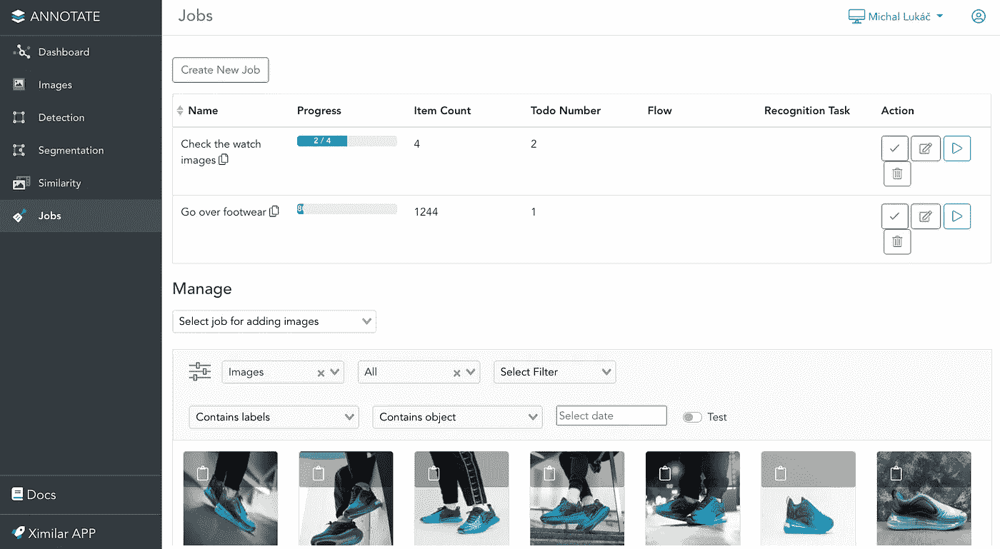
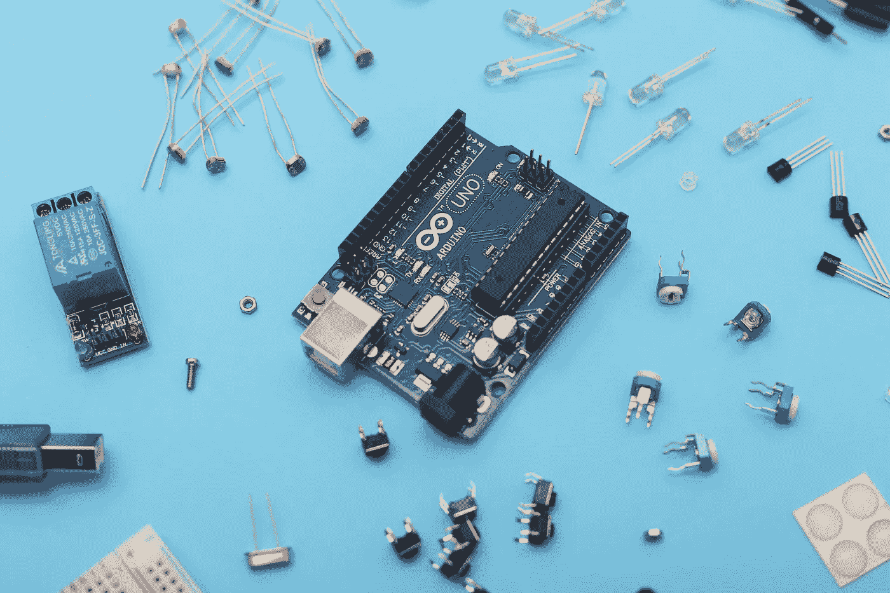
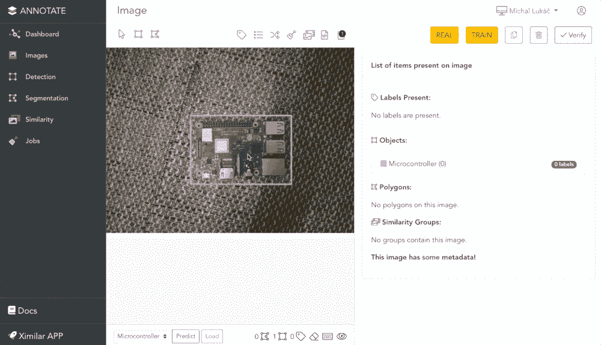
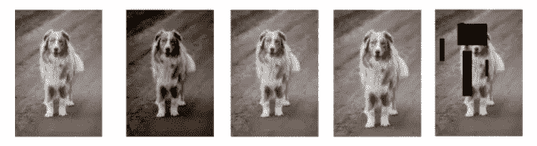

# 物体检测如何准备数据？

> 原文：<https://towardsdatascience.com/how-to-prepare-data-for-object-detection-34750c4d00da?source=collection_archive---------10----------------------->

## 为大型机器学习项目构建自定义对象检测模型的见解

构建可视化人工智能的图像标注。[ [来源](http://www.ximilar.com)

随着时间的推移，我们在 Ximilar 从事了许多具有挑战性的项目，其中包括对象检测。如今，仅模型的训练和部署就可以在几分钟内完成。您可以简单地上传您的数据并点击几个按钮来训练和部署您的模型作为一个 API。如今，检测模型训练越来越具有挑战性和难度的部分是数据，因为:

*   物体检测需要**比普通图像分类器大得多的数据集**。
*   **所有你想让人工智能检测到的物品，首先需要被适当地标注**，这意味着它们以某种方式被标记了标签和边界框。
*   数据注释是一个耗时且费力的过程，通常需要一个**团队。**
*   当注释你的数据时，你需要绝对一致，注释的人必须训练有素，协调一致。

# 数据监管和 MLOps 非常重要

选择架构类型只会使整体精度上下移动**几个百分点**。遗憾的是，大多数机器学习研究都是关于架构设计、新的激活函数和层的。**此外，这项研究大多是在相同的庞大数据集上完成的(**[**ImageNET**](https://www.image-net.org/)**，** [**COCO**](https://cocodataset.org/#home) ，[**Google Open Images**](https://storage.googleapis.com/openimages/web/index.html)**)一遍又一遍**。基本上，研究小组和大型科技公司在这部分研究上花费了数百万美元，但没有花费在数据监管过程上。

> 根据我们的经验，以数据为中心比谷歌开发的最新架构带来更好的结果。大多数机器学习项目都是从很少或没有数据开始的。在数据很少的情况下，最先进的模型往往会失败。

人工智能研究员 **Andrew NG 敦促人工智能社区更加以数据为中心，**我们完全同意。数据的增量改进和使数据集适当平衡是一个更好的方法。[ [来源](https://analyticsindiamag.com/big-data-to-good-data-andrew-ng-urges-ml-community-to-be-more-data-centric-and-less-model-centric/)如果你更注重数据而不是模型，你也可以节省很多培训时间。尝试不同的架构还需要调整许多超参数。

# 构建检测 MLOps 注释管道

在一个空白的机器学习项目中，我们从几个数据点开始。正如我们之前所说，更多的数据可能会带来更好的结果。然而，做注释(分配标签，创建边界框)的人应该重新检查其他人的数据。这样，我们可以交叉验证注释的正确性。

因此，如果我们希望更加以数据为中心，我们需要知道哪些数据已经被检查过。例如，我们正在开发一个能够分析时尚产品图像的时尚人工智能系统。这个项目的复杂性令人震惊。成千上万的图像，成千上万的类别，包括对象检测和分割。

每周，注释者都关注我们需要解决的不同类型的问题。解决一个问题最终会产生另一个问题，或者降低系统不同部分的准确性。这正是[特斯拉 AI 开发者正在经历的问题](https://www.youtube.com/watch?v=oBklltKXtDE)。你需要非常小心正确的图像样本的适当平衡。

这就是为什么我们正在系统地改进我们的训练数据集。每周我们都会分析问题，并为注释者定义新的工作。他们的工作进度被保存下来，然后在下周进行分析。为时尚或自动驾驶等重大任务构建可靠的人工智能是一个永无止境的过程，因为世界也在变化。

注释作业及其进度。[ [来源](http://www.ximilar.com)

例如，在我们的注释工具中，您可以定义注释作业，并指定注释者应该查看图像的次数。然后，机器学习项目的项目经理可以看到工作的进展以及更多内容。

注记工具支持数据的**验证**和多种绘图工具，如矩形、多边形和经典标注。随着时间的推移，注释过程越来越快。这是因为您可以简单地在单击时训练对象检测模型，然后在不使用绘图工具的情况下做出所有预测。**通过标注系统的 MLOps，您可以 A/B 测试在不同版本的数据集上训练的不同版本的模型**。

# 如何让物体检测更准确？

在一些项目中，我们需要检测看起来非常相似的不同类型的项目。这对于模型来说非常难学。**因为如果我们有视觉上非常相似的不同类，目标检测的目标函数的损失将最终停留在第一个时期**。例如，检测数百种鸟类可能非常困难。这同样适用于微控制器(Raspberry PI，Arduino，…)，时尚产品(衬衫与 t 恤)，产品缺陷…

Arduino 的产品之一。所有的 Arduino 产品看起来都非常相似。由[萨汉德·巴巴里](https://unsplash.com/@sahandbabali?utm_source=unsplash&utm_medium=referral&utm_content=creditCopyText)在 [Unsplash](https://unsplash.com/s/photos/arduino?utm_source=unsplash&utm_medium=referral&utm_content=creditCopyText) 上拍摄的照片

想象一下[在图像上检测微控制器](/detecting-microcontrollers-with-cnn-ced688a8a144) (Arduino)的问题。对象检测模型将很容易学会检测&区分 Arduino 和 Raspberry。然而，对于所有不同的 Arduino 和 Raspberry 微控制器来说，做到这一点是非常困难的。它们有几百种。

**那么，有什么选项可以让对象检测在许多视觉上相似的类上工作呢？**

我们可以划分问题，简单地创建一个对象检测模型，只有一个标签，名称为“微控制器”。然后创建一个图像分类器模型，它将告诉我们有哪种特定的 Arduino 产品。**这种两步法将提高整个系统的整体精度。**我们的注释系统能够做到这一点，创建一个对象并分配一个标签或一个复杂的标签分类(层次结构)。只需点击几下鼠标，预测系统就可以部署到 API 端点，只需通过流连接对象检测和图像分类器。

检测大量对象类型的问题可以分为两个步骤。首先检测对象，然后只对边界框的内容进行分类。[ [来源](http://www.ximilar.com)

还记得我提到的时尚或特斯拉用例吗？检测类别越多，需要的数据就越多。将问题分成更少的类是一种更有效的方法。它也不会破坏系统的另一部分，因为每个神经网络只看到我们所说的那部分数据。如果你有一个大的模型，那么你所有的图像必须有所有的边界框和所有的标签，并且要平衡，所以这个类不是主要的。

# 用于目标检测的数据扩充

数据扩充是多种训练样本的常用方法。为同一个图像创建许多不同的变体可以帮助提升你的模型。**然而，你需要非常小心选择哪个增强**。有时图像的水平或垂直翻转会破坏模型的性能(例如，检测交通标志可能会出现这种情况)。理想情况下，您应该能够在不同的增强设置上测试您的模型的性能。然后，您可以选择一个在您的测试数据和生产设置中更加健壮的模型。

如何扩大图像的多种方法？改变颜色，饱和度，缩放，删除部分图像。【[来源](http://www.ximilar.com/blog)

# 使用在线注释工具的好处

总之，注释图像应该可以帮助您建立高质量的数据集，用于训练精确的机器学习模型。整个过程应该是有效的，并且应该导致迭代开发，然后在生产中部署。在处理具有复杂分类的大型项目时，您应该首先考虑您的数据，并将您的问题分成子问题。

如果您想使用或阅读更多关于注释平台和所有功能的信息，请访问 [Ximilar](https://www.ximilar.com/image-annotation-tool-for-teams-2021/) 。