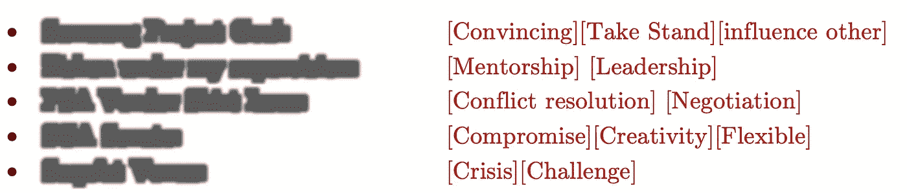
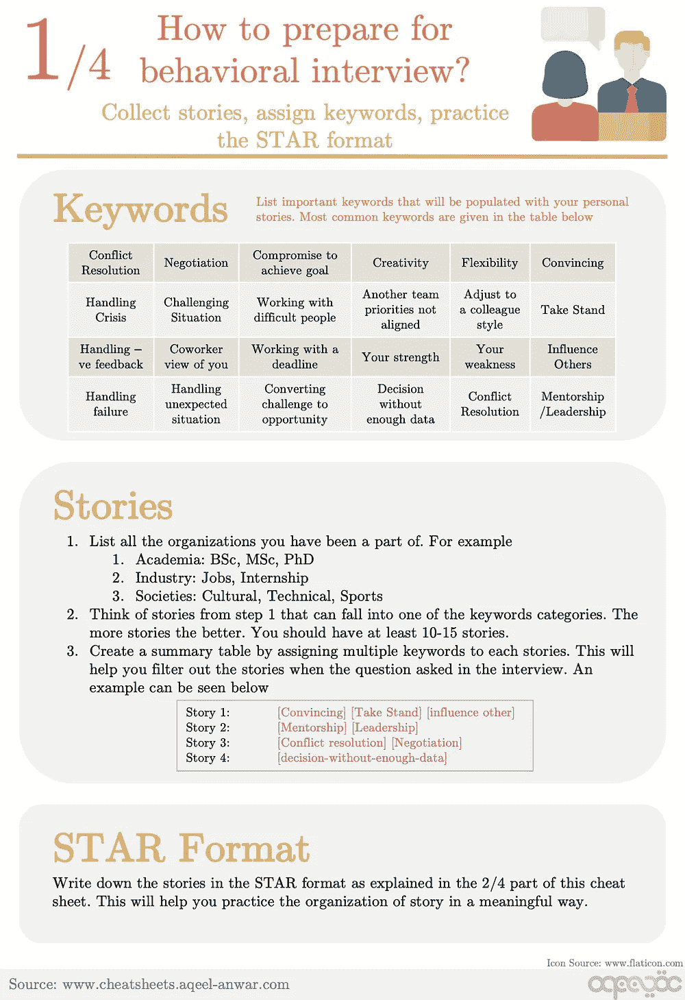
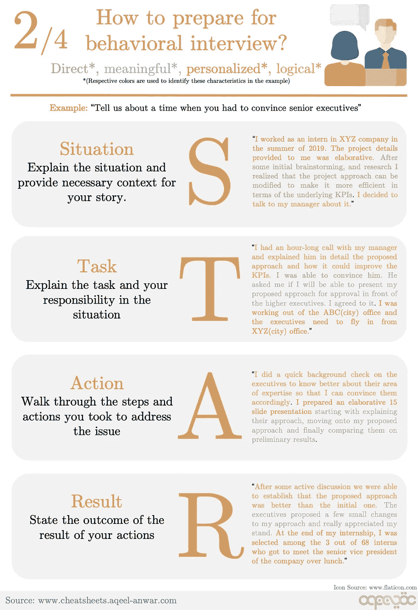
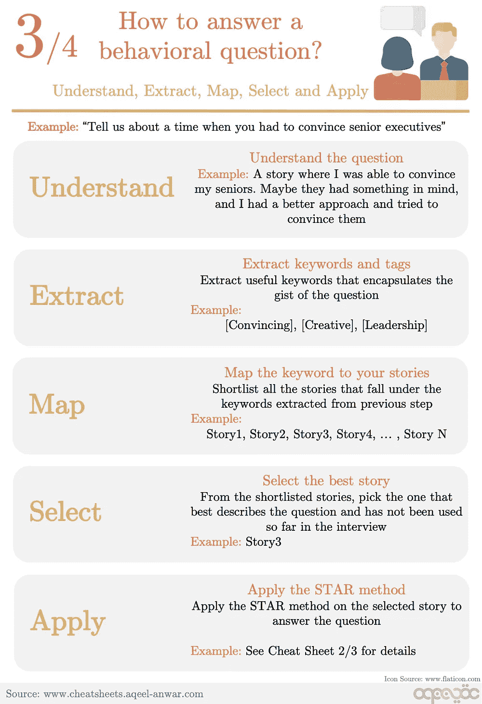
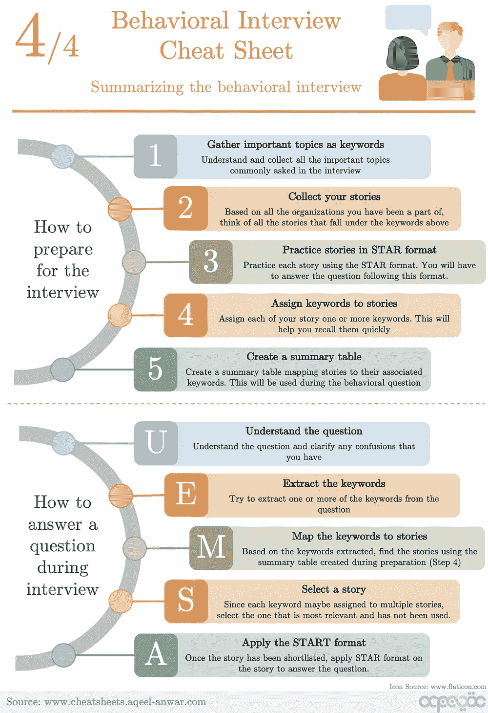

# 如何准备行为/软技能面试？

> 原文：<https://towardsdatascience.com/how-to-prepare-for-a-behavioral-soft-skills-interview-cheat-sheet-9347aaeaef82?source=collection_archive---------7----------------------->

照片由 [Maranda Vandergriff](https://unsplash.com/@mkvandergriff?utm_source=medium&utm_medium=referral) 在 [Unsplash](https://unsplash.com?utm_source=medium&utm_medium=referral) 上拍摄

行为面试是工作过程中的一个重要部分。在这篇文章中，我们将讨论在行为面试中会遇到什么，以及如何准备。最后，我们提供了一份准备和处理行为面试的备忘单。

行为面试评估候选人在组织中互动、生存和成长的能力。大多数公司都在寻找潜在的候选人，他们不仅擅长技术专业知识，而且能够很好地适应公司文化，在团队中运作良好，管理团队，并能够在需要时做出决定。大多数时候，一个在行为面试中表现不佳的候选人，不管他或她在技术面试中表现如何，都无法继续申请。

大多数候选人在技术面试中都表现得很好。编码、机器学习、数据科学、系统设计、案例研究，所有这些对他们来说似乎都很熟悉，而且都在他们的舒适区内。然而，行为面试要求他们坐下来准备。没有正确或错误的答案，面试只是在寻找你有条理的思维，以及你是否能够展示出对公司真正重要的某些特质。

我们将这篇文章分为**三个部分**。在第一部分，我们将彻底了解如何准备行为面试。然后，我们将了解如何在面试中处理和回答行为问题。最后，文章的最后一部分包含了一些关于这个主题的有用资源。

# 第 1 部分:为行为面试做准备

为行为面试做准备并不需要像技术面试那样多的时间。平均 3-4 天，每天 1-2 小时，应该足以适应面试过程、示例问题和个性化故事。

但是如何着手准备这样的面试呢？从哪里开始？涵盖哪些问题？这可能会让人不知所措。遵循下面的 5 个步骤，这个过程会变得更加简单和有条理。

## 第一步:[1-2 小时]收集并理解关键词

需要做的第一件事是研究面试会提问的话题。行为问题可以有广泛的话题。最常见的问题是关于

1.  领导力
2.  协力
3.  解决问题
4.  决策
5.  沟通
6.  人际交往技能
7.  冲突解决
8.  谈判技巧
9.  创造力
10.  个人的优点和缺点
11.  师徒制
12.  表明立场
13.  有期限地工作

在网上寻找在行为面试中被问到的问题，熟悉这些话题并记下来。这大约需要 1-2 个小时。

## 第二步:[3-4 小时]收集你的故事

一旦你熟悉了常见的关键词并记下了它们，你需要从你的个人生活中找到一些故事来反映那些突出你个人技能的话题。我发现有用的是记下我过去参加过的所有组织，比如学术、工作、实习、社团和俱乐部。然后，对于每一个这样的例子，我试图回忆我必须运用我的技能来解决潜在问题的事件。这些故事不必是专业的，也可以来自个人生活。如果你在回忆生活中的事件时有困难，看看第一步中的主题，试着回忆解释这些特定主题的事件。

## 第三步:[0.5 小时]给你的故事指定关键词

现在，一旦你从你的个人生活中收集了故事，仔细地浏览它们并指定关键词。同一个故事可以有多个相关联的标签/关键词。给他们指定关键词将有助于你在面试中更好地回答问题。

## 步骤 4: [0.5 小时]创建一个汇总表

我喜欢在每次行为面试前准备一份汇总表。这个个性化的表格记录了我的个人故事和相关的关键词。这有助于我为行为面试做准备。下面是这种表格的一个例子。

行为访谈汇总表——作者图片

模糊的文字是我的故事的标识符。

## 第五步:[2-3 小时]以星形形式解释故事

回答一个行为问题最重要的部分是它的组织和结构。每个行为问题的答案都必须遵循星形格式。使用以下四个步骤来回答这个问题。我们将使用下面的例子，并尝试应用星形格式。

> **示例问题:**“告诉我们一次你不得不说服高管的经历”

## **1。情况:**

当开始回答一个行为问题时，解释情况，并为你的故事提供必要的背景

> **举例:“**2019 年夏天在 XYZ 公司实习。提供给我的项目细节是精心制作的。经过一些最初的头脑风暴和研究，我意识到可以修改项目方法，使其在底层 KPI 方面更有效。我决定和我的经理谈谈这件事。”

## 2.任务:

一旦你经历了这种情况，解释任务和你在这种情况下的责任。

> **示例:**“我和我的经理通了一个小时的电话，向他详细解释了提议的方法以及它如何改进 KPI。我说服了他。他问我是否能够将我提议的方法提交给上级主管批准。我同意了。我在 ABC(城市)办公室工作，高管们需要从 XYZ(城市)办公室飞过来。”

## 3.行动:

下一步是回顾你为解决手头的问题而采取的一系列行动

> **例子:**“我对高管们做了一个快速的背景调查，以更好地了解他们的专业领域，这样我就可以相应地说服他们。我准备了一份精心制作的 15 页幻灯片演示文稿，从解释他们的方法开始，接着介绍我提出的方法，最后比较他们的初步结果。”

## 4.结果:

最后，陈述你所采取的行动的结果，以及这些行动如何影响手头的问题

> **示例:**“经过一番积极的讨论，我们发现提议的方法比最初的方法更好。高管们对我的方法提出了一些小的改变，并非常欣赏我的立场。实习结束时，我从 68 名实习生中脱颖而出，与公司的高级副总裁共进午餐。”

使用星形格式，你将能够有效地组织你的答案。

准备行为面试的五步流程总结如下。

为行为面试做准备——作者图片

# 第二部分:回答一个行为问题

行为问题通常是开放式的。他们可以涵盖非常广泛的范围，这是不可能的准备每一个问题都可以问。然而，有帮助的是将问题与你已经准备好的常见问题联系起来，并做出相应的回答。以下 5 个步骤将帮助你在面试中回答一个行为问题。

我们将使用下面的例子

> **示例问题:**“告诉我们一次你不得不说服高管的经历”

## 1.明白；理解

当你面对一个行为问题时，首先要做的是仔细倾听并理解它。一个好的做法是用你自己的话重复这个问题，问面试官这是不是他或她的意思。如果有任何困惑，通过提出后续问题来澄清。一旦你理解了这个问题，用更简单的话问自己同样的问题

> 好的，他们想让我分享一个我说服我的前辈的故事。也许他们有什么想法，我有一个更好的方法，我试图说服他们。

## 2.提取

下一步是从问题中提取有用的关键词，帮助你筛选出你的故事。

> **举例:**【令人信服】、【创意】、【领导力】

## 3.地图

一旦你有了你的关键词，列出你的摘要表中属于这些关键词的所有故事

> **示例:**故事 1、故事 3、故事 6

## 4.挑选

从入围的故事中，挑选一个最能描述这个问题，并且迄今为止还没有在面试中使用过的故事。

> **举例:**故事 3

## 5.应用

将 STAR 方法应用于入围的故事

> **例如:**上一节的第 5 步

下面的备忘单总结了这些步骤。

# 第 3 部分:有用的资源

一些最常见的行为问题和示例答案可以在下面的链接中看到

1.  https://www . indeed . com/career-advice/interview/most-common-behavioral-interview-question-and-answers
2.  [https://www . the balances careers . com/top-behavioral-interview-questions-2059618](https://www.thebalancecareers.com/top-behavioral-interview-questions-2059618)
3.  [https://www . themartec . com/inside look/behavioral-interview-questions](https://www.themartec.com/insidelook/behavioral-interview-questions)

# 总结:

行为面试有时会很棘手。在本文中，我们经历了一个有组织的、易于遵循的准备和回答行为问题的过程。

**如果这篇文章对你有帮助，欢迎鼓掌、分享和回复。如果你想了解更多关于机器学习和数据科学的知识，请关注我@**[**Aqeel an war**](https://medium.com/u/a7cc4f201fb5?source=post_page-----9347aaeaef82--------------------------------)**或者在**[***LinkedIn***](https://www.linkedin.com/in/aqeelanwarmalik/)***上与我联系。***